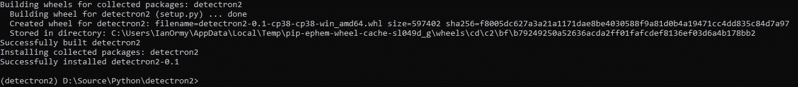

# Detectron2 和 Python Wheels 缓存

> 原文：<https://towardsdatascience.com/detectron2-python-wheels-cache-bfb94a0267ef?source=collection_archive---------29----------------------->

## 在 Windows 上构建一个 Detectron2 wheel 包并缓存它


[巴尼·莫斯](https://www.flickr.com/photos/barneymoss?utm_source=medium&utm_medium=referral)在 [Flickr](https://www.flickr.com/photos/barneymoss/14898532020/) 上的原始照片

## 检测器 2

我最近在做一些定制的[探测器 2](https://github.com/facebookresearch/detectron2) 模型的工作。我一直在云中的 Linux VM 上训练我的模型，但是我想在 Windows 环境中使用这个训练过的模型。脸书研究公司关于 Detectron2 的官方说法是它在 Windows 上不受支持。但我不会让这阻止我去尝试！好消息是我能够做到，这篇文章描述了我使用的过程。

## 初始设置

在解释我是如何做到这一点的过程中，我将假设您熟悉/熟悉以下内容:

*   Python 虚拟环境
*   GIT 命令行

首先要创建一个虚拟环境，然后激活它:

```
virtualenv detectron2
detectron2\Scripts\activate
```

从您的虚拟环境安装 PyTorch 和 torchvision(仅限 CPU 版本):

```
pip install torch==1.5.1+cpu torchvision==0.6.1+cpu -f https://download.pytorch.org/whl/torch_stable.html
```

或许还值得安装 **fvcore** 和 windows 版本的 pycocotools，即 **pycocotools-windows** :

```
pip install fvcore
pip install pycocotools-windows
```

## 下载并安装检测器 2

为了下载 Detectron2 源代码，我们将使用 GIT 命令行克隆一个特定的标记版本(这里的标记是“v0.1”)。

```
git clone --depth 1 --branch v0.1 https://github.com/facebookresearch/detectron2.git
```

将发布变更克隆到刚刚在虚拟环境(不是 GIT 命令行)中用这个克隆创建的 detectron2 文件夹之后。例如，如果您将 GIT 克隆到文件夹**D:\ Source \ Python \ detectron 2**中，则切换到该目录并发出以下命令:

```
pip install -U .
```

不要忘记结尾的句号，这真的很重要！

这应该会构建 detectron2 包，如果一切顺利，您应该会在最后看到如下内容:



构建检测器 2 包

因为我们克隆了 v0.1 标签，所以您会看到它是由 detectron 2–0.1 构建的

## 缓存车轮

你会注意到，当你安装一个 python 包时，它会检查它的本地轮缓存，看看它过去是否下载过这个包，如果下载过，它就使用缓存的版本。要创建您自己的车轮缓存，您需要首先安装车轮包:

```
pip install wheel
```

完成后，我们要列出当前为我们的虚拟环境安装的包，并将它们放入一个文件中(这里称为 requirements.txt):

```
pip freeze > requirements.txt
```

要为当前安装的包复制/创建所有的轮子，并把它们放在一个缓存文件夹中(这里我使用的是 **D:\wheels_cache** )，请执行以下操作:

```
pip wheel --wheel-dir=D:\wheels_cache -r requirements.txt
```

## 车轮缓存的优势

使用 wheels 缓存的好处之一是，将来您可以使用缓存的 wheels 直接安装，而不必再次构建一个包。如果你想在一台不同的电脑上做这件事，这是很有用的，因为你可能没有所有的依赖项。你可以这样做:

```
pip install D:\wheels_cache\detectron2-0.1-cp38-cp38-win_amd64.whl
```

这种方法需要注意的一点是轮子依赖于目标平台和 Python 版本。这个是针对 Windows 64 位和 Python 3.8 的。

你甚至可以安装来自 **requirements.txt** 文件的所有东西，告诉它在你的缓存文件夹中寻找轮子:

```
pip install --no-index --find-links=D:\wheels_cache -r requirements.txt
```

有一次，我必须在客户处安装一台电脑，而这台电脑是隔离的，即不允许连接到互联网或本地网络。我必须能够在这台机器上安装 Python 和所有需要的包，以运行我实现的机器学习软件。我采用的方法是为机器构建一个包含所有需要的包的 wheels 缓存。这样，安装可以从缓存中进行。

## 参考

*   **侦察兵 2**:【https://github.com/facebookresearch/detectron2】T4
*   **py torch**:[https://pytorch.org/get-started/locally/](https://pytorch.org/get-started/locally/)