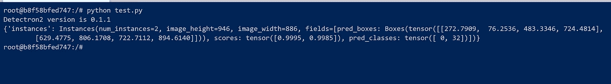
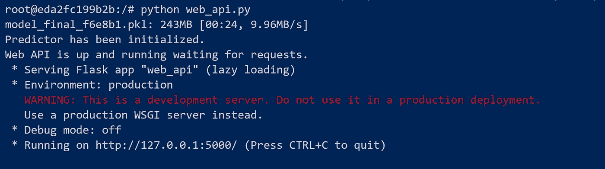
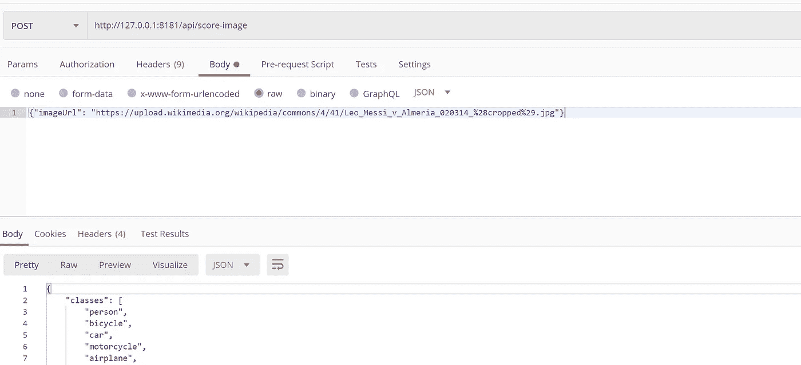
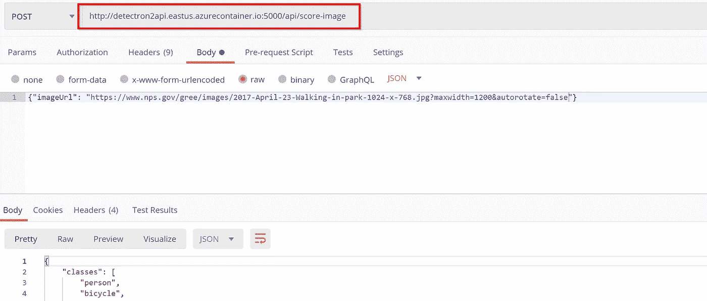
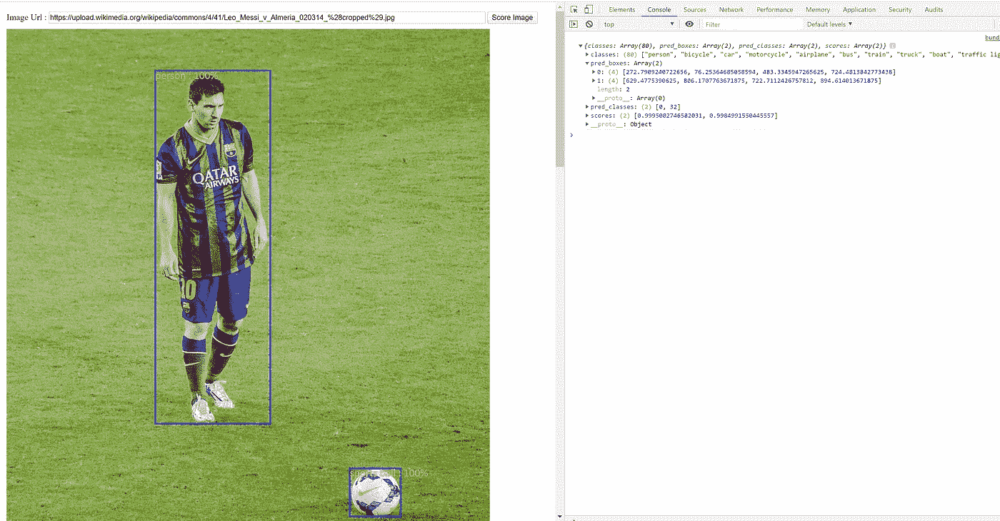

# 探测器 2:最基本的端到端教程

> 原文：<https://towardsdatascience.com/detectron2-the-basic-end-to-end-tutorial-5ac90e2f90e3?source=collection_archive---------5----------------------->


[https://commons . wikimedia . org/wiki/File:simmon _ Telescope _ at _ Eiffel _ Tower _ In _ Paris . jpg](https://commons.wikimedia.org/wiki/File:Monocular_Telescope_at_Eiffel_Tower_In_Paris.jpg)

## 历史第一

2018 年，脸书 AI 开发了一个名为 [Detectron](https://research.fb.com/downloads/detectron/) 的物体检测库。这是一个了不起的图书馆，但有点难以使用。我的早期版本写了一篇关于如何安装 Detectron 和运行示例演示的[博文](https://medium.com/@ylashin/quick-and-easy-guide-to-prepare-a-detectron-sandbox-940ccad8ffe2)，仅此而已。Detectron 的安装和使用有点困难，它是由 Caffe2 供电的。自 2018 年以来，有许多代码更改将 Caffe2 & PyTorch 纳入了一个单一的存储库，这增加了使用 Detectron 的难度。

看起来社区里有一些建设性的反馈，脸书推出了 v2。

根据 Detectron2 的 GitHub 页面:

> Detectron2 是脸书人工智能研究所的下一代软件系统，实现了最先进的物体检测算法。

Detectron2 是使用 PyTorch 构建的，py torch 现在拥有更活跃的社区，可以与 TensorFlow 本身竞争。此外，设置指令更容易，加上一个非常容易使用的 API 来提取评分结果。像 YOLO 这样的其他框架有非常模糊的评分结果格式，以普通多维数组的形式提供。任何与 YOLO 一起工作的人都可以想象首先解析评分结果并将其正确无误需要付出的努力。

历史已经足够了，在这篇文章中，我将带你做一个端到端的练习，学习如何准备一个 Detectron2 docker 映像来托管一个用于对象检测的 web API，并在一个充当服务消费者的小型 web 应用程序中使用它。

## 1.装置

我将首先从安装开始。不幸的是，Windows 不被支持，但是我将使用容器绕过它。快速地说，我们不介意安装一个 CPU 版本，因为 GPU 需要(猜猜是什么)一个 GPU，CUDA 和所有来自 NVIDIA 的可爱的东西。

因此，使用您喜欢的文本编辑器，用这个内容创建一个 docker 文件。

首先，根据 Detectron2 设置指令的要求，选择 Python 版本≥ 3.6 的基础映像。接下来安装一些先决条件，然后在 Detectron2 [安装页面](https://github.com/facebookresearch/detectron2/blob/master/INSTALL.md)上安装相同的安装说明。安装的版本是一个 CPU 版本，它不会超级快，但足够好的教程。最后，Flask 包含在内，因为这个 docker 映像将托管一个 web API 网站，以接受客户的评分请求。

让我们先建立形象。

```
docker build --rm . -t ylashin/detectron2:latest
```

您可以使用任何您想要的名称/标签，并为接下来的步骤做相应的调整。接下来，让我们试一试。

```
docker run -it ylashin/detectron2:latest bin/bash
```

希望上面所有的工作都很好，现在我们已经有了一个安装了 Detectron2 的容器。因此，我们需要验证没有任何东西损坏，我们有独角兽和彩虹。

必须使用 docker CLI 或使用安装在容器上的 nano 将以下`test.py`脚本复制到容器中。

涉及的主要任务有:

1.  印刷检测器 2 版本。
2.  为[莱昂内尔·梅西和一个足球](https://upload.wikimedia.org/wikipedia/commons/4/41/Leo_Messi_v_Almeria_020314_%28cropped%29.jpg)下载图片。
3.  使用预先训练的架构之一创建预测器实例。
4.  使用预测器实例对下载的图像进行评分。

接下来，我们将运行测试脚本，如下一个屏幕截图所示。



在撰写本文时，Detectron2 的版本似乎是 0.1.1。此外，评分是正确的，结果不是一个简单的张量像 YOLO。它是一个类型化的类，具有易于使用的成员，如边界框和预测类。稍后我们将讨论将类代码映射到人类可读的名称。我们在这里有一对夫妇的边界框和一对夫妇的高分加上预测类 0(人)和 32(运动球)。

*附注:根据你正在解决的问题，你需要选择正确的架构，看看它是否针对类似的数据集进行了训练，否则你可能需要进行定制训练。*

## 2.发布 API

下一步是让这个评分功能可以从容器外部访问。Flask web API 需要驻留在该容器中，以接受图像并返回评分结果。为了简单起见，API 将接受一个图像 URL 并自己下载。它不接受二进制有效负载，这是很自然的事情，但它只是很容易使用相同的测试脚本稍加修改。

此外，响应将是一个序列化为 JSON 对象的字典，其中包含调用者所需的足够信息，无需任何复杂的解析。

现在，因为容器将托管 Flask web 服务器，所以必须通过发布 web API 端口来启动它。因此，退出当前容器，并使用端口发布再次启动它。

```
docker run -p 8181:5000 -it ylashin/detectron2:latest bin/bash
```

烧瓶端口 5000 映射到主机端口 8181。

现在，在名为`web_api.py`的容器中创建一个文件，并将下面的 GitHub 要点粘贴到其中。

这与之前使用的测试脚本几乎相同，但有以下区别:

*   进行了一些重构，以便为每个请求准备好一个全局预测器实例。
*   映射到 web API 端点的函数用于接收带有 JSON 对象的 HTTP 请求，该对象具有要评分的图像 URL。
*   该函数进行评分和一些后处理，以准备最终的响应对象。

要启动 web 服务器，请运行:

```
python web_api.py
```



显示的 URL 有一个 5000 端口，但那是因为它只是在容器内部。任何像 Postman、curl 或 PowerShell 这样的工具都可以用来测试 API 是否按预期工作。对于您使用的任何工具，请记住包含带有键`content-type`和值`application/json`的请求头。



如果我们在 Postman 中向下滚动响应，我们将找到预期的得分字段，如边界框、得分和类别预测。

现在 web API 服务器似乎工作得很好，最好将其作为 Dockerfile 定义的一部分。这将允许我们将构建好的映像推送到 docker hub 或任何其他注册表，并与其他人共享或使用它，而不必担心每次都要构建它。

更新的 Docker 文件可以在链接到这篇文章的[报告](https://github.com/ylashin/detectron2-tutorial/blob/master/2.%20api/Dockerfile)中找到，但是为了简洁起见，添加到 Docker 文件的增量是:

```
WORKDIR /appCOPY web_api.py web_api.pyENTRYPOINT ["python", "/app/web_api.py"]
```

一旦构建了修改后的 docker 映像，我们可以再次启动容器，但这一次我们不需要复制 web API 文件，也不需要自己启动它。实际上，我们可以将容器作为守护进程启动。

```
docker run -p 8181:5000 -d ylashin/detectron2:latest
```

可以使用 Postman 再次测试 web API 以进行验证，但我们需要给容器几秒钟时间来下载预测器准备的权重文件部分。

一旦我们对运行的容器满意了，我们就可以关闭它并发布图像。

```
docker push ylashin/detectron2:latest
```

我将该图像发布到我自己的 Docker Hub 帐户，以便我稍后可以向您展示如何将它用于 Azure 容器实例。我将用来消费评分服务的 web 应用程序将在本地托管，因此它可以轻松地访问本地运行容器。但是我更喜欢进入下一个层次，将容器托管在云中的某个地方，以模拟更真实的实现。

## 客户端应用程序

唷，快到了。最后一个阶段是从任何 RESTful 客户端使用 web API。但首先，我将使用 Azure CLI 和 Azure container instances 服务启动 Azure 中的容器。如果你想继续在本地使用容器，你可以跳过这个 Azure 位，但在稍后到来的 web 应用中调整 web API URL。

```
az group create --name detectron2 --location eastusaz container create --resource-group detectron2 --name predictor --image ylashin/detectron2:latest --cpu 2 --memory 4  --dns-name-label detectron2api --ports 5000az container show --resource-group detectron2 --name predictor --query "{FQDN:ipAddress.fqdn,ProvisioningState:provisioningState}" --out table
```

上面的最后一个命令将显示容器的 FQDN，我们可以用它来测试使用 Postman 的云托管 API。请注意，这里使用的端口是普通烧瓶端口，没有映射到其他端口。



我们有一个在云中运行的 web API 端点，可以从任何地方的任何 REST 客户端使用。我已经建立了一个小的 JavaScript 应用程序。这款应用非常简单:

*   它有一个文本框和一个按钮。
*   在文本框中输入一个公共图像 URL，然后单击按钮。
*   该应用程序将调用我们的 API，呈现请求的图像并绘制边界框。

要试用该应用程序，请先克隆它并安装所需的 npm 软件包:

```
git clone [https://github.com/ylashin/detectron2-tutorial](https://github.com/ylashin/detectron2-tutorial)
cd '.\3\. client\'
npm install
npm install -g browserify
npm install -g watchify
watchify index.js -o bundle.js
```

在文本编辑器中打开`index.html`文件，并更新函数`scoreImage`中 API 的 URL，以匹配本地或云托管 API 的 URL。然后双击`index.html`文件，这将在您的默认浏览器中打开应用程序。使用不同的图片网址，但是请注意一些图片网站有一点严格的 CORS 政策，所以不是所有的图片都能正常工作。这与我们的 web 应用程序或 API 无关，而是更多地与 web 的工作方式有关。



本帖安装部分使用的图片是上面试用过的。我们可以看到梅西和球上的边框、分数和标签。开发人员控制台窗格也显示了 API 的 JSON 响应。

在这个 web 应用程序中要考虑的主要部分是解析和使用 API 响应，这非常简单明了。

所有剩下的代码都是通过 npm 包进行管道和 HTML 画布渲染。

## 包裹

我们仅仅触及了 Detectron2 的表面，它还有许多令人惊奇的特性有待探索。此外，为了使帖子尽可能简洁，我们还设置了许多快捷方式。总之，Detectron2 是任何开发人员工具箱的一个非常受欢迎的补充，因为它的特性，但更重要的是易于使用。

如果你碰巧在 Azure 中创建了容器，请记住一旦完成实验就删除资源组或停止容器，否则它将继续消耗你的信用。

## 资源

[](https://github.com/ylashin/detectron2-tutorial) [## ylashin/检测器 2-教程

### 使用 Detectron2 进行物体探测的端到端教程-ylashin/detectron 2-教程

github.com](https://github.com/ylashin/detectron2-tutorial) [](https://ai.facebook.com/blog/-detectron2-a-pytorch-based-modular-object-detection-library-/) [## Detectron2:一个基于 PyTorch 的模块化对象检测库

### 自 2018 年发布以来，Detectron 对象检测平台已成为脸书人工智能研究(FAIR)最…

ai.facebook.com](https://ai.facebook.com/blog/-detectron2-a-pytorch-based-modular-object-detection-library-/) [](https://github.com/facebookresearch/detectron2) [## Facebook 研究/检测器 2

### Detectron2 是脸书人工智能研究所的下一代软件系统，实现了最先进的物体检测…

github.com](https://github.com/facebookresearch/detectron2) [](https://medium.com/@ylashin/quick-and-easy-guide-to-prepare-a-detectron-sandbox-940ccad8ffe2) [## 准备 Detectron 沙盒的快速简单指南

medium.com](https://medium.com/@ylashin/quick-and-easy-guide-to-prepare-a-detectron-sandbox-940ccad8ffe2)