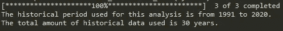

# 使用 Python 为您的投资组合确定安全的提款率

> 原文：<https://towardsdatascience.com/determine-a-safe-withdrawal-rate-for-your-investment-portfolio-with-python-cf2df9185f73?source=collection_archive---------54----------------------->

## 在钱不用完的情况下能取多少？


蒂埃拉·马洛卡在 [Unsplash](https://unsplash.com?utm_source=medium&utm_medium=referral) 上拍摄的照片

1999 年，一项[研究](https://www.researchgate.net/publication/228707593_Sustainable_withdrawal_rates_from_your_retirement_portfolio)发表，详细说明了一系列名义和通胀调整提款率对投资组合的影响，最长支付期为 30 年。在金融、投资咨询和退休规划领域，这项研究被非正式地称为**三位一体研究**。

该研究表明，至少 75%股票的投资组合提供了 4%至 5%的通胀调整后提款。换句话说，如果你有一个 100 万美元的投资组合，你可以每年提取 40，000 至 50，000 美元(经通胀调整)，至少在未来 30 年内没有资金耗尽的风险。

在阅读了这项研究后，我受到启发，扩展了本文的工作。因此，我编写了一个 python 脚本，遵循本研究中描述的方法来确定任何投资组合的可持续提款率(假设有足够的历史数据)。

这篇文章由以下部分组成，首先，我将解释数据和方法。其次，我将详细阐述 Python 实现并解释如何使用它。最后，给出了一个关于确定安全撤出率的结论。

# 数据和方法

为了确定一个可持续的退出率，该研究使用了一个比率，称为投资组合成功率。该比率用于比较具有不同提款率和支付期的所有投资组合。投资组合成功率被定义为投资组合成功的次数除以模拟的次数。如果投资组合在支付期结束时的期末值大于或等于零，则该投资组合被视为成功。

研究中使用的数据是标准普尔 500 指数的总月回报率和所罗门兄弟长期高等级公司债券指数。总月回报是给定期间投资的实际回报，包括利息、资本收益、股息和分配。

使用这些历史月总回报，通过使用不同支付期的重叠年方法来进行模拟。下图详细说明了这种方法:


此图中的三个点( **…** )指的是两年和/或模拟之间的年份和/或模拟。

为了确定投资组合的成功率，需要计算月末投资组合的价值。该研究区分了具有名义提款率的投资组合和经通胀调整后提款的投资组合。这些月末投资组合价值确定如下:


通货膨胀调整是根据消费者价格指数(CPI)确定的。

在继续 python 实现之前，我还想进一步阐述两个项目。这些是投资组合回报( *Rₜ* )和每月提取金额( *Wₜ* )的确定。请参考下图:


投资组合回报的计算隐含地假设**每月对投资组合进行再平衡**以达到期望的投资组合权重。请注意，研究或实施中未考虑交易佣金和费用。

不幸的是，由于数据限制，python 实现的范围仅限于确定**名义提款率**。此外，我只能找到历史月回报，而不是总月回报。因此，不考虑股息或其他分配，这可能会影响投资组合的实际成功率。不过，我相信这个影响不会很大。

# Python 实现

首先，我用于这个实现的库是 [yfinance](https://github.com/ranaroussi/yfinance) 和 [plotly](https://plotly.com/python/getting-started/) 。要使用这个 python 实现，您需要安装这些库。您可以使用`pip`来安装这些库。

```
pip install yfinance --upgrade --no-cache-dir
pip install plotly
```

在安装了必要的库之后，我们可以将注意力转向 python 实现。考虑到不同的投资组合构成、支付周期和提款率的数量，我发现创建一个名为`sustainable_withdrawal_rate`的 python 类是合适的。

在加载这个类之前，如果你在 [Yahoo Finance](https://finance.yahoo.com/) 上查找你选择的符号会有所帮助，因为你将需要它作为 python 类的输入。例如，我想确定包含英国、德国和法国指数的投资组合的(名义)可持续提款率。雅虎财经上这些指数的符号是:

*   英国富时指数:^FTSE
*   德国 DAX 指数:^GDAXI
*   法国 CAC 40 指数:^FCHI

加载 python 类后，需要实例化它。对于实例化，需要符号作为输入。以下是使用上述符号的示例:

```
symbols = "^FTSE ^GDAXI ^FCHI"
port = sustainable_withdrawal_rate(symbols)
```

观察到以下输出:



输出表明所有三个指数的历史(月度)数据范围从 1991 年到 2020 年，这是可用于分析的 30 年历史数据。这是有用的，因为它表明，对于这种投资组合，没有足够的历史数据来确定 30 年支付期的可持续提款率。

基于该投资组合的历史数据量(30 年)，我们可以使用 10 年的支付期。如果您想要确定给定投资组合组合和 10 年支付期的成功率，您可以使用以下代码:

```
portfolio_composition = {"^FTSE":0.4, "^GDAXI":0.4, "^FCHI":0.3}
payout_period = 10
port.portfolio_success_rate(payout_period, portfolio_composition)
```

代码显示，该投资组合的权重包括 40%的富时指数、40%的 DAX 指数和 30%的 CAC 40 指数。运行此代码会产生以下输出:


输出是一个表格，其中包含不同的年度提款率及其相应的成功率。换句话说，由 40%的富时、40%的 DAX 和 30%的 CAC 40 组成的投资组合可以在 10 年的支付期内维持高达 7%的年提款率而不会被耗尽。

如果你想调整投资组合的组成和/或支付期，看看这些变化如何影响成功率。通过调整`portfolio_composition`和/或`payout_period`，并运行代码`port.portfolio_success_rate(payout_period, portfolio_composition)`，你可以很容易地做到这一点。

最后，您还可以绘制特定年提款率的投资组合模拟图。让我们根据上面描述的投资组合构成和支付期，模拟 8%的年提款率。您可以使用以下代码来绘制模拟:

```
annual_withdrawal = 0.08
port.plotsimulations(annual_withdrawal)
```

运行此代码应该会在您的 webbrowser 中产生以下图形:


该研究和实施的基本假设是，本金在支付期间也被消耗。因此，提款率越低，在支付期后剩余大量资金的可能性就越大。

该图显示了年提款率为 8%，支付期为 10 年(120 个月)的不同投资组合模拟。投资组合模拟是根据方法一节中讨论的重叠年方法确定的。此外，该图显示了初始投资组合价值 1，以及对于不同的模拟，月末投资组合价值如何在整个月份中变化。

图中的绿线是被认为是成功的投资组合模拟，因为期末值大于零。相反，图中的红线是失败的投资组合模拟，因为它们的期末价值是负的。

如果您想绘制不同年提款率的投资组合模拟图，只需调整`annual_withdrawal`并运行代码`port.plotsimulations(annual_withdrawal)`。

python 类`sustainable_withdrawal_rate`的完整代码如下所示:

三位一体研究的 Python 实现

# 结论

在本文中，我扩展了三一研究的工作，假设有足够的数据，任何投资组合的(名义)可持续提款率都可以确定。

通过使用 python 类`sustainable_withdrawal_rate`，您可以为您的投资组合确定一个可持续的提款率。选择一个可持续的退出率是主观的，不存在全局最优的退出率。

可持续的提款率取决于许多个人偏好，如当前消费、可变金融需求以及个人是否希望将初始退休投资组合的大部分留给其继承人。因此，这一分析的结果应被视为一种输入，以确定您的可持续戒断率。

这项研究中没有考虑的一个重要因素是个体的预期寿命。对于那些感兴趣的人，我写了一篇文章详细说明了预期寿命对提前退休人数的影响，这里是[链接](https://medium.com/makingofamillionaire/a-critical-look-at-the-multiply-by-25-rule-to-early-retirement-8535ef48cba1)。

***来自《走向数据科学》编辑的提示:*** *虽然我们允许独立作者根据我们的* [*规则和指南*](/questions-96667b06af5) *发表文章，但我们并不认可每个作者的贡献。你不应该在没有寻求专业建议的情况下依赖一个作者的作品。详见我们的* [*读者术语*](/readers-terms-b5d780a700a4) *。*

# 参考

[1] Phillip L. Cooley、Carl M. Hubbard 和 Daniel T. Walz,《投资组合的可持续提款率》( 1999 年),《财务咨询和规划》第 10 卷第 1 期。

本文表达的金融观点来自作者的个人研究和经验。本文仅供参考。不应将其视为财务或法律建议。