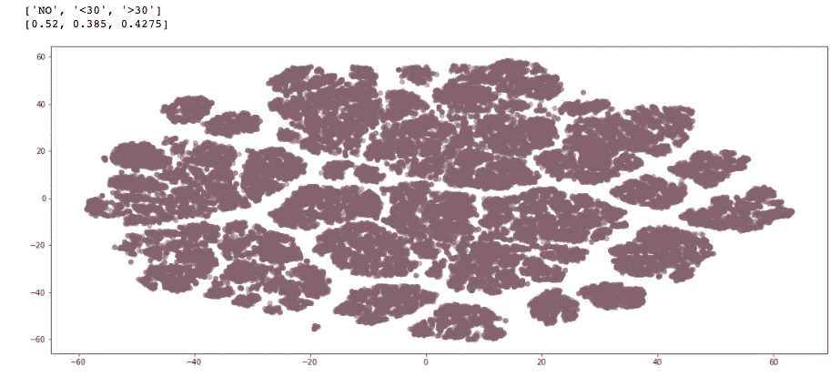
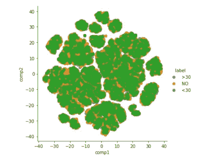

# 确定您的数据是否可以建模

> 原文：<https://towardsdatascience.com/determine-if-your-data-can-be-modeled-e619d65c13c5?source=collection_archive---------48----------------------->

## 你收集到正确的数据了吗？？

一些数据集并不意味着具有可以聚类的地理空间表示。你的特征有很大的变化，理论上也有很大的特征。但是，这并不意味着统计上是可分的。

## 那么，我什么时候停止？

1.  始终**根据您试图预测的类别标签来可视化**您的数据

```
columns_pairplot = x_train.select_dtypes(include=['int', 'float']).join(y_train)
sns.pairplot(columns_pairplot, hue = 'readmitted')
plt.show()
```


作者图片:不可分割的类

不同阶层的分布几乎是精确的。当然，这是一个不平衡的数据集。但是，请注意这些类的分布是如何重叠的？

2.应用 **t-SNE 可视化**

t-SNE 是“t-分布随机邻居嵌入”。它将高维数据映射到二维空间。这个 ***大致保持了样本的接近度。***

您可能需要应用不同的*学习率*来找到最适合您数据集的学习率。通常，尝试 50 到 200 之间的值。

超参数，*困惑度*平衡了 t-SNE 赋予数据的局部和全局可变性的重要性。这是对每个点的近邻数量的猜测。使用 5-50 之间的值。**更高，如果有更多的数据点**。困惑值不应超过数据点的数量。

注意:轴到 t-SNE 图是不可解释的。每次应用 t-SNE 时，它们都会有所不同



作者图片:T-SNE 可视化

嗯，让我们再看多一点——调整一些超参数。

```
# reduce dimensionality with t-sne
tsne = TSNE(n_components=2, verbose=1, perplexity=50, n_iter=1000, learning_rate=50)
tsne_results = tsne.fit_transform(x_train)
```



图片作者:重叠数据-无法分类！

你看到集群是怎么分不开的吗！我应该停在这里的！但是，我不能让自己走出这个疯狂的洞。[是的，我们有时都会这样]。

3.多类分类

从上面我们已经知道，决策边界是非线性的。因此，我们可以使用一个 [SVC](https://scikit-learn.org/stable/modules/generated/sklearn.svm.SVC.html) (具有 RBF 核的支持向量分类器)

```
from sklearn.svm import SVC
from sklearn.model_selection import GridSearchCVsvc_model = SVC() ## default kernel - RBF
parameters = {'C':[0.1, 1, 10], 'gamma':[0.00001, 0.0001, 0.001, 0.01, 0.1]}
searcher = GridSearchCV(svc_model, param_grid = parameters, n_jobs= 4, verbose = 2, return_train_score= True)
searcher.fit(x_train, y_train)
# Report the best parameters and the corresponding score
```

> 训练分数:0.59
> 测试分数:0.53
> F1 分数:0.23
> 精度分数:0.24

所以，我应该早点停止…在你试图过度调整和复杂化模型以期望更好的结果之前，理解你的数据总是好的。祝你好运！