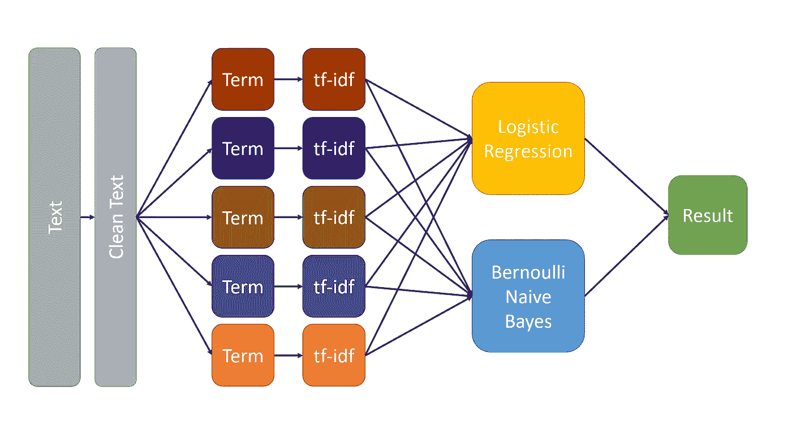
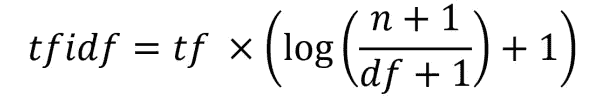
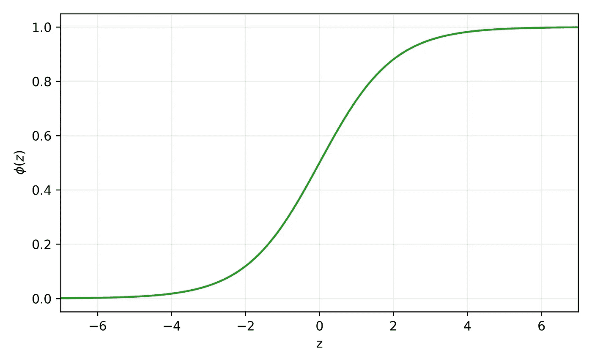
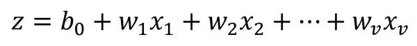
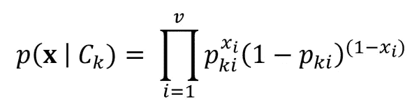

# 使用 Scikit-Learn 确定报价来源

> 原文：<https://towardsdatascience.com/determining-a-quotes-source-using-scikit-learn-9d3e2af894f4?source=collection_archive---------58----------------------->

## 使用逻辑回归和朴素贝叶斯进行整体平均，以确定一条消息更有可能是伯尼·桑德斯或唐纳德·川普发的。



用于文本分类的机器学习管道。图片作者。

人们可以利用视觉和听觉等感官来学习。机器学习遵循类似的概念，但有一个关键的区别。电脑不能像我们一样看或听。它只懂一件事——数字。因此，在机器能够学习之前，它首先需要将人类能够感知的信息转换为数字。数字图像以像素的形式存储数字信息就是一个例子。

在本文**中，我们将开发一个机器学习模型，它可以接收打字信息，并确定伯尼·桑德斯或唐纳德·川普更有可能发微博**。在我的 [GitHub](https://github.com/Shawn-Chahal/who-said-it) 上可以找到包含数据集、Python 代码和将要讨论的 Jupyter 笔记本的存储库。现在让我们开始吧！

# 最小化数据集偏差

为了最大限度地减少偏见，我们需要根据我们两位政治家在类似情况下使用的文本来训练我们的模型。例如，如果我们只从一个政治家对国家悲剧的回应中提取文本，从另一个政治家对积极事件的回应中提取文本，那么我们的模型将学习区分积极和消极的文本，而不一定是他们的写作风格。因此，我们将在自 2015 年*(即*，他们为 2016 年美国总统大选发起竞选活动)以来的两位政治家的推特上训练模型。我们将不包括转发，因为尽管它们可能反映了政治家的社会经济观点，但它们不一定反映他们的语言模式。

# 特征抽出

## 清理推文

推文可以包含指向其他网站、图像或视频的链接，这些链接将带有自己的 URL，包括诸如(https://…)之类的术语。标签(#)和提及(@)也包含一些符号，这些符号不一定是这些政客文章的一部分，但却是使用某些 twitter 功能的必需品。因此，我们将删除这些项目和任何其他非字母数字字符，并将剩下的内容转换为小写。本质上，**我们将只剩下包含小写字母、数字和空格的文本**。例如:

*   她打算买电视机。它以 500 美元出售。

会变成:

*   她打算买这台减价 500 英镑的电视机

该消息在阅读时仍然有意义，并且现在将更容易在我们的模型中实现。

## 词袋模型

让我们考虑以下三个 ***文件*** :

*   我们正在学习机器学习。
*   具体来说，我们正在学习文本分类。
*   你考虑过学习 Python 吗？

清理这些文件给了我们:

*   我们正在学习机器学习
*   具体来说，我们正在学习文本分类
*   你考虑过学习 python 吗

接下来，我们将把每个文档标记成 ***个术语*** :

*   我们|正在|学习|关于|机器|学习
*   具体来说，我们正在|学习|关于|文本|分类
*   你考虑过学习 python 吗

注意“|”符号在我们的模型中实际上并不存在，它只是在这里用来帮助可视化标记。每个文档现在可以被认为是一个包含每个单词的术语的袋子。因此得名*。让我们看看标记化对文档的影响:*

*   *我们是→我们|是*
*   *我们→曾经是*
*   *曾经→曾经*

*前两个术语(*即*“我们是”和“我们是”)具有相同的含义，但将被注册为不同的术语。而且“我们”和“是”这两个词已经分离开了。这可能看起来不可取，但是请记住**某人是否使用缩写是他们如何书写**的一个显著特征。相反，“we 're”和“was”有不同的意思，但现在已经合并为同一个术语。*

## *n-gram 模型*

*在前面的例子中，我们将文档标记为一个单词术语，称为 unigrams ( *，即*，1-grams)。为了改进我们的模型，我们还可以提取由包含两个单词的术语组成的二元模型(*即*，2-grams):*

*   *我们正在学习→我们|正在|学习|我们正在|正在学习*
*   *我们在学习→我们在学习*
*   *你是吗？你是吗*

*使用二元模型，我们现在可以包括新的术语，如“我们是”。我们也有更多的信息来区分“我们是”和“曾经是”，因为“曾经是你”可能比“我们是你”更常见。我们还可以提取像“机器学习”这样的新术语，以前只能作为“机器”和“学习”使用。*

*将二元模型添加到我们的模型中会增加每个文档中的术语数量，使我们的模型更加复杂，但是我们必须小心不要忘乎所以。**包括比必要特征更多的特征(*，例如*，3-grams，4-grams，5-grams，*等。* ) 来描述我们的模型会使它容易过拟合，以及增加它的规模和计算时间。**虽然在本文中我们不会对[过度拟合](https://en.wikipedia.org/wiki/Overfitting)进行详细的讨论，但总的想法是，我们希望尽可能用最少的必要特征制作最精确的模型。*

## *计数矢量化*

*考虑下面的 ***文集*** ( *即*，文献集):*

*   *这是语料库中的第一个例子。*
*   *这是第二个。*
*   *每一个例子都在增加。*

*首先，我们的模型不知道任何术语。因此，我们需要创建一个字典，包含我们希望模型知道的所有术语。这些术语组成了模型的 ***词汇*** ，并且可以使用 Python 中的 scikit-learn 的`[CountVectorizer](https://scikit-learn.org/stable/modules/generated/sklearn.feature_extraction.text.CountVectorizer.html)`从语料库中提取:*

```
*from sklearn.feature_extraction.text import CountVectorizer
import pandas as pd

corpus = ['This is the first example in the corpus.',
          'This is the second.',
          'The corpus is growing with each example.']

count = CountVectorizer(ngram_range=(1, 2))
count.fit(corpus)
df = pd.DataFrame.from_dict(count.vocabulary_,
                            orient='index', columns=['INDEX'])
df.sort_values(by=['INDEX'], inplace=True)

X_count = count.transform(corpus)
df['doc1_tf'] = X_count.toarray().T[df['INDEX'], 0]
df['doc2_tf'] = X_count.toarray().T[df['INDEX'], 1]
df['doc3_tf'] = X_count.toarray().T[df['INDEX'], 2]
print(df)*
```

*输出是我们的词汇表，其中包含我们的语料库中所有唯一的术语(*即*，单词和双词)和 ***术语频率*** ( *tf* ) ( *即*，每个术语在文档中出现的次数)表。*

```
 *INDEX  doc1_tf  doc2_tf  doc3_tf
corpus             0        1        0        1
corpus is          1        0        0        1
each               2        0        0        1
each example       3        0        0        1
example            4        1        0        1
example in         5        1        0        0
first              6        1        0        0
first example      7        1        0        0
growing            8        0        0        1
growing with       9        0        0        1
in                10        1        0        0
in the            11        1        0        0
is                12        1        1        1
is growing        13        0        0        1
is the            14        1        1        0
second            15        0        1        0
the               16        2        1        1
the corpus        17        1        0        1
the first         18        1        0        0
the second        19        0        1        0
this              20        1        1        0
this is           21        1        1        0
with              22        0        0        1
with each         23        0        0        1*
```

## *术语频率-逆文档频率(tf-idf)*

*有很多大家都用的常用词，在某人的写作中不会成为显著特征。例如，“is”和“the”都有一个 ***文档频率*** ( *df* )等于 3 ( *即*，它们出现在我们语料库的所有三个文档中)，因此，它们不会像具有 *df* = 1 ( *即*，它只出现在一个文档中)的术语“growing”那样给我们提供那么多有区别的信息。我们希望对文档出现频率低的术语赋予更高的权重。注意，在计算 *df* 时，一个术语在文档中出现多少次并不重要，只要它至少出现一次。例如，术语“the”仍然有 *df* = 3，尽管在语料库中总共出现了 4 次。我们可以通过将术语频率乘以 ***逆文档频率*** ( *idf* )来应用这个权重。这给了我们 ***术语频率—逆文档频率*** (tf-idf 或 *tfidf* ):*

**

*其中 *n* 是语料库中的文档总数(在我们最后的例子中， *n* =3)。请注意，等式中“+ 1”的用法因实施方式而异。它们的目的是避免产生零，尤其是在分母中。这里显示的等式是我们即将使用的`[TfidfTransformer](https://scikit-learn.org/stable/modules/generated/sklearn.feature_extraction.text.TfidfTransformer.html)`的默认 scikit-learn 实现。*

*最后，我们希望确保文档的长度不会影响我们的模型。例如，如果一个政客通常比另一个政客写得更短，我们不希望用户能够通过简单地写较长的消息来欺骗我们的模型。因此，我们将标准化每个文档向量，使其平方和等于 1。换句话说，**在计算了 *tfidf* 值之后，我们将把每个文档缩放到一个单位向量**。*

```
*from sklearn.feature_extraction.text import TfidfTransformer

tfidf = TfidfTransformer()
X_tfidf = tfidf.fit_transform(X_count)
df['doc1_tfidf'] = X_tfidf.toarray().T[df['INDEX'], 0]
df['doc2_tfidf'] = X_tfidf.toarray().T[df['INDEX'], 1]
df['doc3_tfidf'] = X_tfidf.toarray().T[df['INDEX'], 2]
print(df[['INDEX', 'doc1_tfidf', 'doc2_tfidf', 'doc3_tfidf']])*
```

*这为我们提供了下面的 *tfidf* 表:*

```
 *INDEX  doc1_tfidf  doc2_tfidf  doc3_tfidf
corpus             0    0.227103    0.000000    0.235457
corpus is          1    0.000000    0.000000    0.309598
each               2    0.000000    0.000000    0.309598
each example       3    0.000000    0.000000    0.309598
example            4    0.227103    0.000000    0.235457
example in         5    0.298613    0.000000    0.000000
first              6    0.298613    0.000000    0.000000
first example      7    0.298613    0.000000    0.000000
growing            8    0.000000    0.000000    0.309598
growing with       9    0.000000    0.000000    0.309598
in                10    0.298613    0.000000    0.000000
in the            11    0.298613    0.000000    0.000000
is                12    0.176366    0.280520    0.182854
is growing        13    0.000000    0.000000    0.309598
is the            14    0.227103    0.361220    0.000000
second            15    0.000000    0.474961    0.000000
the               16    0.352732    0.280520    0.182854
the corpus        17    0.227103    0.000000    0.235457
the first         18    0.298613    0.000000    0.000000
the second        19    0.000000    0.474961    0.000000
this              20    0.227103    0.361220    0.000000
this is           21    0.227103    0.361220    0.000000
with              22    0.000000    0.000000    0.309598
with each         23    0.000000    0.000000    0.309598*
```

*注意，即使一些术语在不同的文档中有相同的 *tf* ，它们也可以有不同的 *tfidf* 。*

*既然我们知道了如何从语料库中提取特征并转换成模型可以理解的格式，我们就可以继续前进，开始训练实际的模型。*

# *训练模型*

*在前面的例子中，我们查看了一个包含 3 个文档和 24 个词汇的小型语料库。在实践中，如果我们想要开发一个模型来确定一个引用是属于伯尼·桑德斯还是唐纳德·川普，我们将需要更多的文档和更大的词汇表。如前所述，我们将使用他们自 2015 年以来的所有推文。*

*使用新的 Jupyter 笔记本，让我们从使用 Python 标准库中的`[re](https://docs.python.org/3.7/library/re.html)`清理推文开始:*

```
*import os
import re
import pandas as pd

def clean_text(text):
    text = re.sub(r"'", '', text)
    text = re.sub(r'http\S+', '', text)
    text = re.sub(r'pic.twitter\S+', '', text)
    text = re.sub(r'\W+', ' ', text.lower())

    return text

df = pd.read_csv(os.path.join('tweets', 'tweets.csv'),
                 low_memory=False)
df.drop_duplicates(inplace=True)
df['tweet-clean'] = df['tweet'].apply(clean_text)
drop_index = []

for i in range(len(df)):
    if df['tweet-clean'].iloc[i] in ('', ' '):
        drop_index.append(i)

df.drop(drop_index, inplace=True)*
```

*我们定义了`clean_text`,它获取一个字符串，并根据我们之前讨论的需求对其进行清理。然后，我们将数据集加载到一个`[pandas.DataFrame](https://pandas.pydata.org/pandas-docs/stable/reference/api/pandas.DataFrame.html)`中，并将`clean_text`应用到每条推文中。最后，在我们的清理过程之后，我们会删除任何现在是空白的推文。在我们训练模型之前，让我们定义两个常数:*

```
*random_state = 0
n_jobs = -1*
```

*注意，通过设置`random_state = 0`，我们实际上并没有初始化我们的随机种子，而是将一个整数传递给我们的各种 scikit-learn 实现，这将允许我们在每次运行代码时保持相同的随机状态。**在调整超参数时，我们希望确保每次测试我们的模型时都生成相同的随机序列**，这样我们就可以确定我们看到的任何性能改进都是由于我们所做的更改，而不是由于随机数生成器产生的随机性。*

***Scikit-learn 支持多线程。今天大多数电脑都使用多核 CPU。我们可以设置`[n_jobs](https://scikit-learn.org/stable/glossary.html#term-n-jobs) = -1`使用一个 CPU 上的所有线程来加快模型训练。***

*现在我们将计算推文的矢量化。使用`[TfidifVectorizer](https://scikit-learn.org/stable/modules/generated/sklearn.feature_extraction.text.TfidfVectorizer.html)`可以将语料库直接转换为 scikit-learn 中的 *tfidf* 向量，这实际上是一个`CountVectorizer`后跟`TfidfTransformer`的管道，两者我们之前都使用过。*

```
*from sklearn.feature_extraction.text import TfidfVectorizer

tfidf = TfidfVectorizer(ngram_range=(1, 2), min_df=2)
X = tfidf.fit_transform(df['tweet-clean'])

print(f'Number of documents: {X.shape[0]}')
print(f'Size of vocabulary:  {X.shape[1]}')*
```

*它为我们的数据集输出一些统计数据:*

```
*Number of documents: 34648
Size of vocabulary:  86092*
```

*为了在整篇文章中保持一致，我们将它们指定为:*

*   *文档数量: *n* = 34 648 条推文*
*   *词汇量: *v* = 86 092 个词汇*

*我们设置了`ngram_range=(1, 2)`和`min_df=2`，这表明我们的词汇表将由单词和双词组成，文档频率至少为 2。通过消除文档频率仅为 1 的术语，我们可以减少模型中的特征数量，并减少过度拟合。注意，这种方法在这里工作得很好，因为我们的语料库包含成千上万的文档。这可能不适合较小的语料库，这些参数需要针对每个项目进行专门调整。*

*就像我们的模型需要以数字的形式接收 tweets 一样，它也需要以数字的形式接收政客的名字。这可以使用 scikit-learn 的`[LabelEncoder](https://scikit-learn.org/stable/modules/generated/sklearn.preprocessing.LabelEncoder.html)`来完成:*

```
*from sklearn.preprocessing import LabelEncoder

le = LabelEncoder()
y = le.fit_transform(df['name'])

for i in range(len(le.classes_)):
    print(f'{le.classes_[i]:<15} = {i}')*
```

*它分配以下标签:*

```
*Bernie Sanders  = 0
Donald J. Trump = 1*
```

*在训练我们的模型之前，**将我们的数据集分成训练和测试集**是极其重要的。训练集将用于训练我们的模型，但重要的是要有一个单独的测试数据集，以真正衡量我们的模型在以前从未见过的数据上有多准确。使用 scikit-learn 的`[train_test_split](https://scikit-learn.org/stable/modules/generated/sklearn.model_selection.train_test_split.html)`功能:*

```
*from sklearn.model_selection import train_test_split

X_train, X_test, y_train, y_test = train_test_split(X, y,
                                    test_size=0.5,
                                    random_state=random_state,
                                    stratify=y)*
```

*在这里，我们用`test_size=0.5`指定我们将保留 50%的数据集作为我们的测试集。我们还设置了`[stratify](https://en.wikipedia.org/wiki/Stratified_sampling)=y`,以确保我们的测试和训练数据集具有相同的伯尼·桑德斯和唐纳德·川普推文比率。*

*现在我们已经建立了数据，让我们看看我们的第一个算法。*

## *逻辑回归*

*逻辑回归是最著名的机器学习模型之一，通常是大多数人在开始机器学习时首先学习的算法之一。标准逻辑函数如下所示:*

****

*标准逻辑函数。图片作者。*

*标准逻辑函数接收值 *z* 并输出 0 和 1 之间的值。我们正在处理一个二元分类问题，这意味着结果必须是伯尼·桑德斯或唐纳德·特朗普，没有其他选择。这就是为什么我们之前给每个政治家分配 0 或 1 的值。*

*现在让我们看看如何将一条 tweet 转换成一个值:*

**

*从这个等式中，我们看到 *z* 等于我们的 *tfidf* 向量( **x** )与添加了偏置项( *b_0* )的权重向量( **w** )的点积。注意，虽然 Python 列表从 0 开始索引，但更常见的是在描述数学模型时从 1 开始索引，并为我们的偏差项保留索引 0(有时也会出现为 *w_0* )。对于每条推文，我们可以计算一个值 *z* ，通过逻辑函数传递它，并四舍五入到最接近的整数，得到 0 =伯尼·桑德斯或 1 =川普。为了做到这一点，我们的机器学习算法需要计算出权重向量( **w** )的哪些值将导致最高比例的推文被归因于正确的政治家。*

*我们不会探究解决 w 的各种方法，因为这本身就是一篇完整的文章。Scikit-learn 实现了各种求解器来训练一个`[LogisticRegression](https://scikit-learn.org/stable/modules/generated/sklearn.linear_model.LogisticRegression.html)`分类器。在这个应用中，我们将`solver='[saga](https://arxiv.org/abs/1407.0202)'`设置为我们的优化方法，将`C=20`设置为我们的逆正则项，以减少过度拟合，并使我们的模型更容易训练:*

```
*from sklearn.linear_model import LogisticRegression

clf_log = LogisticRegression(C=20, solver='saga',
                             random_state=random_state,
                             n_jobs=n_jobs)

clf_log.fit(X_train, y_train)
log_score = clf_log.score(X_test, y_test)
print(f'Logistic Regression accuracy: {log_score:.1%}')*
```

*这返回了我们在测试数据集上的准确性:*

```
*Logistic Regression accuracy: 95.8%*
```

## *伯努利朴素贝叶斯*

*朴素贝叶斯分类器在文本分类任务中相对流行。我们将实现一个称为伯努利朴素贝叶斯的特定事件模型。每个政治家写的特定推文的[可能性](https://en.wikipedia.org/wiki/Likelihood_function)可以计算如下:*

**

*其中 *p_ki* ，是政客 *C_k* 在推文中使用术语 *i* 的概率。让我们使用 scikit-learn 的`[BernoulliNB](https://scikit-learn.org/stable/modules/generated/sklearn.naive_bayes.BernoulliNB.html)`分类器来训练我们的模型，然后看看这些参数代表了什么:*

```
*from sklearn.naive_bayes import BernoulliNB

clf_bnb = BernoulliNB(alpha=0.01, binarize=0.09)
clf_bnb.fit(X_train, y_train)*
```

*现在让我们来看看下面伯尼·桑德斯的名言:*

> *“全民医疗保险” *-伯尼·桑德斯**

*此报价将包含术语“medicare for”。让我们看看这如何转化为上述等式中的参数:*

```
*import numpy as np

C_k = 'Bernie Sanders'
k = le.transform([C_k])[0]
i = tfidf.vocabulary_['medicare for']
p_ki = np.exp(clf_bnb.feature_log_prob_[k, i])
print(f'k = {k}')  # class label
print(f'i = {i}')  # index for term 'medicare for'
print(f'C_k = {C_k}')
print(f'p_ki = {p_ki:.3}')*
```

*它返回:*

```
*k = 0  
i = 44798  
C_k = Bernie Sanders
p_ki = 0.0289*
```

*这里， *p_ki* = 0.0289 可以解释为在我们的训练集中，来自伯尼·桑德斯的推文有 2.89%包含术语“医疗保险”。关于伯努利朴素贝叶斯有趣的是**可以直接求解 *p_ki* 值**。它简单地等于政治家 *C_k* 语料库中术语 *i* 的文档频率除以政治家 *C_k* 语料库中的文档总数:*

```
*df_ki = clf_bnb.feature_count_[k, i]
n_k = clf_bnb.class_count_[k]
p_ki_manual = df_ki / n_k
print(f'{p_ki:.5}')
print(f'{p_ki_manual:.5}')*
```

*这两者都为我们提供了相同的值，p_ki 有 4 个有效数字:*

```
*0.028924
0.028922*
```

*在逻辑回归中， **x** 包含 *tfidf* 值。在伯努利朴素贝叶斯中， *x_i* 必须等于 0 或 1。最简单的形式是，如果术语 *i* 出现在 tweet 中， *x_i* 等于 1，如果没有出现，则等于 0。然而，我们可以通过在我们的 *tfidf* 值上设置一个阈值来提取更多的信息。最佳阈值通常通过试错法或穷举搜索法找到，例如 scikit-learn 中的`[GridSearchCV](https://scikit-learn.org/stable/modules/generated/sklearn.model_selection.GridSearchCV.html)`。对于这个应用程序，一个最佳的阈值是`binarize=0.09`。因此，高于 0.09 的任何 *tfidf* 值被设置为 1，低于 0 的任何值被设置为 0。我们还设置了`alpha=0.01`，这是一个平滑参数。*

*回到我们的等式，我们可以看到，如果我们从用户那里接收到一个文档，其中 *x_i* = 1，那么我们正在乘以术语 *i* 出现在政治家 *C_k* 的推文中的概率( *p_ki* )。相反，如果 *x_i* = 0，那么我们就在成倍增加这个词 *i* 不会*出现在政客 *C_k* 的推特上的概率。对词汇表中的每个术语和每个政治家都进行这种乘法运算。然后输出具有最高联合对数似然的政治家作为结果。记住**当逻辑函数输出概率时，伯努利朴素贝叶斯输出可能性**。这两个术语是相关的，但并不意味着同一件事。这里将不讨论将可能性转换成概率的方法，但是下面的[维基百科条目](https://en.wikipedia.org/wiki/Naive_Bayes_classifier#Discussion)包含了对该主题及其与逻辑回归的关系的简明讨论。此外，`BernoulliNB`可以使用它的`[predict_proba](https://scikit-learn.org/stable/modules/generated/sklearn.naive_bayes.BernoulliNB.html#sklearn.naive_bayes.BernoulliNB.predict_proba)`方法将可能性转换成概率。现在让我们计算一下测试数据集的准确度:**

```
*bnb_score = clf_bnb.score(X_test, y_test)
print(f'Bernoulli Naive Bayes accuracy: {bnb_score:.1%}')*
```

*它返回:*

```
*Bernoulli Naive Bayes accuracy: 96.2%*
```

## *整体平均*

*我们训练了两个模型，逻辑回归和伯努利朴素贝叶斯，这两个模型在测试数据集上都具有相对较高的准确性。使用 scikit-learn 的`[VotingClassifier](https://scikit-learn.org/stable/modules/generated/sklearn.ensemble.VotingClassifier.html)`，我们可以通过使用`estimators=[('log', clf_log), ('bnb', clf_bnb)]`选择我们的分类器并设置`voting='soft'`来获得一个更准确的结果，从而获得它们各自计算的概率的加权平均值。通过设置`weights=(0.6, 0.4)`将 60%的逻辑回归概率与 40%的伯努利朴素贝叶斯概率相加具有最高的准确性。一个有趣的结果，考虑到我们的伯努利朴素贝叶斯有更高的准确性，但我们赋予它更小的权重。这可能是因为来自我们的伯努利朴素贝叶斯分类器的潜在概率估计不一定像来自我们的逻辑回归分类器的概率计算那样可靠。现在让我们训练我们的集合模型:*

```
*from sklearn.ensemble import VotingClassifier

clf_vot = VotingClassifier(
    estimators=[('log', clf_log), ('bnb', clf_bnb)],
    voting='soft', weights=(0.6, 0.4), n_jobs=n_jobs)

clf_vot.fit(X_train, y_train)
vot_score = clf_vot.score(X_test, y_test)
print(f'Ensemble Averaging accuracy: {vot_score:.1%}')*
```

*这返回了我们在测试数据集上的准确性:*

```
*Ensemble Averaging accuracy: 96.4%*
```

*虽然这只是准确性的微小提高，但我们应该记住**人们可能会输入不一定是任何一个候选人可能会说的信息**。在这些情况下，整体平均可能是有益的，因为这相当于在决定哪位政治家更有可能在推特上发布用户所写的内容之前获得第二种意见。*

## *最终培训*

*一旦我们确定不再改变任何超参数(*，例如*，朴素贝叶斯的阈值，投票的加权平均值，*等)。*)然后，我们可以在整个数据集上重新训练我们的模型，以获得两倍的训练样本。*

```
*clf_vot.fit(X, y)*
```

# *使用应用程序*

*我希望你现在对 scikit-learn 如何应用于文本分类有了更好的理解，如果你是机器学习的新手，你现在有兴趣学习更多关于它的知识。*

*现在您可以亲自试用[应用](https://www.shawnchahal.com/who-said-it)来看看我们实际操作过的模型！*

 *[## 谁说的？

### 写一条信息，看看伯尼·桑德斯和唐纳德·川普谁更有可能说出来。

www.shawnchahal.com](https://www.shawnchahal.com/who-said-it)*