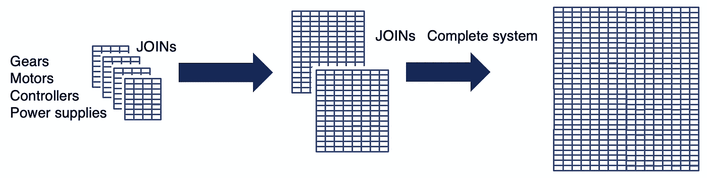
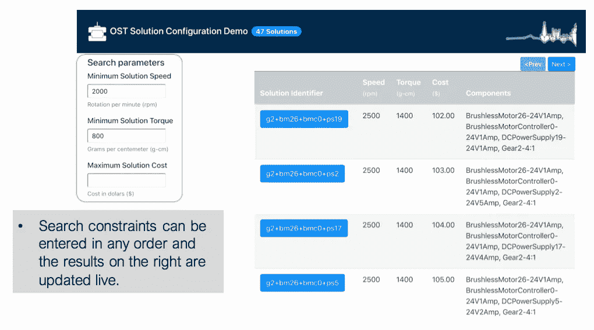
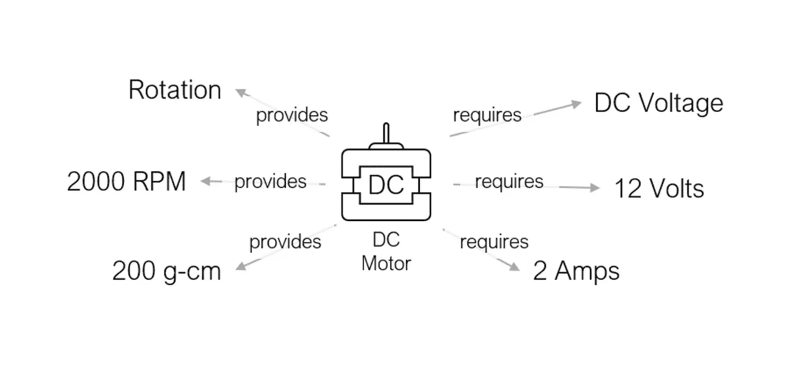
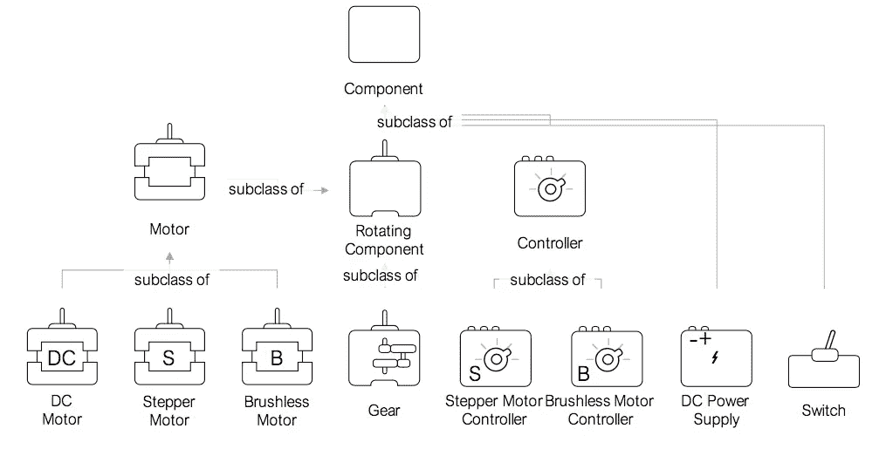
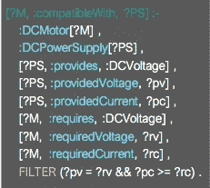
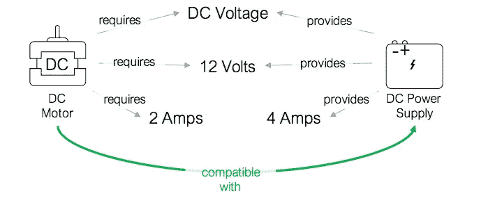
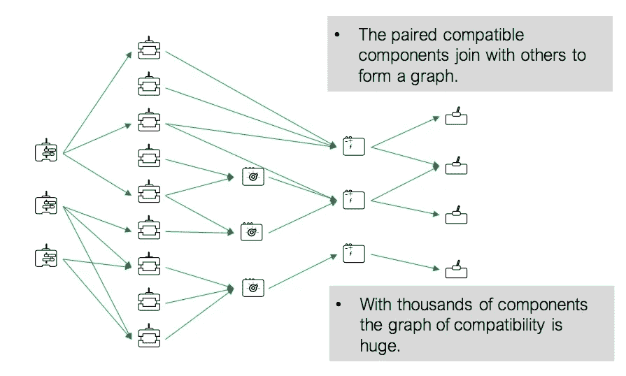
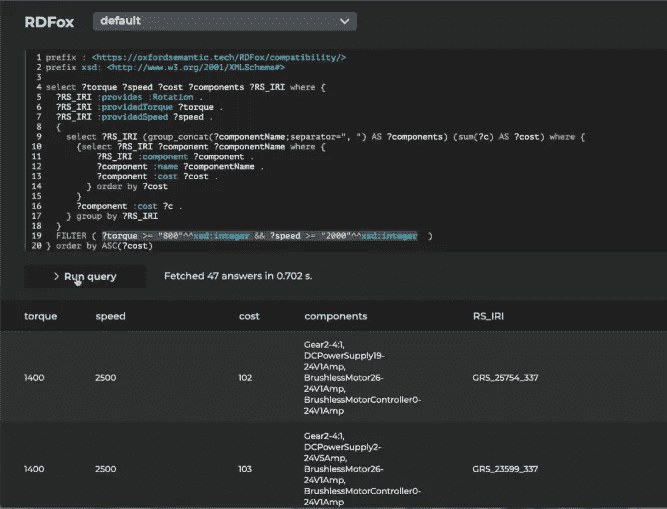
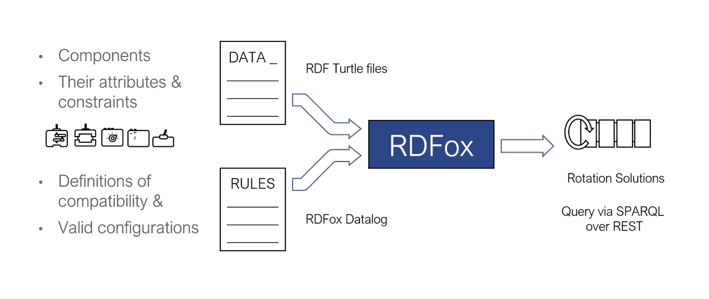

# 确定兼容性

> 原文：<https://towardsdatascience.com/determining-compatibility-b952d941c22a?source=collection_archive---------40----------------------->

## 配置管理示例

在各种行业和商业模式中，公司寻求评估兼容性；例如，关于工业配置管理、合同条款、供应链点、买方和供应商等等。

无论这一过程是与装配、生产还是数据分析相关，都需要检查数百万个组合，以评估组件是否匹配以及是否满足特定要求。大量的数据、复杂的流程和可扩展性问题意味着传统方法效率低下。

本文将展示如何使用 RDFox 使兼容性解决方案正确，迭代次数几乎不明显，并且比其他 RDF 存储快 50-100 倍。它将使用一个工业配置管理解决方案的例子。

例如，参见 [Festo 案例研究](https://www.oxfordsemantic.tech/case-studies)。或者点击此处跟随配置解决方案网络研讨会[**。**](https://www.youtube.com/watch?v=tpB_tl1Vc0A&t=1284s)

# 传统解决方案

传统上，SQL 数据库可用于确定兼容性。但是，这个过程很长，需要为每个组件创建表，连接表以形成更大的表，等等。然后使用完整的系统来评估兼容性。

确定与 SQL 数据库的兼容性

由于可能有数以千计的组件具有许多不同的特征，并且没有通用的模式，因此这个过程极其复杂并且令人厌倦，可扩展性有限。对于包含数万个组件的数据库，这个过程可能需要几个小时。

对于有时间压力和限制的企业来说，这带来了挑战，并可能限制竞争活力。每次添加或删除组件时，整个系统都需要更新，导致开发或修改过程中的长时间迭代。

# 为什么是 RDFox？

RDFox 是一个高性能的知识图和语义推理引擎。知识图由存储数据的图形数据库和解释并操作数据的推理层组成。关系数据库(如上面的 SQL 示例)以严格的表格结构存储数据，而图形数据库以节点(数据点，即主体或客体)和边(数据点之间的关系)的形式存储信息。这些结构差异为需要计算兼容性的用例提供了显著的优势，因为知识图克服了关系数据库的灵活性限制，允许将数据点编码为丰富连接的实体。

RDFox 是一个内存解决方案，这使得它非常快。强大的推理引擎在效率和推理能力方面无与伦比，通过使用规则，它可以提供灵活、增量的数据添加和撤销，以及新事实的快速并行具体化。

但是在配置解决方案的上下文中，推理意味着什么呢？

> 在这种情况下，推理就是理解和应用组件如何装配以满足客户需求的逻辑。

# 配置挑战

> “给我造一个能以每分钟 2000 转的速度旋转并提供 800 克/厘米扭矩的装置”

一个基于 RDFox 的配置管理界面的例子。

对于这个例子，我们已经创建了一个简单的配置管理 web 应用程序，它允许我们查询数据库以获得提供特定需求的配置解决方案。结果是实时更新的，可以在右边看到。

对于一个包含数万个组件的数据库，包括电机、齿轮、开关、电源和控制器，我们需要检查数百万个潜在的组合来确定兼容性。这是通过计算组件是否匹配以及它们是否满足彼此的要求来完成的。每个组件都有一定的要求，并负责一定的规定；例如，如果电池电源和电机需要兼容的电压量。

为了开始这个过程，我们将每个组件的属性映射到知识图中。在这个例子中，我们有 500 个组件。

每个组件都会添加到图表中。此图提供了一个特定的 DC 发动机及其规定和要求的示例。

此外，我们可以向图中添加组件的本体。这将捕获组件层次结构并编码到系统中，提供子类和关系。在为特定配置解决方案查询数据集的过程中，以及在编写规则时，使用本体是有帮助的。

一旦所有组件的数据都存储在知识图中，我们就可以使用推理能力来建立组件的兼容性。使用 datalog 中表达的规则，我们可以轻松、正确地将组件兼容性的逻辑写入系统。

规则允许将组件的约束与组件属性进行比较，从而确定兼容性并为兼容性解决方案提供选项。然后，兼容的配置解决方案可以作为节点(数据点，在这种情况下是组件)之间的新边(关系)存储在知识图中。

这是 datalog 中兼容性规则的一个示例，可能会导致以下结果:

在检查这个特定的规则时，很明显规则是逻辑的表达式，datalog 提供了一种清晰的语言来编码规则。规则读作“如果…那么”语句。例如:左边的公式:- operator 是规则头*(**then '*部分 *)* ，右边的公式是规则体*(**' if '*部分*)。*

直觉上，这个规则说，如果电源提供 DC 电压、特定量的电压和特定量的电流，而电机需要 DC 电压、相同量的电压和相同量的电流，那么这两者是兼容的。该示例显示了这两个组件基于组件的要求和规定是相互兼容的。

此示例仅代表一个配置序列。然而，该数据库包含 500 个组件和许多兼容性链。如果所有配置解决方案都经过计算并具体化到数据库中，那么配置解决方案将有多种途径，例如:

可以构建 Web 应用程序并将其附加到 RDFox 控制台，允许用户与知识图进行交互，而不必编写 SPARQL 查询。这对于要求整个公司的每个人都能够正确、快速地访问信息的企业来说有着重大的好处。通过在左侧的“搜索参数”框中键入搜索约束，将触发一个 SPARQL 查询，从知识图中请求信息。

配置管理应用程序

或者，不使用 web 应用程序，您可以使用 RDFox 的控制台直接与知识图交互。RDFox 使用 RDF 标准查询语言 SPARQL，它向知识图发送信息请求。

带有兼容性查询的 RDFox 控制台

上面的控制台包含使用示例数据库的配置解决方案的查询。查询表明选择了特定的扭矩和速度要求。该查询获取了 47 个答案，并在 0.702 秒内执行—眨眼之间，它就出现了！

通过使用规则，RDFox 可以在查询时间之前计算配置解决方案的所有兼容性。这种高级功能意味着查询比其他知识图解决方案更快，从而提高了企业的效率，因为解决方案提供得更快。这对用户体验和客户满意度产生了间接影响。不使用规则的系统将不得不在查询过程中确定兼容性，导致结果明显变慢。

# 添加或删除新项目时会发生什么？

在现实世界的应用程序中，组件将被添加到数据库中或从数据库中删除。这对使用长迭代周期数据库的公司来说是一个很大的限制。

新的组件数据可以在任何时候导入到 RDFox 中，同时还有它的兼容性规则。由于 RDFox 以增量方式处理更新，因此可以在不需要整个系统更新的情况下添加。

类似地，要删除一个组件，需要告诉 RDFox 删除它。一旦从数据中删除了组件，从该组件到其他组件(节点)的所有关系(边)也将被逐渐删除。

# 如果约束条件改变了呢？

与添加组件数据的过程类似，可以更新规则。这对于必须满足不断变化的约束(如预算、环境、需求等)的公司和客户来说非常重要。

这个增量特性是 RDFox 所独有的，并且提供了巨大的好处，因为它允许从应用程序中实时添加或删除规则和数据；例如，当组件不再生产、进货或缺货，或者产品被召回时。与其他兼容性解决方案相比，RDFox 在不影响性能的情况下提供灵活性的能力非常重要。

# 整体情况:

1.数据和规则进去了

2.RDFox 评估规则

3.使用 RDFox 控制台或基于该控制台构建的 web 应用程序，通过 SPARQL 查询来访问轮换解决方案。

知识图为数据建模提供了绝对的灵活性，因为规则可以对领域专业知识进行编码，并且可以定制以适应每个公司的需求。有关这一特定使用案例的更多信息，请观看网络研讨会。

要了解更多关于 RDFox 的信息，请访问我们的[网站](http://www.oxfordsemantic.tech)或[媒体出版物](https://medium.com/oxford-semantic-technologies)。要申请评估许可，请点击[此处](https://oxfordsemantictech.typeform.com/to/p0WKTn?typeform-embed=embed-widget&typeform-embed-id=vylbd)。

# 团队和资源

牛津语义技术背后的团队于 2011 年在牛津大学计算机科学系开始研究 RDFox，他们坚信灵活和高性能的推理是数据密集型应用的一种可能性，而不会危及结果的正确性。RDFox 是第一个面向市场的知识图，它是从底层开始设计的，并考虑到了推理。牛津语义技术公司是牛津大学的一个分支，由主要投资者支持，包括三星风险投资公司(SVIC)、牛津科学创新公司(OSI)和牛津大学的投资部门(OUI)。笔者很自豪能成为这个团队的一员。

*封面照片由作者在征得其子女同意后使用的主题。*