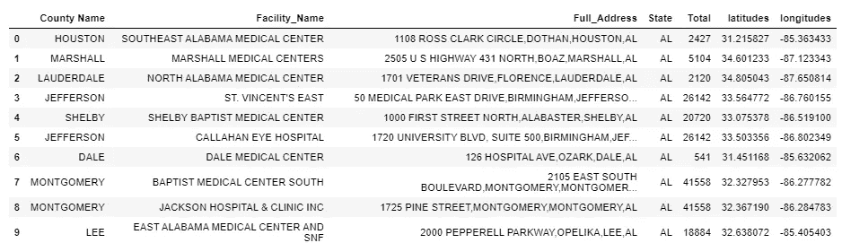
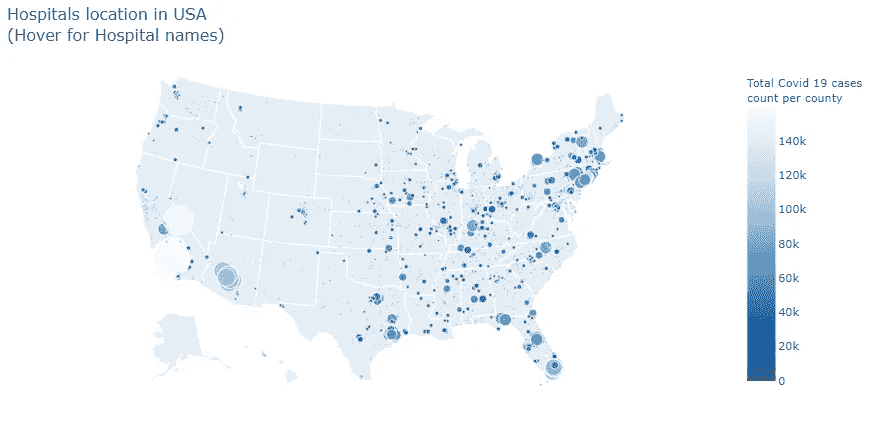
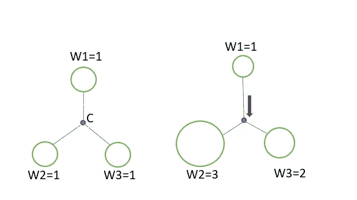
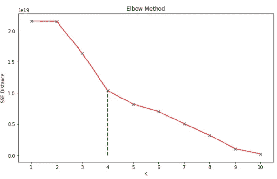
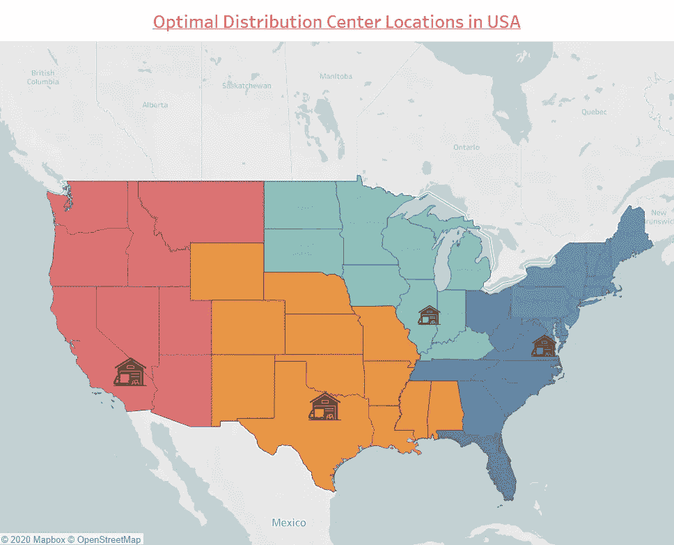

# 利用加权 K-均值确定最优配送中心位置

> 原文：<https://towardsdatascience.com/determining-optimal-distribution-centers-locations-using-weighted-k-means-1dd099726307?source=collection_archive---------20----------------------->

## 寻找在美国分发新冠肺炎疫苗所需的 DC 的位置和最佳数量


由 [Unsplash](https://unsplash.com?utm_source=medium&utm_medium=referral) 上的 [CHUTTERSNAP](https://unsplash.com/@chuttersnap?utm_source=medium&utm_medium=referral) 拍摄

## 背景

在座的各位一定听说过亚马逊及其近年来的增长。亚马逊成功的主要原因之一是其供应链管理。所有至少从亚马逊订购过一次的人都应该熟悉他们广受欢迎的 1 日送达服务。有没有想过像亚马逊这样的公司如何能如此迅速地将产品送到美国的任何地方？

考虑到美国广袤的土地和他们每天从全国各地收到的订单数量，这不是一个简单的任务。事实证明，你订购的大多数产品都是直接从你所在的州发货，而不是从其他地方。所有像沃尔玛、亚马逊这样的公司都会根据客户需求预测，在配送中心储存客户不急需的剩余产品。

所有的服务，如产品混合、订单履行、跨站台、包装都在配送中心完成。这些 DC 的位置便于在最短的时间内将货物运送到最大的区域。任何公司要想取得成功，有效的供应链战略是必不可少的，而 DC 在供应链战略中扮演着至关重要的角色。

## **问题**

9 月 24 日，美国的 COVID 19 例病例总数已突破 700 万大关。另一方面，许多国家，如英国，声称他们的新冠肺炎疫苗开发已进入最后阶段，将于 2020 年底发布。我认为了解疫苗何时最终发布并在所有医院分发会很有趣，包括美国治疗新冠肺炎患者的临床中心。如果美国政府计划利用配送中心向所有治疗新冠肺炎患者的医院提供疫苗接种，*DC 的配送中心应该设在哪里？需要多少个 DC？*

首先，我从维基百科的一些网络垃圾开始，得到美国所有医院的地址和郡名。并将医院区域的县名与该区域中活跃的新冠肺炎病例进行匹配。为了使绘图和查找距离更容易，我使用地理编码找到了所有地址的纬度和经度，对此我在之前的博客中清楚地解释了步骤。

[](/geocoding-and-reverse-geocoding-using-python-36a6ad275535) [## 使用 Python 进行地理编码和反向地理编码

### 当地址已知时查找纬度和经度，或者如果纬度和经度是…

towardsdatascience.com](/geocoding-and-reverse-geocoding-using-python-36a6ad275535) 

找到所有医院的经纬度后对数据集的一瞥



图一。美国医院位置数据

既然我们有了纬度和经度，就很容易把它们标绘出来。下图显示了美国所有使用 python 中的 follow 地图生成的活跃新冠肺炎病例的医院。



图二。美国有活跃新冠肺炎病例数的医院位置(图片由作者提供)

这里，圆圈较大的点代表新冠肺炎活跃病例较多的区域。可以清楚地看到，加利福尼亚州的一些地区的活跃病例数最高。回到我们的问题，我们正试图找到配送中心向所有医院供应疫苗的最佳位置。这里，为特定医院确定 DC 的位置类似于将所有医院分成不同的集群，并为每个医院集群定位一个质心点。这种情况与 K-Means 聚类算法非常相似。因此，可以应用 K-均值聚类。

(标准)K 均值聚类是如何工作的？

K 均值聚类是一种流行的无监督 ML 算法，用于将数据划分为 K 个聚类。该算法反复工作，将每个数据点分配给 *K* 个组中的一个。数据被随机分成 K 组，每组分配一个平均质心点，算法迭代以找到:

1.  所有数据点到质心点之间的距离，并通过将数据点重新分配到其最近的质心来形成新的聚类。
2.  再次通过取距离的平均值找到新的质心点。

重复这个过程，直到距离平方和最小，或者达到预定的极限。

在开始 k-means 之前要执行的一个重要步骤是决定聚类的数量。K 的数量是一个预定义的超参数，应该对其进行调整以获得最佳结果。这可以使用肘方法来完成，本文稍后将对此进行简要说明。

这是一个通用的算法，可用于任何分组。用例的一些例子是基于需求的库存分组或基于购买的客户细分。

**解题:**

我们在这里的唯一问题是，应该更多地优先考虑新冠肺炎病例更活跃的地点。这就是加权 K 均值聚类发挥作用的地方。

> 标准的 K-means 方法不会起作用，因为它没有考虑到这样一个事实，即医院所在的一些地区有更多活跃的新冠肺炎病例，这意味着对要供应的疫苗有更高的需求量。

**加权 K 均值与标准 K 均值有何不同？**

加权 K-均值与标准 K-均值聚类的工作原理相同。唯一的区别是，不是仅仅根据距离的平均值来计算质心点。应该使用加权平均值。因此，数据点的权重越大，质心将被拉得越近。下图显示了标准 K 均值和加权 K 均值的对比。这里，在右图中，W2 和 W3 的数据点权重较高。所以，质心被拉着它们而不是位于中心。



图三。不带权重的左侧图像与带权重的右侧图像(作者提供的图像)

权重可以赋予我们想要从数据集中得到的任何变量，如城市或城市的总人口。在我们的例子中，权重将给予每个县的总活跃新冠肺炎病例。所以应该给他们更多的优先权。

另一个问题是，我们不能使用传统的欧几里德距离作为距离度量来寻找质心点，因为我们有代表地球球面维度的纬度和经度，而不是欧几里德距离中的 2D (x，y)坐标。许多选项可用于计算两个球形点之间的距离，如[哈弗线距离](https://en.wikipedia.org/wiki/Haversine_formula)或大圆距离。我们将使用哈弗线距离。

**哈弗森距离**

哈弗线距离 d 可以用下面的公式求出，其中φ代表纬度，λ代表经度。

*A = sin((φB—φA)/2)+cosφA * cosφB * sin((λB—λA)/2)*

*c = 2 * atan2( √a，√( 1a))*

*d = R ⋅ c (R =地球半径，即 6371 公里)*

幸运的是，我们不需要使用所有这些公式来计算哈弗辛距离，因为在 python 中，有一个名为哈弗辛的库，它用一行代码直接计算位置坐标之间的距离

```
from haversine import haversine
haversine((31.215827,-85.363433),(28.703230,-81.815668))
```

使用具有哈弗线距离的加权 K-Means 作为距离度量，创建了一个改进的加权 K-Means 算法，可以在我的 [Github 库](https://github.com/JaswanthBadvelu/Optimal_DC_locator)中找到。

最后，我们需要确定配送中心的最佳数量，以更好地满足需求并最小化配送费用。即 k 的最佳数量。这可以使用肘方法来确定。

**肘法**

在聚类分析中，肘方法是一种启发式方法，用于确定数据集中聚类的最佳数量。计算' **k'** 的不同值的组内误差平方和(SSE)**。对于**而言，无论哪个**‘k’**值 WSS 首先开始变小，都选择那个特定的**‘k’**。通常，形成*弯头形状*的 K 值被认为是最佳值。SSE 只不过是所有聚类中每个数据点到各自质心的距离的平方和。下图显示了 SSE 与我们数据的聚类数的关系。因为在 4 个聚类之后 SSE 值的降低不再显著。K=4 可以被认为是我们的最佳 K 值。



图 4。确定最佳聚类(K=4)的肘方法(图片由作者提供)

最后，我们发现 4 是所需配送中心的最佳数量。在用 4 个集群实现了我们的算法之后，DC 发现的位置如下所示:



图五。美国最佳配送中心位置(图片由作者提供)

实施该算法后发现的推荐 DC 位置为:

1.  加州河滨
2.  德克萨斯州达拉斯
3.  伊利诺伊州厄巴纳
4.  弗吉尼亚州彼得斯堡。

## 结论

在本文中，应用加权 K-均值聚类算法来确定最佳分布位置进行了演示。综上所述，在这种改进的 K-Means 聚类中，通过考虑加权平均值而不是平均值来计算质心，并且使用哈弗斯距离而不是欧几里德距离。

希望那有用！如果你有任何问题，请随时在 LinkedIn 上给我发信息。并且代码可以在我的 [Github 库](https://github.com/JaswanthBadvelu/Optimal_DC_locator)中找到。