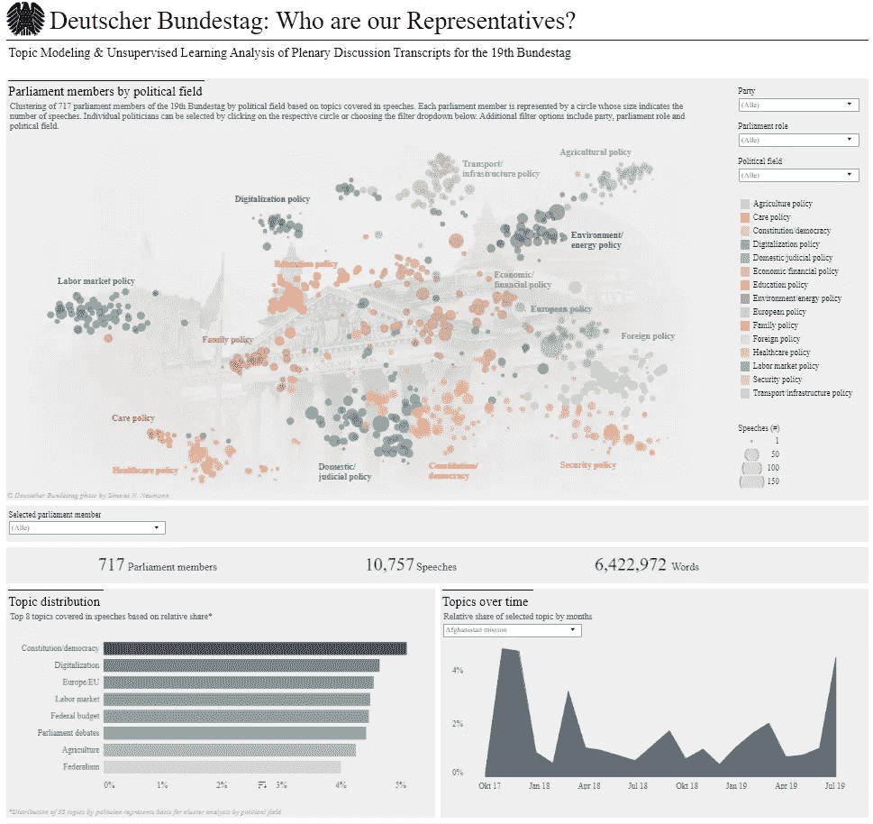
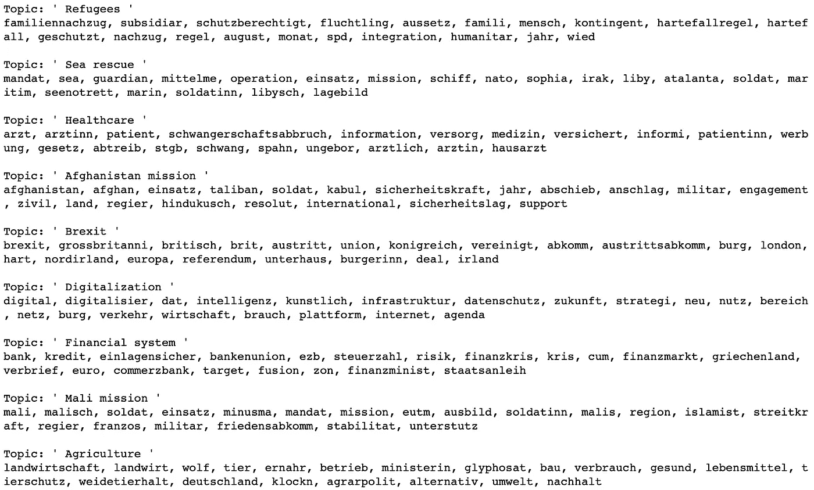
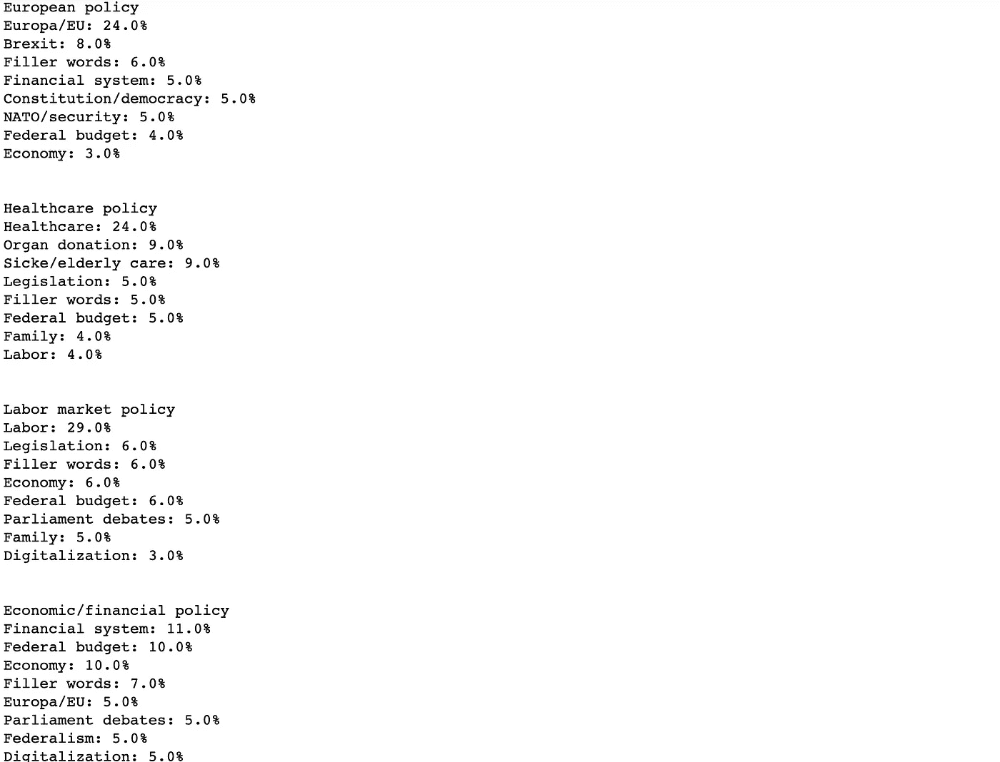
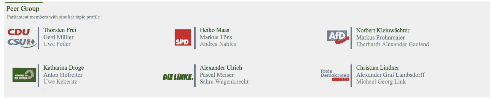
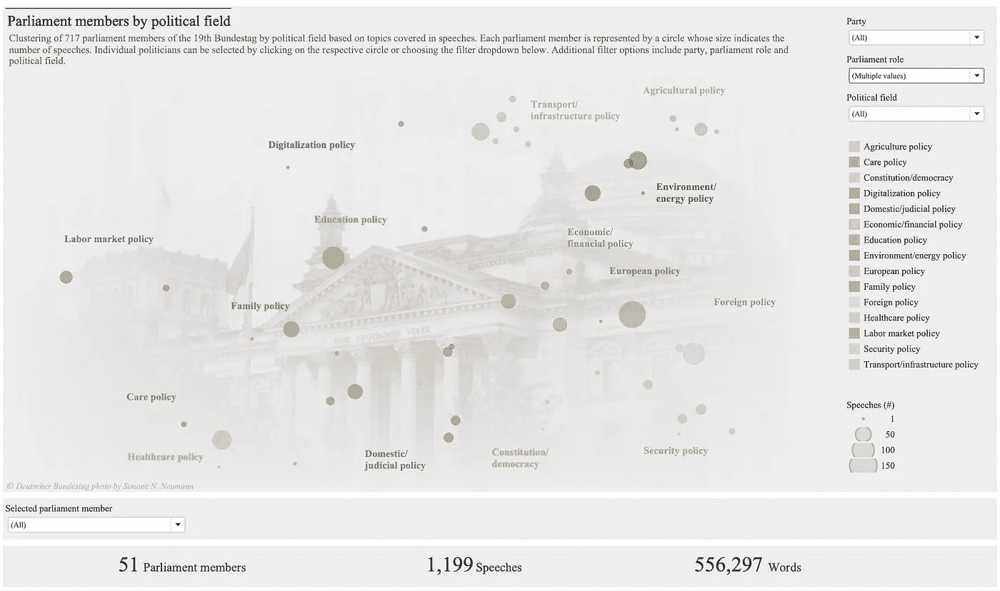

# 德国联邦议院:谁是我们的代表？

> 原文：<https://towardsdatascience.com/deutscher-bundestag-who-are-our-representatives-85a0e0c9669a?source=collection_archive---------46----------------------->

联邦议院:德国政治体系的议会和中央机构

## 利用主题建模和无监督学习分析第 19 届德国联邦议会

政治过程和政治机构的透明度是民主制度的关键要素。德国政治的核心机构是联邦议院，有来自六个不同政党的 700 多名议员。联邦议院通过法律，监督联邦预算，选举联邦总理。此外，全体会议是德国政治体系中交流政治立场和意见的核心小组。

但是组成议会并代表德国人民的 700 多人是谁呢？虽然联邦部长和一些选定的政治家经常出现在媒体和报刊上，但议会的大多数成员对普通公民来说实际上仍然是匿名的。

如果仔细观察德国的选举制度，这一观察结果会更加引人注目。对于德国议会的选举，每个选民投两票。在第一次投票中，地方代表被直接选举并送往议会，而第二次投票则是为政党名单投票。

为了确保透明度，议会讨论在电视上播出，每次辩论后都公布书面记录。然而，只有少数选民有时间和资源密切关注议会辩论，并在很大程度上依赖媒体报道。因此，几乎没有选民知道他们的地方代表在做什么，更不知道他或她在说什么，而这些地方代表实际上是被派到议会来代表他们的。

这个数据科学项目旨在通过应用机器学习和自然语言处理(NLP)的技术，进一步提高德国议会及其成员的透明度。项目的最终结果被可视化为 Tableau Public 上的一个交互式仪表盘:

[***桌面上的仪表盘公共(英文)***](https://public.tableau.com/profile/erik.hafner7972#!/vizhome/DeutscherBundestagWhoareourRepresentatives/Bundestag_final)*(针对桌面优化&链接仅在桌面浏览器中有效)*

[***【Dashboard on Tableau Public(德语)***](https://public.tableau.com/profile/erik.hafner7972#!/vizhome/DeutscherBundestagWersindunsereVolksvertreter/Bundestag_final)*(针对桌面优化&链接仅在桌面浏览器中有效)*

交互式 [Tableau 仪表盘](https://public.tableau.com/profile/erik.hafner7972#!/vizhome/DeutscherBundestagWhoareourRepresentatives/Bundestag_final)可视化结果摘录

该控制面板公开提供，并提供以下使用案例:

*   了解每位议员的政治专业领域
*   探索政党/政治家讨论的主题以及它们如何随着时间的推移而演变
*   确定涉及类似主题的跨党派议员
*   通读个别议员的全会发言

**项目方法**

在这个项目中，用 Python 分析了联邦议院的全体辩论，以得出关于个别议员的结论。为此，使用一种称为主题建模的 NLP 技术来检查全体会议演讲，以识别演讲中的潜在主题。使用主题洞察，然后通过应用无监督聚类将政治家分组到政治领域中。最后，开发了一种启发式方法来识别具有相似主题简介的对等组。

**数据汇总**

该项目的数据来源是第 19 届联邦议院从 2017 年 10 月 24 日首次会议到 2019 年 7 月 24 日夏季休会前最后一次会议的 109 份全体会议讨论记录。

德国议会已经在其网站上发布了自 1949 年德意志联邦共和国成立以来所有全会讨论的文字记录。然而，只有第 19 届联邦议院的 XML 文本包含了详细的标记，可以清楚地区分演讲和各自的演讲者。

使用 Python 库 Selenium 和 Beautiful Soup 对抄本进行抓取和解析，以提取日期、发言者姓名、政党和各自的发言等信息。然后，这些数据经过清理，并增加了额外的信息，最终得到一个由 717 位政治家的逾 1 万篇演讲(约 650 万字)组成的数据集。

> 请注意，第 19 届联邦议院正式成员为 709 人。这种差异可以通过以下偏差来解释:
> 
> 1.当前内阁中在议会中没有正式席位的联邦部长也包括在数据集中。
> 
> 2.根据某些议员的退出日期，数据中可能只反映前任、继任者或两者。
> 
> 3.对于一些议员来说，在相关时间段内没有确定的发言。

**主题建模概念**

非负矩阵分解(NMF)是线性代数中的一种算法，应用于自然语言处理中，从一组文档中提取潜在的主题。

来自 NMF 的主题模型的基线构建了*文档-术语矩阵 A。*A*中的*每行描述了术语在文档中的出现频率，即每行代表一个文档，每列代表一个术语(*文档 x 术语*)。在 NLP 中，文档是文本的术语，术语是单词的术语。

NMF 算法将*文档项矩阵 A* 分解成仅具有非负值的两个矩阵，两个矩阵的乘积以最低误差再现原始矩阵。两个结果矩阵是*文档-主题矩阵 H(文档 x 主题*)和*主题-术语矩阵 W* ( *主题 x 术语*)。

*A(文档 x 期限)≈ H(文档 x 题目)x W(题目 x 期限)*

直观地说，*文档-主题矩阵 H* 描述了文档中的主题是什么，而*主题-术语矩阵 W* 描述了特定主题中哪些词被频繁使用。

**文本预处理**

要使用 NMF 主题建模生成有意义的结果，需要几个预处理步骤，这些步骤按如下方式实现:

*   通过删除标点符号、将所有单词转换为小写字母并排除所有数字来清理演讲
*   通过应用 Python 的 NLTK 库中的德语停用词表，停用词(最常见的词)被移除。此外，用经常出现的上下文含义较低的单词手动扩展列表
*   词干分析(将单词缩减为单词库)是通过应用 NLTK 雪球斯特梅尔公司的德语模块来完成的

然后，通过应用 sklearn 的 TF-IDF 矢量器，将议会演讲转换成文档术语矩阵。与简单的单词包方法(只统计单词在文档中的出现次数)相比，TF-IDF(术语频率-逆文档频率)减少了在所有文档中频繁出现的单词的影响。结果，具有高信息增益的单词在文档中也具有相对较高的权重。

**话题识别**

事实上，NMF 主题建模是一种矩阵分解技术，并不提供关于底层文本中存在多少主题或者主题的上下文含义是什么的指导。因此，这些步骤需要手动实现。

为了确定全体会议发言中的主题，将 sklearn 的 NMF 模块应用于先前创建的文件术语矩阵。这产生了各自的文档-主题和主题-术语矩阵。然后，对于主题-术语矩阵中的每个主题，手动检查具有最高权重的单词，即对于该主题最重要的单词。基于这种分析，每个主题被识别和命名。

例如，权重最高的词是“*银行*”、“*贷款*”、“*存款保险*”、“*银行联盟*”、“*欧洲央行*”、“*纳税人*”、“*风险*”、*“金融危机”、*等。(德语中这些都是单字)定义为“*金融体系*”。

9 个主题及其前 20 个单词的摘录(德语)

由于主题模型中的主题数量需要手动设置作为算法的输入，所以对不同数量的主题重复该过程，以识别在主题内的上下文一致性方面产生最有意义的结果的数量。对于联邦议院的演讲，选择了一个包含 35 个不同主题的模型。

在识别和命名每个主题后，文档-主题矩阵指示每个演讲涉及的主题。每个演讲都是所有 35 个主题的组合，其中一些主题的权重高于其他主题。

**语音聚合**

为了不仅对演讲，而且对议员个人产生洞察力，对每个政治家的主题信息(演讲中每个主题的权重)进行总结。议员的发言通过将发言中的主题权重之和缩放至 100%并取所有发言中主题的平均值来汇总。

**聚类分析**

这种汇总显示了每个议员在 35 个确定的主题中所占的份额。虽然这些信息本身就已经很有见地，但仍然相对难以解读，因为 35 个不同的主题很难同时掌握。此外，只有将几个话题结合起来，才能对政治家关注的政治领域得出有意义的结论。

因此，每位议员都根据其演讲的主题被分配到一个特定的政治领域。为此，使用 sklearn 的 KMeans 模块应用 k-means 聚类(无监督学习)。

直观上，k-means 分割一个数据集，将具有相似特征的数据点分配到一个组(聚类)中。基于距离度量(在这种情况下是欧几里德距离)来评估特征的相似性。该算法以这样的方式定义聚类，使得数据点到相应聚类质心的距离(一个聚类中所有数据点的特征的平均值)最小化。

通过将每个议员的话题权重作为特征，每个代表被反映为 35 维空间中的一个数据点。这些特征随后被用于对政客进行聚类。最后，手动检查每个聚类质心的主题份额，以分配政治领域。

例如，在“f *金融系统*(11%)、“*联邦预算*(10%)、“*经济*(10%)中具有最高份额的集群被定义为“*经济/金融政策*”。

4 个集群的摘录和各自的前 8 个主题(按权重)

与主题模型类似，k-means 中的聚类数需要手动选择，并且通过手动检查不同数量的聚类的结果来选择。这导致 15 个不同的政治领域集群。

为了可视化聚类分析的结果，在最后一步中，通过使用来自 sklearn 的 TSNE 模块应用 t-SNE 维数缩减，将 35 维空间缩减为二维空间。

**同等群体分析**

[同行群体分析的示例性结果](https://public.tableau.com/profile/erik.hafner7972#!/vizhome/DeutscherBundestagWhoareourRepresentatives/Bundestag_final)(针对联邦总理安格拉·默克尔)

仪表板的一个用例是显示具有相似主题简介的不同政党的议会成员，即涵盖相似主题范围的政治家。为此，为每个政治家构建一个对等组，该对等组由来自每个政党的三名议会成员组成，基于 35 维主题向量具有最近的欧几里德距离。

**可视化&验证**

最后，分析的结果被可视化在一个 Tableau 仪表板中，可以交互地用于更好地理解联邦议院及其政治家。

联邦部长和国务秘书的集群分配

同时，仪表板提供了验证分析结果的机会:

*   按党派划分份额最高的主题似乎是合理的，例如*环境/能源*对于*邦迪尼斯 90/迪格鲁 NEN* ，*劳工*对于*迪克林*以及*数字化*对于 *FDP*
*   联邦部长和国务秘书的集群分配基本上与各自的度假胜地一致
*   同辈群体似乎是合理的，例如，对于联邦总理*安格拉·默克尔*来说，同辈群体包括*海科·马斯*、*安东·霍夫赖特*、*克里斯蒂安·林德纳*、*莎拉·瓦根克内希特*和*亚历山大·高兰*

最终，我们希望该项目能够为提高德国政治环境的透明度做出自己的贡献，使选民能够做出更明智的决定，并增强对民主制度的信任。

*一个 GitHub 项目的资源库可以在* [*这里找到*](https://github.com/ErikHafner/NLP_and_clustering_on_Bundestag) *。*

> 免责声明:本文仅代表作者个人观点，不代表作者雇主的工作或观点。