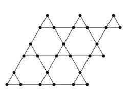
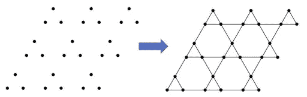
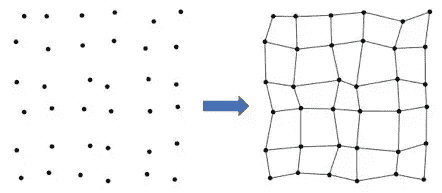
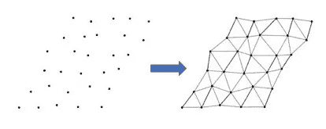
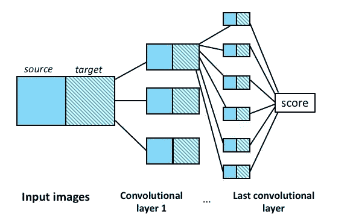
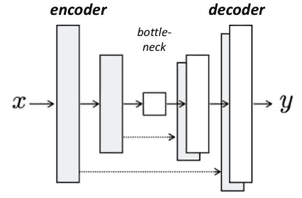
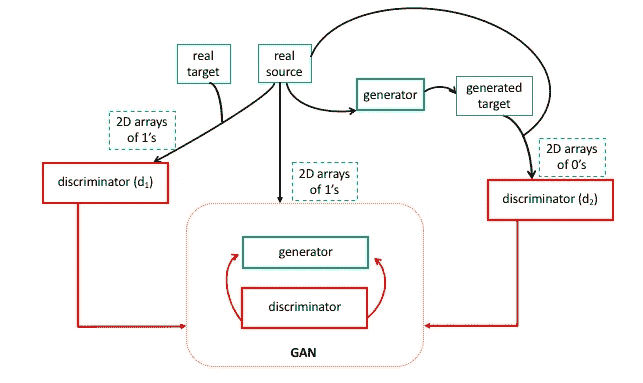
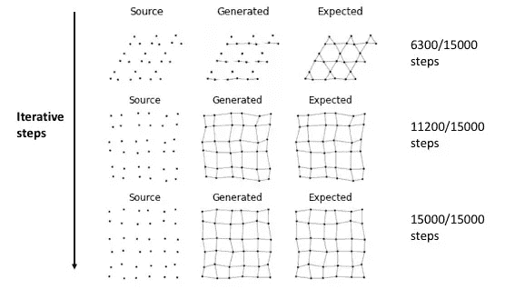
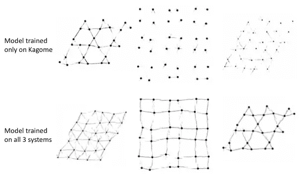

# 开发一个图像到图像的转换模型，以捕捉机械网络(GAN)中的局部相互作用

> 原文：<https://towardsdatascience.com/develop-a-image-to-image-translation-model-to-capture-local-interactions-in-mechanical-networks-9c2f45230849?source=collection_archive---------45----------------------->

## [入门](https://towardsdatascience.com/tagged/getting-started)

## 生成式对抗网络，用于在各种机械网络的图像上自动绘制链接。

# 概观

超材料是一种机械性能依赖于其结构的材料，这种结构赋予了它们传统系统中没有的变形模式。超材料的一个流行模型由通过机械链接相互连接的构建模块组成，这定义了材料的结构。这些被称为**机械网络**。两个机械网络的不同之处在于:

*   积木是如何连接的。这将定义我们处理的系统类别(例如 Kagome 系统、正方形、三角形等..).
*   区块在空间中的分布情况，即区块之间的距离。

换句话说，为了对系统进行分类并掌握其机械特性，了解块体的位置和连接性是至关重要的。通常情况下，机械网络可以用一个*晶格表示* : **点**(也称为位置)来直观地描述，代表建筑块，并通过**键**(也称为边)连接。在研究界经常被考虑的一个典型的机械网络是 Kagome 系统，如下图所示。

Kagome 点阵:点(黑点)由边(直线)连接。图片作者。

# 问题陈述和方法

在某些情况下，特别是在处理微观超材料时，用户/研究人员将只处理构件(点)的图像，连接键太小而无法检测，但仍然存在并对系统的机械性能有贡献。该项目旨在使用深度学习和神经网络在仅包含点的图像上自动绘制出键连接。

用户仅提供块的图像；模型绘制连接键。图片作者。

为此，我们将使用 Jason Brownless 博士的[文章](https://machinelearningmastery.com/how-to-develop-a-pix2pix-gan-for-image-to-image-translation/)介绍如何开发一个**生成式对抗网络(GAN)** 作为**图像到图像**算法。该模型仅通过对三种不同机械网络(Kagome、三角形和正方形网格)的 90 张图像进行训练，就成功地在看不见的系统图像上绘制了连接键。虽然结果相当惊人，但了解该模型的架构也同样令人着迷。

用于训练/测试/验证模型的数据包括由 *Mathematica* 生成的图像，Mathematica 是一个经常用于研究和学术社区的程序。提供的每个图像实际上由一对图像组成，分别是具有和不具有结合的相同系统(即，点在空间上相同分布)。然后，我们选择 30 个随机生成的 Kagome 点阵，以及另外 30 个正方形点阵和 30 个三角形点阵:

无键和有键的变形正方晶格。图片作者。

变形的三角形晶格，有键和无键。图片作者。

这里使用的代码显然是由 **Python** 编写的，并且主要依赖于包 **Keras** (以及常见的嫌疑人 *numpy* 和 *matplotlib* )来构建和训练多个神经网络。笔记本(可以在这里找到)是通过 Google Colab 编写的，它允许我们利用 Google 的 GPU 服务。

# 生成对抗网络

GAN 的架构由两个以对抗方式训练在一起的主要模型组成——鉴别器和生成器——以及将它们绑定和训练在一起的其他功能

## 鉴别器

鉴别器是一个深度**卷积神经网络(CNN)** ，它获取图像形状并执行条件图像分类。总之，它获取源图像(无焊接)和目标图像(有焊接),并分类目标是否是源的*真实*转换。在被传送到网络之前，这两幅图像被连接成一幅图像。

鉴别器模型。图片作者。

深度 CNN 由 6 层组成，每一层都缩小前一层的输出图像，以输出一个分数，该分数用作*分类度量*。

## 发电机

生成器遵循 U-net 架构，由三部分组成:编码器(收缩)、瓶颈和解码器(扩展)。

发电机型号。Jason Brownless 关于机器学习掌握的图片。

1.  编码器部分由多个对输入图像进行下采样的模块组成。每个块都是一个卷积层，具有数量不断增加的过滤器。
2.  相反，解码器由几个扩展模块组成，滤波器数量不断减少。重要的是，每个扩展层的输入既有前一个扩展块的输出，也有相应收缩块的输出。这确保了在编码阶段学习的特征被重新用于在解码阶段重建图像。
3.  瓶颈部分连接编码和解码部分。

## 复合模型和训练模型

生成对抗网络是一个同时包含鉴别器和生成器的复合模型。当生成器通过鉴别器更新其权重时，鉴别器不被训练并“自己”更新其权重。关键特征是，与生成器相比，鉴别器的权重更新需要较慢，因此生成器可以快速学习绘制焊接。

每个训练步骤包括使用复合模型以及来自训练数据的“真实”图像和来自生成器的“虚假”生成图像。这个想法是，真实目标和假生成图像的组合，分别被分类为 1 和 0，将帮助生成器建立一个模型，更快地收敛到一个解决方案。

GAN 的整体架构及其训练方式。图片作者。

这个模型中有许多可调参数和复杂的设计。为了保持这篇文章的简单和可读性，我故意忽略了代码的复杂性，但是请读者查看我的 Github 库以获得更多细节。

# 结果

我们在 90 幅图像上训练该模型，分成 3 批，这意味着在每个时期的每批中随机抽取 30 幅图像。我们选择在 500 个历元上训练模型，这意味着总共有 500 x 30 = 15，000 个迭代步骤。虽然在本地机器上训练模型可能需要长达一天的时间，但谷歌 GPU 将这一过程加快到不到 2 小时！通过迭代过程，我们显示了从训练数据集中随机抽取的样本的生成图像:

通过模型训练生成的图像(随机选择)的演变。图片作者。

对照模型自己的训练集测试模型不是检查其性能的好选择，但它让我们了解生成功能执行得有多好。因此，我们还需要展示模型如何处理看不见的数据:

验证集:戈薇，正方形和三角形格子。图片作者。

最初，我的目标是只针对 Kagome 类构建模型。然后，我决定扩大模型的应用范围，将正方形和三角形格子包括在内:

*   顶行:第一个模型仅在 Kagome 系统的图像上进行训练，显然在绘制正方形和三角形的连接方面存在困难
*   底部一行:第二个模型包含了所有三个格子，产生了更好更重要的结果

非常重要的是，除了绘制键之外，第二个模型还保持所生成图形上的点的位置，这是一个必须保持不变的关键属性，因为这些点的位置决定了系统的机械属性(如上所述)。

# 结论和进一步改进

通过只对 90 对图像进行训练，该模型可以获取部分完整的机械网络的看不见的图像，并绘制正确的键连接，这是理解系统力学的关键特征。这样做，模型不会改变材料的基本属性(点/块的位置),并为研究者提供额外的信息。令人兴奋的是，该模型能够在不止一个，而是三个机械系统上区分和执行其图像到图像的翻译功能:Kagome，正方形和三角形晶格。

虽然这是一个令人满意的结果，但是可以做许多事情来提高模型的性能。特别是，我们可以:

*   在更大的一组图像上训练模型并持续更长的时间(更多的时期)
*   扩大训练批次，以包括额外的超材料类别，特别是更复杂的结构，如每个站点的平均连接数比我们迄今为止看到的更多

# 参考文献和致谢

同样，代码、幻灯片和报告可以在[这里](https://github.com/adriensaremi/Springboard/tree/master/Capstone_2%20-%20GAN%20and%20Mechanical%20Networks%20)找到。所有图片(除非另有说明)均由作者制作。我要特别感谢我在 Springboard 的导师卢卡斯·艾伦(Lucas Allen)，感谢他在这个项目中的指导。我还要感谢 Brownlee 博士在帮助开发人员构建机器学习模型方面的多个在线教程。

[1] J. Brownlee，[如何开发一个 Pix2Pix GAN 用于图像到图像的翻译](https://machinelearningmastery.com/how-to-develop-a-pix2pix-gan-for-image-to-image-translation/) (2020)，机器学习之谜