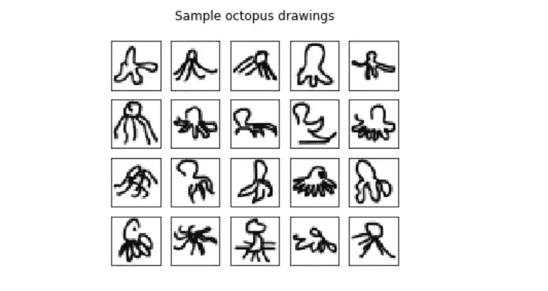

# 开发基于 CNN 的交互式绘图识别应用程序——使用 Flask 部署

> 原文：<https://towardsdatascience.com/develop-an-interactive-drawing-recognition-app-based-on-cnn-deploy-it-with-flask-95a805de10c0?source=collection_archive---------20----------------------->

## 数据科学项目

## 关于数据科学项目的基本技术的快速简单的教程。


照片由 [Dries Augustyns](https://unsplash.com/@drieaugu?utm_source=medium&utm_medium=referral) 在 [Unsplash](https://unsplash.com?utm_source=medium&utm_medium=referral) 拍摄

建立机器学习模型是一项常见的任务，你可能会觉得很舒服。然而，一旦你离线训练和测试的模型让你满意了，你该怎么做呢？你会如何向你的非技术型老板或客户展示它？你将如何在线部署它，以便其他人可以使用它？

在本文中，我将尝试解决那些在学校里通常不会详细讨论的问题，尽管这些问题是数据科学项目中非常重要的一部分。

为此，我决定以一个**绘图应用程序**为例，它使用一个**卷积神经网络**模型对用户绘制的绘图进行分类。

工作流程如下:


我将首先介绍模型，然后描述应用程序的开发。通读之后，我希望本文对您未来的数据科学项目部署有所帮助！

以下所有代码都可以在我的 [github](https://github.com/hugom1997/Flask-Cnn-Recognition-App) 上找到。

# CNN 模型

这个项目的第一部分是准备数据和建立我们的模型！

我已经决定使用来自*的数据，‘快，画！’*游戏中用户需要尽可能快地绘制任意对象。数据集在[这里](https://console.cloud.google.com/storage/browser/quickdraw_dataset/full/numpy_bitmap/?pli=1)可用。

我将我的用例集中在 *6* 动物上:猫、长颈鹿、羊、蝙蝠、章鱼和骆驼，使任务成为**多类分类**。下面是一个数据示例:



## **预处理**

幸运的是，来自这个数据集的图像已经被预处理成统一的 *28*28* 像素图像大小。以下是接下来的步骤:

*   我们需要结合我们的数据，以便我们可以使用它进行培训和测试。我只为这个模型使用了 10 000 个样本。
*   然后，我们可以分割要素和标注(X 和 y)。
*   最后，我们按照通常的(*80–20*)比率在训练和测试之间分割数据。当灰度图像的像素位于 0 和 255 之间时，我们还归一化了 *0* 和 *1* (X/255)之间的值。

预处理. py

## **架构**

一旦一切准备就绪，让我们使用 Keras 建立我们的模型！该模型将具有以下结构:

*   **卷积层** : 30 个滤波器，(3 * 3)内核大小
*   **最大池层数** : (2 * 2)池大小
*   **卷积层** : 15 个滤波器，(3 * 3)内核大小
*   **最大池层** : (2 * 2)池大小
*   **脱落层**:脱落 20%的神经元。
*   **展平图层**
*   **密集/全连接层** : 128 个神经元，Relu 激活功能
*   **密集/全连接层** : 50 个神经元，Softmax 激活功能

下面是相应的代码:

Cnn 模型

现在我们的模型已经准备好了，我们只需要训练它并评估它的性能。


经过 **15** 个时期后，我们的分类器达到了 **92.7%** 的准确率，这对于我们的识别 app 来说已经足够了！让我们检查一下混淆矩阵。


正如我们所看到的，大部分的画都被很好的分类了。然而，有些类别似乎比其他类别更难区分:例如，猫与蝙蝠或骆驼与羊。这可以用它们形状的相似性来解释！


这是一些被我们的模型错误分类的图片。这些图像中的大部分很容易被误认为是错误的，甚至是被人眼误认为是错误的！别忘了我们的数据集收集了玩**‘快，画吧！’的手工人类图画**游戏。因此，许多图像可能与一个类无关。

## **保存模型**

现在我们的模型已经准备好了，我们想把它嵌入到一个**Flask Web App**中。为此，使用 **pickle** 保存(序列化)我们的模型会更方便。

注意:你可以直接将你的模型训练到 flask 中，但是这将会非常耗时，而且对用户不友好。

```
**import** **pickle**
**with** open('model_cnn.pkl', 'wb') **as** file:
      pickle.dump(model_cnn, file)
```

# 用 Flask 开发我们的绘图应用程序

## **烧瓶**

Flask 是一个用 Python 编写的 web 微框架。它允许你设计一个可靠和专业的 web 应用程序。

## 它是如何工作的？

虽然它不需要特定体系结构，但是有一些好的实践可以遵循:

*   app.py :是运行 Flask 应用程序的主要代码。它将包含我们的应用程序的不同路由，响应 HTTP 请求并决定在模板中显示什么。在我们的例子中，它还会调用我们的 **CNN 分类器**、**、**对我们的输入数据进行**预处理**步骤，并进行**预测**。
*   **模板文件夹**:模板是一个 HTML 文件，可以接收 Python 对象，链接到 Flask 应用。因此，我们的 html 页面将存储在这个文件夹中。
*   **静态文件夹**:样式表、脚本、图片等永远不会动态生成的元素必须存放在这个文件夹中。我们将把 Javascript 和 CSS 文件放在里面。


该项目将需要:

*   两个静态文件: *draw.js* 和 *styles_draw.css*
*   两个模板文件:*draw.html*和*results.html*。
*   我们的主文件: *app.py*
*   我们的 *model_cnn.plk* 早存了。

> 现在，让我们来构建我们的应用程序吧！

# 获取用户输入

这个项目的第二部分是获得用户输入**:一个将被我们训练好的模型分类的绘图。为此，我们将首先使用 **javascript** 和 **HTML5** 设计绘图区域。我不会在本文中介绍 *styles_draw.css* 但是你可以在我的 [github](https://github.com/hugom1997/Flask-Cnn-Recognition-App) 上找到它。**

## ****draw.html****

**draw.html**

*   **我们使用`{{url_for('static',filename='styles_draws.css’)}}`和`{{url_for('static',filename='draw.js’)}}`导入位于静态文件夹中的 css 和 js 文件。这是 [Jinja](https://jinja.palletsprojects.com/en/2.11.x/templates/) 导入文件的语法。**
*   **我们用`<canvas>`标签设置我们的绘图区域。**
*   **我们调用 *draw.js* 中包含的 drawCanvas() javascript 函数。**
*   **我们初始化表单，这样就可以使用`POST`方法将数据发送到 flask 实例/ *app.py* 。**
*   **`action = “{{url_for('predict')}”`又是金贾句法。它指定了提交表单时将在 *app.py* 中使用的路径。**
*   **我们在表单中添加了一个额外的隐藏字段，用于传输图像。`<input type = “hidden“ id =’url' name = ‘url' value = “”>`**
*   **仅此而已！简单对吗？**

**我们现在必须使用 javascript 来使它更加动态！否则，你的画布什么也做不了…**

## ****draw.js****

**draw.js**

**这段 Javascript 代码允许我们设计绘图区域并与之交互。**

*   ***drawCanvas()* 旨在初始化画布的主要功能(mouseUp、mouseDown、…)，这些功能将允许与用户的鼠标进行交互。**
*   ***addClick()* 保存用户点击画布时光标的位置。**
*   ***redraw()* 每次调用该函数时，清除画布并重新绘制所有内容。**

**在我画完之后，画布看起来是这样的(顺便说一下，这是一只长颈鹿) :**

****

**Draw.html**

**现在我们的画布已经准备好获取用户的绘图，我们需要确保图像能够到达我们在 *app.py* 中的应用程序。**

**通常我们可以直接使用`POST`函数，通过一个表单提交数据。然而，目前不能用这种方法提交原始图像。此外，我不希望用户保存然后上传他的画，因为这会影响他的体验的流畅性。**

**我用来克服这个问题的一个小技巧是，在通过表单发送之前，使用之前在*results.html*中设置的隐藏输入字段，在 *base64* 中对图像进行编码。该编码过程将在 *app.py.* 中反向进行**

*   **当用户点击*‘预测’*按钮时，调用 *save()* 。它将通过表单发送 *base64* 编码的图像。**

# **做预测**

**既然我们能够获得用户输入，那么是时候使用它来进行预测了！为此，我们只需要一个文件:**

## ****app.py****

**如前所述， **app.py** 是我们项目的主文件，Flask 应用程序在其中被实例化。**

**app.py**

**本规范的要点:**

****1)** 初始化 app，指定模板文件夹。我们可以使用这行代码来实现:**

**`app = flask.Flask(__name__, template_folder =’templates’)`**

****2)** 定义路线(我们的应用程序只有两条) :**

*   ***@app.route('/')* :是我们默认的路径——它会返回默认的*draw.html*模板。**
*   ***@app.route('/predict')* :点击*‘预测’*按钮时调用。处理用户输入后返回*results.html*模板。**

****3)***预测*功能将由表单中的`POST`动作触发(还记得我们在*result.html*中设置此路径时感谢 Jinja 语法！).然后，它将按如下方式进行:**

*   **用`request.form['url']`访问 *base64* 编码图形输入，其中“url”是包含编码图像的表单中隐藏输入字段的**名称**。**
*   **解码图像并将其设置为一个数组。**
*   **调整图像的大小和形状，为我们的模型获得一个 28 * 28 的输入。我们关心的是保持它的比例。**
*   **使用我们的 CNN 分类器进行预测。**
*   **由于`model.predict()`返回单个数组中每个类的概率，我们必须找到数组的最高概率，并使用预定义的字典获得相应的类。**
*   **最后返回*results.html*模板，并将之前做的预测作为参数传递:**

**`return render_template('results.html', prediction= final_pred)`**

***注*:**

**—我们的 *base64* 编码图像看起来会像这样:`data:image/png;base64,iVBOR…`。因此，我们只需要删除第一个 **21** 字符就可以得到干净的 url。为此，我们使用了`draw[init_base64:]`行代码。—**

# **显示结果**

**仅此而已！几乎一切都搞定了。下一步是展示我们的结果。**

## **results.html**

**最后，我们使用*results.html*来显示在 *app.py 中计算的预测。*我们将再次需要使用 *Jinja* 语法来显示预测*。***

**results.html**

**下面是我们预测是“长颈鹿”时的渲染图:**

****

**显示结果**

# **运行应用程序**

**最后一步是启动我们的应用程序！你可以进入你的绘图应用文件夹(你可以在根目录下找到 **app.py** 并使用`flask run.`**

****

**烧瓶运行**

**您的应用将在本地服务器上运行。默认为 [127.0.0.1:5000](http://localhost:5000/) 。**

****

**绘图应用程序**

# **结论**

**就是这样！在本文中，我们看到了如何开发一个烧瓶绘图应用程序，它使用以前构建的 CNN 模型对用户绘制的绘图进行分类。**

**这是 Flask 部署机器学习模型的众多可能用途之一。事实上，可以找到无限的用例，我希望这个具体的项目将帮助您构建其他 ML web 应用程序，使您的代码更容易被他人访问！**

****所有代码在我的**[**github**](https://github.com/hugom1997/Flask-Cnn-Recognition-App)**上都有！****

**祝您愉快！**

# **参考**

**当然，这不是我一个人做的。我在这里找到了一些灵感:**

**[](https://www.datacareer.de/blog/quick-draw-classifying-drawings-with-python/) [## “快，画！”-使用 Python 对图形进行分类

### 图像识别一直是机器学习中的一个主要挑战，与大规模标记数据集一起工作来训练…

www.datacareer.de](https://www.datacareer.de/blog/quick-draw-classifying-drawings-with-python/) [](https://flask.palletsprojects.com/en/1.1.x/) [## 欢迎使用 Flask - Flask 文档(1.1.x)

### 欢迎阅读 Flask 的文档。开始安装，然后了解快速入门概述。有…

flask.palletsprojects.com](https://flask.palletsprojects.com/en/1.1.x/) [](http://www.williammalone.com/articles/create-html5-canvas-javascript-drawing-app/) [## 使用 HTML5 Canvas 和 JavaScript 创建一个绘图应用程序

### 威廉·马隆:本教程将带你一步一步地开发一个简单的网络绘图应用程序…

www.williammalone.com](http://www.williammalone.com/articles/create-html5-canvas-javascript-drawing-app/) [](https://machinelearningmastery.com/handwritten-digit-recognition-using-convolutional-neural-networks-python-keras/) [## 用 Python 中的卷积神经网络进行手写数字识别

### 深度学习技术能力的最新流行演示是图像中的对象识别…

machinelearningmastery.com](https://machinelearningmastery.com/handwritten-digit-recognition-using-convolutional-neural-networks-python-keras/)**