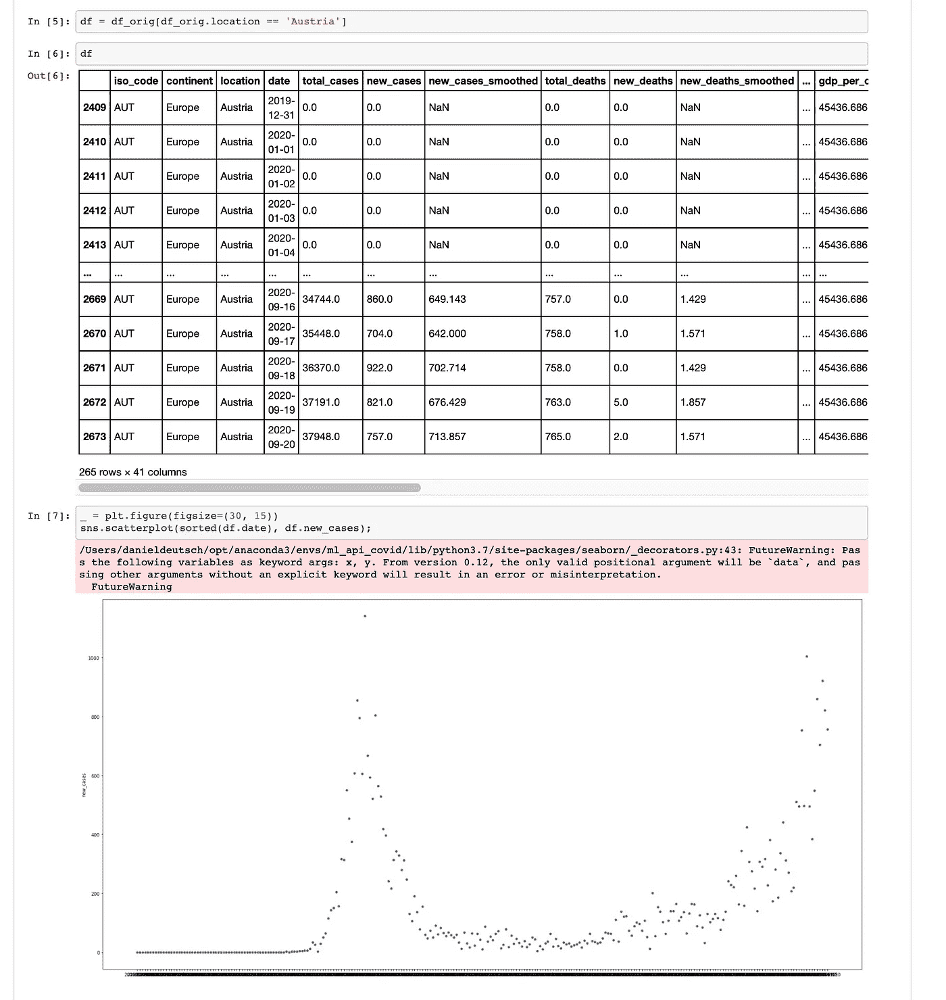
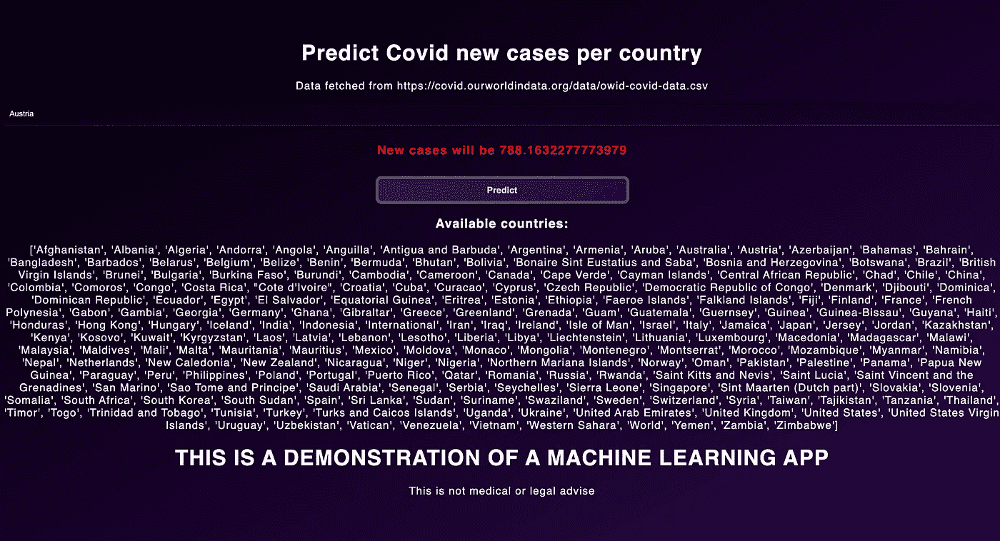
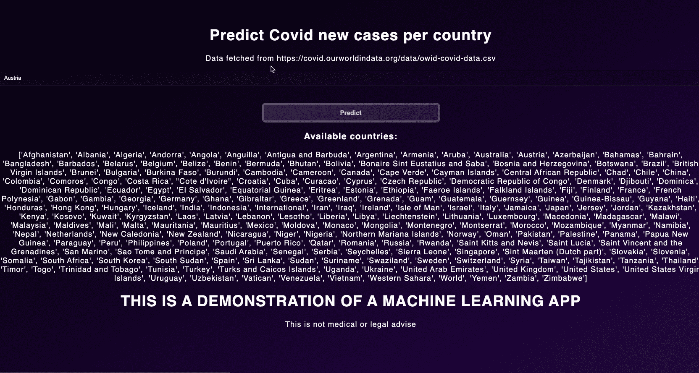
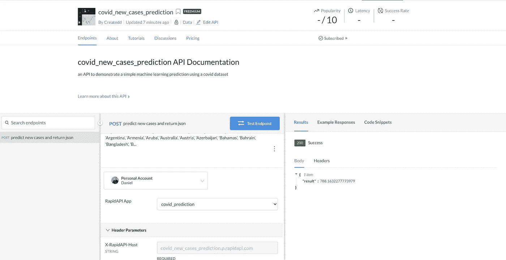

# 开发和销售机器学习应用程序—从头到尾教程

> 原文：<https://towardsdatascience.com/develop-and-sell-a-machine-learning-app-from-start-to-end-tutorial-ed5b5a2b6b2b?source=collection_archive---------2----------------------->

## [入门](https://towardsdatascience.com/tagged/getting-started)


*摄影丹尼尔·科尔派*[https://unsplash.com/photos/HyTwtsk8XqA](https://unsplash.com/photos/HyTwtsk8XqA)

# 新冠肺炎预测端到端 app

在开发和销售 Python API 之后，我现在想用机器学习解决方案来扩展这个想法。所以我决定快速编写一个新冠肺炎预测算法，部署它，并使它可以销售。如果你想知道我是如何做到的，可以查看帖子里的一步一步的教程。

# 目录

*   [*关于本文*](https://github.com/Createdd/Writing/blob/master/2020/articles/mlApiCovid.md#about-this-article)
*   [*免责声明*](https://github.com/Createdd/Writing/blob/master/2020/articles/mlApiCovid.md#disclaimer)
*   [*堆栈使用*](https://github.com/Createdd/Writing/blob/master/2020/articles/mlApiCovid.md#stack-used)
*   [*1。创建项目手续*](https://github.com/Createdd/Writing/blob/master/2020/articles/mlApiCovid.md#1-create-project-formalities)
*   [2*2。为一个问题制定一个解决方案*](https://github.com/Createdd/Writing/blob/master/2020/articles/mlApiCovid.md#2-develop-a-solution-for-a-problem)
*   [*安装包并正确跟踪 jupyter 文件*](https://github.com/Createdd/Writing/blob/master/2020/articles/mlApiCovid.md#install-packages-and-track-jupyter-files-properly)
*   [*制定解决问题的方案*](https://github.com/Createdd/Writing/blob/master/2020/articles/mlApiCovid.md#develop-solution-to-problem)
*   [*构建服务器执行 REST 功能*](https://github.com/Createdd/Writing/blob/master/2020/articles/mlApiCovid.md#build-server-to-execute-function-with-rest)
*   [*加成:用*](https://github.com/Createdd/Writing/blob/master/2020/articles/mlApiCovid.md#bonus-make-reproducible-with-docker) 使可复制
*   [3*。部署到 AWS*](https://github.com/Createdd/Writing/blob/master/2020/articles/mlApiCovid.md#3-deploy-to-aws)
*   [*设置扎帕*](https://github.com/Createdd/Writing/blob/master/2020/articles/mlApiCovid.md#set-up-zappa)
*   [*设置 AWS*](https://github.com/Createdd/Writing/blob/master/2020/articles/mlApiCovid.md#set-up-aws)
*   [*4。设置 Rapidapi* 和](https://github.com/Createdd/Writing/blob/master/2020/articles/mlApiCovid.md#4-set-up-rapidapi)
*   [*最终结果*](https://github.com/Createdd/Writing/blob/master/2020/articles/mlApiCovid.md#end-result)
*   [*灵感*](https://github.com/Createdd/Writing/blob/master/2020/articles/mlApiCovid.md#inspiration)
*   [*最终链接*](https://github.com/Createdd/Writing/blob/master/2020/articles/mlApiCovid.md#final-links)
*   [*关于*](https://github.com/Createdd/Writing/blob/master/2020/articles/mlApiCovid.md#about)

# 关于这篇文章

在本文中，我从我的上一篇文章[“如何从头到尾销售一个 Python API”](/develop-and-sell-a-python-api-from-start-to-end-tutorial-9a038e433966)中汲取了一些思想，并构建了一个机器学习应用程序。如果这里描述的步骤太粗糙，可以考虑先看看我以前的文章。

本项目涉及许多新的、更复杂的问题:

1.  机器学习内容。该应用程序采取构建机器学习模型的基本步骤。这包括准备，也包括预测。
2.  在预测的时间评估(不是时间训练)中。这意味着数据集是新获取的，并且对最新数据执行预测。
3.  部署。部署机器学习应用程序面临各种挑战。在本文中，我们遇到并解决了在 AWS 上外包训练模型的问题。
4.  它不仅是一个 API，而且还有一个小前端。

它从头到尾描绘了一幅开发 Python API 的图画，并在更困难的领域提供了帮助，比如 AWS Lambda 的设置。

有各种各样的困难，这让我对部署和构建过程有了更多的了解。这也是一个很好的方式来建立副业项目，甚至可能赚一些钱。

如目录所示，它由 4 个主要部分组成，即:

1.  设置环境
2.  使用 Python 创建问题解决方案
3.  设置 AWS
4.  设置 Rapidapi

你会发现我所有的代码都在 Github 上打开:

*   [https://github.com/Createdd/ml_api_covid](https://github.com/Createdd/ml_api_covid)

您将在 Rapidapi 上找到最终结果:

*   [https://rapidapi . com/Createdd/API/covid _ new _ cases _ prediction](https://rapidapi.com/Createdd/api/covid_new_cases_prediction)

# 放弃

我与本文中使用的任何服务都没有关联。

我不认为自己是专家。如果你觉得我错过了重要的步骤或者忽略了什么，可以考虑在评论区指出来或者联系我。此外，始终确保监控您的 AWS 成本，不要为您不知道的事情付费。

我总是乐于听取建设性的意见以及如何改进。

有许多事情需要改进和发展。比如机器学习部分，付出的努力非常低。准备工作非常粗糙，缺少许多步骤。从我的专业工作来看，我知道这个事实。然而，我无法在一篇文章中涵盖所有细节。尽管如此，我还是很想在评论中听到你们的改进建议。:)

如果你需要更多关于某些部分的信息，请在评论中指出来。

# 关于术语“教程”

我认为这是一个循序渐进的教程。然而，由于我作为一名开发人员已经工作了很长时间，我假设对某些工具有所了解。这使得教程很可能是一个中级/高级应用程序。

我假定了解:

*   计算机编程语言
*   饭桶
*   Jupyter 笔记本
*   终端/Shell/Unix 命令

# 使用的堆栈

我们将使用

*   Github(代码托管)，
*   依赖和环境管理，
*   Docker(可能在微服务中进一步使用)
*   Jupyter 笔记本(代码开发和文档)，
*   Python(编程语言)，
*   AWS，尤其是 AWS Lambda 和 S3(用于部署)、
*   Rapidapi(销售市场)

# 1.创建项目手续

它总是一样的，但却是必要的。我按照以下步骤来做:

1.  创建本地文件夹`mkdir NAME`
2.  用`NAME`在 Github 上创建一个新的存储库
3.  创造康达环境`conda create --name NAME python=3.7`
4.  激活康达环境`conda activate PATH_TO_ENVIRONMENT`
5.  创建 git 回购`git init`
6.  连接到 Github repo。添加自述文件，提交并

```
git remote add origin URL_TO_GIT_REPO
git push -u origin master
```

# 2.开发解决问题的方法

*   [*安装包并正确跟踪 jupyter 文件*](https://github.com/Createdd/Writing/blob/master/2020/articles/mlApiCovid.md#install-packages-and-track-jupyter-files-properly)
*   [*制定解决问题的方案*](https://github.com/Createdd/Writing/blob/master/2020/articles/mlApiCovid.md#develop-solution-to-problem)
*   [*构建服务器执行 REST 功能*](https://github.com/Createdd/Writing/blob/master/2020/articles/mlApiCovid.md#build-server-to-execute-function-with-rest)
*   [*加成:用 Docker*](https://github.com/Createdd/Writing/blob/master/2020/articles/mlApiCovid.md#bonus-make-reproducible-with-docker) 制作可复制

由于我们将开发一个机器学习解决方案，Jupyter 笔记本将非常有用。

# 正确安装软件包和跟踪 Jupyter 文件

安装 jupyter 笔记本和 jupytext:

```
pip install notebook jupytext
```

在 jupyter 中注册新环境`ipython kernel install --name NAME--user`

在`.git/hooks/pre-commit`中设置一个钩子，用于正确跟踪 git 中的笔记本变化:

```
touch .git/hooks/pre-commit
code  .git/hooks/pre-commit
```

把这个复制到文件里

```
#!/bin/sh
# For every ipynb file in the git index, add a Python representation
jupytext --from ipynb --to py:light --pre-commit
```

之后让钩子可执行(在 mac 上)

```
chmod +x .git/hooks/pre-commit
```

# 找到解决问题的方法

# 目标

目前，世界处于疫情，我想我使用了新冠肺炎案例的多个数据集之一。鉴于数据集的结构，我们希望预测一个国家每天的新增感染病例。

```
pip install -r requirements.txt
```

这将安装我们需要的所有软件包。看看`/development/predict_covid.ipynb`笔记本，看看都用什么库。

最重要的是图书馆

*   熊猫用于转换数据集和
*   用于机器学习的 sklearn

对于以下小标题，请查看 Jupyter 笔记本了解更多详情:

*   [https://github . com/Createdd/ml _ API _ covid/blob/master/development/predict _ covid . ipynb](https://github.com/Createdd/ml_api_covid/blob/master/development/predict_covid.ipynb)



[https://github . com/Createdd/ml _ API _ covid/blob/master/development/predict _ covid . ipynb](https://github.com/Createdd/ml_api_covid/blob/master/development/predict_covid.ipynb)

# 下载数据

我们将使用来自[https://ourworldindata.org/coronavirus-source-data](https://ourworldindata.org/coronavirus-source-data)的 csv 格式的数据集。

*   数据的许可是[归属 4.0 国际(CC BY 4.0)](https://creativecommons.org/licenses/by/4.0/)
*   源代码可在 [Github](https://github.com/owid/covid-19-data/tree/master/public/data) 上获得

# 准备

简而言之，我做到了:

1.  检查丢失的数据
2.  删除丢失数据超过 50%的列
3.  删除剩余缺失内容的行，如洲或等编码。(对需要国家/地区的应用程序解决方案没有帮助)
4.  用标签对分类数据进行编码
5.  用该列的平均值填写剩余的数字缺失数据
6.  分为训练集和测试集

# 创建分类器并预测

1.  创建随机森林回归变量
2.  用数据训练它并评估
3.  使用 RandomizedSearchCV 执行超参数调整
4.  保存训练好的模型
5.  通过提供国家名称来预测新病例

# 构建一个服务器来执行 REST 的功能

对于 API 功能，我们将使用 Flask 服务器(在`app.py`中)

*   [https://github.com/Createdd/ml_api_covid/blob/master/app.py](https://github.com/Createdd/ml_api_covid/blob/master/app.py)

# 服务基本前端

```
@app.route('/')
def home():
    return render_template("home.html")
```

它提供一个基本的 HTML 和 CSS 文件。



应用程序前端

# 负荷预测

这个有点复杂。

关键路线是这样的:

但是在我们返回预测结果之前，我们需要获得最新的数据并再次对其进行预处理。这已经结束了

为了机器学习的目的，`Pre-process`再次转换下载的数据集，而`get_prediction_params`获取输入值(要预测的国家)和最新数据集的 URL。

这些过程使最新数据的预测成为现实，但也减慢了应用程序的速度。

你可能想知道我们为什么做`rf = load_model(BUCKET_NAME, MODEL_FILE_NAME, MODEL_LOCAL_PATH)`。这样做的原因是，当使用 AWS Lambda 执行所有操作时，我们需要从 AWS S3 存储桶中加载预训练模型以节省内存。向下滚动查看更多详细信息。

但是如果我们不想把它部署在云中，我们可以简单地做一些类似于`joblib.load(PATH_TO_YOUR_EXPORTED_MODEL)`的事情。在[笔记本](https://github.com/Createdd/ml_api_covid/blob/master/development/predict_covid.ipynb)中，我们用`joblib.dump`导出模型。 [sklearn 文档](https://scikit-learn.org/stable/modules/model_persistence.html)中关于模型导出的更多信息

但这仅仅是高射炮服务器的功能。提供用于服务 HTML 模板的路径和用于预测的路径。相当简单！

正在运行

```
env FLASK_APP=app.py FLASK_ENV=development flask run
```

将启动服务器。



工作应用

# 好处:使 Docker 可复制

也许你想扩展应用程序，或者让其他人更容易地测试它。为此，我们可以创建一个 Docker 容器。我不会详细解释它是如何工作的，但如果你感兴趣，可以查看我的“灵感”部分的一个链接。

构建一个 Docker 容器并不是让这个应用程序工作的必要条件！

# 创建 Dockerfile 文件

```
FROM python:3.7ENV PYTHONDONTWRITEBYTECODE=1
ENV PYTHONUNBUFFERED=1ENV FLASK_APP=app.py
ENV FLASK_ENV=development# install system dependencies
RUN apt-get update \
    && apt-get -y install gcc make \
    && rm -rf /var/lib/apt/lists/*sRUN python3 --version
RUN pip3 --versionRUN pip install --no-cache-dir --upgrade pipWORKDIR /appCOPY ./requirements.txt /app/requirements.txtRUN pip3 install --no-cache-dir -r requirements.txtCOPY . .EXPOSE 8080CMD ["gunicorn", "--bind", "0.0.0.0:8080", "app:app"]
```

注意:最后一行用于启动 Flask 服务器

创建`Dockerfile`运行后

```
docker build -t YOUR_APP_NAME .
```

然后呢

```
docker run -d -p 80:8080 YOUR_APP_NAME
```

之后，你会看到你的应用在`[http://localhost/](http://localhost/)`上运行

# 3.部署到 AWS

*   [*设置 zappa*](https://github.com/Createdd/Writing/blob/master/2020/articles/mlApiCovid.md#set-up-zappa)
*   [*设置 AWS*](https://github.com/Createdd/Writing/blob/master/2020/articles/mlApiCovid.md#set-up-aws)
*   [*AWS 凭证*](https://github.com/Createdd/Writing/blob/master/2020/articles/mlApiCovid.md#aws-credentials)
*   [*部署*](https://github.com/Createdd/Writing/blob/master/2020/articles/mlApiCovid.md#deploy)
*   [*AWS API 网关—限制访问*](https://github.com/Createdd/Writing/blob/master/2020/articles/mlApiCovid.md#aws-api-gateway---restrict-access)

到目前为止，这是一条相当容易的道路。不要太复杂，也不要太花哨。现在我们开始部署，它变得有趣和具有挑战性。

同样，如果您对 Zappa 和 AWS 有任何问题，我强烈建议您查看我以前的文章[https://towardsdatascience . com/develop-and-sell-a-python-API-from-start-to-end-tutorial-9a 038 e 433966](/develop-and-sell-a-python-api-from-start-to-end-tutorial-9a038e433966)。

这里我不再赘述，而是指出痛点。

# 设置 zappa

在我们本地创建应用程序后，我们需要开始在一个真实的服务器上设置主机。我们将使用 [zappa](https://github.com/Miserlou/Zappa) 。

> *Zappa 使得在 AWS Lambda + API Gateway 上构建和部署无服务器、事件驱动的 Python 应用程序(包括但不限于 WSGI web apps)变得超级简单。可以把它想象成 Python 应用程序的“无服务器”网络托管。这意味着无限扩展、零停机、零维护，而成本只是您当前部署的一小部分！*

```
pip install zappa
```

由于我们使用的是 conda 环境，我们需要指定它:

```
which python
```

会给你`/Users/XXX/opt/anaconda3/envs/XXXX/bin/python`(针对 Mac)

移除`bin/python/`并导出

```
export VIRTUAL_ENV=/Users/XXXX/opt/anaconda3/envs/XXXXX/
```

现在我们能做的

```
zappa init
```

来设置配置。

只要点击浏览所有内容，你就会有一个`zappa_settings.json`的样子

```
{
    "dev": {
        "app_function": "app.app",
        "aws_region": "eu-central-1",
        "profile_name": "default",
        "project_name": "ml-api-covid",
        "runtime": "python3.7",
        "s3_bucket": "zappa-eyy4wkd2l",
        "slim_handler": true,
        "exclude": [
            "*.joblib", "development", "models"
        ]
    }
}
```

没错。不要为 s3 存储桶输入名称，因为找不到它。我真的不知道给你的 s3 桶命名有什么问题，但是从来没成功过。有多个错误语句，我无法解决这个问题。只要留下建议的那个，一切都很好。；)

请注意，我们还没有准备好部署。首先，我们需要获得一些 AWS 凭证。

# 设置 AWS

注意:这需要相当大的努力。不要因为 AWS 及其策略管理的复杂性而气馁。

# AWS 凭据

首先，你需要得到一个 AWS `access key id`和`access key`

## 使用 IAM 中的用户和角色设置凭据

我尽可能简单地分解它:

1.  在 AWS 控制台中，在搜索框中键入 IAM。IAM 是 AWS 用户和权限仪表板。
2.  创建一个组
3.  为您的群组命名(例如 zappa_group)
4.  为您的小组创建我们自己的特定内联策略
5.  在“权限”选项卡的“内联策略”部分下，选择链接以创建新的内联策略
6.  在设置权限屏幕中，单击自定义策略单选按钮，然后单击右侧的“选择”按钮。
7.  创建一个用 json 格式编写的定制策略
8.  通读并复制此处讨论的一项政策:[https://github.com/Miserlou/Zappa/issues/244](https://github.com/Miserlou/Zappa/issues/244)
9.  向下滚动到“我的自定义策略”查看我的策略的片段。
10.  使用您的 AWS 帐号粘贴和修改 json 后，单击“验证策略”按钮以确保您复制了有效的 json。然后单击“应用策略”按钮，将内联策略附加到该组。
11.  创建一个用户并将该用户添加到组中
12.  回到 IAM 控制面板，使用“用户”左侧菜单选项和“添加用户”按钮创建一个新用户。
13.  在“添加用户”屏幕中，为新用户命名，并选择编程访问的访问类型。然后点击“下一步:权限”按钮。
14.  在“设置权限”屏幕中，选择您之前在“将用户添加到组”部分创建的组，然后单击“下一步:标记”。
15.  标签是可选的。如果需要，添加标签，然后单击“下一步:查看”。
16.  查看用户详细信息，然后单击“创建用户”
17.  复制用户的密钥
18.  先不要关闭 AWS IAM 窗口。在下一步中，您将把这些密钥复制并粘贴到一个文件中。此时，将这些密钥复制并保存到一个安全位置的文本文件中不失为一个好主意。确保不要在版本控制下保存密钥。

我的自定义策略:

正如你在政策中看到的，我添加了 S3 的相关政策。这是因为我们想从 S3 下载我们的预训练模型。稍后会有更多信息。

## 在项目中添加凭据

在你的根目录下创建一个`.aws/credentials`文件夹

```
mkdir ~/.aws
code ~/.aws/credentials
```

并从 AWS 粘贴您的凭据

```
[dev]
aws_access_key_id = YOUR_KEY
aws_secret_access_key = YOUR_KEY
```

与`config`相同

```
code ~/.aws/config# and add:[default]
region = YOUR_REGION (eg. eu-central-1)
```

注意，`code`是用我选择的编辑器 vscode 打开一个文件夹。

将分配给用户的 AWS 访问密钥 id 和秘密访问密钥保存在文件~/中。AWS/凭据。请注意。aws/ directory 需要在您的主目录中，并且凭据文件没有文件扩展名。

# 部署

现在，您可以使用

```
zappa deploy dev
```

但是，有一些事情需要考虑:

1.  Zappa 将打包您的整个环境和整个根内容。这个会很大。
2.  AWSλ有一个[上传限制](https://docs.amazonaws.cn/en_us/lambda/latest/dg/gettingstarted-limits.html)

## 减小上传大小

有几个关于如何用 zappa 减少上传大小的讨论。查看灵感部分的链接。

首先，我们需要为上传减少包的大小。

我们将把所有探索性的内容放入一个自己的文件夹中。我把它命名为“发展”。之后，您可以使用 exclude 在 zappa_settings.json 中指定排除的文件和文件夹:

```
{
    "dev": {
        ...
        "slim_handler": true,
        "exclude": [
            "*.ipynb", "*.joblib", "jupytext_conversion/", ".ipynb_checkpoints/",
            "predict_covid.ipynb", "development", "models"
        ]
    }
}
```

您可以添加部署时不需要打包的任何东西。

另一个问题是环境依赖性。在我们的例子中，我们有多个依赖项，这是部署所不需要的。为了解决这个问题，我创建了一个新的“requirements_prod.txt”文件。这应该只有 AWS 上需要的依赖项。

请确保使用导出您当前的包

```
pip freeze > requirements.txt
```

之后，卸载所有软件包

```
pip uninstall -r requirements.txt -y
```

安装用于部署的新包，并将它们保存在文件中

```
pip install Flask pandas boto3 sklearn zappapip freeze > requirements_prod.txt
```

当你点击`zappa deploy dev`时，需要打包的尺寸应该会小很多。

你会注意到我还设置了`slim_handler=true`。这允许我们上传超过 50MB。在幕后，zappa 已经将内容放入自己的 S3 桶中。阅读 zappa 文档了解更多信息。

## 将模型装入 S3 存储桶

因为我们从 AWS Lambda 上传中排除了我们的模型，所以我们需要从其他地方获取模型。我们将使用 AWS S3 铲斗。

在开发过程中，我试图上传程序，但我只是手动上传，因为它现在更快了。(但您仍然可以尝试上传它——我在回购中仍有一个注释文件)

去 https://console.aws.amazon.com/s3/

1.  "创建存储桶"
2.  给定一个名称，将 rest 作为缺省值。检查是否有足够的权限。
3.  "创建存储桶"

检查您是否有足够的策略来与 bucket 和 boto3 交互。您应该有类似于

```
{
      "Effect": "Allow",
      "Action": [
        "s3:CreateBucket",
        "s3:ListBucket",
        "s3:ListBucketMultipartUploads",
        "s3:ListAllMyBuckets",
        "s3:GetObject"
      ],
      "Resource": [
        "arn:aws:s3:::zappa-*",
        "arn:aws:s3:::*"
      ]
    }
```

## 调试和更新

最后，不应该再有任何错误了。但是，如果还有一些，您可以使用以下命令进行调试:

```
zappa status# andzappa tail
```

最常见的错误是与权限相关的(然后检查您的权限策略)或关于不兼容的 python 库。无论哪种方式，zappa 都会为调试提供足够好的错误消息。根据我的经验，最常见的错误是:

1.  IAM 用户的政策问题
2.  Zappa 和大小问题
3.  Boto3 和文件的权限/位置问题

如果您更新您的代码，不要忘记使用

```
zappa update dev
```

# AWS API 网关—限制访问

要在市场上设置 API，我们需要首先用 API-key 限制它的使用，然后在市场平台上设置它。

分解一下:

1.  转到 AWS 控制台并转到 API 网关
2.  点击你的 API
3.  我们希望创建一个 x-api-key 来限制对 api 的不希望的访问，并且也有一个计量使用
4.  为 API 创建一个使用计划，包括所需的限制和配额限制
5.  创建关联的 API 阶段
6.  添加 API 密钥
7.  在 API 键概述部分，单击 API 键处的“显示”并复制它
8.  然后将 API 与键相关联，并丢弃所有没有键的请求
9.  回到 API 概述。在“资源”下，单击“/任意”转到“方法请求”。然后在“设置”中，将“需要 API 密钥”设置为真
10.  对“/{proxy+}方法执行相同的操作

现在，您已经限制了对 API 的访问。

# 4.设置 Rapidapi

*   添加新 API
*   使用 rapidapi 测试端点
*   创建使用 API 的代码

在这篇文章中我不再赘述。再次查看我之前的[https://towardsdatascience . com/develop-and-sell-a-python-API-from-start-to-end-tutorial-9a 038 e 433966](/develop-and-sell-a-python-api-from-start-to-end-tutorial-9a038e433966)设置好一切。我的新机器学习模型没有大的区别。

# 最终结果



[上的 API 接口 https://rapidapi . com/Createdd/API/covid _ new _ cases _ prediction](https://rapidapi.com/Createdd/api/covid_new_cases_prediction)

[https://rapidapi . com/Createdd/API/covid _ new _ cases _ prediction](https://rapidapi.com/Createdd/api/covid_new_cases_prediction)

# 灵感

这次我的主要动机来自于 Moez Ali，他提供了很多关于部署机器学习系统的文章。我也喜欢在社交媒体上关注他。我可以推荐他的文章:

*   [https://towards data science . com/build-and-deploy-your-first-machine-learning-we b-app-e 020 db 344 a 99](/build-and-deploy-your-first-machine-learning-web-app-e020db344a99)
*   [https://towards data science . com/deploy-machine-learning-pipeline-on-AWS-fargate-EB 6 E1 c 50507](/deploy-machine-learning-pipeline-on-aws-fargate-eb6e1c50507)

还有弗朗索瓦·马索

*   [https://towards data science . com/how-to-deploy-a-machine-learning-model-on-AWS-lambda-24 c 36 DCA ed 20](/how-to-deploy-a-machine-learning-model-on-aws-lambda-24c36dcaed20)

# 常见问题

*   [https://github.com/Miserlou/Zappa/issues/1927](https://github.com/Miserlou/Zappa/issues/1927)包错误:python-dateutil
*   [https://stack abuse . com/file-management-with-AWS-S3-python-and-flask/](https://stackabuse.com/file-management-with-aws-s3-python-and-flask/)
*   https://ianwhitestone.work/zappa-zip-callbacks/删除 zappa 中不必要的文件
*   [https://stack overflow . com/questions/62941174/how-to-write-load-machine-learning-model-to-from-S3-bucket-through-joblib](https://stackoverflow.com/questions/62941174/how-to-write-load-machine-learning-model-to-from-s3-bucket-through-joblib)

# 附加阅读

*   [https://www . freecodecamp . org/news/what-we-learned-by-serving-machine-learning-models-using-AWS-lambda-c70b 303404 a 1/](https://www.freecodecamp.org/news/what-we-learned-by-serving-machine-learning-models-using-aws-lambda-c70b303404a1/)
*   [https://ianwhitestone . work/slides/server less-meetup-Fe b-2020 . html](https://ianwhitestone.work/slides/serverless-meetup-feb-2020.html)
*   [https://read . io pipe . com/the-right-way-to-do-server less-in-python-e 99535574454](https://read.iopipe.com/the-right-way-to-do-serverless-in-python-e99535574454)
*   [https://www . blue matador . com/blog/server less-in-AWS-lambda-vs-fargate](https://www.bluematador.com/blog/serverless-in-aws-lambda-vs-fargate)AWS lambda vs fargate
*   [https://docs . AWS . Amazon . com/Amazon cloud watch/latest/monitoring/monitor _ estimated _ charges _ with _ cloud watch . html](https://docs.aws.amazon.com/AmazonCloudWatch/latest/monitoring/monitor_estimated_charges_with_cloudwatch.html)计费告警

# 最终链接

开放源代码:

*   [https://github.com/Createdd/ml_api_covid](https://github.com/Createdd/ml_api_covid)

在 Rapidapi 上:

*   [https://rapidapi . com/Createdd/API/covid _ new _ cases _ prediction](https://rapidapi.com/Createdd/api/covid_new_cases_prediction)

# 关于

丹尼尔是一名企业家、软件开发人员和商业法毕业生。他曾在各种 IT 公司、税务咨询、管理咨询和奥地利法院工作。

他的知识和兴趣目前围绕着编程机器学习应用程序及其所有相关方面。从本质上说，他认为自己是复杂环境的问题解决者，这在他的各种项目中都有所体现。

如果您有想法、项目或问题，请不要犹豫与我们联系。


你可以在 https://www.buymeacoffee.com/createdd 或者 https://etherdonation.com/d?支持我 to = 0xc 36 b 01231 a8f 857 b 8751431 c 8011 b 09130 ef 92 EC


连接到:

*   [LinkedIn](https://www.linkedin.com/in/createdd)
*   [Github](https://github.com/Createdd)
*   [中等](https://medium.com/@createdd)
*   [推特](https://twitter.com/_createdd)
*   [Instagram](https://www.instagram.com/create.dd/)
*   [createdd.com](https://www.createdd.com/)

艺术相关:

*   [中等/最先进](https://medium.com/the-art-of-art)
*   [Instagram/art_and_ai](https://www.instagram.com/art_and_ai/)
*   [公海](https://opensea.io/accounts/createdd)
*   [已知产地](https://knownorigin.io/profile/0xC36b01231a8F857B8751431c8011b09130ef92eC)
*   稀有的
*   [魔鬼艺术](https://www.deviantart.com/createdd1010/)