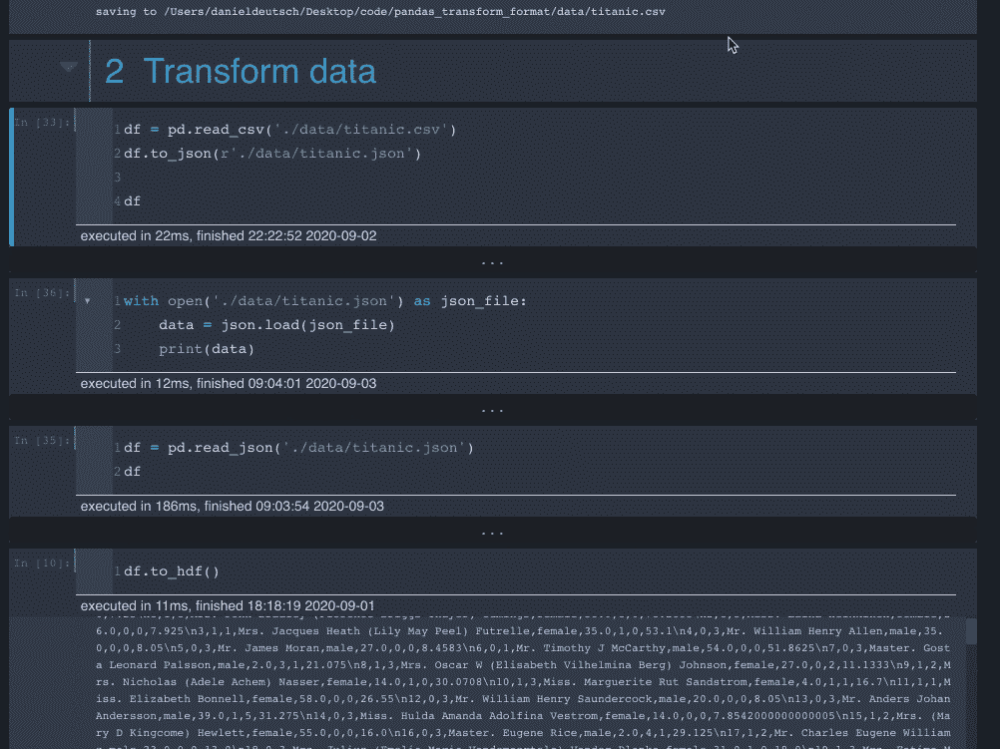
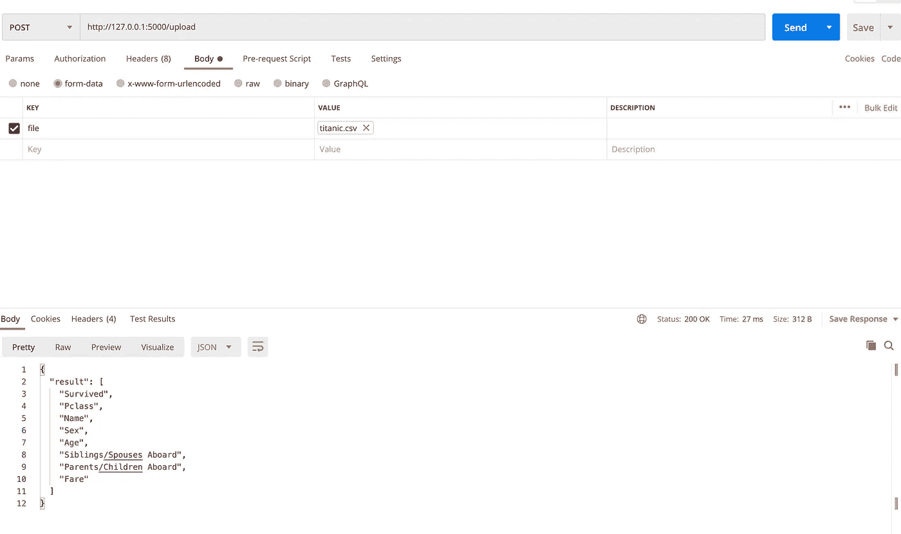
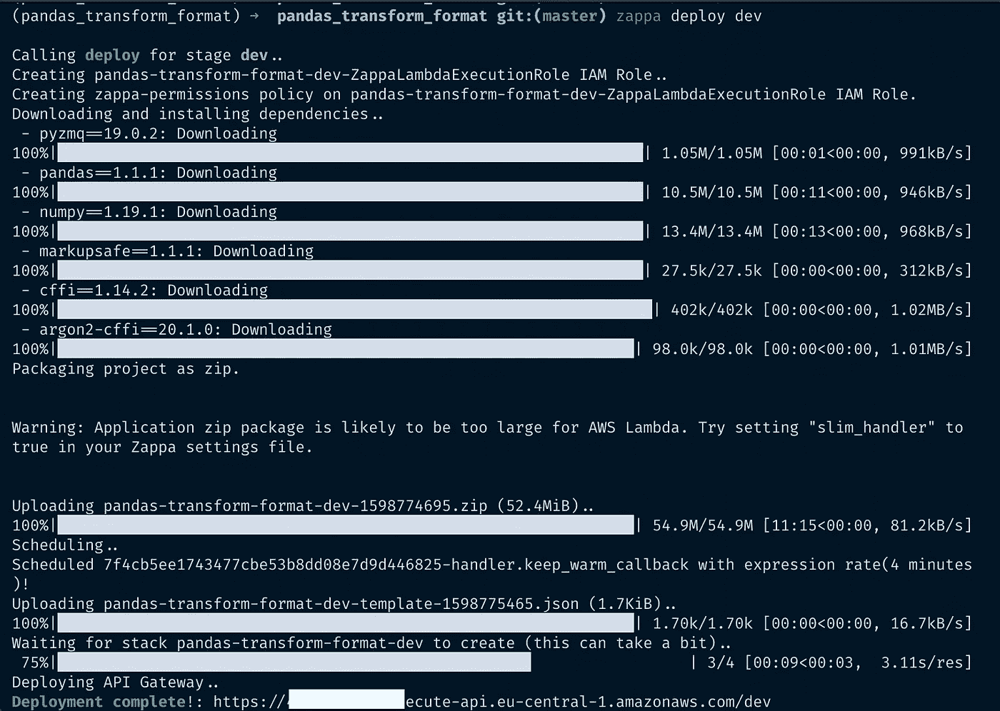
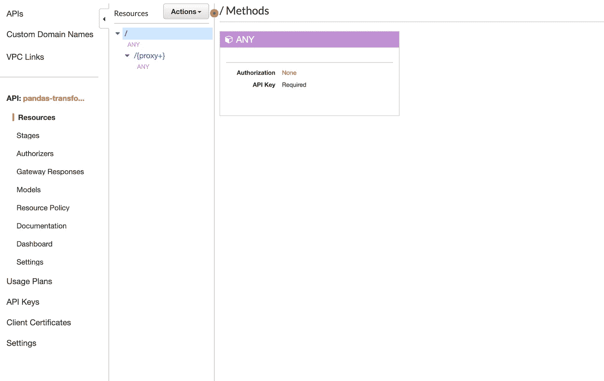
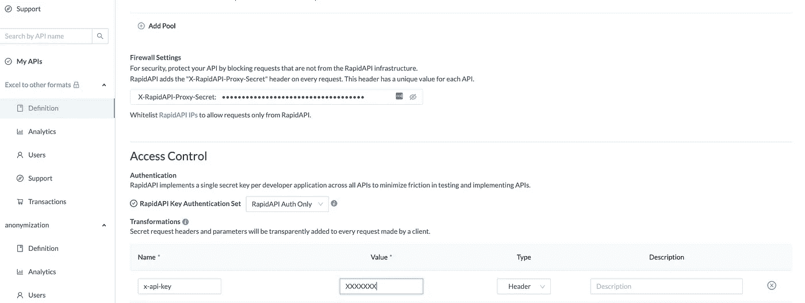
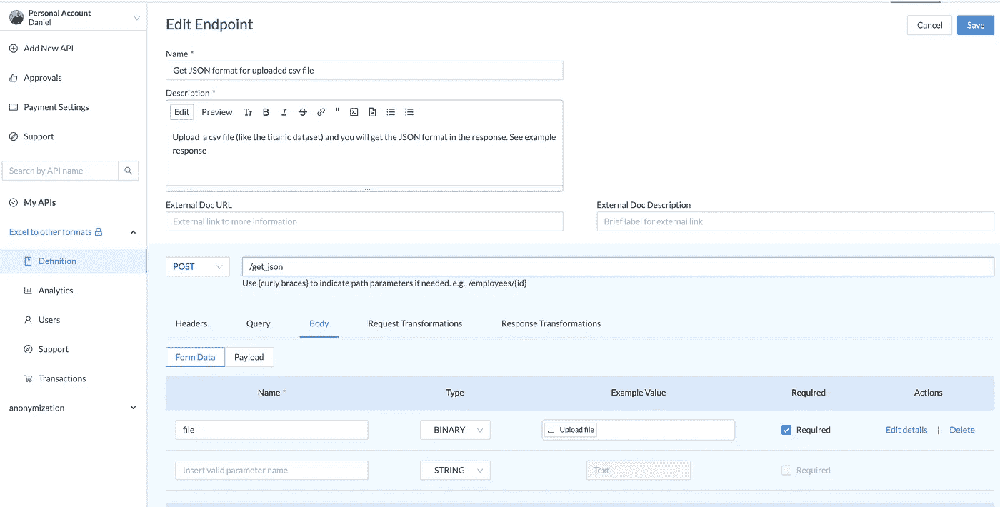
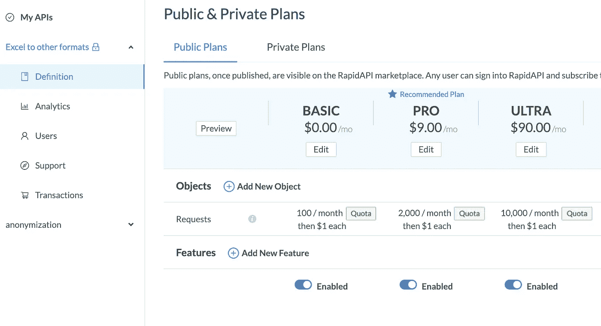
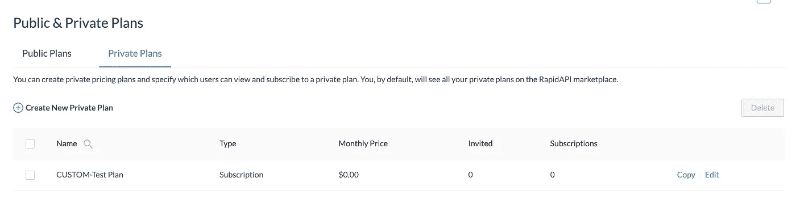
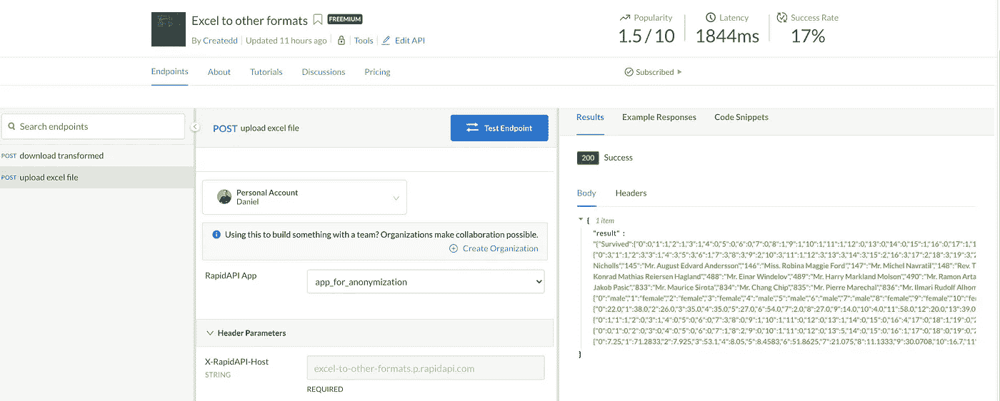
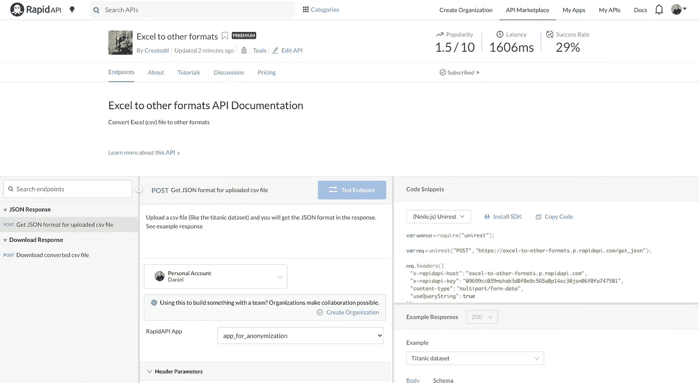

# 开发和销售 Python API —从头到尾教程

> 原文：<https://towardsdatascience.com/develop-and-sell-a-python-api-from-start-to-end-tutorial-9a038e433966?source=collection_archive---------0----------------------->

## 本文从头到尾描述了开发 Python API 的过程，并在更困难的领域提供了帮助。


*图片:*[](https://unsplash.com/photos/LJ9KY8pIH3E)

*最近看了一篇博文，是关于建立自己的 API 并出售的。*

*我很受启发，想测试一下是否有效。仅用了 5 天时间，我就能够从头到尾创建一个 API。所以我想我会分享我遇到的问题，详细阐述文章介绍的概念，并提供一个快速的清单来自己构建一些东西。所有这些都是通过开发另一个 API 实现的。*

# *目录*

*   *[关于本文](https://github.com/Createdd/Writing/blob/master/2020/articles/pythonApi.md#about-this-article)*
*   *[免责声明](https://github.com/Createdd/Writing/blob/master/2020/articles/pythonApi.md#disclaimer)*
*   *[使用的堆栈](https://github.com/Createdd/Writing/blob/master/2020/articles/pythonApi.md#stack-used)*
*   *[1。创建项目手续](https://github.com/Createdd/Writing/blob/master/2020/articles/pythonApi.md#1-create-project-formalities)*
*   *[2。创建问题的解决方案](https://github.com/Createdd/Writing/blob/master/2020/articles/pythonApi.md#2-create-a-solution-for-a-problem)*
*   *[3。部署到 AWS](https://github.com/Createdd/Writing/blob/master/2020/articles/pythonApi.md#3-deploy-to-aws)*
*   *[4。设置 Rapidapi](https://github.com/Createdd/Writing/blob/master/2020/articles/pythonApi.md#4-set-up-rapidapi)*
*   *[最终结果](https://github.com/Createdd/Writing/blob/master/2020/articles/pythonApi.md#end-result)*
*   *[灵感](https://github.com/Createdd/Writing/blob/master/2020/articles/pythonApi.md#inspiration)*
*   *[关于](https://github.com/Createdd/Writing/blob/master/2020/articles/pythonApi.md#about)*

# *关于这篇文章*

*这篇文章可以被认为是其他文章的教程和理解(列在我的“灵感”部分)。*

*它从头到尾描绘了一幅开发 Python API 的图画，并在更困难的领域提供了帮助，比如 AWS 和 Rapidapi 的设置。*

*我想这对其他想做同样事情的人会有帮助。我在路上遇到了一些问题，所以我想分享一下我的方法。这也是一个很好的方式来建立副业项目，甚至可能赚一些钱。*

*如目录所示，它由 4 个主要部分组成，即:*

1.  *设置环境*
2.  *使用 Python 创建问题解决方案*
3.  *设置 AWS*
4.  *设置 Rapidapi*

*你会在 Github 上找到我所有的开源代码:*

*   *[https://github.com/Createdd/pandas_transform_format](https://github.com/Createdd/pandas_transform_format)*

*您将在 Rapidapi 上找到最终结果:*

*   *[https://rapidapi.com/Createdd/api/excel-to-other-formats](https://rapidapi.com/Createdd/api/excel-to-other-formats)*

*如果你觉得这篇文章有帮助，请告诉我和/或购买 Rapidapi 上的功能以示支持。*

# *放弃*

*我与本文中使用的任何服务都没有关联。*

*我不认为自己是专家。如果你觉得我错过了重要的步骤或者忽略了什么，可以考虑在评论区指出来或者联系我。此外，始终确保监控您的 AWS 成本，不要为您不知道的事情付费。*

*我总是乐于听取建设性的意见以及如何改进。*

# *使用的堆栈*

*我们将使用*

*   *Github(代码托管)，*
*   *依赖和环境管理，*
*   *Jupyter 笔记本(代码开发和文档)，*
*   *Python(编程语言)，*
*   *AWS(部署)，*
*   *Rapidapi(销售市场)*

# *1.创建项目手续*

*它总是一样的，但却是必要的。我按照以下步骤来做:*

1.  *创建本地文件夹`mkdir NAME`*
2.  *用`NAME`在 Github 上创建一个新的存储库*
3.  *创造康达环境`conda create --name NAME python=3.7`*
4.  *激活康达环境`conda activate PATH_TO_ENVIRONMENT`*
5.  *创建 git 回购`git init`*
6.  *连接到 Github repo。添加自述文件，提交并*

```
*git remote add origin URL_TO_GIT_REPO
git push -u origin master*
```

*现在我们有:*

*   *本地文件夹*
*   *github 知识库*
*   *anaconda 虚拟环境*
*   *git 版本控制*

# *2.创建问题的解决方案*

*然后我们需要创造一个解决问题的方法。为了便于演示，我将展示如何将 excel csv 文件转换成其他格式。基本功能将首先在 Jupyter 笔记本上进行编码和测试。*

*   *[*安装包*](https://github.com/Createdd/Writing/blob/master/2020/articles/pythonApi.md#install-packages)*
*   *[*制定解决问题的方案*](https://github.com/Createdd/Writing/blob/master/2020/articles/pythonApi.md#develop-solution-to-problem)*
*   *[*下载数据*](https://github.com/Createdd/Writing/blob/master/2020/articles/pythonApi.md#download-data)*
*   *[*创建功能*](https://github.com/Createdd/Writing/blob/master/2020/articles/pythonApi.md#create-functionality)*
*   *[*构建服务器执行 REST 功能*](https://github.com/Createdd/Writing/blob/master/2020/articles/pythonApi.md#build-server-to-execute-function-with-rest)*

# *安装软件包*

*安装 jupyter 笔记本和 jupytext:*

```
*pip install notebook jupytext*
```

*在`.git/hooks/pre-commit`中设置一个钩子，用于正确跟踪 git 中的笔记本变化:*

```
*touch .git/hooks/pre-commit
code  .git/hooks/pre-commit*
```

*把这个复制到文件里*

```
*#!/bin/sh
# For every ipynb file in the git index, add a Python representation
jupytext --from ipynb --to py:light --pre-commit*
```

*之后让钩子可执行(在 mac 上)*

```
*chmod +x .git/hooks/pre-commit*
```

# *找到解决问题的方法*

```
*pip install pandas requests*
```

*添加一个`.gitignore`文件并添加数据文件夹(`data/`)以不将数据上传到主机。*

# *下载数据*

*下载一个示例数据集 [(titanic dataset)](https://www.kaggle.com/c/titanic) 并保存到一个数据文件夹中:*

```
*def download(url: str, dest_folder: str):
    if not os.path.exists(dest_folder):
        os.makedirs(dest_folder) filename = url.split('/')[-1].replace(" ", "_")
    file_path = os.path.join(dest_folder, filename) r = requests.get(url, stream=True)
    if r.ok:
        print("saving to", os.path.abspath(file_path))
        with open(file_path, 'wb') as f:
            for chunk in r.iter_content(chunk_size=1024 * 8):
                if chunk:
                    f.write(chunk)
                    f.flush()
                    os.fsync(f.fileno())
    else:
        print("Download failed: status code {}\n{}".format(r.status_code, r.text)) url_to_titanic_data = 'https://web.stanford.edu/class/archive/cs/cs109/cs109.1166/stuff/titanic.csv'download(url_to_titanic_data,'./data')*
```

# *创建功能*

*转换格式*

```
*df = pd.read_csv('./data/titanic.csv')
df.to_json(r'./data/titanic.json')*
```

**

*Jupyter 笔记本中的转换示例*

# *用 REST 构建服务器来执行功能*

*在 jupyter notebook 中开发了功能后，我们希望在 python 应用程序中实际提供该功能。*

*有很多方法可以使用 jupyter 笔记本的某些部分，但是为了简单起见，我们现在重新创建它。*

*添加一个`app.py`文件。*

*例如，我们希望用户上传一个 excel 文件并返回转换成 JSON 的文件。*

*浏览互联网，我们可以看到已经有软件包可以处理 flask 和 excel 格式。所以让我们利用它们。*

```
*pip install Flask*
```

*启动 Flask 服务器时使用*

```
*env FLASK_APP=app.py FLASK_ENV=development flask run*
```

*Tipp:用 [Postman](https://www.postman.com/) 测试你的后端功能。它很容易设置，并允许我们快速测试后端功能。在“表单-数据”选项卡中上传 excel:*

**

*用邮递员测试后端*

*在这里您可以看到上传的 titanic csv 文件和数据集返回的列名。*

*现在我们只需编写将 excel 转换成 json 的函数，如下所示:*

```
*import json
import pandas as pd
from flask import Flask, requestapp = Flask(__name__)@app.route('/get_json', methods=['GET', 'POST'])
def upload_file():
    if request.method == 'POST':
        provided_data = request.files.get('file')
        if provided_data is None:
            return 'Please enter valid excel format ', 400 data = provided_data
        df = pd.read_csv(data)
        transformed = df.to_json() result = {
            'result': transformed,
        } json.dumps(result) return result if __name__ == '__main__':
    app.run()*
```

*(查看我的[库](https://github.com/Createdd/pandas_transform_format)中的完整代码。)*

*例如，现在我们有了将 csv 文件转换成 json 的功能。*

# *3.部署到 AWS*

*在本地开发之后，我们想把它放到云中。*

*   *[*设置 zappa*](https://github.com/Createdd/Writing/blob/master/2020/articles/pythonApi.md#set-up-zappa)*
*   *[*设置 AWS*](https://github.com/Createdd/Writing/blob/master/2020/articles/pythonApi.md#set-up-aws)*
*   *[*AWS 凭证*](https://github.com/Createdd/Writing/blob/master/2020/articles/pythonApi.md#aws-credentials)*
*   *[*在 IAM*](https://github.com/Createdd/Writing/blob/master/2020/articles/pythonApi.md#set-up-credentials-with-users-and-roles-in-iam) 中设置用户和角色的凭证*
*   *[*在项目中添加凭证*](https://github.com/Createdd/Writing/blob/master/2020/articles/pythonApi.md#add-credentials-in-your-project)*
*   *[*AWS API 网关*](https://github.com/Createdd/Writing/blob/master/2020/articles/pythonApi.md#aws-api-gateway)*

# *设置 zappa*

*在我们本地创建应用程序后，我们需要开始在一个真实的服务器上设置主机。我们将使用 [zappa](https://github.com/Miserlou/Zappa) 。*

> **Zappa 使得在 AWS Lambda + API Gateway 上构建和部署无服务器、事件驱动的 Python 应用程序(包括但不限于 WSGI web apps)变得超级简单。可以把它想象成 Python 应用程序的“无服务器”网络托管。这意味着无限扩展、零停机、零维护，而成本只是您当前部署的一小部分！**

```
*pip install zappa*
```

*由于我们使用的是 conda 环境，我们需要指定它:*

```
*which python*
```

*会给你`/Users/XXX/opt/anaconda3/envs/XXXX/bin/python`(针对 Mac)*

*移除`bin/python/`并导出*

```
*export VIRTUAL_ENV=/Users/XXXX/opt/anaconda3/envs/XXXXX/*
```

*现在我们能做的*

```
*zappa init*
```

*来设置配置。*

*只要点击浏览所有内容，你就会有一个`zappa_settings.json`的样子*

```
*{
    "dev": {
        "app_function": "app.app",
        "aws_region": "eu-central-1",
        "profile_name": "default",
        "project_name": "pandas-transform-format",
        "runtime": "python3.7",
        "s3_bucket": "zappa-pandas-transform-format"
    }
}*
```

*请注意，我们还没有准备好部署。首先，我们需要获得一些 AWS 凭证。*

# *设置 AWS*

# *AWS 凭据*

*首先，你需要得到一个 AWS `access key id`和`access key`*

*你可能认为这很简单:*

*要获得凭据，您需要*

*   *转到:[http://aws.amazon.com/](http://aws.amazon.com/)*
*   *注册并创建一个新账户(他们会给你一年试用期或类似的选择)*
*   *转到您的 AWS 帐户概述*
*   *账户菜单；子菜单:安全凭证*

*但是不，AWS 中的权限更多！*

## *使用 IAM 中的用户和角色设置凭据*

*我发现 Peter Kazarinoff 的这篇文章非常有帮助。他非常详细地解释了下一部分。我下面的要点方法是一个快速总结，我经常引用他的步骤。如果你被困在某个地方，请查看他的文章了解更多细节。*

*我尽可能简单地分解它:*

1.  *在 AWS 控制台中，在搜索框中键入 IAM。IAM 是 AWS 用户和权限仪表板。*
2.  *创建一个组*
3.  *为您的群组命名(例如 zappa_group)*
4.  *为您的小组创建我们自己的特定内联策略*
5.  *在“权限”选项卡的“内联策略”部分下，选择链接以创建新的内联策略*
6.  *在设置权限屏幕中，单击自定义策略单选按钮，然后单击右侧的“选择”按钮。*
7.  *创建一个用 json 格式编写的定制策略*
8.  *通读并复制此处讨论的一项政策:【https://github.com/Miserlou/Zappa/issues/244*
9.  *向下滚动到“我的自定义策略”查看我的策略的片段。*
10.  *使用您的 AWS 帐号粘贴和修改 json 后，单击“验证策略”按钮以确保您复制了有效的 json。然后单击“应用策略”按钮，将内联策略附加到该组。*
11.  *创建一个用户并将该用户添加到组中*
12.  *回到 IAM 控制面板，使用“用户”左侧菜单选项和“添加用户”按钮创建一个新用户。*
13.  *在“添加用户”屏幕中，为新用户命名，并选择编程访问的访问类型。然后点击“下一步:权限”按钮。*
14.  *在“设置权限”屏幕中，选择您之前在“将用户添加到组”部分创建的组，然后单击“下一步:标记”。*
15.  *标签是可选的。如果需要，添加标签，然后单击“下一步:查看”。*
16.  *查看用户详细信息，然后单击“创建用户”*
17.  *复制用户的密钥*
18.  *先不要关闭 AWS IAM 窗口。在下一步中，您将把这些密钥复制并粘贴到一个文件中。此时，将这些密钥复制并保存到一个安全位置的文本文件中不失为一个好主意。确保不要在版本控制下保存密钥。*

*我的自定义策略:*

```
*{
  "Version": "2012-10-17",
  "Statement": [
    {
      "Effect": "Allow",
      "Action": [
        "iam:AttachRolePolicy",
        "iam:GetRole",
        "iam:CreateRole",
        "iam:PassRole",
        "iam:PutRolePolicy"
      ],
      "Resource": [
        "arn:aws:iam::XXXXXXXXXXXXXXXX:role/*-ZappaLambdaExecutionRole"
      ]
    },
    {
      "Effect": "Allow",
      "Action": [
        "lambda:CreateFunction",
        "lambda:ListVersionsByFunction",
        "logs:DescribeLogStreams",
        "events:PutRule",
        "lambda:GetFunctionConfiguration",
        "cloudformation:DescribeStackResource",
        "apigateway:DELETE",
        "apigateway:UpdateRestApiPolicy",
        "events:ListRuleNamesByTarget",
        "apigateway:PATCH",
        "events:ListRules",
        "cloudformation:UpdateStack",
        "lambda:DeleteFunction",
        "events:RemoveTargets",
        "logs:FilterLogEvents",
        "apigateway:GET",
        "lambda:GetAlias",
        "events:ListTargetsByRule",
        "cloudformation:ListStackResources",
        "events:DescribeRule",
        "logs:DeleteLogGroup",
        "apigateway:PUT",
        "lambda:InvokeFunction",
        "lambda:GetFunction",
        "lambda:UpdateFunctionConfiguration",
        "cloudformation:DescribeStacks",
        "lambda:UpdateFunctionCode",
        "lambda:DeleteFunctionConcurrency",
        "events:DeleteRule",
        "events:PutTargets",
        "lambda:AddPermission",
        "cloudformation:CreateStack",
        "cloudformation:DeleteStack",
        "apigateway:POST",
        "lambda:RemovePermission",
        "lambda:GetPolicy"
      ],
      "Resource": "*"
    },
    {
      "Effect": "Allow",
      "Action": [
        "s3:ListBucketMultipartUploads",
        "s3:CreateBucket",
        "s3:ListBucket"
      ],
      "Resource": "arn:aws:s3:::zappa-*"
    },
    {
      "Effect": "Allow",
      "Action": [
        "s3:PutObject",
        "s3:GetObject",
        "s3:AbortMultipartUpload",
        "s3:DeleteObject",
        "s3:ListMultipartUploadParts"
      ],
      "Resource": "arn:aws:s3:::zappa-*/*"
    }
  ]
}*
```

*注意:用您的 AWS 帐号替换内嵌政策中的 XXXXXXXXXXX。*

*您的 AWS 帐号可以通过点击“支持→”支持中心找到。您的帐号列在左上角的支持中心。上面的 json 是对我有用的。但是，我估计这组安全权限可能太开放了。为了增加安全性，你可以慢慢削减权限，看看 Zappa 是否还在部署。上面的设置是最后对我起作用的。如果你想了解更多关于运行 Zappa 所需的特定 AWS 权限，你可以在 GitHub 上深入讨论:[https://github.com/Miserlou/Zappa/issues/244](https://github.com/Miserlou/Zappa/issues/244)。*

## *在项目中添加凭据*

*使用以下命令在根目录下创建一个`.aws/credentials`文件夹*

```
*mkdir ~/.aws
code ~/.aws/credentials*
```

*并从 AWS 粘贴您的凭据*

```
*[dev]
aws_access_key_id = YOUR_KEY
aws_secret_access_key = YOUR_KEY*
```

*与`config`相同*

```
*code ~/.aws/config[default]
region = YOUR_REGION (eg. eu-central-1)*
```

*注意，`code`是用我选择的编辑器 vscode 打开一个文件夹。*

*将分配给用户的 AWS 访问密钥 id 和秘密访问密钥保存在文件~/中。AWS/凭据。请注意。aws/ directory 需要在您的主目录中，并且凭据文件没有文件扩展名。*

*现在，您可以使用*

```
*zappa deploy dev*
```

**

*使用 zappa 部署应用程序*

*不应该再有任何错误了。但是，如果还有一些，您可以使用以下命令进行调试:*

```
*zappa status
zappa tail*
```

*最常见的错误是与权限相关的(然后检查您的权限策略)或关于不兼容的 python 库。无论哪种方式，zappa 都会为调试提供足够好的错误消息。*

*如果您更新您的代码，不要忘记使用*

```
*zappa update dev*
```

# *AWS API 网关*

*要在市场上设置 API，我们需要首先用 API-key 限制它的使用，然后在市场平台上设置它。*

*我发现 Nagesh Bansal 的这篇文章[很有帮助。他非常详细地解释了下一部分。我下面的要点方法是一个快速总结，我经常引用他的步骤。如果你被困在某个地方，请查看他的文章了解更多细节。](https://medium.com/@bansalnagesh/how-to-sell-your-apis-b4b5c9a273f8)*

*我再一次把它分解:*

1.  *转到 AWS 控制台并转到 API 网关*
2.  *点击你的 API*
3.  *我们希望创建一个 x-api-key 来限制对 api 的不希望的访问，并且也有一个计量使用*
4.  *为 API 创建一个使用计划，包括所需的限制和配额限制*
5.  *创建关联的 API 阶段*
6.  *添加 API 密钥*
7.  *在 API 键概述部分，单击 API 键处的“显示”并复制它*
8.  *然后将 API 与键相关联，并丢弃所有没有键的请求*
9.  *回到 API 概述。在“资源”下，单击“/任意”转到“方法请求”。然后在“设置”中，将“需要 API 密钥”设置为真*
10.  *对“/{proxy+}方法执行相同的操作*

*它看起来像这样*

**

*在 AWS API 网关中设置限制*

*现在，您已经限制了对 API 的访问。*

# *4.设置 Rapidapi*

*   *[*在 Rapidapi* 上创建 API](https://github.com/Createdd/Writing/blob/master/2020/articles/pythonApi.md#create-api-on-rapidapi)*
*   *[*测试自己的 API*](https://github.com/Createdd/Writing/blob/master/2020/articles/pythonApi.md#test-your-own-api)*
*   *[*创建私有测试计划*](https://github.com/Createdd/Writing/blob/master/2020/articles/pythonApi.md#create-private-plan-for-testing)*
*   *[*用 rapidapi 测试终点*](https://github.com/Createdd/Writing/blob/master/2020/articles/pythonApi.md#test-endpoint-with-rapidapi)*
*   *[*创建代码来消费 API*](https://github.com/Createdd/Writing/blob/master/2020/articles/pythonApi.md#create-code-to-consume-api)*

# *在 Rapidapi 上创建 API*

1.  *转到“我的 API”和“添加新 API”*
2.  *添加名称、描述和类别。请注意，以后不能再更改 API 名称*
3.  *在 settings 中，添加您的 AWS API 的 URL(它在您使用 zappa 部署时显示)*
4.  *在“转换”下的“访问控制”部分，添加您在 AWS 中添加的 API 键*

**

*Rapidapi 中的访问控制*

*5.在安全选项卡中，您可以检查一切*

*6.然后转到“端点”,通过单击“创建 REST 端点”从 Python 应用程序添加路径*

**

*添加 REST 端点*

*7.为您的 API 添加图像*

*8.制定定价计划。Rapidapi 发表了一篇自己的关于定价选择和策略的文章。正如他们总结的那样，如何定价取决于你的偏好和产品。*

*9.我创建了一个免费增值定价计划。这样做的原因是，我想给免费测试它的机会，但增加了定期使用它的价格。此外，我想创建一个计划来支持我的工作。例如:*

**

*制定价格计划*

*10.创建一些文档和教程。这很容易解释。我们鼓励这样做，因为如果你的 API 被恰当地记录下来，人们会更容易使用它。*

*11.最后一步是公开您的 API。但在此之前，亲自测试一下是很有用的。*

# *测试您自己的 API*

# *创建私人测试计划*

*设置好一切之后，您当然应该使用提供的代码片段进行测试。这一步并不简单，我必须联系支持人员来理解它。现在我在这里简化一下。*

*为自己制定一个私人计划，不要设定任何限制。*

**

*转到 API 的“用户”部分，然后转到“免费计划用户”，选择您自己并“邀请”您加入私人计划。*

**

*将您自己加入您的私人计划*

*现在，您已经订阅了自己的私人计划，可以使用提供的代码片段测试功能。*

# *使用 Rapidapi 测试端点*

*上传一个示例 excel 文件，然后单击“测试端点”。然后你会得到一个 200 ok 的回复。*

**

*在 Rapidapi 中测试端点*

# *创建使用 API 的代码*

*现在要使用 API，您可以简单地复制 Rapidapi 提供的代码片段。例如 Python 和请求库:*

```
*import requestsurl = "https://excel-to-other-formats.p.rapidapi.com/upload"payload = ""
headers = {
    'x-rapidapi-host': "excel-to-other-formats.p.rapidapi.com",
    'x-rapidapi-key': "YOUR_KEY",
    'content-type': "multipart/form-data"
    }response = requests.request("POST", url, data=payload, headers=headers)print(response.text)*
```

# *最终结果*

**

*[https://rapidapi.com/Createdd/api/excel-to-other-formats](https://rapidapi.com/Createdd/api/excel-to-other-formats)*

# *灵感*

*文章[“作为产品的原料药。如何在你只知道一个后端的情况下销售你的作品？](/api-as-a-product-how-to-sell-your-work-when-all-you-know-is-a-back-end-bd78b1449119)*

> *制作一个解决问题的 API*
> 
> *使用无服务器架构进行部署*
> 
> *通过 API 市场分发*

*对于设置一切，我发现 Nagesh Bansal 的文章非常有帮助:*

*   *[https://medium . com/@ bansalnagesh/how-to-sell-your-API-B4 b5 C9 a 273 f 8](https://medium.com/@bansalnagesh/how-to-sell-your-apis-b4b5c9a273f8)*
*   *[https://medium . com/@ bansalnagesh/launch-your-API-on-AWS-with-0-pred-cost-using-zappa-in-10-minutes-eb6d 00623842](https://medium.com/@bansalnagesh/launch-your-api-on-aws-with-0-upfront-cost-using-zappa-in-10-minutes-eb6d00623842)*

*彼得·卡扎林诺夫的这篇文章:[https://python forundergradengineers . com/deploy-server less-we B- app-AWS-lambda-zappa . html](https://pythonforundergradengineers.com/deploy-serverless-web-app-aws-lambda-zappa.html)*

*我鼓励你也看看那些文章。*

*[你也可以直接在 Github 上阅读我的文章(为了更好的代码格式)](https://github.com/Createdd/Writing/blob/master/2020/articles/pythonApi.md)*

# *关于*

*丹尼尔是一名企业家、软件开发人员和律师。他曾在各种 IT 公司、税务咨询、管理咨询和奥地利法院工作。*

*他的知识和兴趣目前围绕着编程机器学习应用程序及其所有相关方面。从本质上说，他认为自己是复杂环境的问题解决者，这在他的各种项目中都有所体现。*

*如果您有想法、项目或问题，请不要犹豫与我们联系。*

*[](https://www.buymeacoffee.com/createdd)

你可以在 https://www.buymeacoffee.com/createdd 支持我* *[](https://www.createdd.com/) [## 主页

### 关于我丹尼尔是一名企业家，软件开发人员和律师。他曾在各种 IT 公司，税务咨询…

www.createdd.com](https://www.createdd.com/) 

连接到:

*   [LinkedIn](https://www.linkedin.com/in/createdd)
*   [Github](https://github.com/Createdd)
*   [中等](https://medium.com/@createdd)
*   [推特](https://twitter.com/_createdd)
*   [Instagram](https://www.instagram.com/create.dd/)*