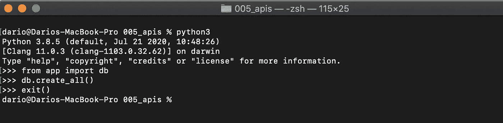
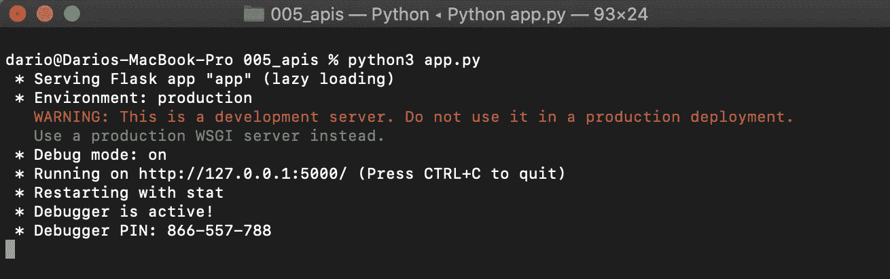
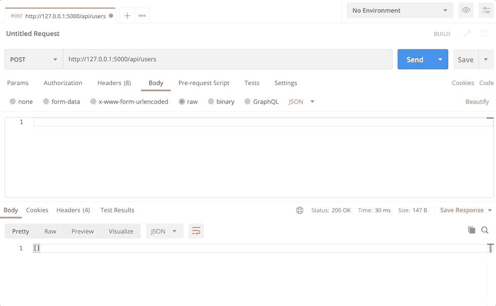
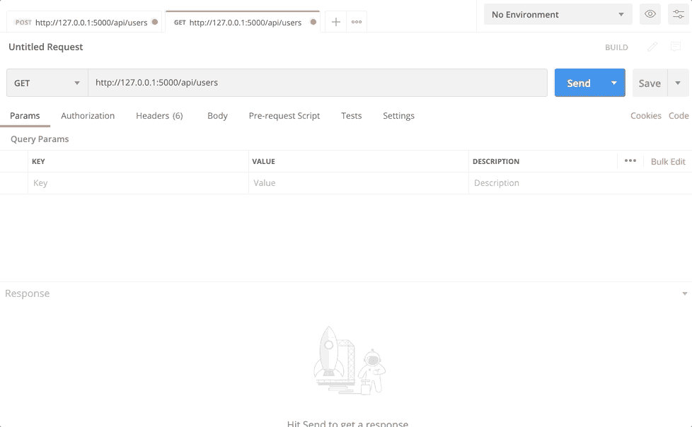
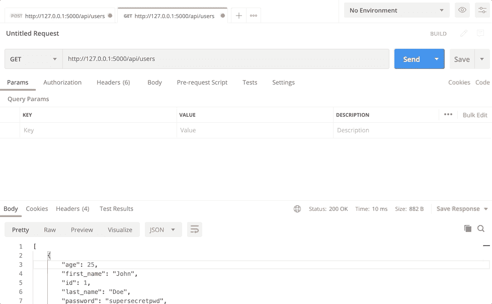
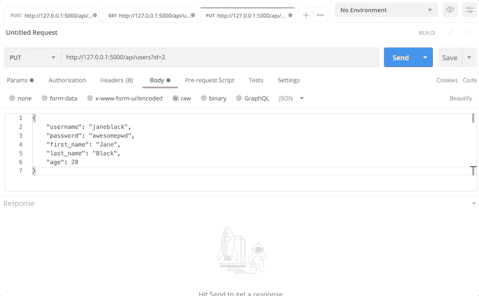
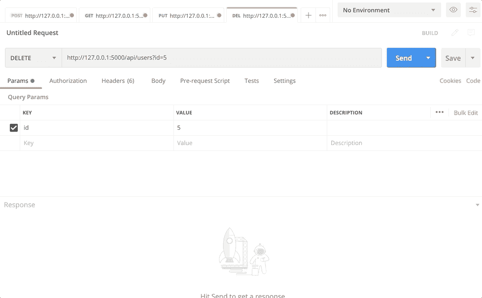

# 用 Python 在 10 分钟内开发数据库驱动的 REST API

> 原文：<https://towardsdatascience.com/develop-database-driven-rest-api-with-python-in-10-minutes-9b8cbb7ce5b2?source=collection_archive---------5----------------------->

## 用 Python 做一个完整的 CRUD REST API。我提到过它是数据库驱动的吗？

REST APIs 在我们身边无处不在，被用来构建高质量的软件。在数据科学中，它们用于将机器学习模型部署到生产中，所以不，从长远来看，你无法避免它们。今天我们将使用 Python 和`Flask-RESTful`创建一个简单但功能齐全的数据库驱动 API。


照片由 [Cookie 在](https://unsplash.com/@cookiethepom?utm_source=unsplash&utm_medium=referral&utm_content=creditCopyText) [Unsplash](https://unsplash.com/s/photos/laptop?utm_source=unsplash&utm_medium=referral&utm_content=creditCopyText) 上的 Pom 拍摄

以下是所用技术的简要概述:

*   Python 是一种神奇的编程语言，广泛用于各种类型的任务
*   **Flask-RESTful**—`Flask`库的扩展。使我们能够快速开发 API
*   **SQLAlchemy** —一种 ORM(对象关系映射器)。帮助我们在不编写 SQL 的情况下与数据库通信

差不多就是这样。这篇文章应该很容易理解，完成它不应该花费你超过 10-15 分钟的时间(如果按照代码进行的话)。

这篇文章的结构如下:

你可以在这里下载源代码[。让我们开始吧。](https://gist.github.com/betterdatascience/1b552750a4ab1c6c94c1d4e451ded9f9)

# 问题描述

我们想创建一个存储用户数据的数据库(想想网站上的注册表单)。我们可以访问用户名、密码、真实姓名和年龄等信息。

接下来，我们想开发一个 REST API 来简化数据库处理。此外，API 使我们的逻辑可用于任何编程语言、终端和工具，如。

我们希望以尽可能简单的方式从数据库中读取、插入、更新和删除记录。让我们就这样做吧，从下一节开始。

# 设置和模型声明

首先，在某个地方创建一个新目录，并在其中创建一个 Python 文件。我把我的命名为`app.py`，因为这是一个惯例，但这不是一个要求——所以你可以随意命名你的。

让我们继续进口，好吗？我们需要几个库:`Flask`、`Flask-RESTful`、`Flask-SQLAlchemy`和`Flask-Marshmallow`。以下是进口货:

```
from flask import Flask, request, jsonify 
from flask_sqlalchemy import SQLAlchemy 
from flask_marshmallow import Marshmallow 
from flask_restful import Resource, Api
```

当这个问题解决后，我们可以继续初始化。我们必须创建一个`Flask`应用程序和 API 的实例，并指定数据库的位置。我们正在使用，因此请确保您首先熟悉它:

[](/python-has-a-built-in-database-heres-how-to-use-it-47826c10648a) [## Python 有一个内置的数据库——下面是如何使用它

### 如何利用内置数据库进行数据存储和操作

towardsdatascience.com](/python-has-a-built-in-database-heres-how-to-use-it-47826c10648a) 

我们还必须制作一个`SQLAlchemy`和`Marshmallow`的实例。后者用于使处理 JSON 响应变得轻而易举。代码如下:

```
app = Flask(__name__) 
api = Api(app) 
app.config['SQLALCHEMY_DATABASE_URI'] = 'sqlite:///users.db' 
app.config['SQLALCHEMY_TRACK_MODIFICATIONS'] = False 
db = SQLAlchemy(app) 
ma = Marshmallow(app)
```

厉害！现在让我们进入正题，为我们的用户声明一个模型。`SQLAlchemy`需要它来动态构建和执行 SQL，所以我们不必担心这个问题。如简介部分所述，我们将处理姓名、年龄、用户名和密码等数据。

我们需要指定数据类型和它们的大小，所以`SQLAlchemy`可以创建表。这一切都发生在继承自`SQLAlchemy.Model`的`class`内。最后，我们将把参数传递给类的构造函数。代码如下:

```
class User(db.Model):
    id = db.Column(db.Integer, primary_key=True)
    username = db.Column(db.String(32), unique=True)
    password = db.Column(db.String(32))
    first_name = db.Column(db.String(32))
    last_name = db.Column(db.String(32))
    age = db.Column(db.Integer)

    def __init__(self, username, password, first_name, last_name, age):
        self.username = username
        self.password = password
        self.first_name = first_name
        self.last_name = last_name
        self.age = age
```

上面的代码片段应该易于阅读和理解，因为没有什么复杂的东西。现在我们可以为我们的用户声明一个模式。这只是继承自`Marshmallow.Schema`的另一个类，用于避免令人头疼的 JSON 解析。代码如下:

```
class UserSchema(ma.Schema):
    class Meta:
        fields = ('id', 'username', 'password', 'first_name', 'last_name', 'age')
```

此时，我们已经准备好初始化数据库并创建`users`表。为此，在根文件夹中打开一个新窗口，执行如下所示的所有操作:



厉害！我们需要做的最后一件事是使用声明的`UserSchema`。我们将声明两个变量——一个用于获取单个用户，另一个用于获取多个用户:

```
user_schema = UserSchema() 
users_schema = UserSchema(many=True)
```

我们现在可以继续实际的 API 开发了。

# API 开发

现在，我们将处理五件不同的事情:

所有这些逻辑都写在一个名为`UserManager`的类中。你可以随意命名你的名字，但这个似乎更合适。在谈到我们需要编写的样板代码的数量时,`Flask-RESTful`非常友好。它是最小的。首先，我们需要声明一个继承自`Flask-RESTful.Resource`的类。这是一个起始代码:

```
class UserManager(Resource): 
    pass
```

我们将从实现获取一个/所有用户的逻辑开始。后面的每个代码块都在`UserManager`类中。

## 获取用户

在`UserManager`类中，我们将声明一个名为`get`的静态方法。这一次命名非常重要，因为方法的名称代表了我们打算发出的 HTTP 请求的类型。请求是获取数据最合适的方式，所以我们将使用它。

逻辑是这样的:

*   检查用户是否在 URL 后面附加了`ID`参数——如果是，我们需要单个用户的数据。如果没有，我们需要所有用户的数据
*   通过`SQLAlchemy`进行相应的查询
*   使用`flask.jsonify`函数返回 JSON 格式的数据

这是代码:

```
@staticmethod
def get():
    try: id = request.args['id']
    except Exception as _: id = None

    if not id:
        users = User.query.all()
        return jsonify(users_schema.dump(users))
    user = User.query.get(id)
    return jsonify(user_schema.dump(user))
```

让我们继续插入新用户。

## 插入用户

这次我们将使用 HTTP 请求。这意味着用户应该以 JSON 格式为新用户传递数据——在测试部分会有更多的介绍。此外，我们的新静态方法必须命名为`post`。

这是我们必须实现的逻辑:

*   获取提供的用户名、密码、名字、姓氏和年龄的 JSON 数据
*   用提供的数据创建一个`User`类的实例
*   将该用户添加到数据库中，并提交事务
*   返回一条消息，表明用户已被插入

这是一个相对简单的函数。代码如下:

```
@staticmethod
def post():
    username = request.json['username']
    password = request.json['password']
    first_name = request.json['first_name']
    last_name = request.json['last_name']
    age = request.json['age']

    user = User(username, password, first_name, last_name, age)
    db.session.add(user)
    db.session.commit()

    return jsonify({
        'Message': f'User {first_name} {last_name} inserted.'
    })
```

让我们继续更新现有用户。

## 更新用户

要更新现有用户，我们将使用 HTTP 请求。然后，静态方法被命名为`put`，您已经猜到了。这是逻辑的概述:

*   检查呼叫中是否传递了用户`ID`。否则，将返回一条错误消息。这是因为我们一次只更新一个用户
*   获取提供的用户名、密码、名字、姓氏和年龄的 JSON 数据
*   根据提供的数据为数据库用户设置值，并提交事务
*   返回一条消息，表明用户已被更新

这种方法比前一种稍微复杂一点，但是仍然相当容易实现:

```
@staticmethod
def put():
    try: id = request.args['id']
    except Exception as _: id = None

    if not id:
        return jsonify({ 'Message': 'Must provide the user ID' })

    user = User.query.get(id)
    username = request.json['username']
    password = request.json['password']
    first_name = request.json['first_name']
    last_name = request.json['last_name']
    age = request.json['age']

    user.username = username
    user.password = password
    user.first_name = first_name
    user.last_name = last_name
    user.age = age

    db.session.commit()
    return jsonify({
        'Message': f'User {first_name} {last_name} altered.'
    })
```

## 删除用户

这是我们要实现的最终方法。它的任务是从数据库中删除单个用户。我相信您现在已经猜到我们将发出什么类型的 HTTP 请求，以及必须如何调用该方法。逻辑是这样的:

*   检查呼叫中是否传递了用户`ID`。否则，将返回一条错误消息。这是因为我们一次只删除一个用户
*   从数据库中删除用户并提交事务
*   返回一条消息，表明用户已被更新

代码如下:

```
@staticmethod
def delete():
    try: id = request.args['id']
    except Exception as _: id = None

    if not id:
        returnjsonify({ 'Message': 'Must provide the user ID' })

    user = User.query.get(id)
    db.session.delete(user)
    db.session.commit()

    return jsonify({
        'Message': f'User {str(id)} deleted.'
    })
```

整个`UserManager`班就这样。接下来让我们完成文件，开始测试。

## 收尾

为了完成`app.py`文件，我们需要将`UserManager`类附加到某个实际的端点上。我已经决定把我的名字命名为`/api/users`，但是命名的决定取决于你。

此外，从终端执行文件后，我们需要运行`Flask`应用程序。以下是两者的代码:

```
api.add_resource(UserManager, '/api/users')

if __name__ == '__main__':
    app.run(debug=True)
```

就这样——我们可以开始测试了。

# 测试

要启动我们的应用程序，请在根文件夹中打开一个新的终端窗口，并运行以下命令:



厉害！API 现在在`http://127.0.0.1:5000/api/users`运行，我们可以开始测试了。为了使这个过程简单明了，我决定使用这个应用程序。您不必这样做，因为您可以直接从 Python 甚至从终端做任何事情。我们将从插入开始，因为这对空数据库最有意义。

如果您正在跟随，请打开 Postman 并按照下面的说明进行操作。

## 创建新用户



## 获取所有用户



## 获取单个用户



## 更新用户



## 删除用户



差不多就是这样了！一切都像宣传的那样工作，所以让我们在下一部分总结一下。

# 结论

这是一篇很长的文章，值得一读——我承认这一点。不过，我希望你已经设法跟上了，如果没有，请参考[源代码](https://gist.github.com/betterdatascience/1b552750a4ab1c6c94c1d4e451ded9f9)。

了解如何使用 API 以及如何设计它们是任何数据科学家的基本技能，Python 提供了一种令人惊讶的简单入门方式。现在由你来决定向你认为合适的方向发展。请在下面的评论区留下你的想法。

感谢阅读。

加入我的私人邮件列表，获取更多有用的见解。

*喜欢这篇文章吗？成为* [*中等会员*](https://medium.com/@radecicdario/membership) *继续无限制学习。如果你使用下面的链接，我会收到你的一部分会员费，不需要你额外付费。*

[](https://medium.com/@radecicdario/membership) [## 通过我的推荐链接加入 Medium-Dario rade ci

### 作为一个媒体会员，你的会员费的一部分会给你阅读的作家，你可以完全接触到每一个故事…

medium.com](https://medium.com/@radecicdario/membership) 

*原载于 2020 年 10 月 6 日 https://betterdatascience.com**[*。*](https://betterdatascience.com/develop-database-driven-rest-api-with-python-in-10-minutes/)*