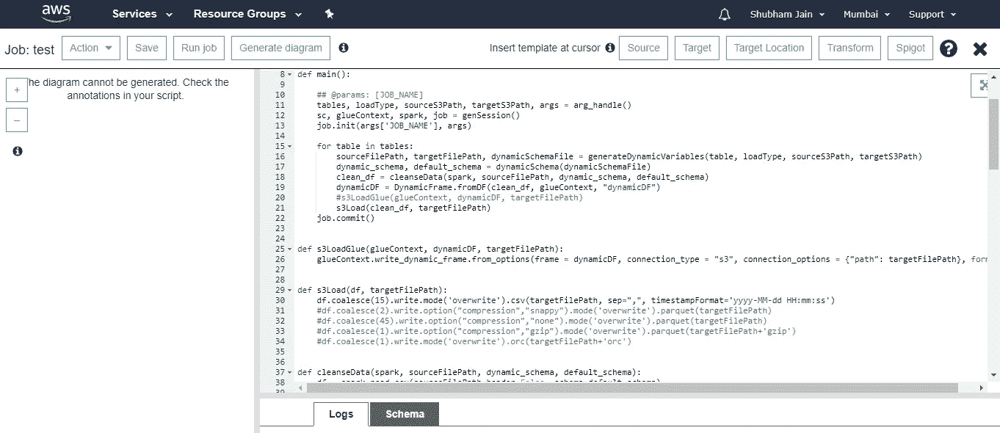
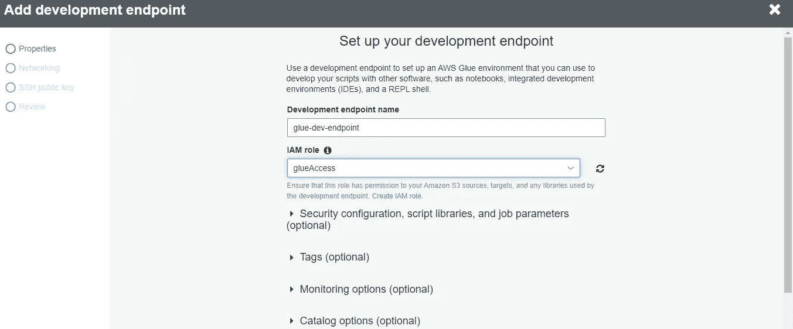

# 使用 Docker 容器在本地开发胶水工作

> 原文：<https://towardsdatascience.com/develop-glue-jobs-locally-using-docker-containers-bffc9d95bd1?source=collection_archive---------16----------------------->

## Docker 容器在本地测试 glue spark ETL 脚本，而不会产生任何额外的成本，也不会使用开发端点


图片由 Free 提供-照片来自 Pixabay

随着当前世界数据量的不断增加，对处理大数据的服务的需求非常高。当我们考虑大数据时，大多数数据工程师使用的框架非常少。阿帕奇 Spark 就是其中之一。

Apache Spark 是一个分布式处理引擎，它需要一个大型集群来执行任何类型的分析或简单地对数据集执行 ETL。要使用 Apache Spark，我们需要建立自己的大型集群，这非常昂贵，或者我们可以在云上利用它们。在这里，我们将讨论 AWS 提供的服务。因此，为了处理大型数据集并使用 spark 对其进行分析，AWS 提供了两个主要服务

1.  AWS EMR(弹性地图缩减)
2.  AWS 胶水

AWS EMR 为我们提供集群来执行我们的处理，并且非常昂贵，因此我们需要仔细确定我们需要集群多长时间，以及如何适当地优化我们的作业。我们不会在这篇文章中讨论 EMR，因为它本身就是一个非常大的讨论话题。

AWS Glue 是一个完全托管的 ETL 服务，由 amazon web services 提供，用于处理大量数据。AWS Glue 最好的部分是它在 AWS 无服务器保护伞下，我们不需要担心管理所有这些集群和与之相关的成本。在无服务器模式中，我们为我们使用的东西付费，因此，如果我们的工作只使用 25 个 DPU 来处理我们的数据，并且运行 20 分钟，那么我们最终只需支付利用 25 个 DPU 20 分钟的成本，而不会多花一分钱。

如今，AWS Glue 是创建基于 python 或 scala 的 spark 处理作业的最大需求。要在 AWS glue 上开发 jobs，我们有三个选项。让我们逐一讨论。

1.  **直接在 glue 编辑器中创建作业并运行作业:**



如果您是 spark 开发人员，并且不太熟悉 glue libraries 及其图生成，那么无论如何都要避免使用这个编辑器。这是写给那些非常确定他们正在写什么，并且从心里知道他们的工作将在第一轮中运行的人。这是完全不推荐的，只有当我们需要对现有的工作做一些改变时才可以考虑。当您在代码中使用胶水库时，直接使用作业编辑器是很好的，因为它会在您编写代码时生成谱系图。在选择这个选项之前，我建议浏览一下胶水库[这里](https://docs.aws.amazon.com/glue/latest/dg/aws-glue-programming-python-transforms.html)。

**2。创建一个胶开发端点:**



您可以设置一个 glue dev 端点，并将其链接到 zeppelin 笔记本或您的 pycharm IDE，或者您甚至可以连接本地 jupyter 笔记本。如果您想在开发工作时测试它们，这是一个更好的选择。要设置 Glue Dev 端点，您可以遵循官方 AWS 文档[这里](https://docs.aws.amazon.com/glue/latest/dg/dev-endpoint.html)。这个 glue dev 端点的唯一问题是它的成本。您将为它运行的时间付费，所以它基本上是用您想要的容量和安装在集群上的胶水库来启动 EMR 集群。如果开发成本不是问题，并且可以考虑的话，这是最好的选择之一。

**3。使用 AWS 胶水库并在本地 Docker 容器上运行它们**

考虑到作业的开发和在相对较小的数据集上测试作业，并且一旦作业准备好使用 glue job console 本身运行它们，这是迄今为止最好的选择。通过这个选项，您可以在您的机器上灵活地使用 glue libraries，或者您可以根据您的数据集大小启动 EC2 实例，并在这些 EC2 上启动 docker 容器，因为这将是一个相对便宜的选项，也是最适合运行您的作业的选项。

要在本地设置 AWS glue，你可以点击这里查看 AWS 文档[。但这似乎并不奏效，我们将详细讨论它。因此，我创建了一个 Docker 图像，并将解释我们正在做什么。](https://docs.aws.amazon.com/glue/latest/dg/aws-glue-programming-etl-libraries.html)

DockerFile 文件

我将 centos 作为基础映像，然后设置这些 env 变量，稍后我们将需要它来下载库

```
ENV MAVEN=https://aws-glue-etl-artifacts.s3.amazonaws.com/glue-common/apache-maven-3.6.0-bin.tar.gz
ENV SPARK=https://aws-glue-etl-artifacts.s3.amazonaws.com/glue-1.0/spark-2.4.3-bin-hadoop2.8.tgz
ENV GLUE=https://github.com/awslabs/aws-glue-libs.git
```

然后，我们将创建一个目录 glue 并安装所需的库，如 Java、python、wget、tar 和 Python 包，并将我们的工作目录设置为 glue

```
RUN mkdir glue
RUN yum install -y python3 java-1.8.0-openjdk java-1.8.0-openjdk-devel tar git wget zip
RUN ln -s /usr/bin/python3 /usr/bin/python
RUN ln -s /usr/bin/pip3 /usr/bin/pip
RUN pip install pandas
RUN pip install boto3
RUN pip install pynt
WORKDIR ./glue
```

现在在这个目录下会下载 maven，spark 和 glue libs 并解压。然后我们将更新 path 变量，并向它添加 SPARK_HOME、JAVA_HOME、MAVEN_HOME 和 GLUE_HOME 变量。

```
#To get the latest aws libraries
RUN git clone -b glue-1.0 $GLUE#To get latest spark version
RUN wget $SPARK#To install Maven for dependencies
RUN wget $MAVENRUN tar zxfv apache-maven-3.6.0-bin.tar.gz
RUN tar zxfv spark-2.4.3-bin-hadoop2.8.tgz#Removing zip files inorder to reduce the final docker image size
RUN rm spark-2.4.3-bin-hadoop2.8.tgz
RUN rm apache-maven-3.6.0-bin.tar.gz#Setting up env variables
RUN mv $(rpm -q -l java-1.8.0-openjdk-devel | grep "/bin$" | rev | cut -d"/" -f2- |rev) /usr/lib/jvm/jdk
ENV SPARK_HOME /glue/spark-2.4.3-bin-spark-2.4.3-bin-hadoop2.8
ENV MAVEN_HOME /glue/apache-maven-3.6.0
ENV JAVA_HOME /usr/lib/jvm/jdk
ENV GLUE_HOME /glue/aws-glue-libs
ENV PATH $PATH:$MAVEN_HOME/bin:$SPARK_HOME/bin:$JAVA_HOME/bin:$GLUE_HOME/bin
```

> **这里有一个重要的已知问题，将删除一些库**[](https://github.com/awslabs/aws-glue-libs/issues/25)****。****

```
RUN sed -i '/mvn -f/a rm /glue/aws-glue-libs/jarsv1/netty-*' /glue/aws-glue-libs/bin/glue-setup.shRUN sed -i '/mvn -f/a rm /glue/aws-glue-libs/jarsv1/javax.servlet-3.*' /glue/aws-glue-libs/bin/glue-setup.sh
```

**现在我们将使用 maven 编译所有的依赖项。这个 shell 脚本运行 maven build 命令并获得所有需要的依赖项。**

> **我们只运行一次，这样我们的 docker 映像就可以预先包含这些库，从而节省以后运行 spark 作业的时间。**

```
RUN sh /glue/aws-glue-libs/bin/glue-setup.sh
```

**最后，我们将清理所有的 tmp 目录，并使用 bash 作为容器的入口点。**

```
RUN yum clean all
RUN rm -rf /var/cache/yum
CMD ["bash"]
```

**现在使用 docker 文件并创建您的容器，以便开始开发 glue spark 作业。**

## **从 Dockerfile 构建 docker 映像**

**要从该 Dockerfile 文件构建映像，请运行以下命令:**

```
docker build -t jnshubham/glue_etl_local .
```

## **从 DockerHub 中提取现有图像**

**要使用现有的映像来启动您的容器，只需从 docker hub 中提取映像，并运行所提供的命令来提交作业**

**要提取图像，请运行以下命令:**

```
docker pull jnshubham/glue_etl_local:latest
```

**通过运行以下命令检查下载的图像**

```
docker images
```

## **运行 Docker 容器**

**要运行容器并进入 *repl* shell:**

```
docker run jnshubham/glue_etl_local "gluepyspark"
```

**进入终端并提交 spark 作业运行**

```
docker run -it jnshubham/glue_etl_localgluesparksubmit script.py --JOB_NAME script
```

**这样，您将能够在本地机器上测试您的作业，或者您也可以根据您的数据大小在任何 EC2 实例上使用它。**

**更多信息，请访问我的 [GitHub](https://github.com/jnshubham/aws-glue-local-etl-docker) 或 [dockerhub](https://hub.docker.com/repository/docker/jnshubham/glue_etl_local) 。**