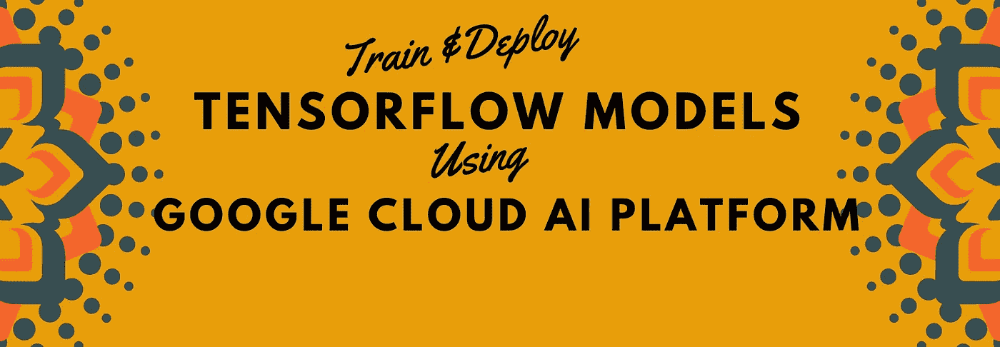
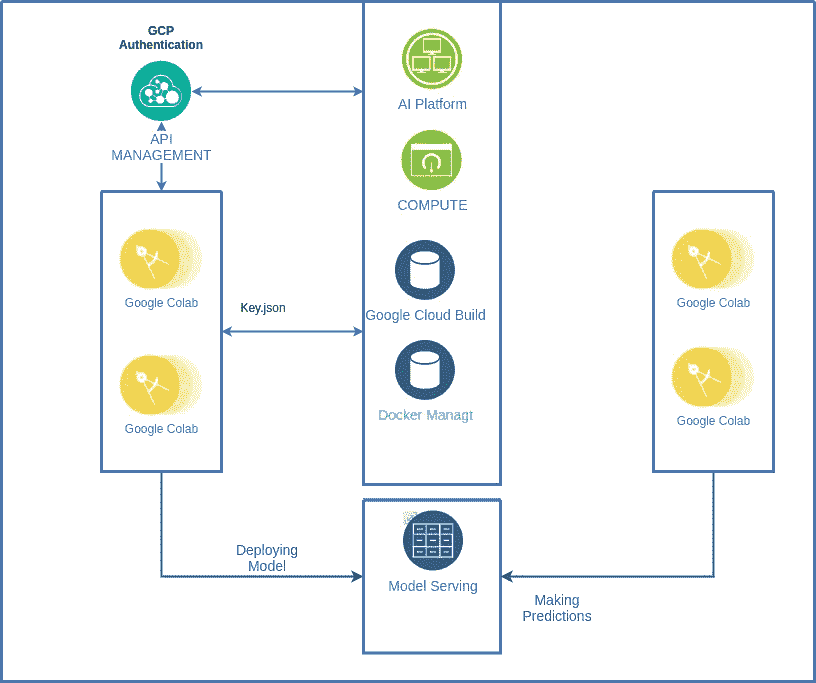
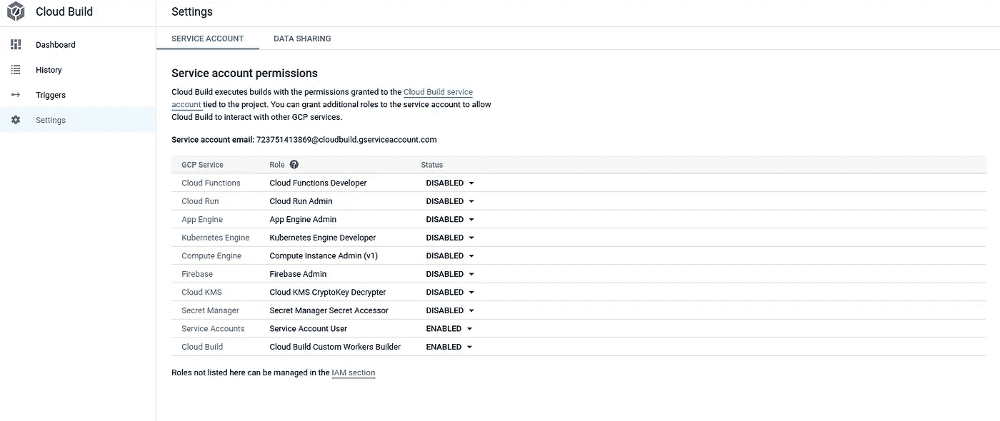
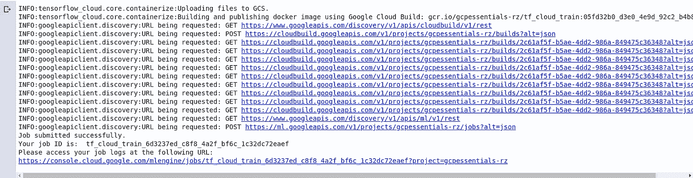
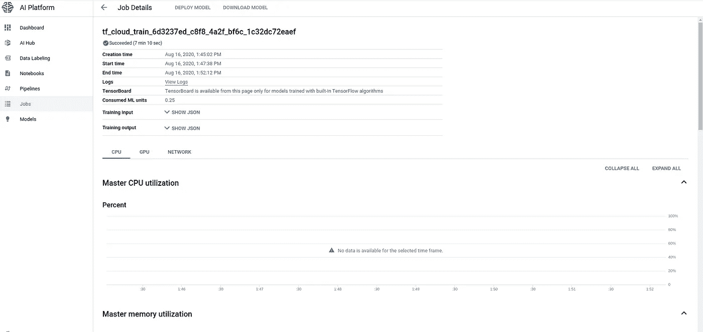
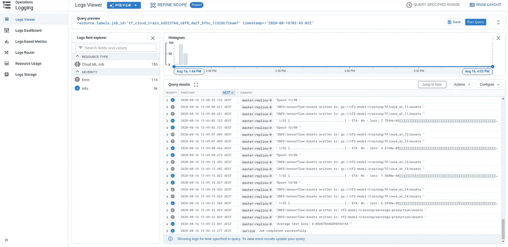

# 使用谷歌云人工智能平台开发、训练和部署 TensorFlow 模型

> 原文：<https://towardsdatascience.com/develop-train-and-deploy-tensorflow-models-using-google-cloud-ai-platform-32b47095878b?source=collection_archive---------23----------------------->

## 实用指南

## 张量流模型训练和部署的实用流程



TensorFlow 生态系统在开发涉及深度学习的应用程序方面已经变得非常受欢迎。原因之一是它有一个强大的社区，围绕核心库开发了许多工具来支持开发人员。在本教程中，我将指导您如何在 google colab 中制作模型原型，在 Google Cloud AI 平台上对其进行训练，并将最终完成的模型部署在 Google Cloud AI 平台上进行生产。我将包括工作的谷歌 colab 笔记本电脑，以重建工作。

Google colab 是 TensorFlow 中用于模型原型制作的免费资源，并附带各种运行时。准备一台带有 GPU 或 TPU 的机器一开始可能会很昂贵，但是用户可以从带有 google colab 的免费 GPU 开始。请记住，colab 资源有限，可能不适合正确训练需要大量计算资源的模型。尽管如此，colab 是构建模型原型和进行一些初步实验的完美工具。



可视化工作流程的框图

## 谷歌云平台上的培训模型

一旦您对模型管道感到满意，就该用适当数量的历元和完整数据集来训练模型了。正如你可能知道的那样，训练深度学习模型需要很长时间和一大群 CPU 的 GPU 或 TPU。一种选择是用户建立他们自己的计算集群，这在大多数情况下既昂贵又耗时。另一种选择是使用云计算来训练模型，然后按需付费。TensorFlow 团队发布了一个名为 [Tensorflow Cloud](https://github.com/tensorflow/cloud) 的包，让用户在谷歌云平台上训练模型，没有任何麻烦。我遵循了[的步骤，使用 TensorFlow Cloud](https://blog.tensorflow.org/2020/08/train-your-tensorflow-model-on-google.html) 博客在 Google Cloud 上训练你的 TensorFlow 模型，并将分享我为使它工作所面临的一些问题。向 GCP 平台提交培训工作的项目指南中定义了一些先决条件。

*   Python >= 3.5
*   [一个谷歌云项目](https://cloud.google.com/ai-platform/docs/getting-started-keras#set_up_your_project)
*   一个[认证的 GCP 账户](https://cloud.google.com/ai-platform/docs/getting-started-keras#authenticate_your_gcp_account)
*   [谷歌人工智能平台](https://cloud.google.com/ai-platform/)为您的 GCP 账户启用的 API。我们使用人工智能平台在 GCP 部署 docker 图像。
*   如果您希望使用本地 docker 流程进行构建，可以使用功能版本的 [docker](https://docs.docker.com/engine/install/) ，或者使用[创建一个云存储桶](https://cloud.google.com/ai-platform/docs/getting-started-keras#create_a_bucket)与 [Google Cloud build](https://cloud.google.com/cloud-build) 一起用于 docker 映像构建和发布。

创建 GCP 项目后，按照下面的步骤为环境配置 Google cloud 身份验证。

```
# Authenticate 
from google.colab import auth
auth.authenticate_user()
```

在环境中设置`PROJECT_ID`

```
os.environ['PROJECT_ID']='gcpessentials-rz'!gcloud config set project $PROJECT_ID
```

创建服务帐户并设置`tensorflow-cloud`包所需的一些权限。下载服务帐户密钥并作为环境变量添加为**GOOGLE _ APPLICATION _ CREDENTIALS。**向谷歌云平台提交工作需要这些凭证。

```
os.environ['PROJECT_ID']='gcpessentials-rz'!gcloud config set project $PROJECT_IDos.environ['SA_NAME']='gcpessentials-rz'!gcloud iam service-accounts create $SA_NAME!gcloud projects add-iam-policy-binding $PROJECT_ID \--member serviceAccount:$SA_NAME@$PROJECT_ID.iam.gserviceaccount.com \--role 'roles/editor'!gcloud iam service-accounts keys create key.json --iam-account $SA_NAME@$PROJECT_ID.iam.gserviceaccount.comos.environ['GOOGLE_APPLICATION_CREDENTIALS']='key.json'
```

即使完成了上述步骤，我还必须在云构建设置下启用`service Accounts`和`cloud_build`状态。下面是我的项目设置的快照。



下一步是创建 GCP_BUCKET 来存储向 Google Cloud 提交作业所需的数据。

```
BUCKET = 'tf2-model-training'
!gsutil mb gs://$BUCKET
```

一旦我们在 google colab 中建立了环境并创建了 GCP_BUCKET，我们就必须准备笔记本来训练模型。以下是准备笔记本时需要考虑的一些要点。

1.  使用 google colab 在笔记本上测试少量的纪元代码
2.  确保笔记本中没有错误，并删除任何不必要的代码
3.  准备`requirements.txt`并上传到 google colab 环境。
4.  将训练好的模型保存在 GCP_BUCKET 中(将用于部署)

一旦我们准备好笔记本，我们就使用`tensorflow-cloud`包在谷歌云平台上提交培训。

```
import tensorflow_cloud as tfcBUCKET = 'tf2-model-training'labels= {'phase': 'test','owner': 'raza',}tfc.run(requirements_txt="requirements.txt",distribution_strategy="auto",chief_config='auto',docker_image_bucket_name=BUCKET,job_labels=labels,)
```

上面的代码会把笔记本转换成`identifier-Fg45-a.py`，以 docker 的形式提交 Google 云平台上的训练。提交作业后，您可以看到如下图所示的消息。



向 GCP 提交培训工作的状态

> 等待几分钟后，工作开始实际培训

通过点击提供的链接，您将看到如下图所示的页面



使用人工智能平台查看训练进度的链接

您可以点击`view logs`查看日志，如下图所示。日志有助于了解代码中发生了何种异常。



培训日志

> 在提交庞大的作业之前，测试几个时期的管道提交脚本，然后提交完整的作业

如果一切顺利，你的模型将使用谷歌人工智能平台进行训练，并与其他资源一起保存在 GCP _ 水桶中。

## 用于培训的 Google Colab 笔记本

下面是使用 TensorFlow-Cloud 包在 Google AI 平台上运行培训的工作笔记本。

## 在谷歌云平台上部署训练好的模型

一旦模型被训练和最终确定，用户希望在可扩展的基础设施上部署该模型。Google Cloud 还提供了必要的基础设施，无需大量修改就可以在其平台上部署 TensorFlow 模型。我将向您展示如何在 google 云平台上部署该模型。在培训结束时，我们将最终确定的模型保存在 Google Cloud Bucket 中。下面是部署模型的步骤。

*   使用人工智能平台配置模型服务
*   对部署的模型执行预测

使用下面的命令集来配置模型，以便在 Google colab 中进行部署。我已经在[模型中用 TensorFlow 详细解释了如何在 Google Cloud 上部署模型，并在 Google Cloud 平台](/deep-learning-course-v1-guide-81a53c238901)上服务。

按照上面教程中的相同步骤，我已经将模型配置为`v2`。

## 获取已部署模型的预测

一旦部署了模型，并且您可以看到绿色的勾号，就该测试模型的预测了。一些需要考虑的要点。

*   使用**测试&测试型号预测使用您的版本或型号选项卡下的**选项卡。
*   输入 JSON 数据取决于您如何定义您的模型

```
# [Reference](https://github.com/GoogleCloudPlatform/python-docs-samples/blob/master/ml_engine/online_prediction/predict.py)

import googleapiclient.discovery

def predict_json(project, model, instances, version=None):

    service = googleapiclient.discovery.build('ml', 'v1')
    name = 'projects/{}/models/{}'.format(project, model)

    if version is not None:
        name += '/versions/{}'.format(version)

    response = service.projects().predict(
        name=name,
        body={'instances': instances}
    ).execute()

    if 'error' in response:
        raise RuntimeError(response['error'])

    return response['predictions']
```

为预测加载看不见的数据

```
df_new_products = pd.read_csv(data_path + 'proposed_new_product.csv')
tdata_instances = {'dense_input':df_new_products.values[0].tolist()}
predictions_gcloud = predict_json(CLOUD_PROJECT, 'earnings_prediction', tdata_instances, version='v2')
predictions_gcloud = predictions_gcloud[0]['dense_3'][0] + 0.1159
predictions_gcloud = predictions_gcloud/0.0000036968

print('Earnings predictions for Proposed product - ${}'.format(predictions_gcloud))Earnings predictions for Proposed product - $259671.15201209177
```

## 用于预测的 Google Colab 笔记本

下面是对部署的模型执行预测的工作笔记本

# 结论

在本指南中，我们已经了解了在`tensorflow-cloud`包的帮助下，使用 Google Cloud AI 平台使用 TensorFlow 2.3.0 训练深度学习模型，并将训练好的模型部署在 Google Cloud AI 平台上。以下是一些重要的经验教训

*   使用 Google Colab 构建张量流模型
*   使用 TensorFlow-Cloud 在 Google Cloud AI 平台上训练模型
*   训练后将训练好的模型保存在 GCP 桶中
*   在 GCP 建立服务模型
*   使用云中部署的模型进行预测

# 参考资料/阅读/链接

1.  [https://blog . tensor flow . org/2020/04/how-to-deploy-tensor flow-2-models-on-cloud-ai-platform . html](https://blog.tensorflow.org/2020/04/how-to-deploy-tensorflow-2-models-on-cloud-ai-platform.html)
2.  [https://blog . tensor flow . org/2020/08/train-your-tensor flow-model-on-Google . html](https://blog.tensorflow.org/2020/08/train-your-tensorflow-model-on-google.html)
3.  [https://scikit-learn.org/stable/modules/preprocessing.html](/deep-learning-course-v1-guide-81a53c238901)