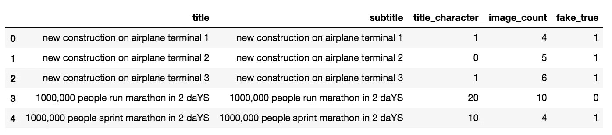
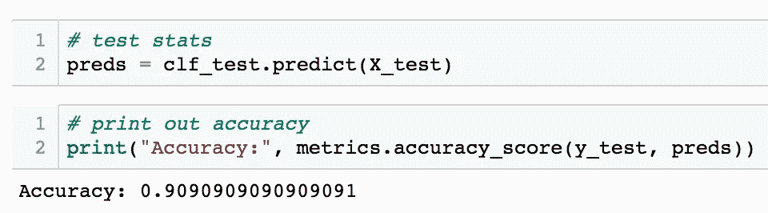
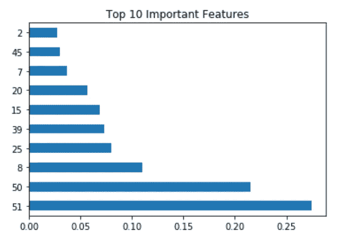

# 开发数据科学模型预测假新闻

> 原文：<https://towardsdatascience.com/developing-a-data-science-model-to-predict-fake-news-184c25a13cb8?source=collection_archive---------30----------------------->

## 使用随机森林、GridSearchCV、Python 和 NLP 进行假新闻检测


[freestocks](https://unsplash.com/@freestocks?utm_source=unsplash&utm_medium=referral&utm_content=creditCopyText) 在[Unsplash](https://unsplash.com/s/photos/twitter?utm_source=unsplash&utm_medium=referral&utm_content=creditCopyText)【1】上拍摄的照片。

# 目录

1.  介绍
2.  探索性数据分析
3.  特征工程
4.  模型
5.  准确(性)
6.  特征重要性
7.  摘要
8.  参考

# 介绍

解读一篇新闻文章是否有效可能很困难。作为一名研究数据科学、分析 Vidhya 和数据系列的新作者，我获得了一些直觉，可以发展出一双辨别真假的眼睛。我想用数据科学和机器学习来测试我的理论，而不是纯粹依靠直觉。我编译了 Python 代码，构建了一个随机森林模型来预测一篇文章是否是假的。作为一名数据科学家，我一直对创造力和自动化很好奇——我相信我的文章和关于这个模型的工作结合了科学和艺术的两个方面来预测新闻的有效性。下面，我概述了我为这个模型使用的代码，以及对进一步工作的评论，以及对真正的文章的特征感兴趣的非技术用户的总结。


由[马库斯·温克勒](https://unsplash.com/@markuswinkler?utm_source=unsplash&utm_medium=referral&utm_content=creditCopyText)在[Unsplash](https://unsplash.com/s/photos/fake-news?utm_source=unsplash&utm_medium=referral&utm_content=creditCopyText)【2】上拍摄。

# 探索性数据分析

这个模型中使用的数据集是从我的虚拟数据中创建的。我正在使用一些常见文章的特征或特性，并试图预测它们是否是假的。在我的情况下，false 是由预先确定的标签决定的，true 也是如此。出于本教程的考虑，这些数据是从我自己的文本中随机生成的。这种数据和模型的伟大之处在于，它可以被缩放和重新定义，比如你从更多的来源收集了几篇文章，你的标签可以是来自脸书、推特甚至纽约时报的真实世界的文章。现在我们知道了我的目标变量 fake(或 true ),让我们看看我用来构建模型的特性:

*   *标题——文章标题中使用的文字/单词(主要的 20 个理由等等)。)*
*   *副标题——文章副标题中使用的文本/词语(施工区等)。)*
*   *title_characters —(":"，"-"，分割文字的特殊字符)*
*   *图像计数—使用的图像数量*

下面是数据帧的前五行:



返回数据的前几行。作者截图[3]。

# 特征工程

由于该模型中同时使用了文本和数字特征，自然语言处理(NLP)有利于预测。我使用了常见的术语频率逆文档频率矢量器，将文本计数转换为术语重要性的加权矩阵。然后，我为文本特征如*标题*和*副标题*编译了 **TextTransformer** 和**tfidf 矢量器**。接下来，我使用 **NumberTransformerr** 类执行了一个类似的方法，但是针对的是数字特性。最后，我将所有的特征，文本和数字结合在一起。下面使用的[代码](https://gist.github.com/mprzybyla123/768d34e9abfdf7bbed3985f4c53bf919) [3]用于特征工程，NLP，并最终准备/预处理数据，使其能够正确输入到模型中。

```
# use the term-frequency inverse document frequency vectorizer to transform count of text
# into a weighed matrix of term importance
vec_tdidf = TfidfVectorizer(ngram_range=(1,2), analyzer='word', norm='l2')# compile both the TextTransformer and TfidfVectorizer 
# to the text features
title = Pipeline([
                ('transformer', TextTransformer(key='title')),
                ('vectorizer', vec_tdidf)
                ])
subtitle = Pipeline([
                ('transformer', TextTransformer(key='subtitle')),
                ('vectorizer', vec_tdidf)
                ])# compile the NumberTransformer
# to the numeric features
title_character = Pipeline([
                ('transformer', NumberTransformer(key='title_character')),
                ])
image_count = Pipeline([
                ('transformer', NumberTransformer(key='image_count')),
                ])# combine all of the features, text and numeric together
features = FeatureUnion([('title', title),
                      ('subtitle', subtitle),
                      ('title_character', title_character),
                      ('image_count', image_count)
                      ])
```

# 模型

数据科学过程的下一部分，也许是最有趣的部分，是创建一个预测目标变量的模型。在这种情况下，模型是一个随机森林分类器。我创建了一个通用的分类器，然后将所有的特征和分类器统一在一个管道中。我从变量 *y* 中分离出这些特性，并相应地存储起来以备后用。下一步是对数据进行训练-测试分割，同时建立 70:30 的训练和测试规模，然后为再现性引入随机状态。为了了解模型在新数据上的表现，开发这种分割，并最终在完全不可见的数据上进行测试(这将是模型的真实应用)。

下一步是为 **GridSearchCV** 创建一个参数网格进行搜索。该网格用于测试几个列出的参数，并查看哪一个是最好的。对于我的模型，我查看了**n _ estimates**。我创建了一个对象来存储评估器，这是已经创建的管道，其中 **param_grid** ，2 的 **cv** (交叉验证)，1 的 **n_jobs** (为了更快的计算)，1 的 **verbose** (为了查看文本输出)，以及用于模型诊断的 **return_train_score** 。我不仅查看了 **mean_train_score** ，还想看看这个模型在查看带有 **mean_test_score** 的新数据时有多有用。我用**grid _ search . best _ params**找出了哪些参数是最好的，这有助于区分 30 个估计量是最好的。

以下是用于此流程建模部分的代码:

```
# create the classfier from RF
clf = RandomForestClassifier()# unite the features and classfier together
pipe = Pipeline([('features', features),
                 ('clf', clf)
                 ])# split the data into train and test
# isolate the features from the target field
text_numeric_features = ['title', 'subtitle', 
'title_character', 'image_count']y = 'fake_true'X_train, X_test, y_train, y_test = train_test_split(df[text_numeric_features], df[y], 
                                                    test_size=0.30,
                                                    random_state=42
                                                   )# parameter grid to scan through
param_grid = {
     'clf__n_estimators': [10, 20, 30, 40, 50, 100]}grid_search = GridSearchCV(estimator = pipe, param_grid = param_grid, 
                          cv = 2, n_jobs = 1, verbose = 1, return_train_score=True)grid_search.fit(X_train, y_train)grid_search.cv_results_['mean_train_score']grid_search.cv_results_['mean_test_score']grid_search.best_params_clf_test = grid_search.best_estimator_
```

# 准确(性)

也许数据科学建模过程中最令人满意的部分是看到您的结果。我在我的 **X_test** 上预测并将其分配给 preds。我使用 **metrics.accuracy_score** 来确定我的准确性。

> 我的模型准确率是 91%



看看这个模型的准确性。作者截图[3]。

要使用引用的代码，请参见以下内容:

```
# test stats
preds = clf_test.predict(X_test)# print out accuracy
print("Accuracy:", metrics.accuracy_score(y_test, preds))
```

# 特征重要性



最重要的功能(字数/计数栏数)。作者截图[3]。

在非数据科学词汇中，特征重要性是指数据集的哪些部分对于预测响应变量非常重要，或者在这种情况下，一篇文章的特征是重要的，以及它们有多重要。因为这个模型是新的，而且数据很少，我看了看绘制最高的特征(*大部分是文本*)，因为使用的特征都很重要。

我调用了**grid _ search . best _ estimator _**来返回一篇虚假文章的特征重要性。在数据框架中，有几个词不会导致一篇假文章。然而，有很多有助于确定一篇假货。重要词汇包括:

*   *文章正文— 1000，000(格式错误的数字)*
*   *图像计数—一篇文章 20 张图像(过高)*

以下代码用于特征重要性分析:

```
pd.DataFrame(grid_search.best_estimator_.named_steps["clf"].feature_importances_)importances = list(zip(grid_search.best_estimator_.named_steps["clf"].feature_importances_, df.columns))
importances.sort(reverse=True)print(grid_search.best_params_)
print(grid_search.best_score_)feature_importances = grid_search.best_estimator_.named_steps["clf"].feature_importances_feat_importances = pd.Series(grid_search.best_estimator_.named_steps["clf"].feature_importances_, 
                             #index=df.columns
                            )
feat_importances.nlargest(10).plot(kind='barh')
plt.title("Top 10 Important Features")
plt.show()
```

# 摘要

对于任何数据科学模型和数据集，重要的是要注意，没有一个特征是预测的主要原因，或者在这种情况下，如果一篇文章是假的。正是它们的结合创造了一篇或真或假的文章。虽然我的分析和模型很擅长预测，但最擅长的是根据我自己的数据进行分类。要改变这种模式，除了收集各种真假文章进行训练之外，不需要做太多的工作。一篇文章的关键属性是:

*   *文章标题、文章副标题、文章特殊字符和图片数量*

将来要测试的其他字符包括:

*   *正文、画质、图像分类(照片是什么？)、读者数量、星期几、一天中的时间、照片或代码的位置、字母的大小写以及其他一些信息*

我希望这篇文章既有趣又有用，并为您提供了一些关于如何对假新闻进行分类的想法，以及构建您自己的数据科学模型的想法和代码。

对于我的模型中使用的所有代码，请参见下面的[要点](https://gist.github.com/mprzybyla123/768d34e9abfdf7bbed3985f4c53bf919)【4】:

GitHub [要点](https://gist.github.com/mprzybyla123/768d34e9abfdf7bbed3985f4c53bf919)作者使用的代码【4】。

# 参考

[1]， [Unsplash](https://unsplash.com/s/photos/twitter?utm_source=unsplash&utm_medium=referral&utm_content=creditCopyText) ，(2016)

[2] [马库斯·温克勒](https://unsplash.com/@markuswinkler?utm_source=unsplash&utm_medium=referral&utm_content=creditCopyText)在[Unsplash](https://unsplash.com/s/photos/fake-news?utm_source=unsplash&utm_medium=referral&utm_content=creditCopyText)(2020)

[3] M.Przybyla，截图(2020 年)

[4] M.Przybyla，[要点](https://gist.github.com/mprzybyla123/768d34e9abfdf7bbed3985f4c53bf919) (2020)

sklearn， [sklearn](https://scikit-learn.org/) (2020)

熊猫，[熊猫](https://pandas.pydata.org/) (2020)