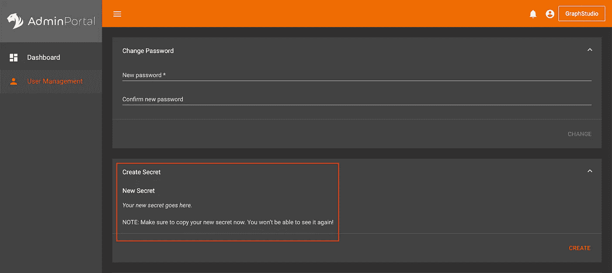
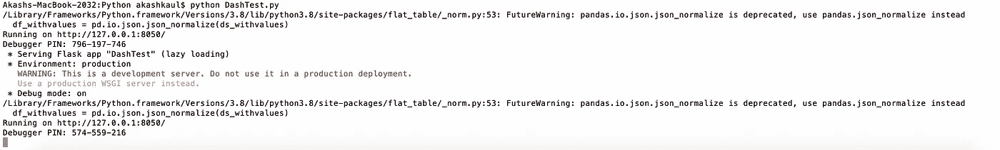
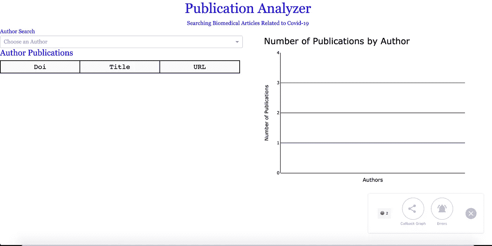
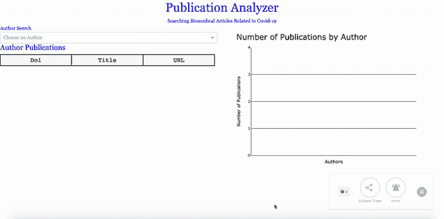

# 使用 Plotly Dash & TigerGraph 开发新冠肺炎文章的动态作者搜索(第 4 部分)

> 原文：<https://towardsdatascience.com/developing-a-dynamic-author-search-of-covid-19-articles-using-plotly-dash-tigergraph-part-4-34e240882a06?source=collection_archive---------51----------------------->


[船员](https://unsplash.com/@crew?utm_source=unsplash&utm_medium=referral&utm_content=creditCopyText)在 [Unsplash](https://unsplash.com/s/photos/search-computer?utm_source=unsplash&utm_medium=referral&utm_content=creditCopyText) 上拍照

# 议程

1.  背景
2.  安装和导入软件包
3.  建立与 TigerGraph 的连接
4.  排序数据
5.  创建应用程序
6.  创建 Plotly 图像
7.  建立布局和元素
8.  配置用户输入
9.  运行应用程序
10.  后续步骤

# 1.背景

[CORD-19](https://www.kaggle.com/allen-institute-for-ai/CORD-19-research-challenge) 是一个巨大的开源新冠肺炎文章数据库。该数据集最初是作为数据分析师收集有意义的信息的挑战而创建的，这些信息可以回答关于该病毒的一些未解决的问题。虽然我没有参加那个挑战，但我发现数据库是一个有趣的工作工具，于是我开始研究和实践计算机科学中的新课题，并将它们应用于这些数据。

这是一个系列的第 4 部分，详细介绍了我为创建一个完整的端到端应用程序而采取的所有步骤，该应用程序分析 CORD-19 数据集的元数据。在第 1 部分的[中，我们看了如何使用 scispaCy，一个为医学数据设计的 NLP 工具，从研究论文的摘要中提取关键词。在](/using-scispacy-for-named-entity-recognition-785389e7918d)[第 2 部分](/linking-documents-in-a-semantic-graph-732ab511a01e)中，我们看到了如何使用 TigerGraph Cloud 在图形中建模我们的数据及其相互联系。在第 3 部分的[中，我们介绍了如何编写查询来有效地搜索和提取图表中的数据。在本系列的最后一部分，我们将探索使用我们的图形查询来提取数据，并使用 Python 库 Plotly 和 Dash 可视化地表示这些数据。](/graph-query-searches-part-3-a8bff845c3f1)

这个项目的完整代码可以在我的 GitHub 页面上找到。

# 2.安装和导入我们的包

我们有相当多的软件包需要安装和导入。要安装软件包，请从终端执行 pip 安装。

```
pip install package_name
```

然后，无论您在哪里编写代码(我使用了 [Atom](https://atom.io/) ，导入以下包。

*在 Google Colab 这样的在线平台上运行 Dash 相当困难，所以我建议把所有东西都写在本地。*

# 3.连接到 TigerGraph 云

我们使用 pyTigerGraph 连接到 TigerGraph 云，pyTigerGraph 是由 Parker Erickson 制作的 python 包。他在 Medium 上写了一些令人惊叹的文章，你可以在这里查看[。要连接到 Cloud，我们需要输入域名、图名和一个 API 令牌(为了保护我自己的图的隐私，我没有包括它)。](https://medium.com/@parker.erickson)

要获得自己图形的令牌，请进入 TigerGraph Cloud 上的**管理**门户，然后选择**创建秘密**。



tigergraph 管理页面

一旦创建了您的秘密，您就可以使用以下代码获得您的令牌:

一旦您的连接建立，我们可以运行我们的查询。

为了运行我们的查询，我们输入查询名称、参数、超时时间和大小限制。你可以在 pyTigerGraph [这里](https://parkererickson.github.io/pyTigerGraph/QueryFunctions/)看到这个函数和所有其他函数的完整文档。

我们正在运行两个查询。第一个获取数据库中所有作者的列表。查询代码如下所示:

```
CREATE QUERY AuthorSearchDash() FOR GRAPH MyGraph {   
/* This querry grabs all authors in our database */ SumAccum<INT> @pubNum; ListAccum<VERTEX> @pubList; Seed={AUTHOR.*}; Author = SELECT a                         FROM Seed:a-()-:t                                      ACCUM a.@pubNum +=1, a.@pubList +=t              ORDER BY a.@pubNum DESC; PRINT Author;
}
```

第二个查询获取我们所有的出版物。该代码如下所示:

```
CREATE QUERY GrabPubs() FOR GRAPH MyGraph {   
/* Grab all publications with their relevant information */ Seed = {PUBLICATION.*}; Pubs = SELECT s                        FROM Seed:s -() - :t; PRINT Pubs[Pubs.id, Pubs.pub_title, Pubs.pub_url];
}
```

要进一步了解在 TigerGraph Cloud 中编写 GSQL 查询，请参考本系列的第 3 部分。

# 4.整理我们的数据

导入数据后，我们现在需要对其进行排序，使其更易于管理。我们使用 pandas 将数据存储为数据帧。然后，我们使用 flat-Table 来标准化我们的数据。最后，我们将数据分类到列表和字典中，以提供更快的查找。

*由于我们的应用程序是动态的，它需要连续查找数据。如果数据存储在列表或字典中，这比存储在数据帧中要快得多。*

# 5.创建我们应用程序的实例

我们使用之前导入的 Dash 包实例化我们的应用程序。我们还指定了要使用的样式表。顾名思义，样式表是应用于仪表板的样式和布局的集合。我们使用 Bootstrap 框架，因为它允许我们方便地配置我们的应用程序布局。

我们还在这里创建了两个字典。这些将在稍后用于创建我们的条形图的颜色。

# 6.创建一个空的 Plotly 条形图

接下来，让我们创建图表。我们现在只是创建一个空白图表，因为当用户与仪表板交互时，图表会更新。我们使用 Plotly Express 制作条形图。图表中的 x 轴代表作者的姓名，而 y 轴代表每位作者的出版物数量。

# 7.建立我们的布局和元素

这是我们代码的核心所在。Dash 的工作原理是模仿你的网站的 HTML 结构。如果你没有 HTML 的经验，不要惊慌。我之前没有任何经验，仅仅通过查看 [Dash 文档](https://dash.plotly.com/)就能学到很多东西。而且，如果你以前有过 HTML 的经验，这应该看起来很熟悉。

让我们浏览一下这个仪表板的结构。我们从包含仪表板中所有内容的父 Div 开始。然后，我们为标题和副标题添加两个组件。然后，我们使用 Dash Bootstrap(还记得我们之前导入的样式表)创建一个包含两个等宽列的行。在左栏中，我们有一个包含作者列表的下拉列表，一个显示出版物数量的 div，一个显示出版物列表的 div。在右栏，我们有我们的图表。

# 8.用用户输入更新我们的用户界面

现在，我们已经完成了仪表板布局。但是，为了使它动态，我们需要添加回调。回调允许我们从特定的容器(比如下拉菜单)获取输入，执行一些操作或更新，并将结果输出到其他容器。我们使用了三个回调函数，每个回调函数对应一个我们输出数据的容器。

## 更新我们的表格

这个回调从 dropdown 容器中获取输入(因此输入是作者的名字),并打印出与该作者对应的文章表。这些出版物以及它们的细节都来自我们之前制作的字典。

## 更新我们的数字字段

这是最简单的回调。我们只需从下拉列表中取一个作者的名字，并打印相应数量的出版物。由于我们在开始时创建了字典，这变得特别容易。

## 更新我们的图表

我们的第三次回调用我们刚刚选择的作者的新条形图更新了条形图。我们在 Plotly 中用 **add_trace** 函数添加了这个条。每当向图形中添加跟踪时，该跟踪都会收到自己的图例图标。为了防止这种情况，我们创建了 **legendgroups** ，并使用一些操作来只显示还没有显示的组。

# 9.运行我们的仪表板

我们通过在本地服务器上运行应用程序来结束我们的代码

有了这两行代码，我们的程序就完成了。要运行代码，打开终端，切换到代码所在的目录，然后运行 python 脚本。**运行前，确保您的图形解决方案已启动。**

```
cd location/where/code/is/located
python app_name.py
```

调用脚本后，需要一段时间来加载。最终加载后，您应该会看到如下所示的内容:



终端输出

打开 URL，您应该会看到这个屏幕。



仪表板图像

就这样，你可以看到你辛辛苦苦建立的仪表板！但是，现在不要停止。试一试，看看我们已经实现的所有功能。



仪表板使用示例

# 10.后续步骤

这是我第一次处理 Plotly 和 Dash。我知道代码有很大的优化和定制空间，这个我就留给你了。但是，在微调运行时和使仪表板在视觉上更有吸引力(我认为美学显然不是我的强项)的过程中，您还可以添加更多的交互式模块。最好的部分是我们已经写好了查询。如果您参考本系列的第 3 部分,我们编写了这里没有实现的多个查询。特别是，在这个仪表板中实现查询查找相似的出版物和查询查找引用给定关键字的顶级出版物是非常有趣的。我希望有一天能自己解决这些问题，但我也希望你们也能这样做。或者，进一步编写一些新的查询，提取其他有用的数据进行显示。

# 结论

到此，这个简短的系列就结束了。这是一段不平凡的旅程。我们首先使用 NLP 从我们收集的新冠肺炎文章中提取数据。然后，我们将数据映射到一个图表中，并学习如何编写查询来搜索数据。最后，我们学习了如何在后端实现查询来创建可视化用户界面。感谢您和我一起探索数据科学中一些非常酷的话题。我希望你已经学到了一两件可以应用到你正在做的任何事情上的东西，无论是一个有趣的小项目还是一个全面的应用程序。感谢阅读，敬请关注未来更多文章！

# 资源

1.  [https://www . ka ggle . com/Allen-institute-for-ai/CORD-19-research-challenge](https://www.kaggle.com/allen-institute-for-ai/CORD-19-research-challenge)
2.  [https://towards data science . com/using-scispacy-for-named-entity-recognition-785389 e 7918d](/using-scispacy-for-named-entity-recognition-785389e7918d)
3.  [https://towards data science . com/linking-documents-in-a-semantic-graph-732 ab 511 a01e](/linking-documents-in-a-semantic-graph-732ab511a01e)
4.  [https://towards data science . com/graph-query-searches-part-3-A8 BFF 845 C3 f1](/graph-query-searches-part-3-a8bff845c3f1)
5.  [https://github . com/akash-Kaul/Dash-Publication-visualizer . git](https://github.com/akash-kaul/Dash-Publication-Visualizer.git)
6.  [https://atom.io/](https://atom.io/)
7.  [https://medium.com/@parker.erickson](https://medium.com/@parker.erickson)
8.  [https://Parker Erickson . github . io/pyTigerGraph/query functions/](https://parkererickson.github.io/pyTigerGraph/QueryFunctions/)
9.  【https://dash.plotly.com/ 

[](https://github.com/akash-kaul/Dash-Publication-Visualizer) [## akash-Kaul/Dash-出版物-可视化工具

### 使用 Plotly 和 Dash-akash-Kaul/Dash-Publication-Visualizer 对新冠肺炎文章进行动态作者搜索

github.com](https://github.com/akash-kaul/Dash-Publication-Visualizer) [](https://www.linkedin.com/in/akash-kaul-6a8063194/) [## 阿卡什·考尔-数据科学实习生-未来学家学院| LinkedIn

### 查看阿卡什·考尔在全球最大的职业社区 LinkedIn 上的个人资料。阿卡什有 5 个工作列在他们的…

www.linkedin.com](https://www.linkedin.com/in/akash-kaul-6a8063194/)