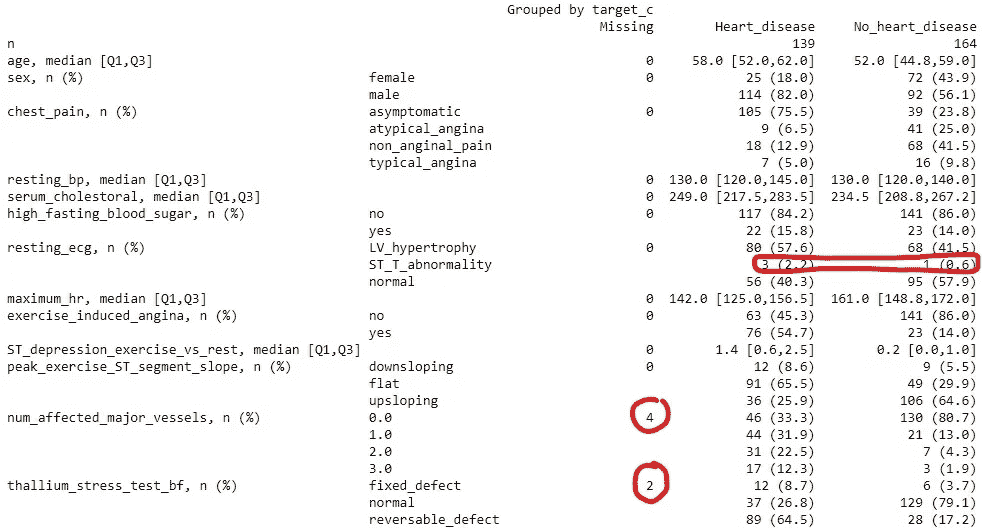
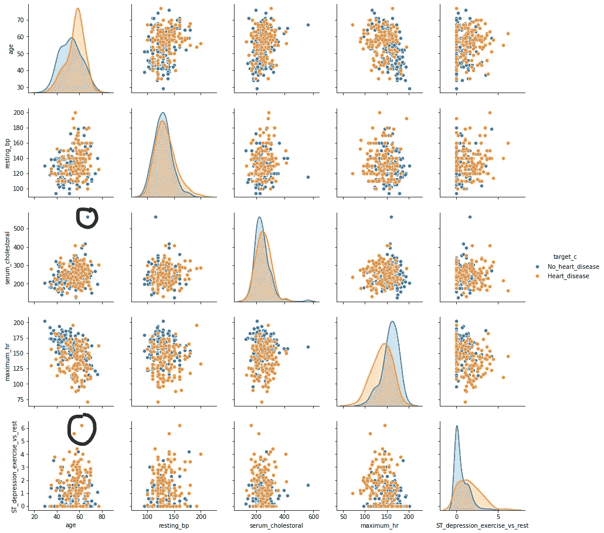
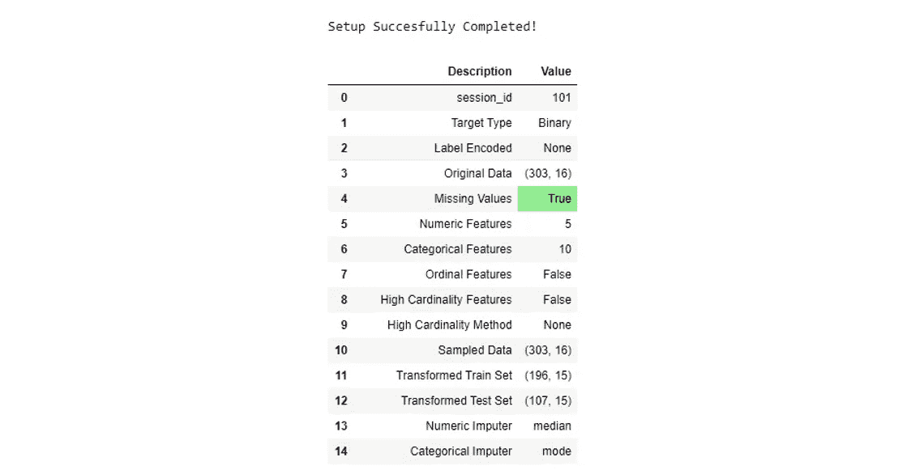
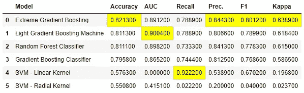
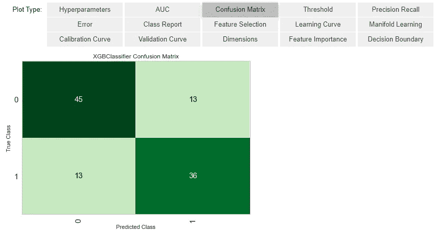
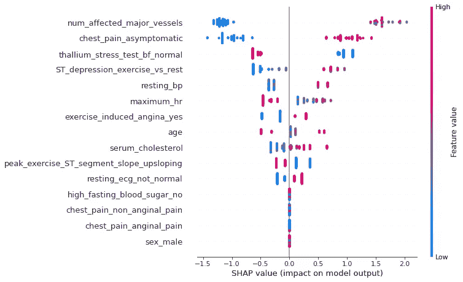
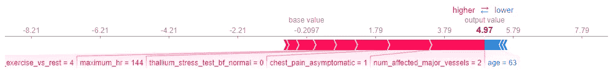
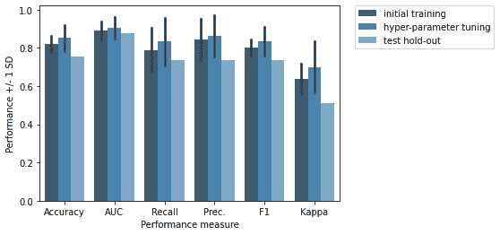
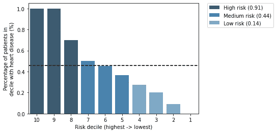

# 使用 PyCaret 开发心脏病预测模型

> 原文：<https://towardsdatascience.com/developing-a-model-for-heart-disease-prediction-using-pycaret-9cdf03a66f42?source=collection_archive---------46----------------------->


来源:Adobe Stock(许可证编号 262173764)

# 背景

在一个发达的专业数据科学环境中，你可能可以访问 AWS、GCP、Azure 或其他平台或软件，并使用工具来进行实验设置、跟踪和记录。但是，如果你只是想让一个试点项目启动并快速运行，或者你正在做一个研究项目呢？这就是 py caret([https://pycaret.org/](https://pycaret.org/))快速系统地做实验的能力可能派上用场的地方！

PyCaret 是什么？它的创建者将其描述为“…开源的、**低代码的**Python 机器学习库，允许你在几秒钟内从准备数据到在你选择的笔记本环境中部署你的模型。”任何能让你在内容上花更多时间并最大化影响的东西都是好的，对吗？

在下面的例子中，我们将开发、评估和检验一个使用 PyCaret 预测心脏病的模型。因为这是我第一次使用 PyCaret，所以我也将在最后提供一些想法和第一印象。一如往常，在任何涉及健康的示例应用中，关联、推论和评论绝不构成医疗建议或专业知识。用于支持本文的笔记本和其他材料可以在我的 Github 上获得([https://Github . com/Jason-Bentley/medium _ articles/tree/master/heart _ disease _ py caret](https://github.com/jason-bentley/medium_articles/tree/master/heart_disease_pycaret))。

# 数据

克利夫兰诊所处理过的心脏病数据集([https://archive.ics.uci.edu/ml/datasets/heart+Disease](https://archive.ics.uci.edu/ml/datasets/heart+Disease))包含 13 个特征和 303 名患者的结果。当分为两类时，结果表明患者是否患有心脏病，并且是感兴趣的目标。总体而言，队列中 45%的患者患有某种程度的心脏病，因此我们的目标是平衡的。

对于我们的简略探索性数据分析(EDA)，我们将比较有心脏病和无心脏病患者的特征，并使用图(图 1 和图 2)更详细地查看连续特征。



图一。队列表



图二。连续特征的绘图

来自 EDA 的指示是我们可能期望的。患有心脏病的患者更可能是老年人、男性、无症状胸痛、较高的血清胆固醇、较低的最大心率、运动诱发的心绞痛、运动期间与休息时相比较高的 st 段压低、平坦或向下倾斜的运动 ST 段峰值斜率、受影响的主要血管以及通过铊负荷试验识别的血流缺陷(固定或可逆)。

我们在预处理时需要考虑 EDA 的一些观察结果:

1.  连续(通过荧光镜检查确定的血管计数)和分类特征(铊负荷试验心脏血流)的一些缺失值。
2.  ST-T 异常的静息心电图结果在整个队列中只有 4 例——这是一个罕见的水平，我们可以将其与另一个水平相结合，或者您可以将其视为一个低方差的特征。我们可能还想结合其他功能的水平。
3.  一些潜在的异常值，一个没有心脏病的患者的血清胆固醇水平高于 500，心脏病组中的两个患者的 ST 段压低值> 5。

# 实验装置

我结合了一些类别(胸痛的典型和非典型心绞痛；静息心电图 ST-T 异常与左心室肥厚:峰值运动 ST 段斜率平缓或下降；血流铊负荷试验中的固定缺陷和可逆缺陷)并将运动期间的血清胆固醇和 st 下降调整至 99.5 百分位，以解决上述第 2 点和第 3 点。

修改后的数据通过 **setup()** 功能成为实验的基础。该功能有大量输入，因为它创建了一个数据处理管道，涵盖许多常见任务，如转换、归一化、插补等。完整的列表可以在这里找到(【https://pycaret.org/preprocessing/】T2)。

在实验设置中，我们将使用 65%的数据进行训练。为了解决缺失值，我们将数值和分类特征的插补方法分别设置为中位数和众数。运行时，我们首先确认分类变量和数字变量的名称。然后创建管道的其余部分，实验设置完成，生成一个漂亮的汇总表，突出显示管道的各个方面(图 3)。



图 3。实验设置包括确认特征类型，然后生成管道汇总表(截断)。

我们可以看到，我们保留了原始数据中的所有观察值(如果我们选择使用 PyCaret 来过滤离群值，那么与原始数据相比，采样数据中的观察值数量会更少)。使用我们的 65%训练 35%测试分割，我们分别有 196 和 107 个观察值。总共有 15 个特征(5 个数字特征和 10 个分类特征)。第 4 行中突出显示的部分表示检测到缺失数据，第 13 行和第 14 行表示我们对这些数据进行估算的选择。

重要的是，这个设置对象构成了所有后续工作的基础。模型开发的许多后续函数调用会将结果保存为实验对象的一部分，以便可以随时访问它们，而且还可以保存整个过程。例如，实验对象包含用于采样、训练和测试特征矩阵以及目标向量的单独项目。

# 模型开发

设置完成后，为了快速识别一组好的候选模型，我们使用 **compare_models()** 。这使用默认超参数来评估不同的分类模型，并使用 10 重交叉验证来评估训练数据中的性能。有 18 种可能的分类器可用，但为了好玩，让我们将自己限制在一些增强方法(梯度，极端和轻)，两种风格的 SVM(线性，径向基)和随机森林。 **compare_models()** 的输出很好地总结了被评估者的六个常用分类器指标(图 4)。



图 4。compare_models()的输出

理想情况下，我们会选择最佳候选模型，并在调整后选择最终选项。然而，为了简单起见，鉴于我们的极端梯度推进模型是一个很好的准确性候选，让我们继续这样做。如果我们想查看上表中所选分类器的 CV 结果，我们可以使用 **create_model()** 函数为一个特定的模型创建一个对象。

超参数调优是使用 **tune_model()** 函数完成的，这稍微提高了性能(图 5)。例如，精确度从 0.82 提高到 0.85。请注意，如果你看引擎盖下，随机网格搜索与 10 次迭代正在使用。当然，可以使用更多的迭代，甚至是不同的方法，例如 hyperopt，但是为了本文的目的，我们将继续查看模型。


图 5。调整后候选模型的性能

**evaluate_model()** 函数提供了一个交互式单元格输出，其中包含许多常用的有用图表和摘要。可用性可能取决于您正在评估的模型，但是大多数对于所有模型都是通用的，并且代表了我们在评估模型时想要的一组良好的标准输出。交互式单元格如下所示，其中灰色框中的每个选项都可以在笔记本中点击。查看我们的混淆矩阵作为示例输出(图 6)，我们可以看到在测试集中我们有 45 个真阴性，36 个真阳性，以及 13 个假阳性和假阴性的实例，这给了我们 76%的准确率。



图 6。evaluate_model()中调优模型的混淆矩阵

为了理解是什么特征驱动了模型的心脏病预测，通常使用 SHAP 值([https://shap.readthedocs.io/en/latest/](https://shap.readthedocs.io/en/latest/))。PyCaret 允许我们使用函数 **interpret_model()** 创建选定的基于 SHAP 的输出，以便更好地理解我们的模型。



图 7。SHAP 值汇总图

对于我们的模型，三个主要因素(图 7)是受影响的主要血管的数量，其中最低值(0)降低了预测风险，无症状胸痛(如果存在)增加了预测风险，铊负荷试验表明正常血流(高值)降低了预测风险。我们还可以看到一些似乎对预测风险没有影响的因素:空腹血糖高、胸痛(心绞痛或非心绞痛)和性别。

为了更深入一点，我们可以看看在我们的测试集中，特征对患者的预测风险评分的贡献(图 8)。



图 8。对高风险患者的预测贡献

与基础风险评分(平均模型输出= -0.21，概率= 0.45)相比，该患者的高度 ST-T 抑制、最大心率、铊负荷试验的血流缺陷、无症状胸痛和 2 条受影响的主要血管均导致心脏病的高预测风险评分(4.97，概率= 0.99)。

使用 **predict_model()** 函数，我们可以使用拒绝集来检查性能。性能比训练 CV 差一点，所以我们可能有点过度拟合，但也可能更差(图 9)。另外，通过适当的超参数调整，我们也可以克服这个问题。



图 9。我们所选模型的保留集性能与训练数据中的默认和调整模型性能的比较

最后，为了在实践中使用这个模型，我们可能还希望将预测的心脏病可能性分组，以便我们可以定义要采取的一系列行动。一种方法是根据预测的风险十分位数，在测试组中绘制心脏病发病率图。我们设定阈值的位置取决于具体情况，需要具备专业的临床知识并了解收益与成本。由于这是一个例子，我掩饰这一点。目测之后，我们假设有三个不同的风险组(低、中、高)，每个风险组都有不同的跟进措施。



图 10。根据预测的风险十分位数，测试组的心脏病发病率。虚线是队列中的总体风险(0.45)

读者可能已经注意到上面的输出缺少 Python 代码。那么，在我自己准备数据并生成上面的一些自定义数字之后，设置数据管道、使用 CV 识别候选模型并对其进行调优、评估和解释，以及最终评估保留测试集的性能，到底需要多少 PyCaret 代码呢？这就是，7 个功能，最少的输入！

```
# experiment set-up
exp1 = setup(hd_df,
             train_size=0.65,
             target='target',
             session_id=101,
             ignore_features=['num', 'target_c'],
             numeric_imputation = 'median',
             categorical_imputation = 'mode')# find a good candidate model
compare_models(blacklist=['lr', 'lda', 'qda', 'et', 'catboost', 'ada', 'ridge', 'dt', 'nb', 'gpc', 'knn', 'mlp'],
               fold=10,
               turbo=False)# tune the candidate model - you can skip create_model as this is called as part of tune_model anyway
tuned_model = tune_model('xgboost')# evaluate
evaluate_model(tuned_model)# SHAP-based feature importance and understanding of prediction
interpret_model(tuned_model)
interpret_model(tuned_model, "reason", observation=94)# performance in hold-out test set
predict_model(tuned_model)
```

# 摘要

这是我第一次尝试使用 PyCaret，虽然仍然有大量的文档需要完成，但我的第一印象是它太棒了！它真的让我可以很快地了解我想了解的细节，文档和可用的教程都很有帮助。

正如我们看到的实验设置，找到一个模型，调整，评估和检查当然是低代码。低代码当然并不意味着在数据理解、数据清理和功能工程方面跳过尽职调查，但是 PyCaret 方法意味着你可以在这些事情上花更多的时间。

当然，任何低代码解决方案都需要权衡灵活性。以下是我的一些观察:

1.  在实验设置中，您不能选择仅应用于选定特征的预处理选项，并且并非所有可能性都可用。例如，不能对单个要素应用法线变换，也不能设置阈值来修剪要素以减少异常值。
2.  您需要检查构造的管道对象，以了解预处理步骤的执行顺序。生成管道流程图表示的功能可能是一个奇妙的未来附加功能。
3.  允许超参数调整的不同方法的灵活性将是很大的，例如访问 hyperopt 的简单方法。我确实自己尝试了一些实验，在实验对象之外使用 hyperopt，然后将这些参数传回到模型摘要中是可能的(但是很笨拙)。
4.  包含 SHAP 值的函数是很棒的，但是这种功能没有扩展到通过标准 SHAP 库提供的全套可视化。例如，通过 link='logit '参数传递单个力图的多患者力图，或者选择用于相关性图中交互项的变量，都不能通过 **interpret_model()** 获得。然而，您可以从实验对象中获取模型对象和测试数据，并自己进行 SHAP。
5.  您可以通过实验对象访问的内容有些随意，您可能需要稍微搜索一下您想要的内容，或者您可能需要检查实际的函数(即，您选择的估计器的调整模型中使用的参数网格)。然而，这些可以被访问，因此可以创建模型开发的定制摘要/可视化，并且希望在未来的更新中，从引擎盖下获得您需要的东西可能会更加用户友好。
6.  该结构引导用户遵循适当的标准化工作流程来开发预测模型。
7.  将最终模型和整个实验作为单独的对象保存的能力对于部署和可再现性来说是非常重要的。
8.  虽然我能够提取信息并创建自己的总结，例如初始训练、调整和保持之间的性能指标，但从实验对象创建这种性质的总结报告的功能将是非常棒的。

在未来，我希望更多地利用 PyCaret 来处理更大的数据集，其中高基数特性的内置处理会非常有用。一如既往，欢迎评论、想法、反馈和讨论。