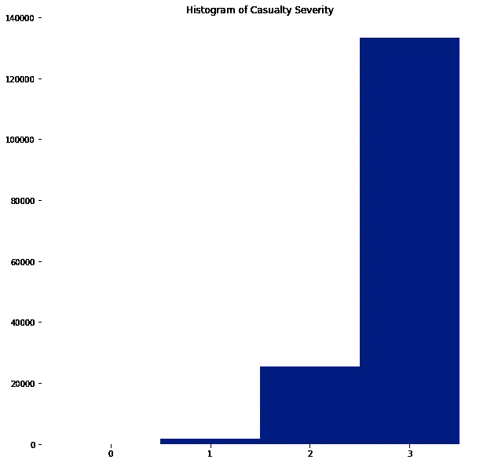

# 开发机器学习管道

> 原文：<https://towardsdatascience.com/developing-machine-learning-pipelines-2881e50fc5e4?source=collection_archive---------11----------------------->


## *在数据科学领域，你的表现取决于你构建工作的方式*

E 即使最有经验的数据科学家也不总是熟悉开发机器学习管道的最佳实践。对于应该包括哪些步骤，它们的顺序应该是什么，以及总的来说，如何确保您创建的见解是准确和有价值的，存在很多困惑。描述实用和正确方法的好资源也非常有限。

**然而，在许多数据科学项目之后，你开始意识到构建管道的方法总是相同的。**

机器学习管道是模块化的，根据情况，可以添加或跳过一些步骤。你有分类变量吗？添加代码对它们进行一次性编码。你有丢失的数据吗？引入一些代码来估算它们。

为了给出更实用的方法，您可以在我的 [Github](https://github.com/ezuccarelli/Medium/tree/master/Developing%20Machine%20Learning%20Pipelines) 上找到一个示例管道。这个例子旨在开发一个预测模型，用于估计驾驶员发生严重事故的风险。

# 1.商业问题

任何机器学习管道都是从最重要的一步开始的，这根本不是机器学习，而是**商业问题**。在对我们要实现的目标进行彻底讨论之前，机器学习不应该发挥作用。

所有利益相关者都应该参与到这样的对话中，尤其是业务团队和最终用户。应该仔细倾听他们的目标，在整个项目过程中，应该始终牢记他们的需求和目标。因为，说到底，做机器学习是没有意义的，不管它有多性感，除非它能解决利益相关者的问题。你应该问你的利益相关者:这个项目的动机是什么？有哪些痛点？结果将如何被使用？

即使在这些问题得到回答之后，立即开始编写机器学习模型也是错误的。有没有更容易、更务实、更有效的解决方案来实现你的利益相关者的目标？我们能否使用描述性统计或更容易使用的工具，如 Excel？当且仅当答案是否定的，我们才能继续下一步。

# 2.翻译需求

一旦同意 ML 是正确的方法，下一步就是将目标、难点和限制转化为技术需求。换句话说，您需要将业务需求转化为易于应用于标准建模技术的东西。如果你的利益相关者寻求一个实数的预测，那么使用回归模型；如果您必须预测有限的一组值，分类模型是最合适的解决方案。

# 3.数据收集

没有数据，任何机器学习项目都不可能成功。要保证项目的成功，需要获得足够多的高质量样品。更具体地说，像线性回归或逻辑回归这样的算法即使只有几百个观察值也能很好地工作，而更复杂的算法，从 CART 到神经网络，至少需要几千个。

就质量而言，来自自动化、不灵活系统的数据，在没有人为干预的情况下，将更适合机器学习应用。例如，应该避免自由文本字段。如果数据收集设置是数据科学家创建的 Google 表单，下拉列表比自由文本框更受欢迎。

然而，总的来说，每个数据科学家都应该接受这样的事实:数据将会是杂乱的，手工输入的，充满了缺失的数据。这只是工作的一部分。

# 4.数据加载

数据集最常见的格式通常是 CSV 和 Excel 文件。要加载数据，您可以使用:

```
vehicles = pd.read_csv(‘Data/Vehicles.csv’, low_memory=False)
casualties = pd.read_csv(‘Data/Casualties.csv’, low_memory=False)
accidents = pd.read_csv(‘Data/Accidents.csv’, low_memory=False)
```

也就是说，如果您可以从数据库中获取数据，这将是首选。数据库被配置为保持完整性，这意味着只允许通过完整性检查的数据。此外，数据库维护跨表的关系，同时易于更新。这样做，脚本可以通过编程从相同的源中提取数据，这保证了数据的一致性。为此，请使用适合各种 SQL 的 Python 库。例如，要连接到 PostgreSQL 数据库，您可以使用 *psycopg2* 库。要建立连接:

```
con = psy.connect(host=<Database Address>,
                  user=<Username>,
                  password=<Password>,
                  dbname=<Database Name>)
```

一旦建立了连接，就可以使用*熊猫:*轻松获取数据

```
pd.read_sql('select * from tbl_vehicles', con)
```

# 5.探索性分析

一旦数据加载到内存中，熟悉它们是关键。应进行初步探索性分析，以了解数据集的粒度、可用的信息类型和目标变量。

通常要计算的统计数据是每个特征的平均值和标准差，以及突出显示特征分布的直方图。值的范围也是注意异常值的关键。获得最有用的统计数据的一个简单方法是使用:

```
vehicles.head()
vehicles.describe()
```

其中第一行给出了前 *k* 行，而第二行显示了数据的基本统计。

要显示感兴趣特征的分布，您可以使用*熊猫*。hist()函数:

```
casualties.Casualty_Severity.hist()
```



# 6.数据聚合

数据通常不是正确的格式。它可以是不适合任务的粒度，例如在“伤亡级别”而不是“车辆级别”，其中每一行对应一个伤亡。此外，它可以跨多个文件拆分，需要将多个数据集聚合在一起。

为了克服这些限制，我们可以，例如，简单地使用*熊猫的* *groupby* 函数。在本例中，我们做到了:

```
casualties.groupby(['Accident_Index', 'Vehicle_Reference'])['Casualty_Severity'].min().reset_index()
```

这使得我们可以为每辆车只选择最严重的伤亡事故(得分最低)，在“车辆级别”汇总这些信息。

# 7.数据清理

在我们熟悉数据集之后，我们可以开始构建生产管道本身。第一步是处理数据，清除错误和不一致。例如，日期应该在合理的范围内(例如，过去事件的日期不应该在未来)，并且在日期功能中采用一致的格式(例如，我们不应该有一个“mm/dd/yyyy”格式的列和另一个“dd/mm/yyyy”格式的列)。

如果模型在预测一个未来的结果，比如下个月发生车祸的可能性，我们只能考虑所谓的“事前”信息。这些特征是目前已知的，即驾驶员的年龄、通常驾驶的汽车的发动机类型等。同时必须删除所有“事后”信息。这些包括诸如事故地点、天气状况等特征。直到要预测的事件发生后才知道。否则会让我们的模型“窥视未来”，使其无法预测结果。

# 8.特征工程

另一个关键步骤是特征工程。这一步包括从结构化格式的数据中提取信息。例如，我们可以通过从收集驾驶员数据的日期中减去出生日期来得出驾驶员的年龄。这一步可以帮助机器学习算法更好地识别数据中的信号。

## 8.1 处理分类特征

通常教授许多不同的技术来处理分类特征。此类特征的问题在于它们不是数字，因此无法计算量化指标，如数字和类别之间的距离。

对类别进行编码的一种常见方式是将它们映射到数字，只需将相同的数字分配给相同的类别。然而，这种方法是极其有害的，因为它创造了现实中并不存在的关系。例如，如果我们将['汽车'，'摩托车'，'自行车']编码成[1，2，3]，我们基本上是在声明'自行车'是'汽车'的三倍，不管那是什么意思，或者两次'汽车'等于'摩托车'。

更好的方法是一键编码和目标编码。一键编码包括创建额外的二进制特征，每个类别的值一个，如果样本具有这样的值，则假设为 1，否则为 0。这可以通过以下方式实现:

```
pd.get_dummies(data[c])
```

相反，目标编码是用目标变量的平均值替换分类值的过程。这样做，我们基本上可以根据分类变量对目标变量的影响对它们进行排序。

# 9.分割培训、验证和测试

一旦我们有了一个包含相关特征的数据集，我们就可以把它分成训练集、验证集和测试集。通常情况下，训练和验证占 70%的数据，而测试是剩下的 30%。如果有足够的数据，测试集可以减少到 20%，因为样本的数量无论如何都足够多。这种分割通常是随机进行；然而，这个一般规则有几个例外。

第一，在分类问题中，我们经常使用分层抽样。如果少数类的频率明显低于其他类，这一点尤为重要。在这种情况下，如果我们随机选择一个拆分，我们可能会很不幸地没有选择训练集中少数类的任何样本，而是选择测试集中的所有样本，从而大大降低性能。

相反，当使用时态数据时，分割应该按顺序进行。特别地，训练数据应该是时间上排序的数据的最初 70%,而测试集应该是最近的部分。这阻止了模型“展望未来”。

# 10.归罪

只有分割数据集后，我们才能处理丢失的值。如果我们用所有的数据集来估算数据，从技术上来说，我们就是在作弊。我们将用来自测试集的信息填充训练集。正确的方法是仅用训练集拟合插补学习者，然后转换训练集和测试集。

有许多方法可以用来估算缺失数据。最著名的包括计算平均值、中间值或其他常量指标。然而，这些方法通常是要避免的。主要原因是它们完全改变了特征的分布，减少了方差，因为我们增加了多次常数项。此外，他们没有考虑功能之间的关系，一次只关注一个功能。

两个更好的解决方案是 MICE 和 KNN，前者适合一个分布，后者考虑用最接近的邻居来估算数据。为了选择 *K* 的参数，可以使用验证，使用肘方法，增加 *K* 的数量，直到验证集上的性能仅略微增加。

```
lnr = si.KNNImputer()lnr.fit(train_X)train_X = lnr.transform(train_X)
test_X = lnr.transform(test_X)
```

# 11.系统模型化

现在，你可以训练你的模型，但是..你应该选择哪一个？

这在很大程度上取决于我们要完成的任务、样本数量以及我们想要的互操作性水平。在医疗保健和金融等风险较高的领域，了解一个模型为什么会做出预测至关重要。如果模型没有如此强烈的含义，我们可以使用更复杂的黑盒算法，如神经网络。

一般来说，测试的模型应该在可解释性和性能方面有所不同。如果一个更简单的模型达到的性能几乎接近更复杂的模型，同时更容易理解，那么这个模型应该是首选的。

我通常使用的模型有:

*   逻辑回归(或用于回归任务的线性回归)
*   随机森林
*   XGBoost

为了调整此类模型的参数，我们通常执行网格搜索，测试所有参数组合以找到最佳组合。

# 12.性能赋值

为了评估模型的性能，我们可以使用各种度量标准，但是分类和回归任务有两个不同的集合:

对于回归，使用均方误差(MSE)、均方根误差(RMSE)和 R。其中，RMSE 和 R 通常是首选，因为 RMSE 的原始任务单位相同，而 MSE 的单位是平方。如果我们想预测投掷物体的距离，RMSE 会用米(或英里)来计算误差，而 MSE 会用平方米(或平方英里)来计算，这就失去了很多直觉。

对于分类，通常可以计算的指标是准确性、敏感性(或真阳性率)和特异性(或真阴性率)。另一个有用的度量是通过绘制不同阈值下的灵敏度和特异性，获得更全面的图，ROC 曲线(接收器操作特征曲线)。在这些度量中，准确性通常是最常用的度量之一，然而，当类严重不平衡时，它就变成了一个无意义的度量。为了解决这个问题，AUC，即 ROC 曲线下的面积，是通常首选的指标，因为它更可靠。AUC 从 0.5(随机选择)到 1(完全分类)。

# 13.部署

最后，一旦我们对模型的性能感到满意，并且无法实现进一步的改进，我们就可以继续进行最后的步骤。这些包括向利益相关者展示结果，强调性能、特性重要性等。以及在生产中部署模型。要做到这一点，我们可以利用 Amazon Web Services 或 Azure 等平台来托管该模型，并通过前端让最终用户可以使用该模型进行交互。

# 摘要

开发机器学习管道的过程涉及相同的一组步骤:

1.  商业问题
2.  翻译需求
3.  数据收集
4.  数据加载
5.  探索性分析
6.  数据聚合
7.  数据清理
8.  特征工程
9.  分割培训、验证和测试
10.  归罪
11.  系统模型化
12.  性能赋值
13.  部署

*要阅读更多类似的文章，请关注我的* [*Twitter*](https://twitter.com/jayzuccarelli) *，*[*LinkedIn*](https://www.linkedin.com/in/ezuccarelli)*或我的* [*网站*](https://eugeniozuccarelli.com/) *。*