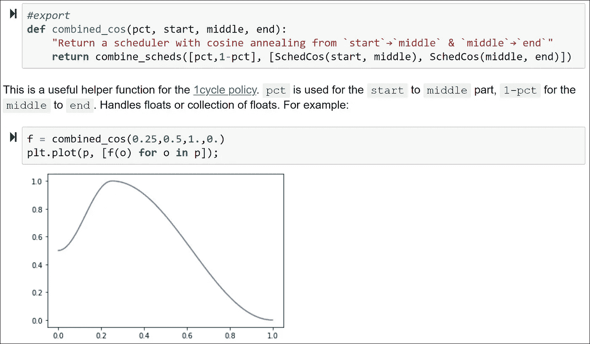
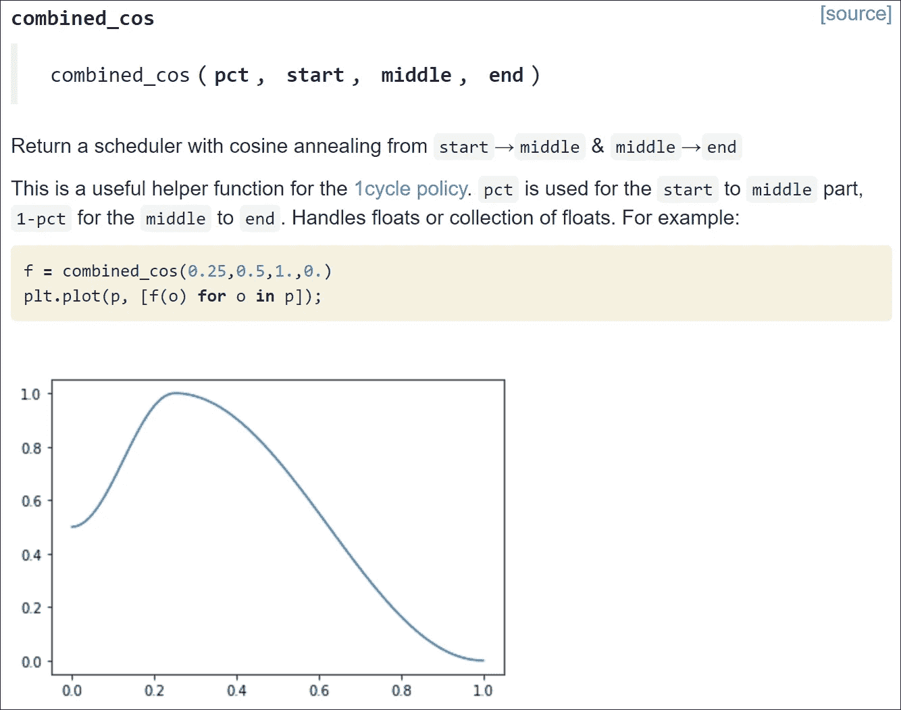

# 为数据科学家开发 Python 库

> 原文：<https://towardsdatascience.com/developing-python-libraries-for-data-scientists-17dc28872f07?source=collection_archive---------52----------------------->

来源: [Pexels](https://www.pexels.com/photo/blur-close-up-code-computer-546819/) (CC0)的 [luis gomes](https://www.pexels.com/@luis-gomes-166706) 。

很大一部分数据科学家每天都使用 Jupyter 笔记本。如果你不熟悉 Jupyter 笔记本，你可能会问，为什么它们这么受数据科学家的欢迎？我对这个问题的回答是因为他们太棒了！Jupyter 笔记本允许交互式编程。有了这些笔记本，除了许多其他功能，您可以轻松地用 markdown 记录您的代码，轻松地查看单元格的输出，以及创建和查看数字。如果你以前从未使用过 Jupyter 笔记本，我强烈建议你尝试一下([这里](/bringing-the-best-out-of-jupyter-notebooks-for-data-science-f0871519ca29)是一篇很好的博客文章，讲述了 Jupyter 笔记本的一些其他酷功能)。这些笔记本是数据科学家和所有科学家的完美之选。它们允许我们轻松地试验创建新的模型，记录我们的试验，并轻松地调试代码。

尽管 Jupyter 笔记本是数据科学家通常用于实验和创建模型的工具，但实现数据科学项目的实际生产代码很少写在笔记本上。通常它们是用 Python 文件编写的(即。py 文件),当在生产环境中工作时，这是一个合理的选择。例如，历史上，Jupyter 笔记本存在一些版本控制问题。这很大程度上与渲染问题有关。一台计算机呈现 Jupyter 笔记本的方式在另一台计算机上可能不同，因此如果两个不同的开发人员在一台笔记本上工作，这可能会出现一些问题。此外，许多软件工程师不熟悉 Jupyter 笔记本电脑，因此在数据科学家和软件工程师的团队中，软件工程师不太可能想要参与和维护写在笔记本电脑中的生产代码(不是说没有例外！).但这真的很丢人！Jupyter 笔记本非常适合记录和讲述一个图书馆是如何发展的故事。我还发现在 Juptyer 笔记本上编码时，调试代码更容易，最重要的是实验！

不要害怕！随着 fast.ai 团队开发的名为 [nbdev](http://nbdev.fast.ai/) 的惊人 Python 库的发布，许多这些问题都得到了解决。最终，nbdev 的目标是允许在 Jupyter 笔记本中创建 Python 库。其工作方式是，在 Jupyter Notebook 中编写您希望包含在库中的代码，并在您希望包含在生产代码中的单元格中，在单元格顶部包含`#export`标记(如下图所示)。当您准备好导出库时，您只需在命令行中键入`nbdev_build_lib`，您的代码将被导出到 Python 文件中。很简单！

来自 [nbdev 网站](http://nbdev.fast.ai/)。

再说一次，Jupyter 笔记本电脑的真正强大之处在于增强的文档功能。nbdev 不仅可以轻松地在笔记本上开发生产代码，还可以集成文档。Jupyter 笔记本允许使用 markdown，这使得讲述/记录代码甚至演示代码的特性变得很容易。例如，在上图中，有描述`combined_cos`函数的文档，甚至还有下面的示例值图。该代码不会被导出到生产代码中，而是保存在 Jupyter 笔记本中以供记录。这可以允许用户容易地理解功能。还有，文档可以转换成可以托管在 GitHub 页面上的网页，非常有用(如下图所示)！直接从源代码中提取代码文档的想法非常强大，我发现这是一个非常有用的特性。你再也不用担心库的文档是与源代码同步的，因为有了 nbdev，文档是直接从源代码中提取的。

来自 [nbdev 网站](http://nbdev.fast.ai/)。

# 结论

如果你是数据科学家/软件工程师，给 nbdev 一个机会吧！fast.ai 团队有很棒的[教程](http://nbdev.fast.ai/tutorial/)如果你想入门的话。我使用 nbdev 创建了一个异常检测库，这是一次很棒的体验——我也发现维护这个库很容易。nbdev 还有很多我没有在这里描述的其他特性(例如，导出到 pip，解决合并冲突)，这些特性可以在教程和 nbdev 的文档中找到。祝您编码愉快，如果您在开发数据科学库方面需要帮助，请访问[我的网站](https://zachmonge.github.io/)获取我的联系信息！