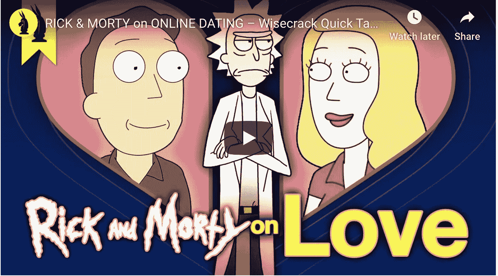

# 数据科学、迪士尼和 Tindering

> 原文：<https://towardsdatascience.com/developing-successful-data-science-career-30b20a8892f6?source=collection_archive---------24----------------------->

## 与数据科学长期关系的 5 个事实

图片由[俏皮话](https://www.wisecrack.co/)

**TL；DL** —谈恋爱很容易。持久的爱很难。在第一次约会并与数据科学建立长期关系之前，你应该知道以下 5 个事实。最后，您可以通过现场调查了解社区对数据科学的承诺程度。

***免责声明*** *:所有观点均为本人观点。我交替使用“数据科学”、“机器学习”和“分析”。*

***喜欢读什么？*** *跟我上* [*中*](https://medium.com/@ianxiao) *，*[*LinkedIn*](https://www.linkedin.com/in/ianxiao/)*，或者*[*Twitter*](https://twitter.com/ian_xxiao)*。*

# 外星人、火绒和爱情

我最近看到了[俏皮话](https://www.wisecrack.co/)的一个娱乐性和挑衅性的视频。它探索了什么是真爱，以及现代夫妻之间的互动。这让我想起了我们与“数据科学”(或任何职业)的关系。

YouTube:里克和莫蒂谈爱情

如果你很忙，以下是要点:

*   一个外星人做了一个类似 Tinder 的 app 这个应用程序让“爱”变得丰富。
*   这太棒了。人们可以很容易地逃离糟糕的情况。
*   但是，恶性循环从未打破。我们相爱，争吵，逃避，重复。
*   在某一点上，每个人都累了，并问:我们为什么要这样做？什么是真正的爱情？我们如何维持良好的关系？

# 坠入爱河又失恋的故事

让我们将它与数据科学领域的职业生涯进行对比。

你对数据科学一见钟情是因为它太性感了——嗯，它是 21 世纪最性感的工作。谁不会得意忘形？所以，向右滑动。

[吉菲](https://media.giphy.com/media/dHKi8uIOP34Wc/giphy.gif)

然后，你**带着最好的西装、妆容或任何你想做的事情去约会**。数据科学展示了所有奇妙的可能性和新奇的小玩意。事实上，数据科学非常喜欢你，并决定**给你一个机会**进一步探索事情。

接下来，你**最终通过签署要约**结婚(哎呀)。在迪斯尼电影中，这是灰姑娘和白马王子幸福生活的时刻。电影结束；幕布落下；人群欢呼鼓掌。

但是在**现实**中，白马王子变懒了(可能还变胖了)。灰姑娘变得脾气暴躁(并且可能满脸皱纹)。灰姑娘宝宝一直在哭。迷人国王生病了。魅力大叔引发内战。最后，王子像懦夫一样逃跑了。

[吉菲](https://media.giphy.com/media/dHKi8uIOP34Wc/giphy.gif)

现在，你开始质疑数据科学是否适合你，并开始寻找新的工作。**恶性循环**开始。你爱上别的，受挫，寻找出路，重复。进入数据科学就像使用 Tinder 寻找关系一样。

那么，我们为什么不专注于寻找合适的人(例如数据科学职业)并维持良好的关系呢？

# 事实核查

我相信每个人都想要幸福、满足和健康的关系，无论是个人还是事业。建立这种关系的关键是理解并诚实面对现实。

这里有 5 个重要的(伪)事实可以帮助你做到这一点:

**事实 1:数据科学使用最好的自拍滤镜。**雇主希望尽可能好地描述数据科学角色。这可以理解。所以，问问他们每天都做些什么。不要被个人资料图片骗了。

事实 2:家务永远不会结束。“天下没有免费的午餐。”凡事都有代价。恋爱，关系好也不例外。[注意那些为了享受数据科学的乐趣而不得不做的无聊事情](/data-science-is-boring-1d43473e353e)。

事实 3:家庭动态可能很复杂。许多数据科学团队试图向业务、工程和产品同行证明价值。这会导致紧张、困惑和沮丧。

**事实四:狗狗很可爱；孩子可能很烦人。制作原型就像养狗一样。它需要更少的工作和温暖的心。相比之下，将 ML 部署到生产中就像有了孩子一样。这需要做更多的工作，而且当东西坏了的时候很烦人，尤其是在半夜。**

事实 5:变化是唯一不变的。就像我们一样，数据科学也随着时间而变化。我们不知道未来 5 年、10 年它会变成什么样。接受和适应变化在一段关系中至关重要。保持学习和好奇心，否则就会落后。

认识、理解和接受这些事实是走向健康和可持续关系的重要一步。

# 斗牛中的最后一剑

那么，什么是真正的爱情呢？

> “爱是最持久的建筑。真正的爱情是持久的，有时是痛苦的，战胜时间、空间和世界设置的障碍。”
> 
> **法国哲学家阿兰·巴迪乌**

那么，你对数据科学的热爱是真的吗？

***喜欢读什么？*** *跟我上* [*中*](https://medium.com/@ianxiao)*[*LinkedIn*](https://www.linkedin.com/in/ianxiao/)*，或者*[*Twitter*](https://twitter.com/ian_xxiao)*。你想学习如何沟通，成为一名有影响力的数据科学家吗？查看我的《* [*用机器学习影响*](https://www.bizanalyticsbootcamp.com/influence-with-ml-digital) *》指南。**

# *这里有几篇你可能会喜欢的文章:*

* [## 最有用的 ML 工具 2020

### 每个懒惰的全栈数据科学家都应该使用的 5 套工具

towardsdatascience.com](/the-most-useful-ml-tools-2020-e41b54061c58)  [## 被遗忘的算法

### 用 Streamlit 探索蒙特卡罗模拟

towardsdatascience.com](/how-to-design-monte-carlo-simulation-138e9214910a)  [## 数据科学很无聊

### 我如何应对部署机器学习的无聊日子

towardsdatascience.com](/data-science-is-boring-1d43473e353e)  [## ML 和敏捷注定的联姻

### 如何不对 ML 项目应用敏捷

towardsdatascience.com](/a-doomed-marriage-of-ml-and-agile-b91b95b37e35)  [## 人工智能的最后一英里问题

### 如何培养人类和人工智能之间的信任

towardsdatascience.com](/fixing-the-last-mile-problems-of-deploying-ai-systems-in-the-real-world-4f1aab0ea10)  [## 又一个 AI 冬天？

### 如何部署更多的 ML 解决方案——五种策略

towardsdatascience.com](/the-last-defense-against-another-ai-winter-c589b48c561)*