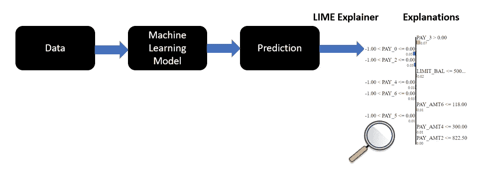
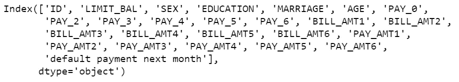
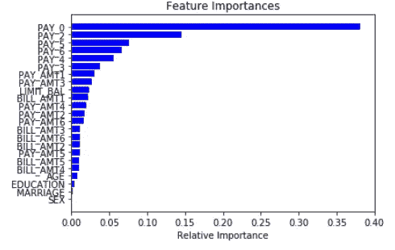
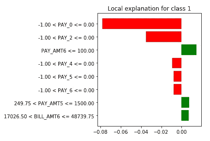
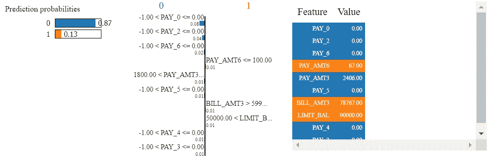
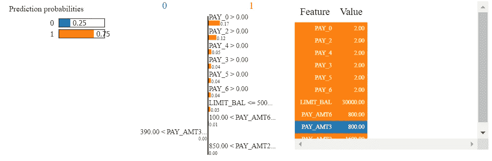
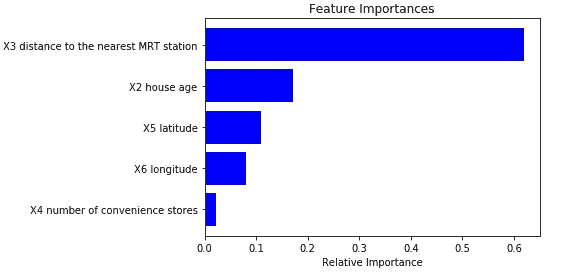
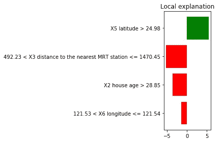
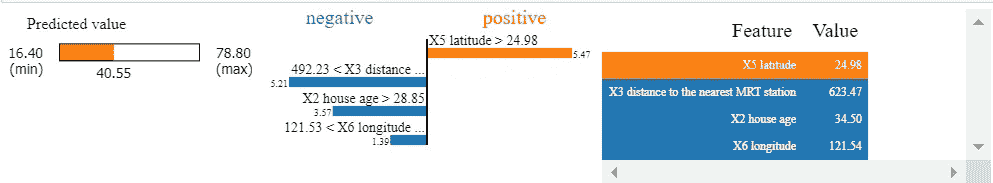

# 发展对机器学习模型预测的信任

> 原文：<https://towardsdatascience.com/developing-trust-in-machine-learning-models-predictions-e49b0064abab?source=collection_archive---------38----------------------->

## 使用 LIME 解释和说明机器学习模型做出的预测


肖恩·梅因斯在 [Unsplash](https://unsplash.com/s/photos/lime?utm_source=unsplash&utm_medium=referral&utm_content=creditCopyText) 上拍摄的照片

*如果我告诉你今天投资 10 万美元在一只特定的股票上，因为我的机器学习模型预测会有高回报。你会问我的问题将是解释我的预测的基础，因为这对你来说是一个重大的决定。你不想赌博，但想根据数据做出明智的决策。*

为了信任机器学习模型的预测，你会问以下问题。

*   模型是如何做出预测的？
*   为什么模型会对特定的实例做出特定的预测？
*   哪些特征对预测的影响最大，哪些影响最小，并给出一个易于理解的解释。
*   模型的解释应该呈现特征和模型预测之间的文本或视觉定性关系。

在这篇文章中，你将学习使用 LIME 来解释机器学习模型的预测，并解释对做出预测贡献最大的特征。

有几种解释机器学习模型的技术，但这里我们将讨论 **LIME(局部可解释模型-不可知论者解释)。**

***什么是石灰？***

**LIME 是机器学习模型的局部可解释模型不可知解释**，它让你理解个体预测，

*   **LIME 可以解释机器学习模型的单个预测，而不是解释整个数据集。**
*   它是局部忠实的，并且具有局部保真性，这意味着全球基本特征在局部环境中可能不那么重要，反之亦然。它通过**用一个可解释的模型对其进行局部近似来做到这一点。**
*   **它是模型不可知的**，可以应用于分类器以及基于回归的机器学习算法。



***石灰是怎么起作用的？***

LIME 扰动输入数据集以查看预测中的变化。这些扰动是基于数据的方差。

*   它**创建一个可解释的表示，该表示根据输入数据**的小扰动进行训练，这提供了一个用于解释个体预测的良好的局部近似。
*   它在可解释表示数据 **和原始数据**之间创建**相似性分数，以了解它们有多相似**
*   **使用可解释制图表达数据集上的模型进行预测。**
*   它**在可解释的表示数据集上尝试不同的组合，以找到最大可能匹配模型在原始数据集上所做预测的最小要素集**。
*   确定的**最小特征集给出了原始数据的大部分信息以及相似性得分，用于解释个体预测。**

***有哪些不同的机器学习模型可以用到 LIME？***

LIME 与模型无关，可以用于

*   **分类以及回归**问题。
*   它可以使用 NLP 在**文本数据**上使用。
*   可应用于**图像数据**
*   LIME 也可以应用于**表格数据**，其中列代表特征，行是单独的实例。

***如何将 LIME 应用于基于分类的机器学习模型？***

## 石灰在使用表格数据的分类模型中的应用

使用的数据集是[默认信用卡客户数据集](https://archive.ics.uci.edu/ml/datasets/default+of+credit+card+clients)。

对于分类问题，值 1 意味着客户将拖欠付款，值 0 表示客户不会拖欠信用卡付款。

**加载数据并显示列名**

```
**import pandas as pd
import numpy as np
np.random.seed(0)
df = pd.read_csv(r'c:\data\default of credit card clients.csv')
df.columns**
```



**创建特征和目标变量**

```
**Y = df[['default payment next month']]**
**X =  df[['LIMIT_BAL', 'SEX', 'EDUCATION', 'MARRIAGE', 'AGE', 'PAY_0', 'PAY_2', 'PAY_3', 'PAY_4', 'PAY_5', 'PAY_6', 'BILL_AMT1', 'BILL_AMT2','BILL_AMT3', 'BILL_AMT4', 'BILL_AMT5', 'BILL_AMT6', 'PAY_AMT1', 'PAY_AMT2', 'PAY_AMT3', 'PAY_AMT4', 'PAY_AMT5', 'PAY_AMT6']]**
```

**将数据集分成训练和测试**

```
**from sklearn.model_selection import train_test_split
from sklearn import preprocessing****X_train, X_test, Y_train, Y_test = train_test_split(X, Y, test_size = 0.4)**
```

**创建随机森林分类器并拟合训练数据**

```
**from sklearn.ensemble import RandomForestClassifier**
**model = RandomForestClassifier(max_depth=6, random_state=0, n_estimators=10)
model.fit(X_train, Y_train)**
```

**显示特征重要性**

```
**importances = model.feature_importances_
indices = np.argsort(importances)****features = X_train.columns
plt.title('Feature Importances')
plt.barh(range(len(indices)), importances[indices], color='b', align='center')
plt.yticks(range(len(indices)), [features[i] for i in indices])
plt.xlabel('Relative Importance')
plt.show()**
```



**创建石灰表格实例**

因为我们的数据集是表格形式的，所以我们创建了 LimeTabularExplainer()的一个实例。 **training_data** :通过训练数据集，

**模式**:可以是**回归**或**分类**。我们正在处理一个分类问题，所以我们将模式参数设置为“分类”

**feature_names** :数据集中的所有输入特征，用于计算每个特征的统计数据。平均值，计算数值特征的标准偏差，而分类特征被离散化为四分位数。

**训练 _ 标签**:传递训练目标变量

```
**import lime
from lime.lime_tabular import LimeTabularExplainer****explainer= LimeTabularExplainer(*training_data*=np.array(X_train),
                                *mode*='classification', 
                                *feature_names*=list(X_train.columns),
                                *training_labels*=np.array(Y_train),
                                *random_state*=12**
```

使用从训练数据生成的计算统计

1.  创建扰动的样本实例，这是一个**可解释的表示数据集。**
2.  **当属性不在同一标度上时，缩放数据以计算相似性得分的距离**。

**为预测生成解释**

现在，您可以通过将观察结果传递给 **explain_instance()** 来为特定的观察结果生成解释

**data_row:** 指定需要解释的观察结果

**classifier_fn:** 需要为分类模型指定模型预测概率，采用 numpy 数组，输出预测概率。对于回归模型，我们可以指定模型预测。

**num_features** :我们需要解释的最大特征数

```
**exp = explainer.explain_instance(X_test.iloc[0], model.predict_proba, num_features=8)****exp.as_pyplot_figure()
from matplotlib import pyplot as plt
plt.tight_layout()**
```



在 python 笔记本中显示 HTML 解释

```
**exp.show_in_notebook(show_table=True, show_all=True)**
```



***如何解读结果？***

对于观察，概率预测是 87%，即客户不会拖欠信用卡付款。

**客户未拖欠信用卡付款的原因**

客户没有拖欠本月、2 月、3 月、4 月、5 月和 6 月的任何付款(PAY_0、PAY_2、PAY_3、PAY_4、PAY_5 和 PAY_6 为 0)。最近三个月的付款少于 1800 美元

***让我们来看另一个观察的解释。***

```
**exp = explainer.explain_instance(X_test.iloc[731], model.predict_proba)
exp.show_in_notebook(show_table=True, show_all=False)**
```



对于观察，概率预测是 75%，客户将拖欠信用卡付款。

**客户拖欠信用卡付款的原因**

客户将本月、2 月、3 月、4 月、5 月和 6 月的付款延迟了两个月(PAY_0、PAY_2、PAY_3、PAY_4、PAY_5 和 PAY_6 为 2)。消费信贷少于或等于 500 美元。

***基于回归的机器学习模型如何应用 LIME？***

## LIME 在使用表格数据的回归模型中的应用

使用的数据集是[房地产价格预测](https://www.kaggle.com/quantbruce/real-estate-price-prediction?select=Real+estate.csv) n。

这里我们将使用 **RandomForestRegressor** 。

```
#Importing required libraries
**import pandas as pd
import numpy as np
import plotly
np.random.seed(0)
import matplotlib.pyplot as plt
import lime
from lime.lime_tabular import LimeTabularExplainer
from sklearn.model_selection import train_test_split
from sklearn import preprocessing
from sklearn.ensemble import RandomForestRegressor**#Reading the data file
**df = pd.read_csv(r'c:\data\Real estate.csv')**# Creating the input features and target variable
**Y = df[['Y house price of unit area']]
X =  df[[ 'X2 house age',
       'X3 distance to the nearest MRT station',
       'X4 number of convenience stores', 'X5 latitude', 'X6 longitude']]**# check for missing data
**X.isnull().sum()**#Creating train and test data
**X_train, X_test, Y_train, Y_test = train_test_split(X, Y, test_size = 0.2)**#Random Forest Regressor
**model = RandomForestRegressor(max_depth=50, random_state=0, n_estimators=1000, bootstrap=True)
model.fit(X_train, Y_train)**#printing feature importances
**importances = model.feature_importances_
indices = np.argsort(importances)
features = X_train.columns**
**plt.title('Feature Importances')
plt.barh(range(len(indices)), importances[indices], color='b', align='center')
plt.yticks(range(len(indices)), [features[i] for i in indices])
plt.xlabel('Relative Importance')
plt.show()**
```



**创建一个石灰表格实例**

将模式指定为**回归**。

```
**explainer= LimeTabularExplainer(training_data=np.array(X_train),
                                mode='regression', 
                                feature_names=list(X_train.columns),
                                class_names=['Y house price of unit area'],
                                random_state=12
                                         )**
```

**为预测生成解释**

```
**exp = explainer.explain_instance(X_test.iloc[0], model.predict, num_features=4)****exp.as_pyplot_figure()
from matplotlib import pyplot as plt
plt.tight_layout()**
```



```
**exp.show_in_notebook(show_table=True, show_all=False)**
```



## 结论

LIME 是一种**模型不可知的机器学习技术**，用于**以人类可理解的格式解释基于分类或回归的模型**的预测。LIME 为一次观察提供**当地的解释。它最适用于表格数据、图像和文本。**

## 参考资料:

我为什么要相信你？解释任何分类器的预测

[https://github.com/marcotcr/lime](https://github.com/marcotcr/lime)