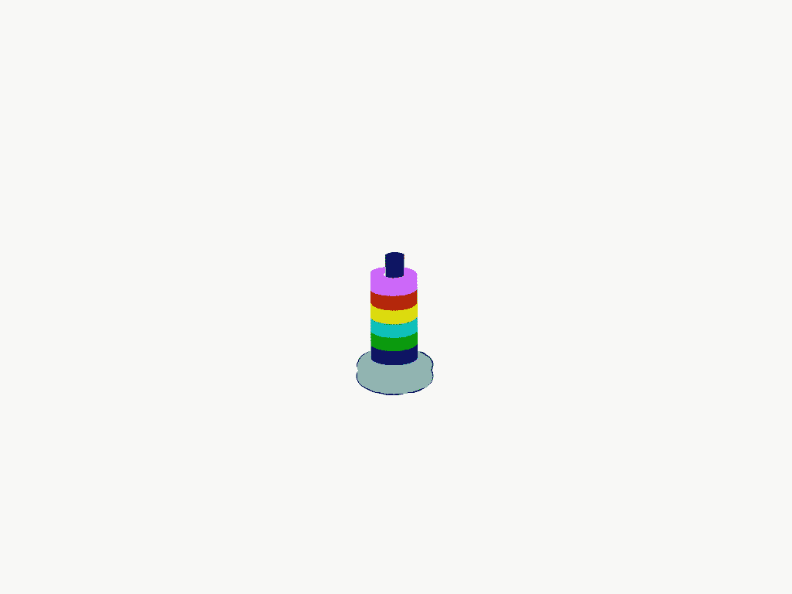
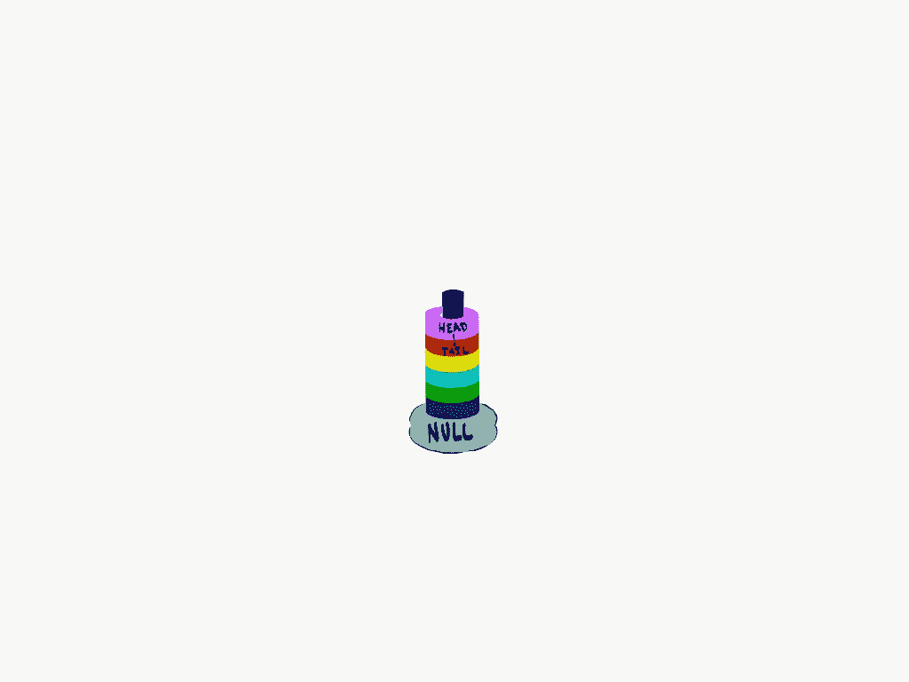
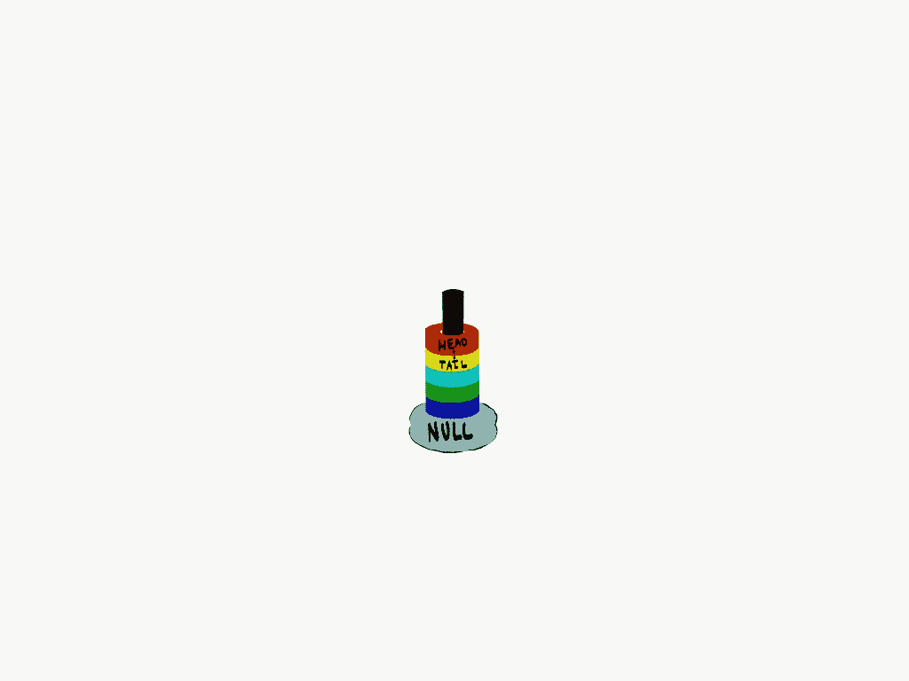

# 直观地学习数据结构

> 原文：<https://towardsdatascience.com/developing-visual-intuition-in-computer-science-7efb62f81c49?source=collection_archive---------35----------------------->

## 发展视觉直觉以理解复杂数据结构的艺术。


[天一马](https://unsplash.com/@tma?utm_source=medium&utm_medium=referral)在 [Unsplash](https://unsplash.com?utm_source=medium&utm_medium=referral) 上拍照

作为一名经历了大学经历考验和磨难的计算机科学本科生，我遇到过的最被滥用的术语之一是**直觉**。从第一次打开终端，我的教授向我保证，有一种内在的理解会冲刷我。这种直觉是慢慢产生的，但通常不是来自讲课或残酷的考试。它来自于缓慢地完成家庭作业和项目，试图理解我面前的这个金属大块头是如何解释我在键盘上疯狂键入的希腊语的。然而，随着我成为一名程序员，我开始看到现实世界中与数字世界直接相关的模式和寓言，这极大地帮助了我的理解。

本质上，计算机科学只不过是试图让一块石头以你的方式思考，让一个无生命的物体以与程序员看待世界的方式相似的方式感知世界。因此，在一种悖论中，计算机让用户重新分析他们自己看待世界的方式，将他们的感觉分解为处理器可以理解的基本构件。所以，我的教授们所说的这种**直觉**不是一种编程:学习*计算机*如何思考，而是理解*程序员*如何思考，将复杂的感知分解成计算机可以概念化的比特大小的积木。我清楚地记得，当我意识到这一点的时候——我正在学习一种叫做链表的数据结构。

我能找到的最简洁的链表定义是:

“链表是一种线性数据结构，其中的元素不是存储在连续的内存位置上”(GeeksforGeeks.com:链表数据结构)

这个定义虽然在技术意义上是描述性的，但它很少告诉我们这个结构的*物理表示*，所以当我们继续阅读时，我们看到了一幅图:


链表图片||来源:[https://www.geeksforgeeks.org/data-structures/linked-list/](https://www.geeksforgeeks.org/data-structures/linked-list/)

现在，有了这张图片，我们对这个数据结构有了更多的了解。似乎有一个开始(**头**)和一个结束(**空**)，中间有一些**节点**。存储数据的节点都指向另一个节点，它们之间存在单向关系，每个节点都知道哪个节点跟在后面。现在，根据现代学术界的观点，我们应该准备好实现和使用这种数据结构来达到我们想要的任何目的，对吗？嗯，它比这个稍微复杂一点，在我们进入这个数据结构的内部之前，有一个**直觉**需要开发。我们如何从这个结构中获取一条信息？我们怎么把一个放进去？回顾一下之前的观点，我们不应该考虑计算机如何完成这项任务，而应该考虑在人类世界中我们会如何看待这一点。因此，为了开发这个模型，我们现在将开始一段小学时期最美好的回忆之旅。

当我还是个孩子的时候，这个简单的玩具到处都是，这可能是为什么很多年后我重温它来帮助我理解复杂的数据结构。



童年回忆||作者图片

现在，想象一下，我们让一个孩子从堆栈中取出深蓝色的戒指。只有一种方法可以做到这一点，所以我们观察孩子首先从顶部拿起紫色的环，然后是每个连续的环，直到最后深蓝色的环被抽出。太好了！！！这和计算机科学又有什么关系呢？好吧，我们可以把这个游戏重新设计成一个链表的实现，我们会看到这两者是怎么一回事。



问题的重铸版||作者图片

正如我们所看到的，这是以新的视角展示的上图，顶部的紫色环作为头部，每个连续的环作为一个节点，而结构的蓝绿色底部作为空。这个模型保持了链表的单向性吗？除非孩子在其中一个环上咬出一个洞，那么是的。结构有头有尾吗？没错。有什么环看起来是重叠的吗？不，满足连续内存位。因此，有了这个模型，我们可以很容易地看到如何从系统中可视化地提取数据。假设我们想要在红色环中存储一条信息。首先，我们将取下紫色的顶部(**头**)并继续下去，直到堆栈的顶部是红色的环。当我们把它拿掉，我们现在有了我们正在寻找的数据。



去掉头像后||作者图片

为了用伪代码实现这个动作序列，我们需要假设孩子一次至少可以看*两个环。他们可以查看他们当前持有的戒指，即**头**，以及堆叠中的下一枚戒指，即**尾**。因此，当孩子将**头**拉出堆栈时，当前的**尾**现在位于新的顶部，因此它成为**头**，它下面的环成为新的**尾**。因此，要在代码中实现这一点，我们可以说:*

*直到深蓝色的环是头部***，继续移除环:因此将顶部的环重新分配给头部。**

*在伪代码中:*

```
*while head != dark blue:           
    head = tail
return head*
```

*正如我们所看到的，我们已经开发了一个现实世界的寓言来描述这个抽象的概念，一个视觉**直觉**来描述可以应用于计算机科学中许多概念的系统。*