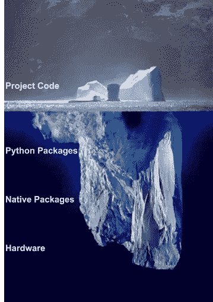
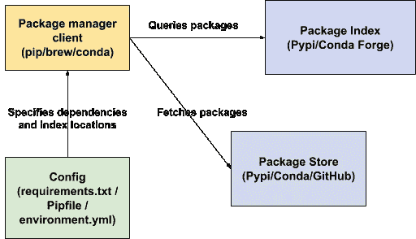

# 面向数据科学的开发运维:让您的 Python 项目具有可重复性

> 原文：<https://towardsdatascience.com/devops-for-data-science-making-your-python-project-reproducible-f55646e110fa?source=collection_archive---------16----------------------->

## 从依赖地狱中拯救你的朋友

在亚马逊担任软件工程师的第一年年末，我的经理给我上了宝贵的一课。提高团队的效率和我个人的贡献一样重要。

我把这一课带到了位于[impossible](https://improbable.io/defence)的建模团队，在那里，当我们处理大规模模拟项目时，我专注于最大化科学家的生产力。这些经历现在让我倡导我们一起努力解决一个我经历了近十年的问题。

# 问题是

现在是 2013 年，我是 Python 开发的新手，正在玩一些自然语言处理代码。根据电子邮件的内容推断人们的态度(感谢[安然](https://en.wikipedia.org/wiki/Enron_Corpus))。当时对我来说这就像科幻小说。

不幸的是，这在一段时间内仍然是科幻的，因为我花了 4 天时间让作者的代码运行起来。缺少系统库，相互冲突的依赖关系，未知的 Python 版本。在接下来的 7 年里，软件工程取得了很大的进步，但是这个问题仍然存在。为什么运行对方的代码这么难？

# 一些历史背景

Python 包管理有着悠久而丰富多彩的历史，这是我从未想过会写的一句话。 [*开源应用的架构*](http://aosabook.org/en/packaging.html) 描述了社区从一个打包系统到下一个打包系统的几次迁移。经过多年的迭代，我们已经有了几种安装 Python 代码的主流方式和两种不同的主要包索引。每个 Python 开发人员都需要投入一些时间来学习它们，以确保他们的工作可供他人使用。


强制 XKCD([https://xkcd.com/1987/](https://xkcd.com/1987/))

# 本指南

实现一般意义上的可再现性真的很难——数据版本控制、确定性保证等等。本指南只解决依赖管理问题。每个 Python 开发人员都有可能确保他们的代码可以安装在他们同事的机器上。我的目标是帮助传授必要的“devops”知识，这样你就可以改变你的工作的成熟度。

默认情况下，您的项目代码与安装在您笔记本电脑上的所有东西交织在一起。尽管在依赖配置方面做了一些努力，但它是一个自包含的产品，将在开源生态系统中蓬勃发展。

在项目的早期进行组织是关键。它留给您维护您的环境的更简单的任务，以便您的工作是一种乐趣，构建，部署和发布！

可复制的项目对合作者更有吸引力，迭代更快，并且可移植。这对于自动化测试、分析和在像[活页夹](https://mybinder.org/)这样的服务上分享你的工作是非常棒的。

# 关于 Devops 的一个注记

本指南不是关于编写代码的，而是关于一旦编写好代码，有效地使用它所必需的活动。在传统的软件开发中，“操作”不是开发者关心的问题。然而，在过去的 15 年中，角色已经合并(因此是开发人员操作)，因为改进的工具允许个人编写和运行他们的代码。学习操作技能让你产生影响！

# 库与应用

把你的作品交到人们手中是不同的，这取决于你是在制作一个库还是应用程序。如果您正在构建库，那么您可能已经了解了许多依赖项管理的机制，以及如何通过 Pypi 或 conda 通道使您的工作可用。

另一方面，可能在 Jupyter 笔记本中分析数据、创建 CLI 工具或构建仪表板的应用程序构建者是从重新思考依赖性管理中获益最多的人。

# 你的代码只是冰山一角

我想挑战简单地分享你的代码就意味着你的分析是可重复的这一观点。您的代码实际上是冰山的一角，为了让它在新的环境中运行，需要一系列工具来重建冰山。



你的项目不仅仅是你的代码。它几乎肯定需要外部包，其中一些可能具有特定的本机依赖性(专门为某个操作系统构建的二进制文件)，并且可能需要特殊的硬件。目标是以编程方式尽可能多地指定这些内容。(图片由作者提供)

假设您已经将您的 repo 上传到 GitHub，我们如何确保其他人可以复制您的项目环境的下一个级别 Python 包？这就需要选择一个包管理器并创建一个依赖文件。

# 软件包管理架构入门

你无疑对包管理器客户端比较熟悉:`pip install`、`conda activate`等。但这只是这个系统的一部分。



包管理器从存放数百万不同社区提交的项目的存储库中定位并获取必要的依赖项。(图片由作者提供)

每个包管理器客户端在您的本地设备上都有**配置**，告诉它当前项目需要什么(例如 matplotlib v3.2.1，python 3.8+)，应该检查哪些包索引，等等。

使用配置，客户端调用一个或多个**包索引**来解析哪些文件需要下载到您的系统上，然后从可能不同的**包存储**中下载这些文件。

现在我们已经描述了用于重现项目依赖关系的不同组件，我们可以评估主要的包管理器客户端选项。

# 选择您的软件包管理器

我将只讨论 pip、pipenv 和 conda，因为它们将涵盖您的几乎所有用例。我发现自己出于不同的原因经常使用这三种方法，如果你喜欢冒险，还有更多的方法。

# 1.Pip (+ Virtualenv)

✅ 安装速度快
✅简单配置文件
❌不锁定可传递依赖关系
❌ 必须组合两个独立的 CLI 工具
❌不能锁定 Python 版本
ℹ️使用纯文本配置`requirements.txt`

Pip 是默认的 Python 包管理客户端，它是随 Python 自动安装的。Virtualenv 允许您用自己的 Python 二进制文件和依赖项为项目创建一个独立的目录。

```
➜ which python
/usr/local/anaconda3/bin/python # my system python~/Desktop/cfg
➜ virtualenv venv # create the virtualenv
...
~/Desktop/cfg
➜ . venv/bin/activate # activate it.➜ which python # $PATH has changed!
/Users/alexremedios/Desktop/cfg/venv/bin/python~/Desktop/cfg
➜ ls -la venv # take a look inside
total 8
drwxr-xr-x  21 alexremedios  staff   672B 26 May 12:01 bin
drwxr-xr-x   3 alexremedios  staff    96B 26 May 12:01 lib
-rw-r--r--   1 alexremedios  staff   265B 26 May 12:01 pyvenv.cfg
```

`venv/bin`包含您的 Python 解释器副本和用于激活虚拟环境的脚本。`venv/lib`包含`site-packages`，在那里`pip install`放置您的 Python 依赖项。

Pip + Virtualenv 让您可以使用不同的 Python 版本和依赖项在一台机器上运行多个 repos。

⚠️没有 virtualenv，Pip 写入您的全局站点包目录，这可能会导致混乱和冲突。
ℹ️您可以使用`which`找到当前 python 环境的站点包目录

```
~/Desktop/cfg
➜ which python
/usr/local/anaconda3/bin/python~/Desktop/cfg
➜ ls -la /usr/local/anaconda3/lib/python3.7/site-packages
```

现在 Pip + Virtualenv 感觉有点低级，但是对于在你的笔记本电脑上有多个项目污染你的全球包环境的问题，这是最简单的可能的解决方案。

## 如何导出 pip 环境…正确的方法

我推荐手动编写你的 requirements.txt，你大概没有超过 10 个直接需求，文件格式超级简单。手动编写文件还会鼓励您留意项目所依赖的内容。

```
# requirements.txt, doesn't have to be complex
matplotlib>=3.2
numpy
pandas
```

创建 requirements.txt 的另一种方法是冻结您当前的环境:`pip freeze > requirements.txt`但是您应该在创建文件之后减少以下缺点。

## ⚠️ ❄️ 1.传递依赖将变成直接依赖

您可能想知道为什么您只安装了两个包，而现在您的 requirements.txt 中有 50 个包，这是因为 pip freeze 不知道您直接需要的包和子依赖包之间的区别。

```
# pip freeze > requirements.txt results in the whole transitive closure being treated as direct dependencies
…
sphinxcontrib-qthelp==1.0.3
sphinxcontrib-serializinghtml==1.1.4
spinners==0.0.23
SQLAlchemy==1.3.15
streamlit==0.56.0
tenacity==6.0.0
termcolor==1.1.0
terminado==0.8.3
testpath==0.4.4
textwrap3==0.9.2
timeago==1.0.13
toml==0.10.0
toolz==0.10.0
toposort==1.5
tornado==6.0.3
tqdm==4.42.1
traitlets==4.3.3
…
```

这是不好的，因为当你想删除一个依赖项时，你必须手动识别并删除所有的子依赖项。或者，你的 Python 环境将会有很多不需要的依赖，这会导致[依赖地狱](https://en.wikipedia.org/wiki/Dependency_hell)。

## ⚠️ ❄️ 2.版本将被过度固定

版本锁定是指您确切地指定您的项目应该使用哪个版本的依赖项，如上所示(例如`tornado==6.0.3`)。虽然能够保证其他人将与您的项目安装相同的包版本是有用的，但是将每个依赖项都固定在 requirements.txt 中并不是最好的解决方案，原因有三。

第一个原因是您必须通过更改固定版本来手动更新每个包。您的依赖项的次要版本更新包含错误修复和其他改进。定期更新依赖关系对于防止代码腐烂很有用。

第二个原因是，当你添加一个新的需求时，它更有可能导致冲突。例如，当您只需要`jupyter-client==6.*`时依赖`jupyter-client==6.0.0`会导致不必要的冲突，如果您随后安装依赖`jupyter-client>=6.1.0`的`nbconvert`。

```
ERROR: nbclient 0.3.1 has requirement jupyter-client>=6.1.0, but you'll have jupyter-client 6.0.0 which is incompatible.
```

不固定所有需求的最后一个原因是，如果其他人遇到上述问题，他们会对使用您的代码感到困惑。他们如何知道您的代码是否真的需要需求的特定版本？

也就是说，您应该只在必要的时候将版本固定在特定的依赖项上。在这种情况下，最好留下评论。

如果您想获得锁定所有依赖项版本的好处而没有这些问题，那么 Pipenv 是您的最佳选择。

# 2)管道

👍推荐，除非你需要大量的科学库
✅锁定传递依赖
✅锁定 Python 版本
✅ CLI 工具自动创建依赖配置
❌锁定传递依赖可能很慢
ℹ️使用 TOML 格式的`Pipfile`和 JSON 格式的`Pipfile.lock`进行配置

Pipenv 就像包装在命令行工具中的 pip + virtualenv，它也锁定了可传递的依赖关系。

## 什么是锁定？

锁定将您的一般需求锁定在整个传递闭包的精确版本上。例如，如果你说你需要`matplotlib==3.2`，那么加锁会让你说你最后一次运行代码使用了`matplotlib==3.2.1` +所使用的子依赖的确切版本

前面我说过版本锁定是不好的，但是 pipenv 的锁定足够智能，可以给你版本锁定的好处，而没有脆弱性。

## Pipfile 和 Pipfile.lock

Pipfile 类似于 requirements.txt，它是人类可读的，并且指定了您的直接 Python 包依赖项+您的 Python 版本(不同于 requirements.txt)。

您通常不需要直接编辑它们，因为 pipenv CLI 工具会在您`pipenv install something`时为您管理它们。

```
# Pipfile is a TOML formatted description of your project runtime and direct dependencies.[[source]]
name = "pypi"
url = "[https://pypi.org/simple](https://pypi.org/simple)"
verify_ssl = true

[dev-packages]
pylint = "*"
autopep8 = "*"
pipenv = "*"
pytest = "*"
python-magic = "*"

[packages]
treebeard = {editable = true,path = "."}

[requires]
python_version = "3.7"

[pipenv]
allow_prereleases = true
```

每次 Pipfile 发生变化时，都会重新生成锁定文件。它描述了你的项目的*传递闭包*，即当前安装的所有依赖项(不仅仅是直接依赖项)。Pipfile.lock 非常适合部署您的工作:它准确地描述了要安装哪些包，考虑到有些包只在特定的操作系统上需要。

```
// Pipfile.lock is a JSON formatted description of your project's transitive closure, programmatically derived from your Pipfile
...
"appnope": {
   "hashes": [
       "sha256:5b26757dc6f79...",
       "sha256:8b995ffe925347a2138d7..."
   ],
   "markers": "platform_system == 'Darwin'",
   "version": "==0.1.0"
},
...
```

注意:Pipenv 的一个快速发展的替代品是[诗歌](https://python-poetry.org/)。

# 3)康达

👍推荐用于大型数据科学或机器学习项目
✅更好地支持原生依赖关系
✅锁定 Python 版本
✅默认安装包含有用的数据科学包
❌由于`solving environment`
❌不锁定可传递依赖关系
ℹ️使用 YAML 格式配置`environment.yml`

Conda 是三个包管理器中最强大的，因为它[支持用任何语言编写的包](https://www.anaconda.com/blog/understanding-conda-and-pip)，但是比 pip + virtualenv 慢一个数量级。

## 处理本机依赖关系

Conda 被设计成在比 pip 更低的层次上工作——使用二进制文件而不是 Python 包。这有几个很好的特性:

首先，这意味着 Python 和 Pip 只是 conda 包。您可以将它们安装在 conda 环境中，并像使用 Pip + virtualenv 一样使用 Pip + conda。也就是说，如果您已经处于 conda 环境中，则不需要 virtualenv。

第二，conda 的通用性意味着依赖于非 Python 包的 Python 包往往会工作得更好。

**例子:安装 cartopy(一个通用的映射库)** Cartopy 可能很难运行。它是一个 Python 库，可以通过 Pypi 安装，但是 Pypi 包通常不包含它们运行所需的所有本机依赖项。

因此，您可能需要安装带有 pip 的 Python 代码

```
➜ pip install cartopy
```

然后用您平台特定的包管理器来填充缺失的库，例如`brew`、`yum`或`apt-get`。

```
brew install proj
```

Conda 不在乎 cartopy 是用 python 写的，但 proj 是用 C++写的，它照样安装它们。

会照顾好一切。

conda 的这个特性对于经常依赖于这些原生依赖项的科学用例来说非常有用。

## 康达频道和康达锻造

因为 conda 能够管理本机依赖项，所以它有一个不同于 Pypi 的包结构。因此，您可以从 conda *通道*安装 conda 软件包。

包的默认来源渠道是[https://anaconda.org/anaconda](https://anaconda.org/anaconda)，类似于[https://pypi.org/](https://pypi.org/)是 pip 的默认渠道。

然而，与 pip 不同的是，有一些非默认的频道包含许多您需要的软件包，例如*康达锻造*频道([https://anaconda.org/conda-forge](https://anaconda.org/conda-forge))。

## Conda 包名称

Pypi、anaconda、conda forge 和其他通道都有自己的名称空间。这意味着这是可能的，但是[不能保证](https://github.com/pysal/pysal/issues/1034)一个公共包在每个源中都有相同的名字。

⚠️🐍不要假设 requirements.txt 可以粘贴到 environment.yml 而不改变一些包名(除非您将它们粘贴到`pip:`部分)。

## 为您的 conda 环境创建 environment.yml

与 pip 类似，我建议手动维护您的环境。yml，但是如果事情已经远离您:

```
➜ **conda env export --from-history --no-builds** # ✅ good
name: base
channels:
  - conda-forge
  - defaults
dependencies:
  - conda
  - python
  - conda-env
# Note! Conda does not know about anything you have pip installed, you will have to manually add them:
  - pip:
    - tensorflow
```

`**—-no-builds**`标志防止包含特定于平台的构建 id。如果没有这个标志，你将会遇到像`ResolvePackageNotFound`这样的问题，即使是存在于每个平台上的依赖关系。

**举例:OpenSSL** `openssl=1.1.1d`存在于每个平台，`openssl=1.1.1d=h0b31af3_0`只存在于 OS X 上[自己看](https://anaconda.org/conda-forge/openssl/files)。

`**--from-history**`是在 Conda 4.7.12 中引入的，因此您可能需要更新 Conda。如果你花了一段时间让某个东西工作起来，却忘记记下你安装了什么，那么这个标志非常有用。Conda 将只导出您使用`conda install`明确安装的包和版本。

⚠️ ❄️如果你不使用这些标志，你会遇到与`pip freeze`相同的问题

```
➜ **conda env export** # ❌ bad, has transitive dependencies with pinned versionsname: blah
channels:
  - conda-forge
  - defaults
dependencies:
  - ca-certificates=2019.11.28=hecc5488_0
  - certifi=2019.11.28=py37_0
  - libcxx=9.0.1=1
  - libffi=3.2.1=h6de7cb9_1006
  - ncurses=6.1=h0a44026_1002
  - openssl=1.1.1d=h0b31af3_0
```

[看这里的官方指南。](https://docs.conda.io/projects/conda/en/latest/user-guide/tasks/manage-environments.html#exporting-an-environment-file-across-platforms)

# 验证项目再现性

唷，这可能是你主动学习配置 conda 环境之类的最长时间了。

现在，我们已经选择了一个包管理器，并对它进行了配置，以成功安装我们的依赖项。这是一个巨大的进步，让合作者可以快速开始，但是我们如何确保随着项目的增长，可再现性不会随着时间的推移而被侵蚀呢？

手动方式是定期在一台新机器上安装你的项目，只是为了检查它是否还在运行。这听起来效率很低，所以在结束之前，我打算先研究一下自动方式。

监控你工作的整体质量的过程被称为*持续集成(CI)* ，它围绕着将自动化服务连接到你的源代码库。持续集成超出了本文档的范围，但我将向您介绍两个产品: [Github Actions](https://github.com/features/actions) ，它默认集成到 Github 中，以及 [Treebeard](http://treebeard.io) (完全公开:我正在开发)，它也可以安装在 Github repos 上以跟踪可再现性。

一旦你经历了使你的项目可复制的麻烦，不附加 CI 服务将是一种浪费。这就像写了一篇博客文章却没有进行拼写检查一样。说到这里，我们结束吧。

# 外卖食品

1.  在您的项目中包含一个维护良好的依赖文件，可以让您通过避免依赖地狱，以更快的速度进行协作和交付
2.  如果您需要`pip freeze`或`conda export`您的环境，记得删除可传递的依赖项和不必要的固定版本
3.  持续集成让您可以自动检查依赖性

# 进一步阅读

这篇文章讨论了一些 devops 实践，它们帮助你在团队中更有效地工作，并让你的代码在外面的世界中运行。有关相关实践，请阅读:

*   [持续集成](https://aws.amazon.com/devops/continuous-integration/)
*   [码头工人](https://docker-curriculum.com/)
*   [基础设施代码](https://www.hashicorp.com/resources/what-is-infrastructure-as-code/)