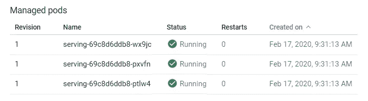

# 与 GCP 合作开发数据科学

> 原文：<https://towardsdatascience.com/devops-for-data-science-with-gcp-3e6b5c3dd4f6?source=collection_archive---------17----------------------->


来源:[https://pix abay . com/photos/dock-ship-container-port-boat-1277744/](https://pixabay.com/photos/dock-ship-container-port-boat-1277744/)

## 为模型服务部署生产级容器

数据科学团队的职能之一是建立机器学习(ML)模型，为产品和个性化提供预测信号。虽然 DevOps 并不总是被视为数据科学团队的核心职责，但随着这些团队开始更多地负责运行和维护数据产品，它变得越来越重要。数据科学家不再将代码或模型交给工程团队进行部署，而是在生产中拥有系统，这种情况越来越普遍。虽然我之前写过一本关于用 Python 构建可伸缩 ML 管道的[书](https://www.amazon.com/dp/165206463X)，但是我并没有太关注构建数据产品的维护方面。这篇文章的目标是通过一个示例 ML 系统，它涵盖了数据科学 DevOps 的一些方面。


【https://www.amazon.com/dp/165206463X 

模型服务是指托管其他服务可以调用的端点，以便从机器学习模型中获得预测。这些系统通常是实时预测，其中关于用户或 web 会话的状态被传递到端点。设置端点的一些方法包括使用 web 服务，如 Flask 和 Gunicorn，使用无服务器功能，如 GCP 云功能，以及使用消息协议，如 GCP PubSub。如果您希望建立一个需要以最小的延迟为大量请求提供服务的系统，那么您可能希望使用容器化的方法，而不是无服务器的功能，因为您将对系统的运行时环境有更多的控制，并且成本可以显著降低。在这篇文章中，我们将展示如何在谷歌云平台(GCP)上使用 Flask 和 Docker 结合谷歌 Kubernetes 引擎(GKE)构建一个可扩展的 ML 系统。Kubernetes 是一种越来越受 DevOps 欢迎的技术，也是一种越来越需要数据科学家的技能。

除了使用这些工具来构建一个能够以低延迟扩展到大量请求的数据产品之外，我们还将探讨模型服务的以下开发运维关注点:

1.  如何部署具有高可用性的 ML 模型？
2.  如何扩展您的部署以满足需求？
3.  您如何设置警报和跟踪事件？
4.  您如何推出系统的新部署？

在这篇文章中，我们将重点关注能够部署和监控 ML 模型的工具，而不是触及其他数据科学问题，如模型训练。在本帖中，我们将探讨以下主题:

1.  为 GCP 建立发展环境
2.  为本地模型服务开发 Flask 应用程序
3.  用 Docker 将应用程序容器化
4.  将容器发布到 GCP 容器注册中心
5.  使用 GKE 在一个机器集群上托管服务
6.  使用负载平衡器分发请求
7.  使用 Stackdriver 进行分布式日志记录和度量跟踪
8.  使用带有滚动更新的 GKE 部署新版本的服务
9.  使用 Stackdriver 为警报设置警报

在本文中，我们将从一个烧瓶应用程序开始，并使用 GCP 将其扩展到生产级应用程序。在此过程中，我们将使用 Gunicorn、Docker、Kubernetes 和 Stackdriver 来解决大规模部署此端点时的 DevOps 问题。这篇文章的完整代码清单可以在 [GitHub](https://github.com/bgweber/DS_Production/blob/master/Stackdriver.ipynb) 上找到。

## 1.GCP 发展环境

在开始之前，你需要建立一个 [GCP](https://cloud.google.com/) 账户，该账户提供 300 美元的免费积分。这些信用提供了足够的资金来启动和运行各种 GCP 工具。您还需要创建一个新的 GCP 项目，如下图所示。我们将创建一个项目，其名称为`serving`，完整的项目 id 为`serving-268422`。


在 GCP 创建一个新项目。

我推荐使用 Linux 环境来开发 Python 应用程序，因为 Docker 和 Gunicorn 最适合这些环境。如果您安装了以下应用程序并设置了命令行访问，您应该能够理解:

*   [**python**](https://www.python.org/downloads/release/python-380/) :我们将用于模型服务的语言运行时。
*   [**pip**](https://pip.pypa.io/en/stable/installing/) :我们将安装额外的 GCP python 客户端库。
*   [**docker**](https://docs.docker.com/install/) :用于封装我们的模型服务端点。
*   [**gcloud**](https://cloud.google.com/deployment-manager/docs/step-by-step-guide/installation-and-setup) : GCP 命令行工具。

我不会深究安装这些应用程序的细节，因为安装会因您的计算环境而有很大的不同。需要注意的一点是，gcloud 工具会在幕后安装 Python 2.7，因此请确保您的命令行 Python 版本不会受到此安装的影响。设置好`glcoud`之后，您可以使用以下命令创建一个凭证文件，用于对 GCP 的编程访问:

```
gcloud config set project serving-268422
gcloud auth login
gcloud init
gcloud iam service-accounts create serving
gcloud projects add-iam-policy-binding serving-268422 --member   
    "serviceAccount:[serving@serving-268422.iam.gserviceaccount.com](mailto:serving@serving-268420.iam.gserviceaccount.com)" 
    --role "roles/owner"
gcloud iam service-accounts keys create serving.json 
    --iam-account [serving@serving-268422.iam.gserviceaccount.com](mailto:serving@serving-268420.iam.gserviceaccount.com)
```

该脚本将创建一个名为`serving`的新服务帐户，可以访问您的 GCP 资源。最后一步创建了一个名为`serving.json`的凭证文件，我们将用它来连接 Stackdriver 之类的服务。接下来，我们将使用 pip 在 Google Cloud 中安装用于日志记录和监控的 Python 库，以及使用 Python 作为端点托管 ML 模型的标准库。

```
pip install google-cloud-logging
pip install google-cloud-monitoringpip install pandas
pip install scikit-learn
pip install flask 
pip install gunicorn
```

我们现在已经设置好了构建和监控服务于 ML 模型的 web 服务所需的工具。

## 2.模特服务用烧瓶

为了演示如何将预测模型作为端点，我们将使用 scikit-learn 训练一个逻辑回归模型，然后使用 Flask 公开该模型。接下来，我们将使用 Gunicorn 使我们的服务成为多线程的，并扩展到更大的请求量。

服务于模型请求的示例 web 应用程序的完整代码如下面的代码片段所示。代码首先直接从 GitHub 获取一个训练数据集，然后用 scikit-learn 构建一个逻辑回归模型。接下来，`predict`函数用于定义服务模型请求的端点。传入的参数( *G1，G2，G3，…，G10* )从 JSON 表示转换成一个只有一行的 Pandas dataframe。这些变量中的每一个都跟踪客户过去是否购买过特定的产品，并且输出是客户购买新产品的倾向。dataframe 被传递给 fitted 模型对象以生成倾向得分，该倾向得分作为 JSON 有效载荷被返回给发出模型服务请求的客户机。关于这段代码的更多细节，请参考我之前关于将[模型作为 web 端点](/models-as-web-endpoints-162cb928a9e6)的文章。

假设这个文件被命名为`serving.py`，我们可以通过运行下面的命令来测试这个应用程序:`python serving.py`。为了测试服务是否正常工作，我们可以使用 Python 中的请求模块:

运行该代码块的输出如下所示。结果显示 web 请求是成功的，并且模型为样本客户提供了 *0.0673* 的倾向得分。

```
**>>> print(result)** <Response [200]>**>>> print(result.json())** {'response': '0.06730006696024807', 'success': True}
```

Flask 使用单个进程来服务 web 请求，这限制了端点可以服务的流量。为了扩展到更多的请求，我们可以将 Flask 与一个 WSGI 服务器(比如 Gunicorn)结合使用。要使用 Gunicorn 运行模型服务，我们只需将文件名传递给 Gunicorn，如下所示。

```
gunicorn --bind 0.0.0.0 serving:app
```

运行此命令后，您将在端口 8000 上运行一个服务。为了测试服务是否正常工作，您可以更改上面的请求片段，使用端口 8000 而不是端口 5000。

## 3.集装箱模型

我们现在有了一个在本地机器上运行的模型服务应用程序，但是我们需要一种分发服务的方法，以便它可以扩展到大量的请求。虽然可以使用云提供商提供硬件来手动分发模型服务，但 Kubernetes 等工具提供了完全托管的方法来设置机器以服务请求。我们将使用 Docker 来封装应用程序，然后使用 GKE 托管服务。

容器化应用程序的 docker 文件如下所示。我们从 Ubuntu 环境开始，首先安装 Python 和 pip。接下来，我们安装所需的库，并复制应用程序代码和凭证文件。最后一个命令运行 Gunicorn，在端口 8000 上公开模型服务应用程序。

下面的命令说明了如何构建容器，在您的机器上查看生成的 Docker 图像，并以交互模式在本地运行容器。在本地测试容器以确保您在应用程序中使用的服务按预期工作是很有用的。要测试应用程序是否工作，请将上面的请求片段更新为使用端口 80。

```
sudo docker image build -t "model_service" .
sudo docker images
sudo docker run -it -p 80:8000 model_service
```

## 4.发布到容器注册表

要在 Kubernetes 中使用我们的容器，我们需要将图像推送到 Docker 注册中心，Kubernetes pods 可以从那里提取图像。GCP 提供了一种叫做容器注册的服务来提供这种功能。要将我们的容器推到注册表中，运行下面要点中显示的命令。

上面代码片段中的第一个命令将凭证文件传递给`docker login`命令，以便登录到容器注册中心。下一个命令用您的 GCP 帐户 ID 标记图像，最后一个命令将图像推送到注册表。运行这些命令后，您可以浏览到 GCP 控制台的容器注册表部分，验证映像是否已成功推送。


集装箱注册中的模型服务图像。

## 5.与 GKE 一起部署

我们现在可以启动 Kubernetes 集群，在分布式环境中托管模型服务应用程序。第一步是通过浏览 GCP 控制台中的“Kubernetes Engine”选项卡并单击“create cluster”来设置集群。将`model-serving`指定为集群名称，选择 2 个节点的池大小，并将 *g1-small* 实例类型用于节点池。这将创建一个小集群，我们可以使用它进行测试。


与 GKE 一起创造了一个库伯内特集群。

一旦集群启动，我们就可以使用我们的容器创建一个工作负载。要将我们的映像作为应用程序在 GKE 上运行，请执行以下步骤:

1.  从“Kubernetes 引擎”中点击“工作负载”
2.  单击“部署”
3.  点击“图像路径”下的“选择”
4.  选择带有最新标签的*型号 _ 服务*图像
5.  点击“继续”
6.  分配一个应用程序名称“serving”
7.  在“集群”下，选择您新创建的集群
8.  单击“部署”

这个过程可能需要几分钟才能完成。完成后，您可以单击工作负载来浏览管理工作负载的 pod 的状态。该映像应该部署到三个单元，如下所示。



模型在 GKE 应用的三个实例。

## 6.公开服务

我们现在有了在分布式环境中运行的服务，但是还没有一种与服务交互的方法。我们需要设置一个负载平衡器来将模型服务公开给开放的 web。执行以下步骤为服务设置负载平衡器:

1.  选择“服务”工作负载
2.  点击“操作”,然后点击“暴露”
3.  为“端口”选择 80，为“目标端口”选择 8000
4.  在“服务类型”下，选择“负载平衡器”
5.  点击“暴露”

要使用负载平衡器，请单击您的工作负载并浏览到“公开服务”一节。您现在应该看到一个负载平衡器设置了一个公开服务的公共 IP 地址。您可以通过修改请求片段以使用负载平衡器的 IP 来测试服务。


服务工作负载的负载平衡器。

我们现在已经具备了可扩展模型托管服务的许多要素。如果需要，系统现在可以扩展到更多的单元，我们可以增加节点池大小和副本数量，以使用 GKE 处理大流量。此外，如果在系统中检测到故障，新的 pod 将会启动，因此 GKE 为我们的服务提供高可用性。我们在该系统的开发操作中缺少的关键部分是警报和监控。我们需要知道系统何时出现故障或异常，并快速做出响应。

## 7.使用 Stackdriver 进行监控

GCP 现在提供了 Stackdriver 的托管版本，这是一种提供日志记录、监控、警报和事件跟踪的服务。我们将使用日志功能来记录服务器状态更新，我们将使用监控功能来跟踪系统的请求量。为了实现这个功能，我们将使用 Stackdriver 的 [Python 接口](https://cloud.google.com/python/docs/stackdriver)。

下面的代码片段展示了如何为 Stackdriver 设置一个日志客户端，并向服务记录一条文本消息。要在本地工作时设置日志客户端，您需要提供一个凭证文件，但是在 GCP 的计算实例或 GKE 上工作时，这一步可能不是必需的。

要浏览应用程序的日志，请在 GCP 控制台中搜索“日志”，然后选择“日志查看器”选项卡。选择“Global”作为资源，您应该会看到如下所示的日志消息。在下一节中，我们将使用日志记录来跟踪新的服务器实例何时启动，并记录导致异常的模型请求。


在 Stackdriver 中查看服务日志。

Stackdriver 提供了记录定制指标的能力，比如记录每分钟模型服务请求的数量。要使用定制指标，您需要首先创建一个定制指标，如下面的代码片段所示。该代码首先设置一个监控客户机，为记录定义一个新的度量，然后提供一个样本数据点。一旦设置了新的指标，您就可以在每台服务器上每分钟记录一条记录。

要查看自定义指标，请在 GCP 控制台中搜索“Stakdriver Monitoring API ”,然后选择“Metrics explorer”。通过搜索“custom”并选择“Global”作为资源来选择指标。您应该会看到一个图表，它绘制了一段时间内自定义指标的值。


使用 Stackdriver 监控功能跟踪每分钟的请求数。

在下一节中，我们将使用定制的指标来记录每分钟有多少模型请求被处理。在最后一节中，我们将展示如何使用自定义指标来设置警报。

## 8.执行滚动更新

现在，我们已经拥有了为模型服务应用程序设置警报和监控所需的所有组件。Flask 应用程序的完整代码清单如下所示。

以下是最初应用程序的主要变化:

1.  我们为日志记录和监控引入了额外的库
2.  我们根据 IP 和一个随机值为服务创建一个唯一的 ID
3.  我们设置了日志记录和监控客户端，并记录服务器启动消息
4.  我们创建一个计数器变量来跟踪请求计数
5.  我们定义了一个函数来编写自定义指标
6.  我们定义一个每秒运行一次的函数，将请求计数作为自定义指标传递给 Stackdriver 并重置计数
7.  我们用导致失败的 try/except 块和日志请求来包装 Flask 请求
8.  我们为每个 web 请求更新计数器值

一旦我们在本地测试完脚本，我们将需要重新构建容器，并向集群推送一个新版本。第一步是重新构建容器，并将更新后的映像推送到容器注册表，如下所示:

```
sudo docker image build -t "model_service" .
sudo docker tag model_service us.gcr.io/serving-268422/model_service
sudo docker push us.gcr.io/serving-268422/model_service**# Output** latest: digest: sha256:**286fe62e19368d37afd792b5bc6196dd5b223eada00e992d32ed6f66a4de939d** size: 3048
```

更新映像后，push 命令将输出一个摘要，我们可以用它在 GKE 上推出容器的新版本。第一步是选择上面显示的摘要的粗体部分。接下来，选择您的工作负载，单击“ACTIONS”，然后单击“Rolling update”。用新的容器摘要替换“图像”下的摘要，然后按更新。


用滚动更新来更新容器。

使用滚动更新的目的是防止在执行系统更新时服务出现任何停机。下图显示了 GKE 如何在运行旧版本的同时为新的服务版本构建新的 pod。一旦单元被加速旋转以匹配当前的工作负载，旧的单元版本将被删除。


GKE 为执行滚动更新提供了强大的功能，降低了 GCP 上基于容器的数据产品开发运维的复杂性。

## 9.使用 Stackdriver 进行事件跟踪

我们将在本文中讨论的最后一个 DevOps 问题是设置警报和响应事件。使用 Stackdriver 记录定制指标的一个主要好处是，我们可以为不同的问题设置警报，例如缺少检测到的数据或太多的传入请求。我们将通过执行以下步骤，设置一个当系统每分钟收到 10 个以上请求时触发的警报:

1.  在 GCP 控制台中搜索“Stakdriver Monitoring API”
2.  单击“警报”选项卡
3.  单击“创建策略”
4.  分配一个名称，“太多请求”
5.  点击“添加条件”
6.  在“目标”下，选择自定义指标和“全局”作为资源
7.  在“配置”下，将阈值设置为 10
8.  选择持续时间的“最近值”
9.  点击“添加”
10.  在“通知”下，单击“添加通知频道”
11.  选择电子邮件并输入您的电子邮件地址
12.  点击“添加”，然后点击“保存”。

我们现在设置了一个警报，如果自定义指标值超过每秒 10 个请求，就会触发一个事件。我们现在可以通过向负载平衡器 URL 发送 10 个以上的请求来生成警报。向端点发送过多流量的示例如下所示。


超过警报策略的请求计数。

几分钟后，Stackdriver 将检测到违反了警报策略，并触发一个事件。您将收到为警报设置的每个频道的通知。通过电子邮件发送的通知示例如下所示。


警报策略违规的电子邮件通知

如果触发了警报，您可以浏览 Stackdriver 中的“alerting”选项卡，查看状态更新并提供事件的附加注释。对于这个事件，我们可能会决定更改工作负载的自动缩放设置。对于其他类型的实例，比如停机，我们可能会部署一个新版本，或者为当前版本设置新的副本。


在堆栈驱动程序警报选项卡中查看事件。

Stackdriver 中的警报功能提供了许多有助于数据科学家拥有更多数据管道的功能。除了电子邮件提醒之外，您还可以使用其他渠道(如 Slack、PagerDuty 或 SMS)向团队通知提醒。

## 结论

在这篇文章中，我们介绍了数据科学团队承担更多将 ML 模型投入生产的 DevOps 责任所必需的许多构建模块。我们在这篇文章中提到的关键特性是滚动更新和提醒。当使用 GKE 时，GCP 提供了开箱即用的功能，这使得数据科学团队能够拥有更多部署预测模型的流程。

借助这些工具，数据科学团队可以构建在出现问题时触发警报的数据产品，调查日志以确定问题的根源，并部署新的模型版本，同时最大限度地减少停机时间。

本·韦伯是 Zynga 的一名杰出的数据科学家。我们正在[招聘](https://www.zynga.com/job-listing-category/data-analytics-user-research/)！