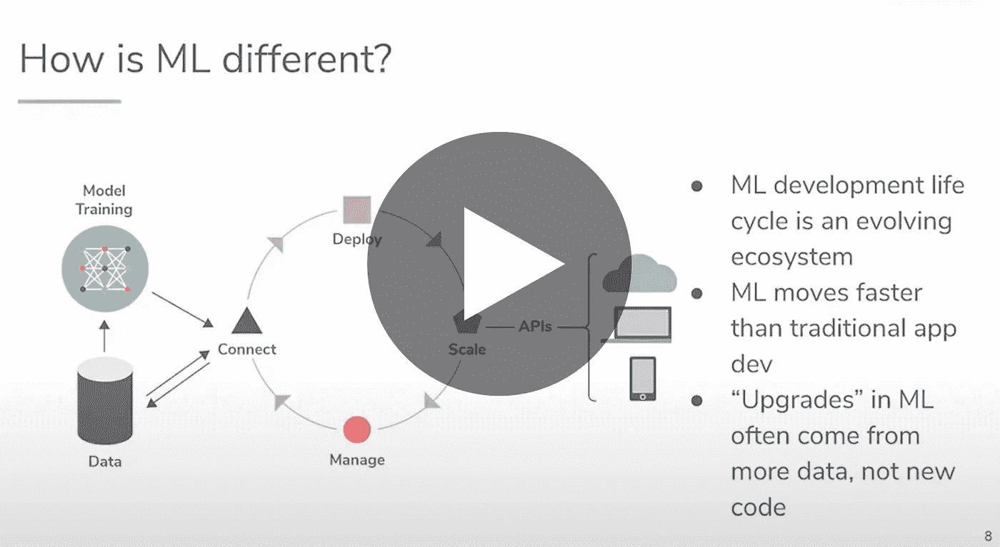

# ML 和其他半真半假的 DevOps 生命周期的过程和工具

> 原文：<https://towardsdatascience.com/devops-for-ml-and-other-half-truths-processes-and-tools-for-the-ml-life-cycle-b642ece2d6c0?source=collection_archive---------43----------------------->

## [活动讲座](https://towardsdatascience.com/event-talks/home)

## 肯尼·丹尼尔| TMLS2019

## 关于演讲者

肯尼·丹尼尔是 Algorithmia 的创始人兼首席技术官。他在攻读博士学位期间，看到了大量从未公开的算法，于是萌生了开发 Algorithmia 的想法。

作为回应，他建立了 Algorithmia 云人工智能层，该层已帮助超过 80，000 名开发人员共享、管道化和消费超过 7000 个模型。

通过与数百家实施 ML 的公司合作，他创建了企业 AI 层，帮助世界上最大的组织部署、连接、管理和保护大规模的机器学习操作。Kenny 拥有卡内基梅隆大学和南加州大学的学位，在那里他学习了人工智能和机制设计。

[ML 和其他半真半假的 DevOps 生命周期的过程和工具](https://www.youtube.com/watch?v=X3SO-QMTX0s)