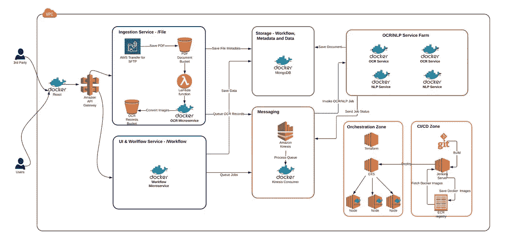
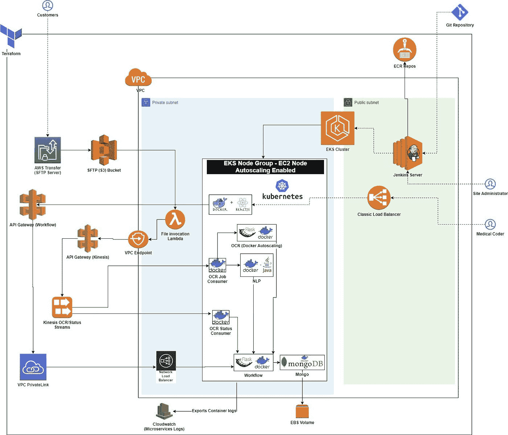
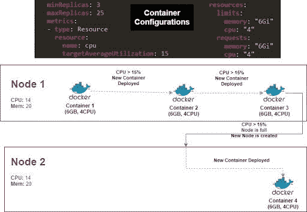

# DevOps —使用亚马逊 EKS、ECS 和 Docker 的无服务器 OCR-NLP 管道

> 原文：<https://towardsdatascience.com/devops-serverless-ocr-nlp-pipeline-using-amazon-eks-ecs-and-docker-9c439ebbce01?source=collection_archive---------41----------------------->

## 我们如何使用由 Docker 和 Kubernetes 驱动的事件驱动微服务架构，自动扩展光学字符识别管道，每天将数千份 PDF 文档转换为文本

图片由[穆罕默德·哈桑](https://pixabay.com/users/mohamed_hassan-5229782/?utm_source=link-attribution&utm_medium=referral&utm_campaign=image&utm_content=4114070)拍摄，来自[皮克斯拜](https://pixabay.com/?utm_source=link-attribution&utm_medium=referral&utm_campaign=image&utm_content=4114070)

在最近的一个项目中，我们被要求创建一个能够将 PDF 文档转换为文本的管道。收到的 PDF 文档通常有 100 页，可以包含打字和手写文本。这些 PDF 文档由用户上传到 SFTP。正常情况下，平均每小时会有 30-40 个文档，但在高峰时期会高达 100 个。由于他们的业务不断增长，客户表示每天需要 **OCR** 多达一千份文档。这些文件然后被输入到一个 NLP 管道中做进一步的分析。

## 让我们做一个概念验证——我们的发现

转换 100 页文档的时间— 10 分钟

执行 OCR 的 Python 进程消耗了大约 6GB RAM 和 4 个 CPU。

> 我们需要找到一种渠道，不仅能满足我们的常规需求，还能在高峰期自动扩展。

## 最终实施

我们决定使用事件驱动的微服务来构建一个无服务器管道。整个过程细分如下:

*   以 PDF 格式上传的文档—使用 SFTP 的 AWS Transfer 处理
*   当上传新的 PDF 文档时触发 S3 事件通知—触发 Lambda 函数
*   Lambda 函数在 Kinesis 流中添加 OCR 事件
*   OCR 微服务被触发-使用 Tesseract 库(每页一个)将 PDF 转换为文本。在 MongoDB 中将文本输出保存为 JSON 文档
*   在 Kinesis 流中添加 NLP 事件
*   NLP 微服务从 MongoDB 读取 JSON。NLP 的最终结果保存回 MongoDB

作者图片

## 技术栈

**数据接收—** AWS SFTP 服务

**微服务—** 存储在亚马逊弹性容器注册表(ECR)中的 Docker 图像

**容器编排**—EC2 节点上的亚马逊弹性库本内特服务(亚马逊 EKS)

**用于容器的无服务器计算引擎—** AWS Fargate

**基础设施供应—** 地形

**消息传递—** 亚马逊 Kinesis 流

## 网络体系结构

作者图片

## 聚类自动缩放

使用水平和垂直缩放的组合来实现集群自动缩放，如下所示:

**垂直缩放—容器**

根据我们的计算，我们能够在给定的 EC2 节点上支持 25 个正在运行的容器。我们用 3 个副本容器(minReplicas=3)启动 OCR 微服务，并将最大值设置为 25 (maxReplicas=25)。我们还设置 targetAverageUtilization=15，这意味着如果容器 CPU 利用率超过 15%，即容器正在处理一个文档，那么**在给定的 EKS 节点上将一个新容器加速到最大值 25。**

作者图片

**水平缩放— EKS 节点**

如果当前 ELS 节点已满**，即 25 个并发运行的容器，则 EKS 会自动提供一个新的 EKS 节点。此后，垂直扩展接管新节点并旋转新容器。**

**通过这种方式，基础架构能够支持数百个 OCR 和 NLP 流程。高峰需求满足后，等待期开始。在等待期到期后，新部署的 EKS 节点和容器会缩减，以便达到最佳资源分配。**

**我希望这篇文章有助于启动您的 DevOps 知识。这些主题是由 [Datafence Cloud Academy](http://www.datafence.com) 提供的 DevOps 课程的一部分。**