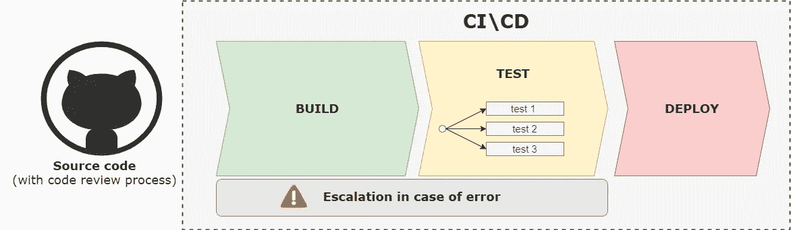
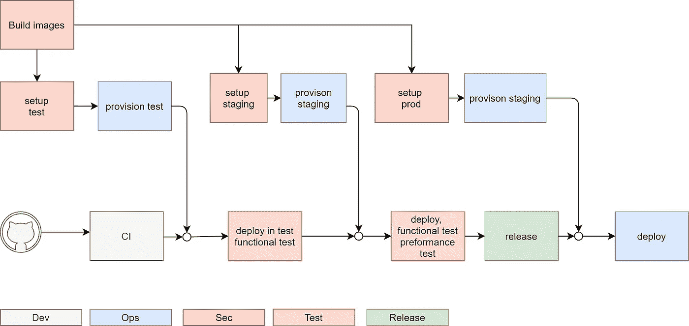

# DevOps:下一个级别

> 原文：<https://towardsdatascience.com/devops-trends-8ccbed85e7af?source=collection_archive---------15----------------------->

## DevOps 的新领域和 2020 年的发展趋势

自从 Patrick Debois 在 2009 年创造了 DevOps 这个术语以来，十多年过去了。在 IT 界，没有什么是确定的。所有的技术和技巧都在沿着我们无法阻挡的创新趋势继续发展。

我们不能仅仅说:“我厌倦了改变；请让我休息一下。”唯一的选择是为变化做好准备。

在 DevOps 中，由于云和市场的兴起，有一个显著的变化，要求总是更高。

DevOps 理念被大多数公司采用，并为质量和成本节约带来了重要的改进。无论如何，DevOps 场景正在不断发展，并适应新的市场需求。

在这篇文章中，我们将分析 DevOps 的新前沿以及与时俱进的知识。让我们看看这篇文章中有哪些最新的趋势可以遵循。

[粘土银行](https://unsplash.com/@claybanks?utm_source=medium&utm_medium=referral)在 [Unsplash](https://unsplash.com?utm_source=medium&utm_medium=referral) 拍摄的照片

# DevOps 增长

简而言之，DevOps 是将开发(Dev)和运营(Ops)集成在一起的实践，创建一个合作过程。

根据 [IDC](https://www.idc.com/getdoc.jsp?containerId=US44193818) 的报告，到 2022 年，DevOps 市场将达到 80 亿美元，而 [Grand View Research](https://www.grandviewresearch.com/press-release/global-development-to-operations-devops-market) 的另一份报告称，到 2025 年将达到 130 亿美元。这意味着公司对这一主题的兴趣越来越大。

促成这种变化的另一个驱动因素是云的上升。根据甲骨文[预测](http://www.oracle.com/us/solutions/cloud/oracle-cloud-predictions-2019-5244106.pdf)，到 2025 年，80%的 IT 解决方案将迁移到云。

自从 DevOps 概念被提出以来，DevOps 实践从未停止过发展，并得到了越来越强大的工具的支持。

这应该是阅读下一章的一个推动，并成为这一演变的一部分。

# 将安全性集成到开发运维流程中

安全性一直很重要，但随着数字服务和敏感数据(生物特征、照片等)存储的使用越来越多。)，是至关重要的。

用户开始询问他们的数据在哪里，如何管理这些数据。我们的客户希望我们保护他们的信息安全。我们不能失败。顺便说一下，用户总是要求更高，我们需要支持敏捷流程来响应变化。

我们不能允许这样的情况，我们完成一个项目或一个重要的功能，然后我们需要提交给 SecOps。我们的项目可能会被 SecOps 停止一周，或者更糟，被拒绝。我们不能仅仅重做所有的工作，因为一些“小”的安全细节被开发人员忽略了。

这不仅仅是一个成本问题。更多的是时机问题。营销不会等待你的内部问题。客户将从其他供应商那里购买该功能。这就是为什么，几乎对于关键项目，我们需要将 DevOps 与 SecOps 集成，从一开始就让安全人员参与进来。

从一开始就牢记安全需求，并让安全团队参与进来，有助于防止发布过程中出现糟糕的情况和摩擦。

如果你有一个 NoOps 过程，这个问题就更重要了。NoOps 带来了更多的自动化，您可能会陷入这样一种境地:不受信任的代码在没有正确监督的情况下进入生产环境。

这种情况可以通过在流水线(或装配线，我们将在下面的段落中读到)中包含和自动化安全测试来解决。

我们不想因为安全漏洞而在报纸上结束，对吧？嗯，我们需要一种方法来整合敏捷性和安全性；这得到了 DevSecOps 哲学的支持。

# NoOPS

NoOps 表示*无操作*。无服务器解决方案的普及和新的自动化前沿使 NoOps 梦想成为可能。它的理念是去除所有的平台管理部分，减少开发者和基础设施之间的摩擦。

正如我在《更好的编程》上发表的文章《 [DevOps 已死，NoOps](https://medium.com/better-programming/devop-noops-difference-504dfc4e9faa) 万岁》中所解释的，对 DevOps 的尊重是:

> DevOps […]意味着你总是需要一些手工劳动。你仍然有一个人在这个过程的大部分背后。这意味着用老方法工作。

NoOps 的目的是定义一种新的过程，在这种过程中，不需要将开发和运营结合起来，因为大多数任务都是自动化的。好处是上市时间更短，质量更好，维护工作更少。

这很有意思。我们可以同意背后的原则，但我们必须意识到故事的另一面:监控和安全。在一个完全自动化的系统中，一切都由代码驱动，谁来负责这些步骤呢？

这个问题的解决方案还是自动化。您需要对每个部分实现自动化，而不再是由一个人来完成，包括监控和安全。这收敛到 DevSecOps 方向。

# 从管道到装配线

当 DevOps 在 2009 年诞生时，典型的场景可能是一个单一的 web 应用程序。这是 MVC 模式发生革命性变化的时候，在我看来这是很久以前的事了。

今天的情况有点不同。在最简单的情况下，我们有两个应用程序(前端 SPA 和后端 API)。通常他们会有不同的发展，并由不同的团队管理。很可能，我们会为下一个项目选择微服务架构。这意味着要部署大量的应用程序和依赖关系。

我们的管道方法似乎相当有限。管道模型非常适合遵循线性模型(提交>编译>测试>部署),其中您的项目很容易用简单的流程来表示。让我们看一个例子。

传统的流水线方法

在图中，我们看到了代码，由到达 CI\CD 工具的 Pull 请求批准，构建并测试。如果在“构建到测试”阶段出现错误，问题将在部署之前提交给正确的解决方案。

这种方法可能仍然适用于大多数项目，但是在许多情况下，它可能是有限制的。

这种新方法类似于工业，它被称为“*装配流水线*”

就像在物理装配流水线中，每个部门都做出自己的贡献，为产品添加“一块”。

使用这种方法，所有参与这一过程的人从一开始就参与其中，并且从一开始就有一个清晰的流程。通过这种方式，许多团队可以合作并管理具有多种依赖关系的复杂场景(来自应用程序、安全性等)..).

装配线合作的一个例子

装配线是对复杂场景中 DevOps 碎片化的响应，需要文化协作作为粘合剂将所有部分结合在一起。此外，我们还需要一个“超级工具”来管理所有这些交互。

基于工业的类比，我们称之为装配岛。坏消息是，大多数常见的 CI\CD 工具本身并不支持这种方法，您将需要与一组工具结合在一起。

# 一切都是一个代码

没有比源代码更好的了。它是可版本化的，可以复制和粘贴，可以通过电子邮件发送，如果你执行两次，你会得到相同的结果。或者说，差不多，这就是我们对好代码的期望。

从历史上看，sysadmin 的事情并不相同。你不能剪切和粘贴一个数据中心，并通过电子邮件发送，对不对？

好消息是你的基础设施可以像源代码一样。

我们已经推出了像 [Ansible](https://www.ansible.com/) 、 [Terraform](https://www.terraform.io/) 或其他自动化框架这样的解决方案。我们可以对我们的脚本进行版本控制，并自动化基础架构管理。

此外，像在 [Kubernetes](/what-exactly-is-kubernetes-52c9f1c4990b) 中那样的基础设施的声明性描述对于理解事物如何工作非常有帮助，而不需要阅读大量的文档或者通过对配置文件进行逆向工程来理解服务器配置。

流程开始时的自动化有助于以正确的方式开始，并为我们提供一个可复制的基础架构，这无疑是一个巨大的帮助(只是想一想灾难恢复或简单地创建一个新环境来测试单个功能)。

# 外卖

DevOps 是一个上升的话题。甚至很多东西都已经写好了；我们需要发展我们的能力以适应趋势。

这一变化中最重要的关键词是:

*   云
*   自动化
*   装配流水线
*   NoOps

它们中的大多数都汇聚到同一个目标:使用技术来改进质量过程。

这种改变可以通过自动化人工任务、在流程中集成安全性和监控来实现，并使用云来加速这一过程。

这怎么可能呢？

我们需要一个工具或一组工具来支持所有的操作，并协调人们的合作，但像往常一样，改变心态是第一步。

感谢您的阅读。

觉得这篇文章有用？在 Medium 上关注我( [Daniele Fontani](https://medium.com/@daniele.fontani) )并查看我在下面 DevOps 上最受欢迎的文章！不要忘记👏这篇文章分享一下吧！

*   [无服务器是 Kubernetes 的末日吗？](/kubernetes-serverless-differences-84699f370609)
*   [DevOps，NoOps，现在 FinOps？](https://medium.com/better-programming/devops-noops-finops-64e0df91bcb8)
*   [如何使用 Kubernetes 部署 Web 应用程序](https://medium.com/swlh/how-to-deploy-an-asp-net-application-with-kubernetes-3c00c5fa1c6e)