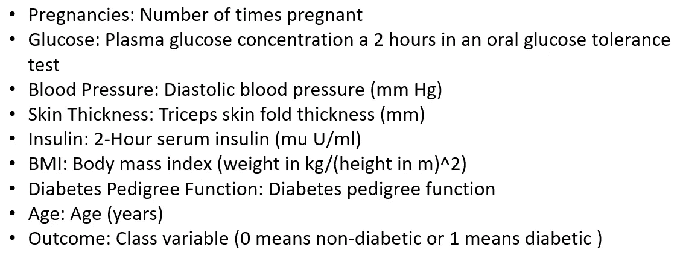
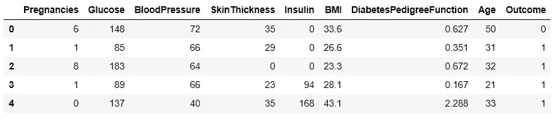
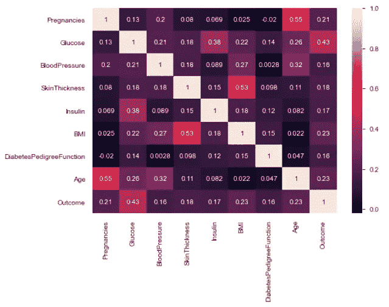
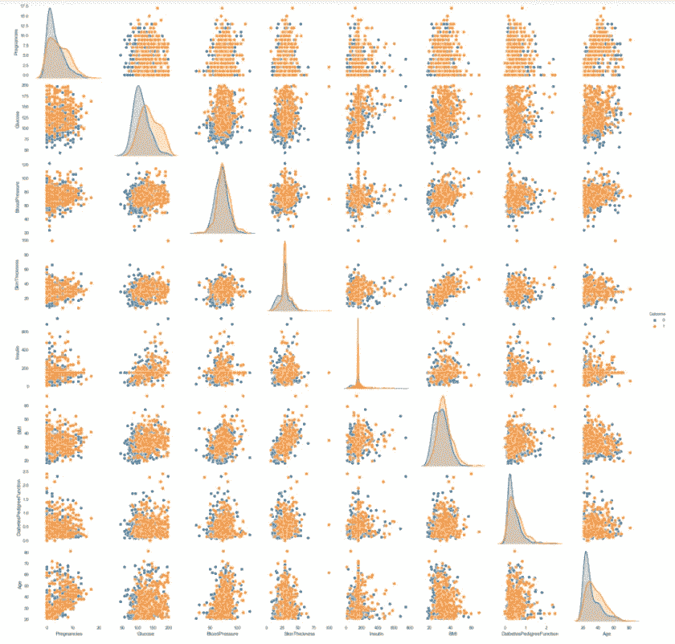
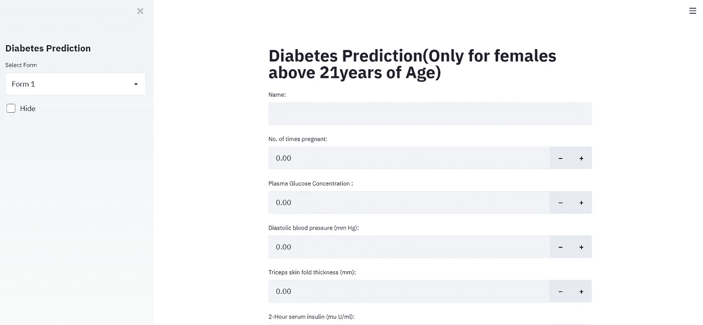

# 使用 Streamlit 的糖尿病预测应用

> 原文：<https://towardsdatascience.com/diabetes-prediction-application-using-streamlit-fed6120124a5?source=collection_archive---------34----------------------->

## 使用 PIMA 印度糖尿病数据集创建机器学习应用程序


马库斯·温克勒在 [Unsplash](https://unsplash.com?utm_source=medium&utm_medium=referral) 上的照片

**Streamlit** 是一个开源的 Python 库，其速度快得惊人，可以轻松地为机器学习和数据科学构建漂亮的定制网络应用。这是一个非常棒的工具，只需要一些 python 知识就可以创建高度交互式的仪表板。

使用 streamlit 创建应用程序会对最终用户产生影响，因为它有一个良好的用户界面，并支持许多用户友好的小部件。在 streamlit 中创建应用程序也很容易。我们将使用 streamlit 创建一个应用程序，它将预测用户是否患有糖尿病。我们将使用的数据集是 [PIMA Indian 糖尿病数据集](https://www.kaggle.com/uciml/pima-indians-diabetes-database)，它包含 8 个预测变量和 1 个目标变量。

让我们看看数据集中有哪些不同的属性。预测变量被命名为结果，其被编码为 0 和 1，其中 0 代表非糖尿病，1 代表糖尿病。其他属性信息如下所示。



# 探索数据集

让我们从探索我们将使用的数据集开始。为了探索数据集，我们将使用 jupyter 笔记本通过 pandas 加载数据集并执行探索性数据分析。

```
import pandas as pd
df = pd.read_csv('Diabetes.csv')
df.head()
```



糖尿病数据集

# 可视化不同的属性:

1.  热图

```
sns.heatmap(df.corr(),annot=True)
```



热图显示不同属性之间的关联。

2.配对图

```
sns.pairplot(df,hue='Outcome')
```



配对图用于显示糖尿病患者和非糖尿病患者之间的相似性和差异。

类似地，我们可以为 EDA 过程创建更多的图，并探索所有属性的不同特性。

我们将在 jupyter 笔记本中创建逻辑回归模型并保存它，以便在我们的 streamlit 应用程序中调用它进行预测。

```
from sklearn.model_selection import train_test_split
from sklearn.linear_model import LogisticRegression
import pickle# Split dataset into training set and test set
X_train, X_test, y_train, y_test = train_test_split(df[['Pregnancies', 'Glucose','BloodPressure','SkinThickness','Insulin','BMI','DiabetesPedigreeFunction','Age']], df['Outcome'], test_size=0.3, random_state=109)#Creating the model
logisticRegr = LogisticRegression(C=1)
logisticRegr.fit(X_train, y_train)
y_pred = logisticRegr.predict(X_test)#Saving the Model
pickle_out = open("logisticRegr.pkl", "wb") 
pickle.dump(logisticRegr, pickle_out) 
pickle_out.close()
```

现在让我们开始创建应用程序。为了创建应用程序，我们需要用 python 创建一个脚本，为此，我们需要在系统中安装一个代码编辑器。你可以使用任何代码编辑器，但是我个人使用 Atom 是因为它的特性。我们将使用逻辑回归来创建预测模型。让我们从导入所需的库开始。

# 加载所需的库

```
import streamlit as st
import pandas as pd
import numpy as np
import plotly.express as px
from plotly.subplots import make_subplots
import plotly.graph_objects as go
import matplotlib.pyplot as plt
import seaborn as sns
import pickle
```

# 调用我们在上面保存的模型:

```
pickle_in = open('logisticRegr.pkl', 'rb')
classifier = pickle.load(pickle_in)
```

# 为应用程序创建用户界面:

Streamlit 为其界面预定义了 UI。我们将使用不同的小部件来显示信息，并接受用户输入进行预测。

```
st.sidebar.header('Diabetes Prediction')
select = st.sidebar.selectbox('Select Form', ['Form 1'], key='1')
if not st.sidebar.checkbox("Hide", True, key='1'):
    st.title('Diabetes Prediction(Only for females above 21years of    Age)')
    name = st.text_input("Name:")
    pregnancy = st.number_input("No. of times pregnant:")
    glucose = st.number_input("Plasma Glucose Concentration :")
    bp =  st.number_input("Diastolic blood pressure (mm Hg):")
    skin = st.number_input("Triceps skin fold thickness (mm):")
    insulin = st.number_input("2-Hour serum insulin (mu U/ml):")
    bmi = st.number_input("Body mass index (weight in kg/(height in m)^2):")
    dpf = st.number_input("Diabetes Pedigree Function:")
    age = st.number_input("Age:")submit = st.button('Predict')if submit:
        prediction = classifier.predict([[pregnancy, glucose, bp, skin, insulin, bmi, dpf, age]])
        if prediction == 0:
            st.write('Congratulation',name,'You are not diabetic')
        else:
            st.write(name," we are really sorry to say but it seems like you are Diabetic.")
```

这将创建应用程序，现在我们需要使用。py”扩展名。例如，如果您需要将应用程序保存为“predict ”,那么您需要将其保存为“predict.py”。为了启动该应用程序，我们将打开 Anaconda 命令提示符并键入下面给出的命令。

```
streamlit run predict.py
```

这将启动我们的应用程序，现在我们可以使用不同的用户输入来创建一个人是否患有糖尿病。



应用程序的主页

通过输入不同用户的信息，我们可以产生不同的结果，并看到我们的模型有多好和准确。

这只是 streamlit 所能做的一个例子。您可以探索更多信息，了解 streamlit 为创建网络应用和仪表盘提供的无限功能。创建您的应用程序，并在本文的回复中分享您的经验。

[](/exploratory-data-analysis-using-dora-ac596e5a32a6) [## 使用 Dora 进行探索性数据分析

### 自动化探索性数据分析和数据建模

towardsdatascience.com](/exploratory-data-analysis-using-dora-ac596e5a32a6) [](/technical-analysis-of-stocks-using-ta-lib-305614165051) [## 使用 TA-Lib 对股票进行技术分析

### 技术分析 python 库

towardsdatascience.com](/technical-analysis-of-stocks-using-ta-lib-305614165051) 

# 在你走之前

***感谢*** *的阅读！如果你想与我取得联系，请随时通过 hmix13@gmail.com 联系我或我的* [***LinkedIn 个人资料***](http://www.linkedin.com/in/himanshusharmads) *。也可以在我的*[***Github****中查看我在这里使用过的代码和数据集。*](https://github.com/hmix13/DiabetesApplication) *还有，随意探索* [***我的简介***](https://medium.com/@hmix13) *阅读我写过的与数据科学相关的不同文章。*