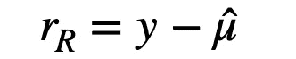
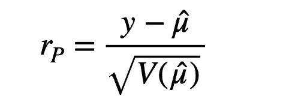
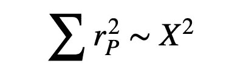
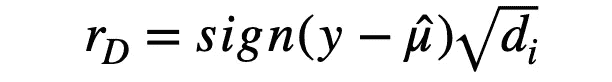
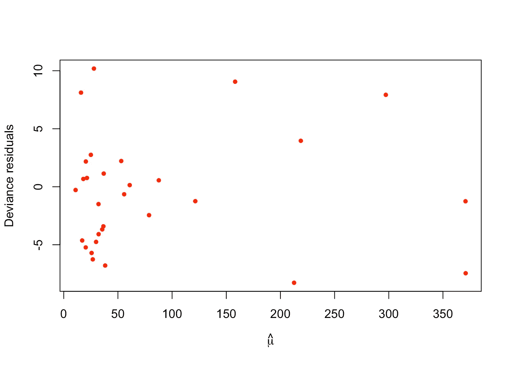
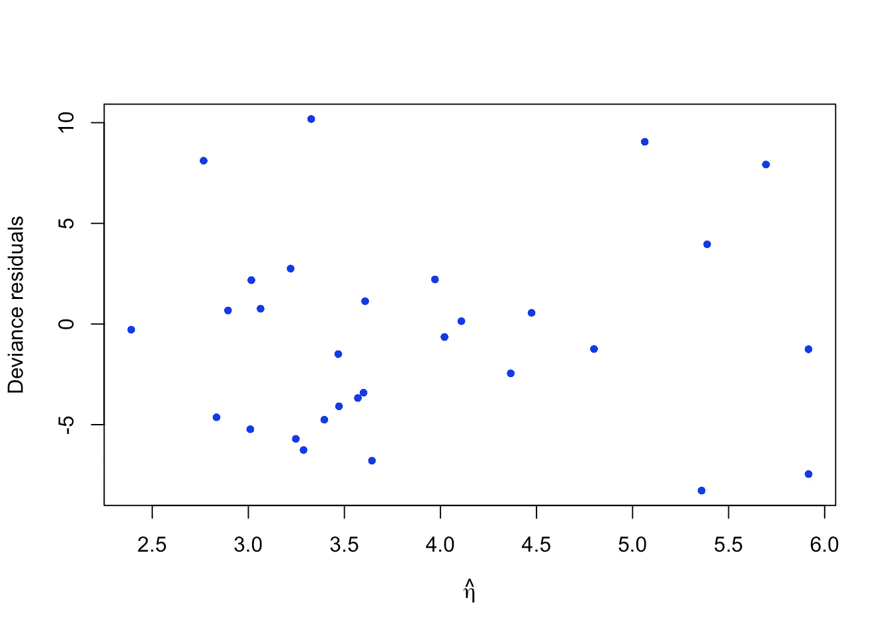
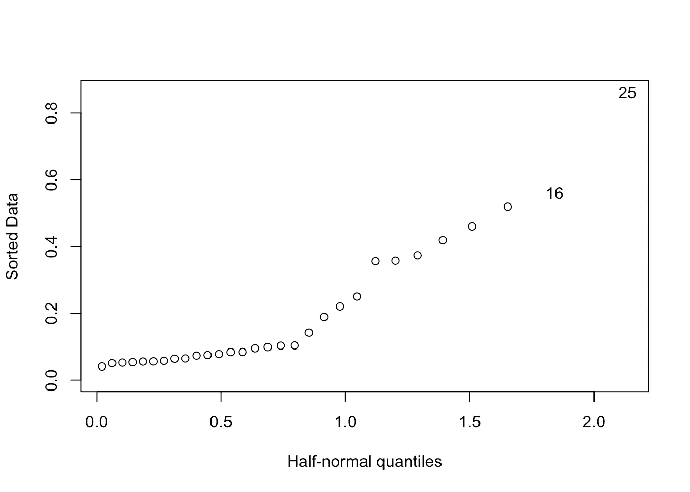
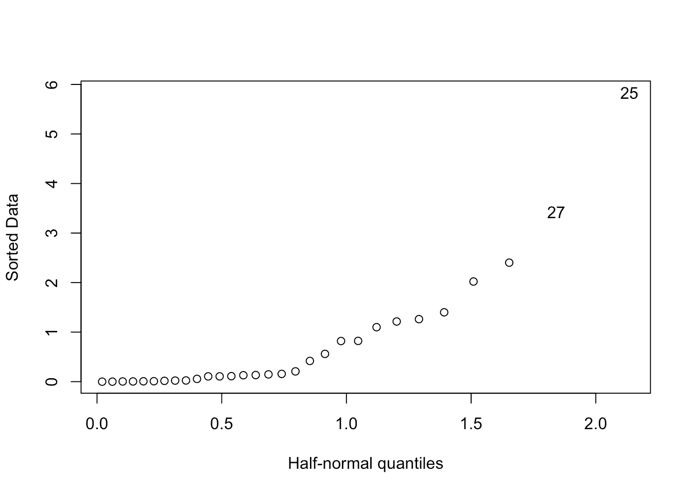

# 诊断广义线性模型

> 原文：<https://towardsdatascience.com/diagnose-the-generalized-linear-models-66ad01128261?source=collection_archive---------8----------------------->

## 广义线性模型

## 检查 r 中 GLM 的模型假设和异常值。


[内森·安德森](https://unsplash.com/@nathananderson?utm_source=medium&utm_medium=referral)在 [Unsplash](https://unsplash.com?utm_source=medium&utm_medium=referral) 上拍照

G 一般化线性模型( *GLM* )之所以受欢迎，是因为它可以处理多种不同响应变量类型的数据(如 [*二项式*](/why-is-logistic-regression-the-spokesperson-of-binomial-regression-models-54a65a3f368e) *、* [、泊松](/adjust-for-overdispersion-in-poisson-regression-4b1f52baa2f1) *，或者* [*多项式*](/multinomial-models-for-nominal-data-8b7467201ca9) )。

与*非线性*模型相比，例如*神经网络*或*基于树的*模型，线性模型在预测方面可能没有那么强大。但是*解释的简单性*使得它仍然具有吸引力，尤其是当我们需要理解每个预测因素是如何影响结果的时候。

GLM 的缺点和优点一样明显。线性关系可能并不总是成立的，它对异常值非常敏感。因此，不进行诊断就安装 GLM 是不明智的。

在这篇文章中，我将简要地谈谈如何诊断一个广义线性模型。实现将用 R 代码展示。

主要有两种类型的诊断方法。一个是**异常值检测**，另一个是**模型假设**检验。

## 残差

在深入诊断之前，我们需要熟悉几种类型的残差，因为我们将在整个帖子中使用它们。在高斯线性模型中，残差的概念非常直接，它基本上描述了预测值(通过拟合的模型)和数据之间的差异。



响应残差

在 GLM 中，它被称为“响应”残差，这只是一种有别于其他类型残差的符号。

响应的方差在 GLM 不再是常数，这导致我们对残差进行一些修改。

如果我们根据估计的标准误差重新调整响应残差，它就变成了皮尔逊残差。



皮尔逊残差

你可能会看到一些人使用估计值的平方根而不是标准误差作为上式的分母。这是因为他们使用的是*泊松*模型，其中估计方差*等于估计均值*。所以，不要混淆，它们是一回事。

皮尔逊残差的特征之一是皮尔逊残差平方和近似遵循*卡方*分布。



皮尔逊残差的平方和近似遵循卡方分布

这一特性启发研究人员使用另一种类型的残差，称为偏差残差，其平方和也遵循卡方分布。

*注意:*模型的偏差仅描述拟合优度，它专门计算完全(饱和)模型的对数似然性与考虑中的模型(您为拟合而构建的模型)的对数似然性之间的差异。高偏差表明模型拟合不好。

每个数据点都有自己对模型偏差的贡献。如果我们根据拟合值和数据之间的差异给这些*个体偏差*中的每一个分配一个方向，我们就得到偏差残差。



偏差残差

通常，在 GLMs 的诊断中，偏差残差优于其他类型的残差。

在 R 中，使用“残差”函数实现这些不同类型的残差是很简单的。

```
# R code
# Suppose your fitted model is modresiduals(mod,type = "response") ## response residuals
residuals(mod,type = "pearson") ## pearson residuals
residuals(mod,type = "deviance") ## deviance residuals
```

函数‘residuals’的**默认**性能是**偏差残差**，所以如果您忘记将‘type’参数传递给函数，也不用担心。

## 模型诊断

残差与拟合值的关系图是诊断中最重要的图形。该图旨在检查残差和拟合值之间是否存在非线性。

GLMs 和高斯线性模型之间的一个区别在于，GLM 中的拟合值应该是在通过连接函数转换之前的值，然而在高斯模型中，拟合值是预测的响应。

让我们以下面的泊松模型为例。记住泊松回归模型是这样的:


泊松模型

让我们首先绘制残差与估计值(mu_i)的关系图。

```
# R code
mod_pois = glm(Species ~ ., family=poisson,gala) # gala is the example dataset in package "faraway" plot(residuals(mod_pois) ~ predict(mod_pois,type="response"),xlab=expression(hat(mu)),ylab="Deviance residuals",pch=20,col="red") 
```



相对于估计值的偏差残差

我们可以看到大部分点都挤在了图的左侧，很难解读。因此，最好不要检查链接函数的转换。

```
# R code
plot(residuals(mod_pois) ~ predict(mod_pois,type="link"),xlab=expression(hat(eta)),ylab="Deviance residuals",pch=20,col="blue")
```



相对于\eta 的偏差残差

如果满足模型的假设，我们确实期望图中有恒定的变化，因为偏差残差不应该有已经重新调整的非恒定变化。如果图中有明显的非线性，就会发出警告信号。然而，该图看起来没有任何非线性。

假设剧情出现了明显的非线性，怎么办？

通常，从改变链接函数或转换响应变量开始是不明智的。链接函数的选择通常受限于响应数据的自然特征，例如，泊松模型要求响应变量为正。同样，响应变量的转换将违反响应的假定分布。

有两件事值得一试:

1.  更改模型类型。例如，利用*负二项式模型*，而不是泊松模型。
2.  对预测值做一些转换，比如 log()、sqrt()等等…

## 离群点检测

GLMs 诊断的另一个重要部分是检测异常值。它可以是定量的*或图形的*。**

**在检测异常值的定量方法中，基本思想是找到那些对模型具有异常大的影响的点或者拟合模型最敏感的点。**

**在拟合模型上可以使用两个指标:杠杆*和库克距离*。这是 r 中的代码。****

```
**# R code
i_n = influence(mod_pois)$hat # calculate the influence of data points
which.max(i_n)**
```

**这产生了，**

```
**## SantaCruz 
##        25**
```

**这意味着数据点“SantaCruz”对拟合泊松模型的影响最大。**

**如果我们应用库克的距离度量，它将产生相同的结果。**

```
**# R code
c_d = cooks.distance(mod_pois)
which.max(c_d)**
```

**结果是，**

```
**## SantaCruz 
##        25**
```

**我们还可以使用 QQ 图来图形化地检测异常值。与高斯线性模型诊断的一个区别是，在 GLM 诊断中，我们不在 QQ 图中寻找直线，因为残差预计不会呈正态分布。GLM 的 QQ 图的唯一目的是找出数据中的异常值。**

```
**# R code
halfnorm((i_n))**
```

****

**杠杆作用的 QQ 图**

```
**# R code
halfnorm((c_d))**
```

****

**库克距离的 QQ 图**

**这些方法建议进一步调查数据点“25 `SantaCruz`”。**

## **外卖**

1.  **在 GLMs 中运行诊断非常重要。**
2.  **两个方面需要研究:模型假设和异常值。**
3.  **必要时，对预测变量进行转换，但不对响应变量进行转换。**
4.  **移除定量和图形化检测到的异常值。**

**希望这篇帖子对你有帮助。**

## **参考资料:**

**远方，Julian J. *用 R 扩展线性模型:广义线性、混合效应和非参数回归模型*。CRC 出版社，2016。**

**[](https://www.datascienceblog.net/post/machine-learning/interpreting_generalized_linear_models/) [## 解释广义线性模型

### GLMs 允许在响应变量具有非正态误差分布的情况下使用线性模型…

www.datascienceblog.net](https://www.datascienceblog.net/post/machine-learning/interpreting_generalized_linear_models/)  [## RPubs

### 编辑描述

rpubs.com](https://rpubs.com/benhorvath/glm_diagnostics) [](https://bookdown.org/egarpor/PM-UC3M/glm-diagnostics.html) [## 5.7 模型诊断|预测建模说明

### 正如第 5.2 节所暗示的，广义线性模型是建立在一些概率假设上的，这些假设是…

bookdown.org](https://bookdown.org/egarpor/PM-UC3M/glm-diagnostics.html) 

扎克·杜兰特在 [Unsplash](https://unsplash.com?utm_source=medium&utm_medium=referral) 上的照片**