# 用机器学习诊断心脏病

> 原文：<https://towardsdatascience.com/diagnostic-for-heart-disease-with-machine-learning-81b064a3c1dd?source=collection_archive---------15----------------------->

## 我们能用核磁共振诊断心脏病吗？你打赌！


目录表

1.  *摘要*
2.  *背景*
3.  *材料&方法*
4.  *结果&结论*
5.  *参考文献*

# **1。摘要**

根据疾病控制和预防中心(CDC)的数据，心脏病是美国男性、女性和大多数种族和民族人群的头号死因。在美国，每分钟都有一个以上的人死于这种疾病，每年有近 50 万人死于这种疾病，每年造成数十亿美元的损失。⁴因此，这个故事的目的是研究不同的潜在监督机器学习(ML)算法，以创建诊断心脏病模型。

# **2。背景**

为了进行这种分析，使用公开可用的克利夫兰心脏病数据集用 Python 构建了一个 [Jupyter notebook](https://nbviewer.jupyter.org/github/stevensmiley1989/Cleveland_Dataset/blob/master/Cleveland.ipynb) ，该数据集有 300 多个独特的实例，共有 76 个属性。⁵ ⁶ ⁷ ⁸ ⁹从这 76 个总属性中，只有 14 个常用于研究至今。此外，该分析中使用的超参数来自 Olson 博士的建议，“将机器学习应用于生物信息学问题的数据驱动建议。”⁰在这个分析中使用的库和编码包是:SciPy，Python，NumPy，IPython ⁴，Matplotlib ⁵，熊猫⁶，Scikit-Learn ⁷，和 Scikit-Image。⁸

# 克里夫兰 dataset⁵ ⁶ ⁷ ⁸ ⁹的背景

克利夫兰数据库的实验集中在简单地试图区分心脏病的存在和不存在。使用的 14 个属性:

表 1。克利夫兰数据集 14 特征和描述。

# olson 博士超参数建议的背景

Randal S. Olson 等人在 2017 年发表的一篇文章为解决机器学习的生物信息学问题提供了有见地的最佳实践建议，[“将机器学习应用于生物信息学问题的数据驱动建议”](https://arxiv.org/abs/1708.05070)。

简要地看一下摘要，他们分析了“13 种最先进的、常用的机器学习算法，这些算法针对一组 165 个公开可用的分类问题，以便为当前的研究人员提供数据驱动的算法建议。”有趣的是，这个数据集并没有包含在他们论文的[表 2](https://arxiv.org/abs/1708.05070) 的分析中。这使得它成为实验的一个很好的候选，因为它是使用 ML 的生物信息学中的一个二元分类问题。

通过他们的研究，他们能够提供“五种具有超参数的算法的建议，这些算法可以最大限度地提高测试问题的分类器性能，以及将机器学习应用于监督分类问题的一般指南。”这些建议概述如下:

表二。奥尔森博士的超参数建议摘要。⁰

# 3.材料和方法

## 导入库

## 导入和查看数据

表 3。导入后克利夫兰数据集的前 10 行原始数据。

将二进制分类的诊断列值更改为 0 或 1 之间。

```
*# Change num values > 0 to 1 for a Diagnosis* 
data['diagnosis'] = np.where((data['diagnosis']>0),1,0)
```

检查有关数据的信息以了解其类型。

```
data.info() *# view*
```

有两个包含`object`值的特性:

1.  #通过荧光镜检查着色的主要血管
2.  地中海贫血

在这两个特征中，有一个唯一的值`?`,表示缺少一个值。这是从以下内容中发现的:

```
data['# Major Vessels colored by Flouroscopy'].unique()data['Thalassemia (norm.,fix. defect, revers. defect)'].unique()
```

两者分别只有 4 次和 2 次计数。假设实例数量不多，因此这些实例按如下方式删除:

```
sum(data['# Major Vessels colored by Flouroscopy'].values=='?')droplist=data.loc[data['# Major Vessels colored by Flouroscopy']=='?'].index.tolist()data.drop(droplist,axis=0,inplace=**True**)data['# Major Vessels colored by Flouroscopy']=data['# Major Vessels colored by Flouroscopy'].astype(str).astype(float).astype(int)sum(data['Thalassemia (norm.,fix. defect, revers. defect)'].values=='?')droplist=data.loc[data['Thalassemia (norm.,fix. defect, revers. defect)']=='?'].index.tolist()data.drop(droplist,axis=0,inplace=**True**)data['Thalassemia (norm.,fix. defect, revers. defect)']=data['Thalassemia (norm.,fix. defect, revers. defect)'].astype(str).astype(float).astype(int)
```

此外，还使用以下方法检查缺失值:

```
data.isnull().sum()
```

此时，没有丢失的值。

## 特征工程

如上所述的一些分类值只有几个唯一值。对这些值使用分类编码是一个很好的实践，这样 ML 算法就不会过度适应唯一的值。将这些转换成二进制允许 ML 算法以较少偏差的方式处理数据，而不会丢失任何信息。

表 4。特征工程后克利夫兰数据集的前 5 行原始数据。

接下来，清理和特征工程后的克利夫兰数据集直方图如图 0 所示。这个数字和心脏病的结果有一些明显的关系。

例如，看左上方的年龄支线图，在 60 岁左右，心脏病患者的数量相对于该年龄没有疾病的人增加了近一倍。另外，看性爱的支线剧情，很明显男性(值= 1)比女性(值=0)患心脏病的次数多。还有更多的关系，但关键是这些关系是存在的，而且是牢固的。因此，最大似然算法应该利用这些来进行诊断。

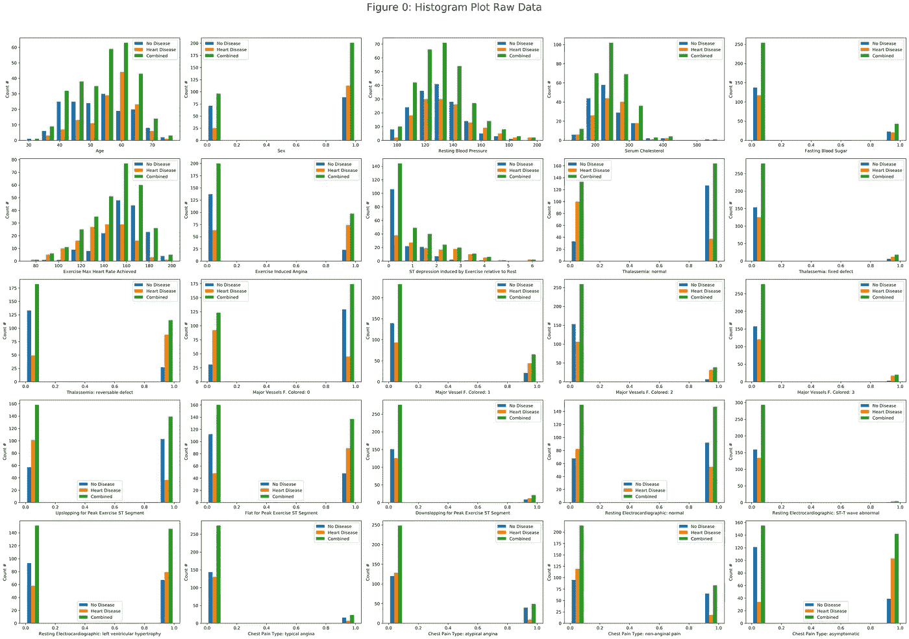

图 0。清理和特征工程后克利夫兰数据集的直方图。

## 缩放数据

缩放数据非常重要，这样 ML 算法就不会过度拟合错误的要素。使用`MinMaxScaler()`，根据 0 和 1 之间的最小值和最大值，对每个特征的值进行缩放。这防止了信息丢失，但是允许 ML 算法用数据正确地训练。

```
X = data.drop(['diagnosis'], axis= 1)
y= pd.DataFrame(data['diagnosis'])

*#Scale Data*
scaler = MinMaxScaler()
X=MinMaxScaler().fit_transform(X.values)
X = pd.DataFrame(X)
X.columns=(data.drop(['diagnosis'], axis= 1)).columns
```

表 5。克利夫兰的前 5 行缩放数据。

## 具有皮尔逊相关系数的特征热图

皮尔逊相关系数值接近 1 表示强相关。因此，当查看热图(图 1)时，与第一列“诊断”最相关的值对于训练 ML 算法将非常重要。其他特征之间接近 1 的值是不理想的，因为该信息已经存在用于训练 ML 算法。这在统计学上叫做多重共线性。看来`Major Vessels F. Colored: 0`和`Thalassemia:normal`的特征与`diagnosis`具有最强的相关性，皮尔逊相关系数为 0.24。这不是很大的相关性，因此 ML 模型不太可能具有心脏病诊断所需的准确性，但这并不妨碍诊断的有效模型，因为它是基于受试者工作特征(ROC)曲线的曲线下面积(AUC)。

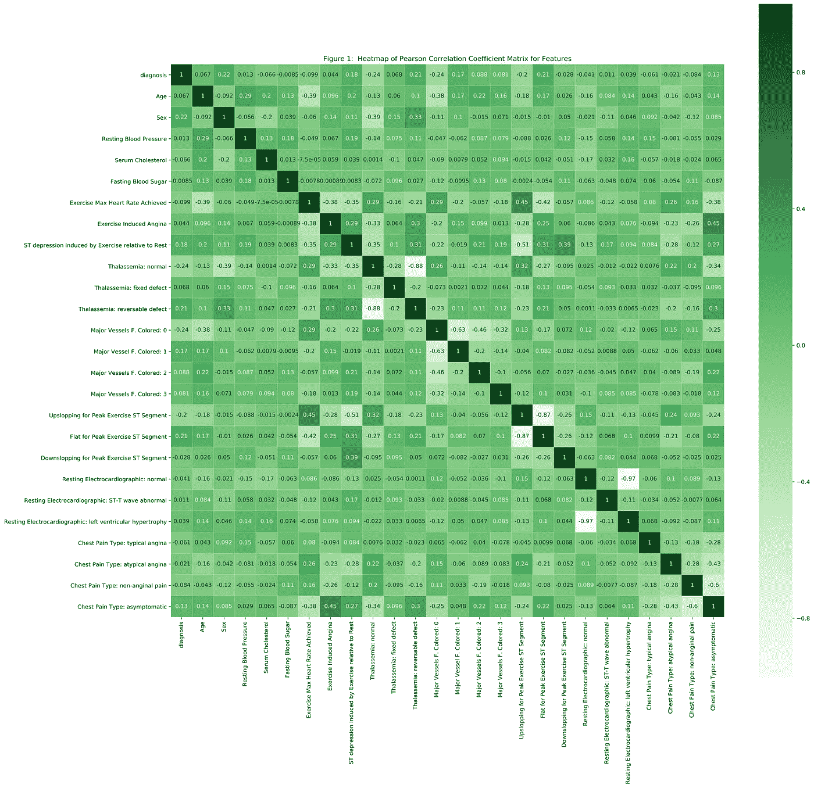

图一。清理、要素工程和缩放后的克利夫兰数据集的热图。

## 为培训拆分数据

在删除了 6 个缺失值的实例后，数据被分成 80%的培训(237 人)和 20%的测试(60 人)。这是拆分数据以训练 ML 算法的一般经验法则。

```
X_train, X_test, y_train, y_test = train_test_split(X, y, test_size= 0.2, random_state= 42) *#withold 20% of data for testing*
```

## 机器学习

为了找到一个好的模型，在训练数据集上测试了几种算法。使用算法的不同超参数的敏感性研究用 GridSearchCV 迭代，以便优化每个模型。通过查看训练数据和验证数据结果，最佳模型是具有最高准确性而不会过度拟合的模型。对于这些模型来说，计算机时间似乎不是问题，所以它对模型之间的决策没有什么影响。代码和细节请看 [Jupyter 笔记本](https://nbviewer.jupyter.org/github/stevensmiley1989/Cleveland_Dataset/blob/master/Cleveland.ipynb)。

使用 GridSearchCV 通过 k-fold 交叉验证评估模型，k-fold = 10，GridSearchCV 迭代不同算法的超参数。测试了几个新的超参数，以及奥尔森博士的分析中没有包括的一个附加算法。新算法是一个神经网络，多层感知器(MLPClassifier)。

表 6。GridSearchCV 使用的超参数和算法摘要。

## 评估模型

**查看混淆矩阵图**

*图二。答 3。答 4。答，5。答，6。答，7。答，8。答，9。答，10。答，11。答，12。答和 13。答*

当涉及到诊断心脏病时，我们希望确保我们没有太多的假阳性(你没有心脏病，但被告知你做了并得到了治疗)或假阴性(你有心脏病，但被告知你没有得到治疗)。因此，选择总体精度最高的模型(精度是混淆矩阵上对角线的总和除以总和)。您可以看到，所有模型的假阳性和假阴性都不到几个，这意味着它们都相当准确，因为测试集有 60 个观察值。

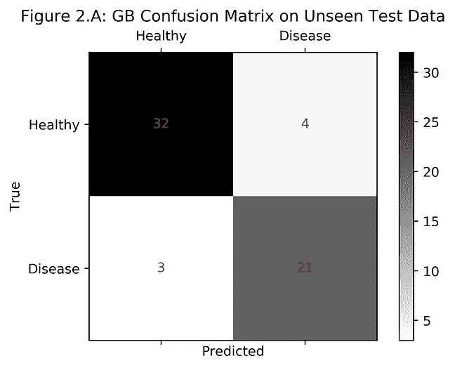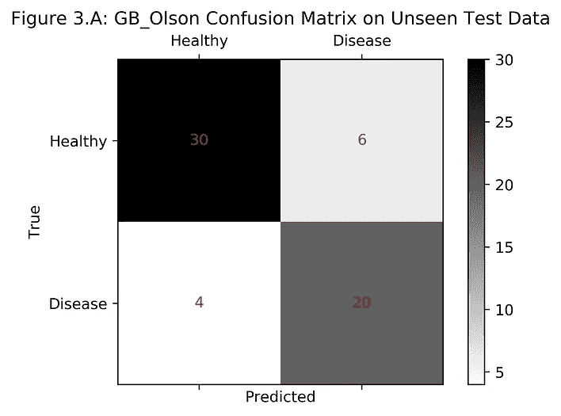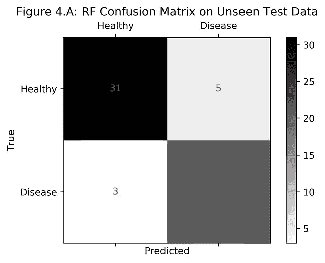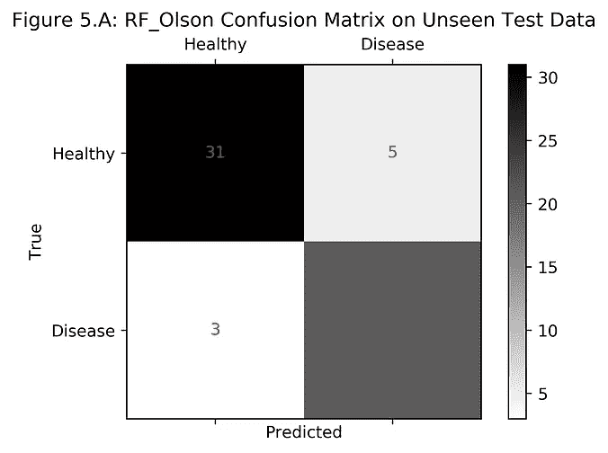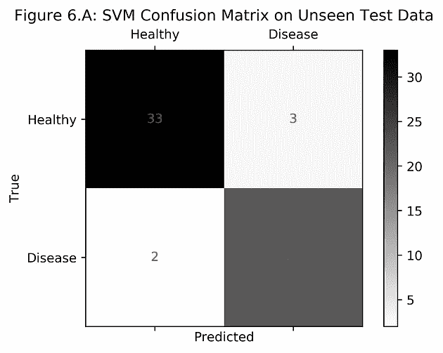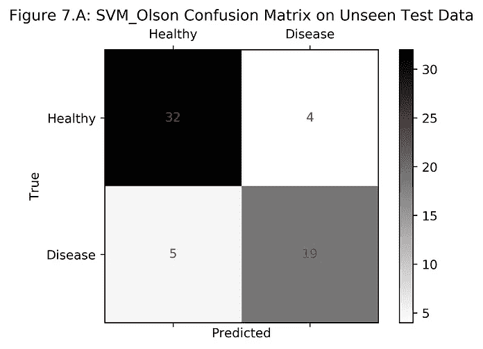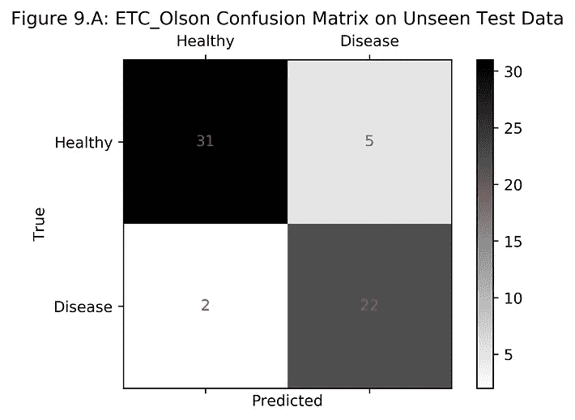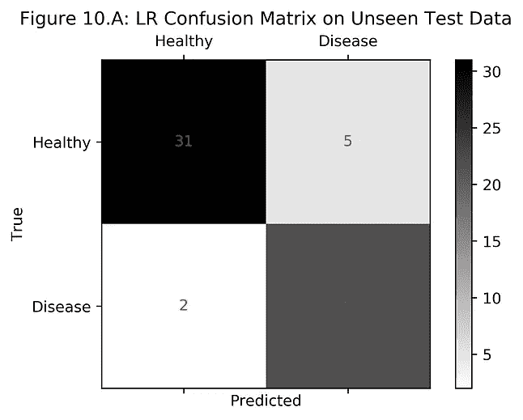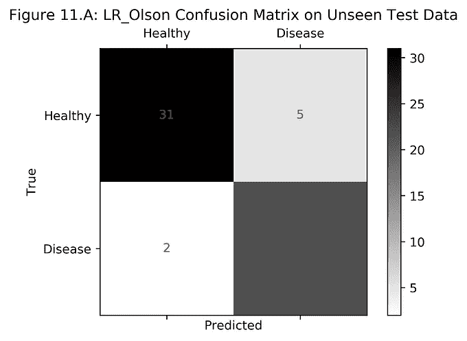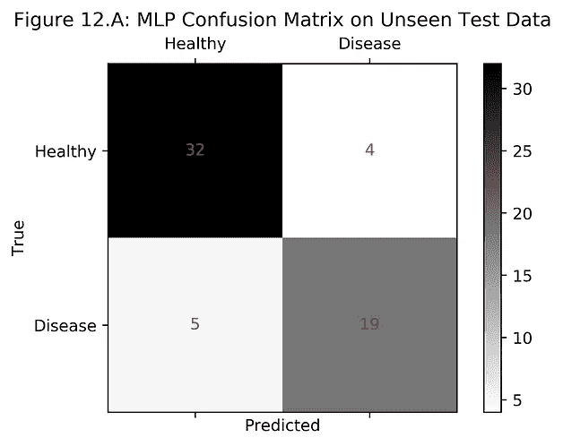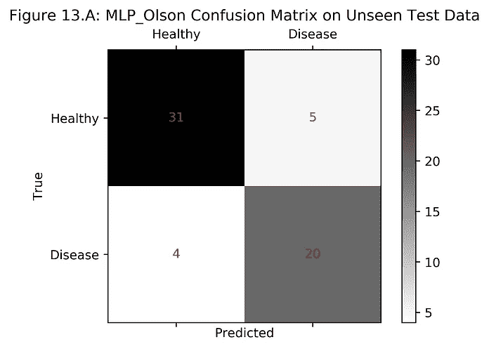

**查看变量重要性图**

*图二。b，3。b，4。b，5。b，8。b 和 9。B*

大多数`ensemble`模型都有一个名为`predict_proba`的参数，该参数允许通过`gini`指数或`entropy`的多数投票，根据模型的概率输出最重要的特征。这 5 个最重要的变量出现在所有这些变量重要性图中:

*   `Exercise Max Heart Rate Achieved`
*   `Major Vessels F. Colored: 0`
*   `ST depression induced by Exercise relative to Rest`
*   `Thalassemia: reversable defect`
*   `Thalassemia: normal`

毫不奇怪，在图 1 的热图中，这些相同的变量也显示出与诊断的高度相关性。因此，这些变量变得如此重要是有道理的。

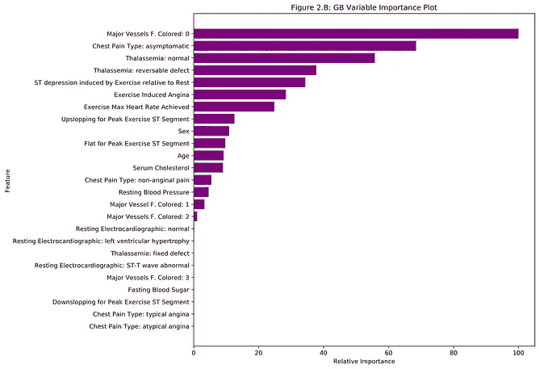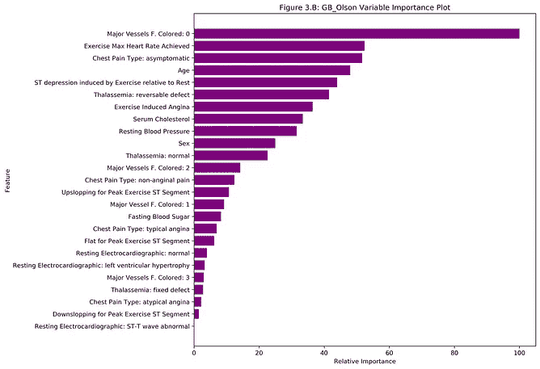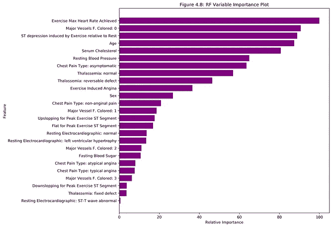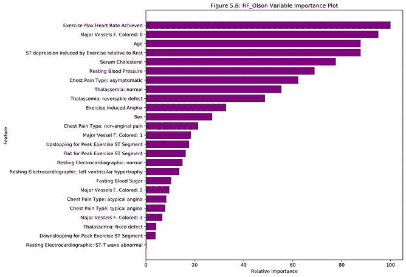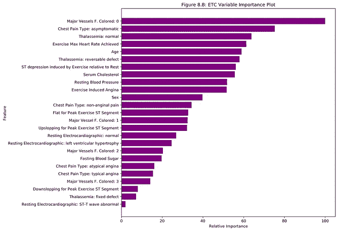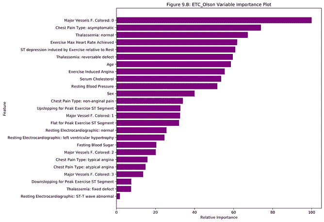

**查看接收机工作特性(ROC)曲线**

*图 14*

所有模型的受试者操作特征(ROC)曲线都有`Excellent`曲线下面积(AUC ),因为它们的值都大于 90%(所有值都接近 95%),这意味着它们都可以作为优秀的诊断。这也表现在它们的高特异性和灵敏度值上。

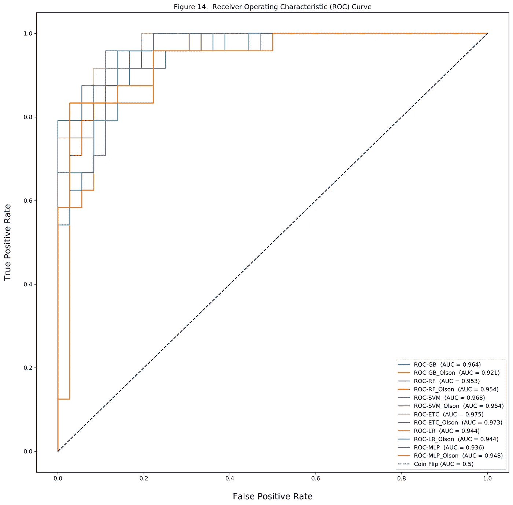

# 4.结果和结论

所有模型在微调其超参数后都表现良好，但最佳模型是具有最高总体准确性的模型。

在该分析中，`Support Vector Machine (SVM)`和`Multilayer Perceptron Classifier (MLP)`并列获得最高的整体精度，`91.7%`(见下表 7)。然而，`SVM`的 AUC`96.8%`比`MLP`的 AUC`93.6%`高。这意味着`SVM`在这种情况下是更好的诊断模型，但并不意味着`SVM`在所有情况下都是最好的模型。所有这一切意味着，对于给定的测试集，这个模型表现最好。在这个测试中 20%的数据(60 个随机个体)中，只有少数几个在所有模型中被误诊。没有一个模型是完美的，但是这些结果是有希望的。如果平均来说，测试集中少于几个人被如此准确和精确地误诊，这是一个好的开始。显然，未来的目标是找到更好的度量标准来训练和测试 ML 算法或更多的数据。

**这里的关键是，由于受试者工作特征(ROC)曲线的曲线下面积(AUC)如此之高，心脏病的诊断是可能的。所有值都大于 90%，诊断结果非常好。**

表 7。统计结果汇总。

# 5.参考

1.  Heron，M. [死亡:2017 年的主要原因](https://www.cdc.gov/nchs/data/nvsr/nvsr68/nvsr68_06-508.pdf)。*国家人口动态统计报告*；68(6).2019 年 11 月 19 日接入。
2.  本杰明·EJ、蒙特纳·P、阿朗索·A、比滕考特·MS、卡拉威·CW、卡森·AP 等,《心脏病和中风统计——2019 年更新:美国心脏协会的一份报告》。*循环*。2019;139(10):e56–528。
3.  Fryar CD，Chen T-C，Li X. [心血管疾病未控制危险因素的患病率:美国，1999–2010](https://www.cdc.gov/nchs/data/databriefs/db103.pdf)。NCHS 数据简报，第 103 号。马里兰州 Hyattsville:国家卫生统计中心；2012.2019 年 5 月 9 日接入。
4.  Dua d .和 Graff c .(2019 年)。http://archive.ics.uci.edu/ml 的 UCI 机器学习库。加州欧文:加州大学信息与计算机科学学院。
5.  匈牙利心脏病研究所。布达佩斯:[安朵斯·雅诺西，医学博士](https://archive.ics.uci.edu/ml/datasets/heart+Disease)
6.  瑞士苏黎世大学医院:[医学博士威廉·斯坦布伦](https://archive.ics.uci.edu/ml/datasets/heart+Disease)
7.  瑞士巴赛尔大学医院:[医学博士马蒂亚斯·普菲斯特勒](https://archive.ics.uci.edu/ml/datasets/heart+Disease)
8.  V.A .医疗中心，长滩和克里夫兰诊所基金会: [Robert Detrano，医学博士，哲学博士](https://archive.ics.uci.edu/ml/datasets/heart+Disease)
9.  Olson，Randal S .等人[“将机器学习应用于生物信息学问题的数据驱动建议”。](https://arxiv.org/abs/1708.05070)“太平洋生物计算研讨会。太平洋生物计算研讨会 23(2017):192–203。
10.  [SciPy。(2019)SciPy 1.0-Python 中科学计算的基本算法。预印本 arXiv:1907.10121](https://scipy.org)
11.  [**巨蟒。**](https://www.python.org) a)特拉维斯·芬特。科学计算的 Python，科学计算&工程，9，10–20(2007)b)k . Jarrod mill man 和 Michael Aivazis。面向科学家和工程师的 Python，科学计算&工程，13，9–12(2011)
12.  [**NumPy。**](https://numpy.org) a)特拉维斯·芬特。美国 NumPy 指南:特雷戈尔出版公司(2006 年)。(b)斯蒂芬·范德沃特、克里斯·科尔伯特和盖尔·瓦洛夸。NumPy 数组:高效数值计算的结构，科学计算&工程，13，22–30(2011)
13.  [**IPython。**](https://ipython.org) a)费尔南多·佩雷斯和布莱恩·e·格兰杰。IPython:交互式科学计算系统，科学计算工程，9，21–29(2007)
14.  [**Matplotlib。**](https://matplotlib.org) J. D. Hunter，“Matplotlib:一个 2D 图形环境”，科学计算&工程，第 9 卷，第 3 期，第 90–95 页，2007 年。
15.  [熊猫。](https://pandas.pydata.org) 韦斯·麦金尼。Python 中统计计算的数据结构，第 9 届科学中的 Python 会议录，51–56(2010)
16.  [**Scikit-Learn。**](https://scikit-learn.org/stable/) 法比安·佩德雷戈萨、加尔·瓦洛夸、亚历山大·格拉姆福特、文森特·米歇尔、贝特朗·蒂里翁、奥利维耶·格里塞尔、马蒂厄·布隆德尔、彼得·普雷顿霍弗、罗恩·韦斯、文森特·杜伯格、杰克·范德普拉斯、亚历山大·帕索斯、大卫·库尔纳波、马蒂厄·布鲁彻、马蒂厄·佩罗特、爱德华·杜谢斯奈。sci kit-learn:Python 中的机器学习，机器学习研究杂志，12，2825–2830(2011)
17.  [**Scikit-Image。**](https://scikit-image.org) 斯蒂芬·范德沃特、约翰内斯·l·舍恩伯格、胡安·努涅斯-伊格莱西亚斯、弗朗索瓦·布洛涅、约书亚·d·华纳、尼尔·雅戈、伊曼纽尔·古雅特、托尼·于和 scikit-image 供稿人。sci kit-Image:Python 中的图像处理，PeerJ 2:e453 (2014)