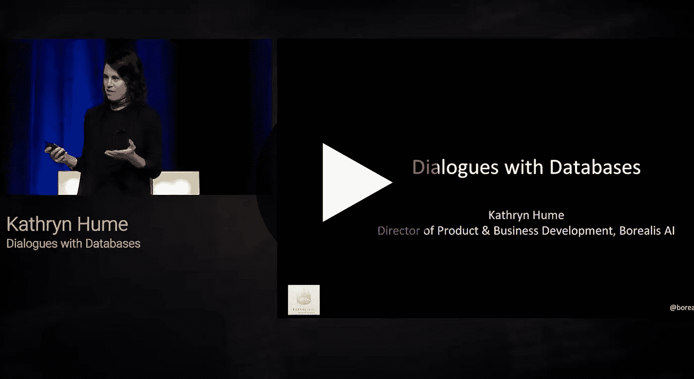

# 与数据库的对话

> 原文：<https://towardsdatascience.com/dialogues-with-databases-d0eefa754f81?source=collection_archive---------84----------------------->

## [活动讲座](https://towardsdatascience.com/event-talks/home)

## 凯瑟琳·休姆| TMLS2019

[在多伦多机器学习峰会上的演讲](https://torontomachinelearning.com/)

## 关于演讲者

Kathryn Hume 领导加拿大皇家银行机器学习研究实验室 Borealis AI 的产品和业务开发。在加入 Borealis AI 之前，Kathryn 曾在 integrate.ai 和 Fast Forward Labs(被 Cloudera 收购)担任领导职务。她已经帮助 50 多家财富 500 强公司开发了机器学习应用程序，是人工智能道德和负责任部署方面的公认专家。Kathryn 经常在人工智能上发表演讲和写作，其作品在 TED、《环球邮报》和《哈佛商业评论》上发表。她拥有斯坦福大学比较文学博士学位，会说七种语言，并在哈佛商学院、麻省理工学院、斯坦福大学和卡尔加里大学法学院发表过关于人工智能和职业道德的演讲。

[与数据库对话](https://www.youtube.com/watch?v=R1FgPi_Y9Hk) |凯瑟琳·休姆