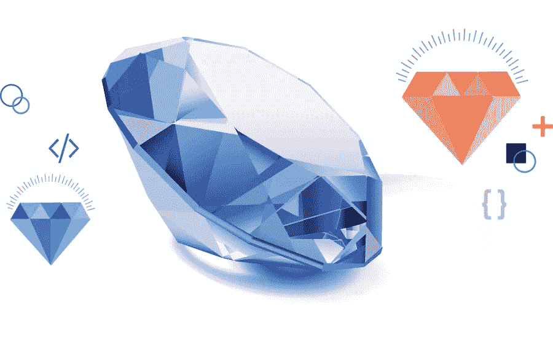
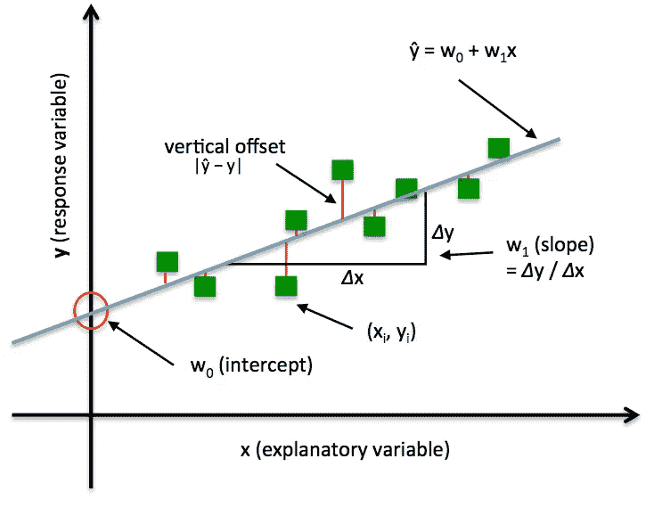
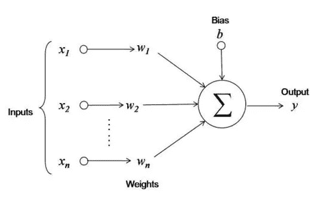

# 使用 PyTorch 根据切割、颜色、净度和价格预测钻石价格

> 原文：<https://towardsdatascience.com/diamond-price-prediction-based-on-their-cut-colour-clarity-price-with-pytorch-1e0353d2503b?source=collection_archive---------21----------------------->

## PyTorch 中构建简单线性回归模型的指南

资料来源:Opensourceforu.com

你有没有问过自己，钻石是怎么定价的？这篇文章讨论了基于切割、颜色、净度和其他属性的钻石价格预测，还介绍了使用 PyTorch 建立一个简单的线性回归模型。

我的 PyTorch 之旅从[“使用 PyTorch 进行深度学习:零到 Gans”](https://jovian.ml/forum/c/pytorch-zero-to-gans/18)课程开始，现在我们已经进入了该课程的第二周，到目前为止，我们已经在 PyTorch 中讲述了线性&逻辑回归的基础知识和实现。PyTorch 的基本功能请参考这篇[文章](https://medium.com/@vinneelaero/introduction-to-basic-pytorch-tensor-functions-51cb5b58713)。

# 线性回归简介:

线性回归是机器学习中最简单的算法之一。根据统计，术语**回归**被定义为输出变量和输入变量之间关系的度量，因此，线性回归假设自变量(输入)和因变量(输出)之间存在线性关系。

更一般地，线性模型通过简单地计算输入要素的加权和以及偏差(也称为截距)项来进行预测。[(来源)](https://www.oreilly.com/library/view/hands-on-machine-learning/9781492032632/)如下式所示。

资料来源:中央统计局。Brown.edu

我考虑了经典的钻石数据集，它包含了近 54，000 颗钻石的价格和其他属性，该数据集托管在 [Kaggle](https://www.kaggle.com/shivam2503/diamonds) 上。数据集包含 53940 行和 10 个变量。在开始构建模型之前，让我们来看看变量&的定义。

*   **价格**以美元为单位
*   **克拉**钻石的重量
*   **切割**切割质量(一般、良好、非常好、优质、理想)
*   **颜色**钻石颜色，从 J(最差)到 D(最好)
*   **净度**衡量钻石净度的指标(I1(最差)、SI2、SI1、VS2、VS1、VVS2、VVS1、IF(最佳))
*   **x** 长度单位为毫米
*   **y** 宽度单位为毫米
*   **z** 深度以米为单位
*   **深度**:钻石的高度
*   **表**:钻石台面的宽度，以其平均直径的百分比表示

# 让我们根据以下步骤开始构建线性回归模型

1.  导入所需的包
2.  加载数据集
3.  执行探索性数据分析(EDA)
4.  为训练准备数据集
5.  创建线性回归模型
6.  训练模型以适应数据
7.  使用训练好的模型进行预测

# 步骤 1:导入所需的包

# 步骤 2:加载数据集

为了加载数据集，我们将使用`pd.read_csv()`函数，它会将数据集转换为数据帧，并使用`pd.head()`函数查看数据集的前 5 行

删除不必要的列“未命名:0”

数据集有 53940 行和 10 个变量

# 步骤 3:探索性数据分析(EDA)

看看数据集的简明摘要

数据集中没有空数据，也可以使用`data.isnull().any`进行检查。给定的数据集有 6 个数值列和 3 个非数值(分类)列

使用`pd.describe()`获取数据集的描述性统计数据

观察到 x(长度)、y(宽度)和 z(深度)的最小值为零，并且使钻石的长度\宽度\深度为零没有任何意义。

让我们放弃这几行

观察到 x、y 和 z 的最小值是非零值

用`hist()`法绘制数值属性的分布

让我们看看数据集的配对图。配对图允许我们看到变量的分布以及两个变量之间的关系

观察到 x、y 和 z 变量相对于因变量(目标)价格具有良好的相关性，让我们通过使用`.corr()` &来量化这种相关性，并使用`sns.heatmap()`方法将其可视化

我们可以得出结论，克拉，x，y & z 特征与 w.r.t 价格变量有很强的相关性，而深度与 w.r.t 价格变量的相关性很弱。因此，我们可以从模型的最终输入特征列表中删除深度特征。

让我们通过使用箱线图来了解目标(价格)变量的分类特征

我使用箱线图来比较给定分类变量类别之间的数据分布、集中趋势(中值)和可变性，这些图也有助于识别异常值。

到目前为止，我已经做了非常初步的数据探索，以了解这些特征及其与目标变量的关系。本文的主要目标是在 PyTorch 中实现线性回归，所以让我们停止数据探索，直接进入本文的核心部分。

在继续构建模型之前，最好将分类数据转换为数值数据，有两种方法可以转换为数值形式 1。标签编码器或整数编码 2。一键编码

一般来说，一键编码做得很好，更多细节请参考此[链接](https://jovian.ml/outlink?url=https%3A%2F%2Fmachinelearningmastery.com%2Fwhy-one-hot-encode-data-in-machine-learning%2F)

# 步骤 4:为训练准备数据集

我们需要将熊猫数据框架中的数据转换成 PyTorch 张量用于训练。为此，第一步是将它转换成 NumPy 数组

现在，我们需要为训练和验证创建 PyTorch 数据集和数据加载器。第一步是通过使用`torch.tensor`函数将输入的&目标数组转换成张量来创建`TensorDataset`

现在，我们将把数据集分为训练和验证数据集。训练集将用于训练模型，而验证集用于评估模型&它还用于调整超参数(学习率、时期、批量等..)以便更好地概括训练模型。

我们将使用`random_split`函数将数据集分割成所需百分比的训练&验证

让我们来看一组数据，以验证到目前为止一切正常。

xb 和 yb 的形状表明到目前为止一切都运行良好

# 步骤 5:创建线性回归模型

我们将通过扩展 PyTorch 的`nn.Module`类来创建线性回归模型

在`__init__`构造函数方法中，我们使用`nn.Linear`函数实例化权重和偏差。在 forward 方法中，当我们将一批输入传递给模型时会调用这个方法，它会将输入传递给`self.linear`。定义的神经网络将如下所示

我们已经定义了模型并实例化了权重和偏差。现在，让我们定义成本函数。

线性回归的常用成本函数(J)是均方误差(MSE)。该函数计算预测值和目标值之间的差值，并对其求平方。成本函数衡量评估模型性能的好坏。

`training_step` & `validation_step`该方法分别计算每个训练&验证批次的预测& MSE 损失。该方法返回每个历元的平均验证损失。请参考此[链接](https://jovian.ml/forum/t/lecture-2-working-with-images-logistic-regression/1542/333)以了解历元&迭代之间的差异。

让我们通过调用`DiamondPriceModel()`类创建一个模型对象

# 步骤 6:训练模型以适应数据

*   线性回归的主要目标是最小化成本函数。
*   [梯度下降](https://jovian.ml/outlink?url=https%3A%2F%2Fwww.youtube.com%2Fwatch%3Fv%3DIHZwWFHWa-wis)是一种帮助最小化成本函数的优化算法，其主要目的是找出全局最小值。这里，梯度表示函数的变化率，它指向函数最大增长的方向。为了最小化成本函数，我们需要执行成本函数(J)相对于其参数(权重(w) &偏差(b))的梯度。

来源:[http://rasbt.github.io/](http://rasbt.github.io/)

**注意**:学习率α是一种控制权重更新量的方法。如果我们选择一个小的学习率，我们的模型训练可能需要很长时间。但是如果选择大的学习率，可能会超调，我们的训练永远不会收敛。具体的学习率取决于我们的数据和我们使用的模型类型，但通常最好在[1e 8，1e 1]范围内探索。

`evaluate`函数，调用`validation_step` & `validation_epoch_end`方法，返回每个历元后的平均验证损失。

`fit`函数通过在[随机梯度下降](https://jovian.ml/outlink?url=https%3A%2F%2Fwww.youtube.com%2Fwatch%3Fv%3DW9iWNJNFzQI)(梯度下降的一种变体)优化的帮助下更新每一步的参数来执行模型训练。它记录每个时期的确认损失，并返回训练过程的历史。

最初的验证损失非常高，这是人们从随机初始化的模型中可能期望的。目标是使用足够的历元和合适的学习速率来最小化这种损失。这是一个反复试验的过程，以产生最适合我们的模型。

运行该模型 800 个时期，验证损失已经减少到 1276336.0000。现在，让我们用验证数据来测试模型。

# 步骤 7:根据验证数据测试模型

`predict_single`函数返回给定输入张量的预测钻石价格值。

测试# 1

测试# 2

通过在当前模型中引入隐藏层可以提高模型性能，并且可以进一步将优化器改进为 [Adam 优化器。](https://jovian.ml/outlink?url=https%3A%2F%2Farxiv.org%2Fabs%2F1412.6980)

**代码库:**你可以在我的 [GitHub repo](https://github.com/vineel369/DeepLearning-with-PyTorch/blob/master/01_Linear%20Regression/Linear_Regression_with_Pytorch_Diamond_Price_prediction_final.ipynb) 找到笔记本。

嗯！！我们刚刚使用 PyTorch 完成了第一个机器学习算法。感谢阅读！！并尝试使用自己的数据集。

快乐学习！编码快乐！

# 参考资料:

1.  https://www.youtube.com/watch?v=4ZZrP68yXCI&feature = youtu . be
2.  [https://github . com/madewithml/basics/blob/master/notebooks/07 _ Linear _ Regression/07 _ PT _ Linear _ Regression . ipynb](https://github.com/madewithml/basics/blob/master/notebooks/07_Linear_Regression/07_PT_Linear_Regression.ipynb)
3.  [https://cs . brown . edu/courses/csci 1951-a/assignments/stats _ 讲义. html](https://cs.brown.edu/courses/csci1951-a/assignments/stats_handout.html)
4.  [https://jovian.ml/forum/c/pytorch-zero-to-gans/18](https://jovian.ml/forum/c/pytorch-zero-to-gans/18)
5.  [https://www.kaggle.com/shivam2503/diamonds](https://www.kaggle.com/shivam2503/diamonds)