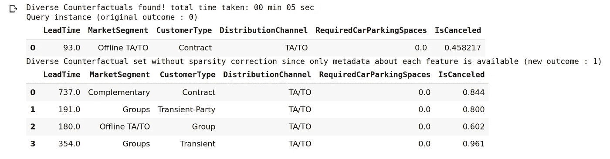
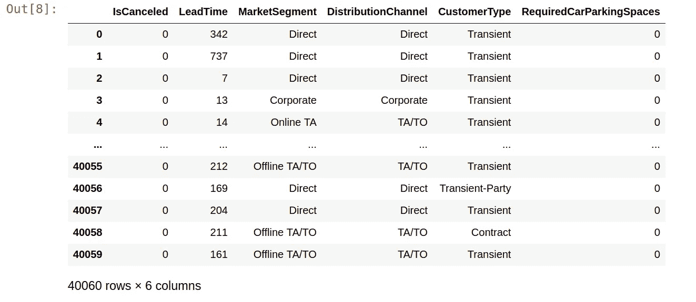
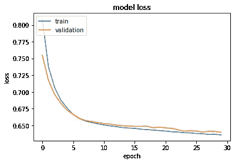
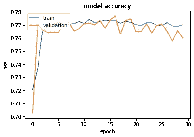
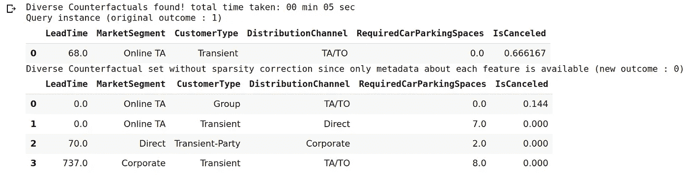
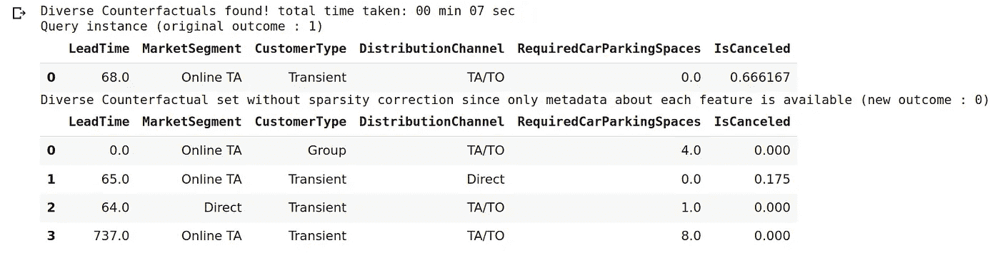
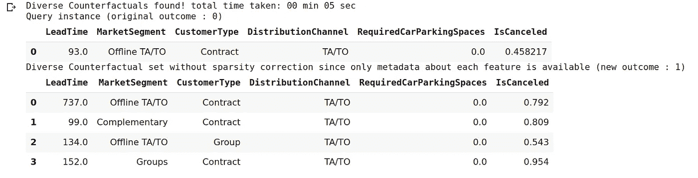
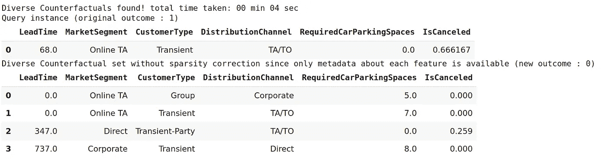
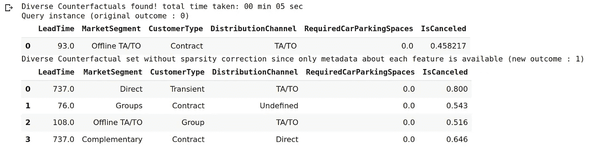

# DiCE:酒店取消的多种反事实解释

> 原文：<https://towardsdatascience.com/dice-diverse-counterfactual-explanations-for-hotel-cancellations-762c311b2c64?source=collection_archive---------44----------------------->

## DiCE 是更广泛的 InterpretML 库的一部分，非常擅长为特定数据集生成“多样化的反事实解释”。

“多样化的反事实解释”，我们指的是由一个模型做出的决定，这个模型的影响力足以改变结果变量。

我们举个例子。假设一位酒店经理正在分析客户预订，并希望分析哪类客户更有可能取消预订。



来源:Jupyter 笔记本

这是一个客户没有取消酒店预订的例子。

根据这个特例，客户属于细分市场**线下 TA/TO** ，客户类型为**合同**，分销渠道为 **TA/TO** ，所需停车位为 **0** 。

然而，一个希望最大限度减少取消预订的酒店经理最好能确定哪些类型的顾客可能会取消预订。这就是骰子的用武之地。

当查看上面的反事实解释时——客户**取消了**的预订，我们观察到:

*   **提前期**在四个示例中明显更长。
*   一个客户仍然属于**线下 TA/TO** 细分市场。
*   四个取消的客户之一仍然是**合同**客户。
*   **分配渠道**和**所需停车位数量**保持不变。

不取消和取消(至少在这种情况下)的最大区别似乎是**提前期**。从客户预订到实际入住酒店的时间越长，客户取消预订的可能性就越大。

# 方法学

为了生成上面的骰子解释:

1.  使用 Tensorflow 的 Keras API 训练神经网络，以便建立分类算法。
2.  然后从神经网络生成骰子模型。
3.  使用原始数据集的参数创建“骰子数据集”，即包含连续变量的范围，同时包括分类变量的所有类别。
4.  然后生成骰子解释实例，以解释结果变量的结果。
5.  然后产生反事实的例子(按照上面的例子)来解释可能改变结果变量的条件。
6.  *接近度*和*差异度*被修改，以检验接近原始输入的数据与显著变化的数据如何影响反事实解释。

关于第 3 点，DiCE 的一个便利特性是能够丢弃旧数据，同时保留模型训练参数。这样的做法符合**公平**数据原则，规定数据应该 **F** 可用， **A** 可访问， **I** 不可操作， **R** 可用。

但是，其他法律可以规定客户有权删除其个人数据，或者确实要求在一定期限后删除客户数据。

在这种情况下，DiCE 的优势在于它允许保留对相关数据的模型训练，而不必保留数据本身。

请注意，TensorFlow **1.15** 在此实例中与 Python **3.6.9** 一起用于运行 DiCE 和相关模型。

# 神经网络训练及骰子说明实例

以下是数据集的一个示例:



来源:Jupyter 笔记本

数据集中的连续要素定义如下:

```
# Dataset for training an ML model
d = dice_ml.Data(dataframe=dataset,
                 continuous_features=['LeadTime','RequiredCarParkingSpaces'],
                 outcome_name='IsCanceled')
```

使用**二元交叉熵**损失和 **adam** 优化器在 **30** 个时期内训练神经网络模型。

```
from tensorflow.keras.models import Sequential
from tensorflow.python.keras.layers import Dense
from tensorflow.python.keras.wrappers.scikit_learn import KerasRegressorsess = tf.InteractiveSession()
# Generating train and test data
train, _ = d.split_data(d.normalize_data(d.one_hot_encoded_data))
X_train = train.loc[:, train.columns != 'IsCanceled']
y_train = train.loc[:, train.columns == 'IsCanceled']# Fitting a dense neural network model
ann_model = Sequential()
ann_model.add(Dense(6, input_shape=(X_train.shape[1],), activation=tf.nn.relu))
ann_model.add(Dense(1, activation=tf.nn.sigmoid))
ann_model.compile(loss='binary_crossentropy', optimizer='adam', metrics=['accuracy'])
history=ann_model.fit(X_train, y_train, validation_split=0.20, epochs=30, verbose=0, class_weight={0:1,1:2})
history
```

这是模型损耗的曲线图:



来源:Jupyter 笔记本

这是训练和验证准确性的图表:



来源:Jupyter 笔记本

出于解释目的，该模型现在存储为骰子模型:

```
>>> m = dice_ml.Model(model=ann_model)
>>> m
<dice_ml.model_interfaces.keras_tensorflow_model.KerasTensorFlowModel at 0x7f22fb2e0da0>
```

如前所述，这些特征现在以与 DiCE 兼容的特殊格式存储，以便生成 DiCE 解释实例:

```
new_d = dice_ml.Data(features={
                   'LeadTime':[0, 737],
                   'MarketSegment': ['Complementary', 'Corporate', 'Direct', 'Groups', 'Offline TA/TO', 'Online TA'],
                   'CustomerType': ['Contract', 'Group', 'Transient', 'Transient-Party'],
                   'DistributionChannel':['Corporate', 'Direct', 'TA/TO', 'Undefined'],
                   'RequiredCarParkingSpaces': [0, 8]},
         outcome_name='IsCanceled')
```

形成骰子解释实例:

```
>>> exp = dice_ml.Dice(new_d,m)
>>> exp<dice_ml.dice_interfaces.dice_tensorflow1.DiceTensorFlow1 at 0x7f22fb2da630>
```

# 不同的反事实解释

既然解释实例已经形成，这可以用来生成反事实的解释。

让我们以具有以下属性的客户为例，这些属性包含在所谓的**查询实例**中:

```
query_instance = {'LeadTime': 68,
    'MarketSegment': 'Online TA',
    'CustomerType': 'Transient',
    'DistributionChannel': 'TA/TO',
    'RequiredCarParkingSpaces': 0}
```

反事实的例子产生如下:

```
# Generate counterfactual examples
dice_exp = exp.generate_counterfactuals(query_instance, total_CFs=4, desired_class="opposite")
# Visualize counterfactual explanation
dice_exp.visualize_as_dataframe()
```



来源:Jupyter 笔记本

这里，生成了一个原始结果为 **1** 的案例，即取消。还观察到顾客不取消他们的酒店预订的反例也产生了。

相反，这里有一个查询实例，客户**取消了**的酒店预订。

```
query_instance_2 = {'LeadTime': 93,
    'MarketSegment': 'Offline TA/TO',
    'CustomerType': 'Contract',
    'DistributionChannel': 'TA/TO',
    'RequiredCarParkingSpaces': 0}
```

再次，产生了反事实的例子:

```
# Generate counterfactual examples
dice_exp_2 = exp.generate_counterfactuals(query_instance_2, total_CFs=4, desired_class="opposite")
# Visualize counterfactual explanation
dice_exp_2.visualize_as_dataframe()
```


来源:Jupyter 笔记本

这些只是一些如何产生反事实解释的例子。

在这些例子中，产生了四个反事实的例子(total_CFs=4)，其中“相反的”类是感兴趣的。

# 邻近性与多样性

关于反事实的解释，使用骰子可以产生更深刻的见解。

例如，可以考虑对原始输入的解释的**接近度**以及那些解释的**多样性**，即对所讨论的解释的建议改变的范围。 [DiCE GitHub 自述文件](https://github.com/interpretml/DiCE)提供了关于这些的更多解释。

**以下是 *proximity_weight* 增加到 *1.5* 时的反事实解释。**

*查询实例 1*



来源:Jupyter 笔记本

*查询实例 2*



来源:Jupyter 笔记本

**现在，让我们将 *diversity_weight* 设置为 *2.5* ，其中 *proximity_weight* 在 *0* 处。**

*查询实例 1*



来源:Jupyter 笔记本

*查询实例 2*



来源:Jupyter 笔记本

# 结论

在本文中，您已经看到:

*   骰子如何被用来产生反事实的解释
*   DiCE 如何在不保留数据本身的情况下保留模型训练
*   修改神经网络输出以便与骰子兼容
*   利用邻近性和多样性来产生有根据的反事实解释

非常感谢您的参与，这个例子的相关 GitHub 库可以在[这里](https://github.com/MGCodesandStats/hotel-cancellations)找到。

*免责声明:本文是在“原样”的基础上编写的，没有任何担保。本文旨在提供数据科学概念的概述，不应以任何方式解释为专业建议。*

# 参考

*   [安东尼奥、阿尔梅迪亚和努内斯(2019)。酒店预订需求数据集](https://www.sciencedirect.com/science/article/pii/S2352340918315191)
*   [对 ML 的各种反事实解释(DiCE)](https://github.com/interpretml/DiCE)