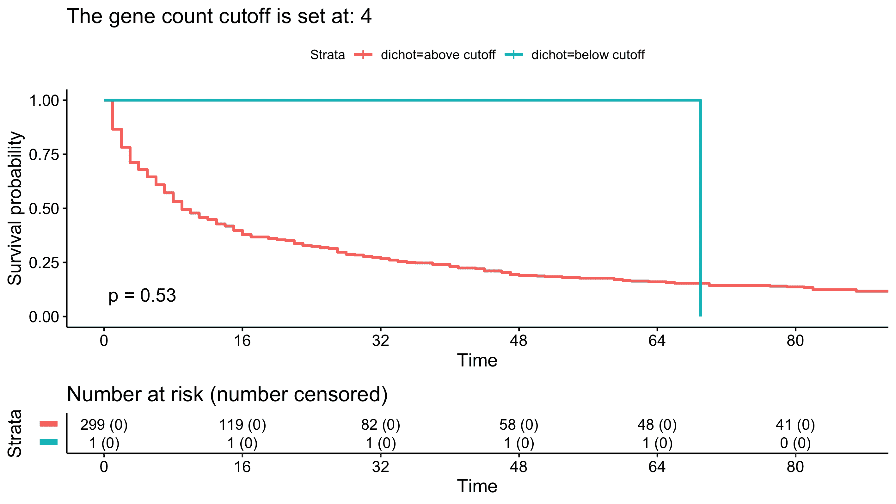
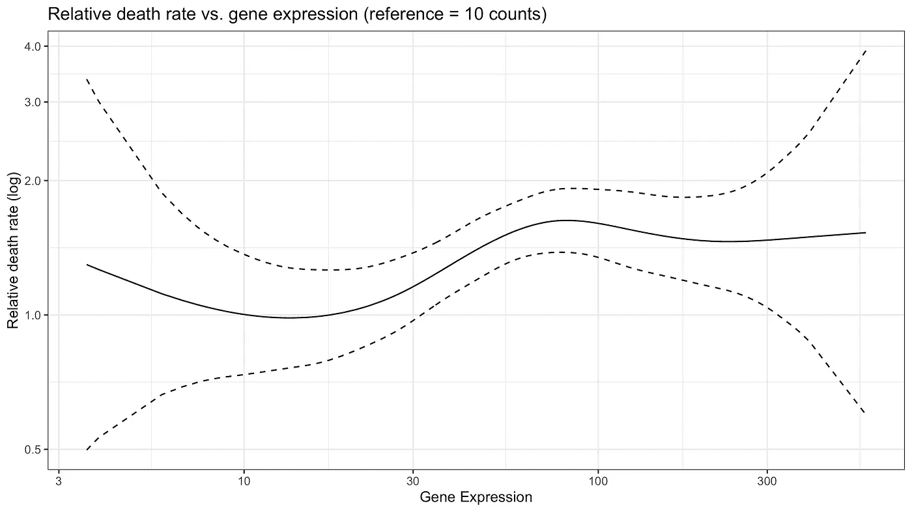
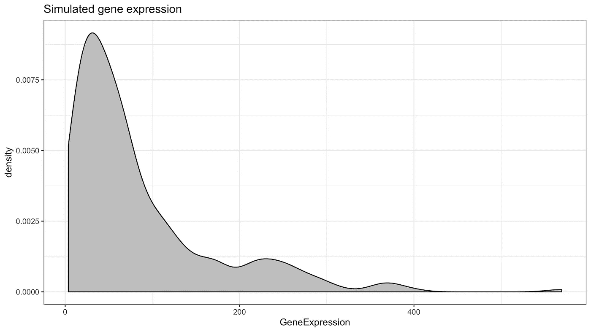

# 卡普兰疯狂:二分法连续变量

> 原文：<https://towardsdatascience.com/dichotomising-continuous-variables-8cf3fdd5de33?source=collection_archive---------31----------------------->

封面照片:[托拜厄斯·范·施奈德](https://unsplash.com/@vanschneider)

M 任何时候，我都会看到从数据集(如 TGCA 癌症基因组图谱)中选择基因的海报或演示，作者表明该基因的高(或低)表达与更好或更差的存活率相关。通常，会显示 p 值，作者没有提到他们是否调整了其他(已知的)预后因素。然后他们利用这种存活率的差异进行进一步的功能验证。

这没有太大的意义。

因为基因表达是一个连续变量(这里基因表达可以用任何其他连续变量代替)，所以需要设定一个阈值来定义“高”与“低”表达，以便绘制 Kaplan Meier 生存曲线。连续变量的二分法是一个[的坏习惯](https://www.ncbi.nlm.nih.gov/pmc/articles/PMC1458573/)，并且伴随着成本。

如果没有预先指定临界值，可以改变阈值，直到找到显著的 p 值:

> 使用这种所谓的“最佳”分界点(通常是给出最小 P 值的分界点)存在产生虚假显著结果的高风险；两组之间的结果变量的差异将被高估，可能相当大；并且置信区间会太窄。永远不要使用这种策略— [奥特曼，BMJ](https://www.ncbi.nlm.nih.gov/pmc/articles/PMC1458573/)

通过模拟数据，这个概念变得更加清晰。在该动画中，截止值从~27 开始变得“统计显著”，并在~ 65 左右停止显著，而曲线本身的变化很小:

在这个模拟中，除了定义高和低基因表达的阈值之外，没有任何变化。

如果您仍然想了解连续变量和生存率之间的关系，您可能想了解 Cox 比例风险模型，其中包括影响预后的其他协变量。

如果我们只包括基因表达，Cox 比例风险(请注意，我没有检查比例风险假设，这应该在您对真实数据集进行此操作之前进行)给出的 p 值为 0.0276，HR 为 3.114，95%置信区间为[1.133，8.559]。由于在将其用作 Cox 拟合的输入之前，我已经转换了 log10 尺度的基因表达，3.14 的 HR 将意味着基因表达每增加 log10 单位的风险增加 3.14 倍(正如@jvdesomp 在 Twitter 上指出的)。

此外，使用 Cox 回归模型，如果基因表达增加，我们可以评估相对死亡率(而不是隐藏大部分数据的二分法):

# 模拟内部

## 生成虚构数据

如果你对模拟是如何制作的感兴趣，请继续阅读。

开始了一项虚构的研究，随访时间为 96 个月，有 300 名参与者。没有被审查的个体(除了在 96 个月，模拟结束时)。基因表达从对数正态分布中随机取样，其中 rlnorm R 函数的均值为 4，标准差为 1:

模拟了其他几个协变量，这在本文中没有提到。我鼓励你自己看一看它们，看看对 KM 估计和 Cox 模型有什么影响。

## 考克斯回归

为了研究基因表达对风险比的影响，使用了惩罚样条项(注意，基因表达是从对数正态分布中取样的，因此这里应该转换回 log10 标度):

相对死亡率如[生存曲线插图](https://cran.r-project.org/web/packages/survival/vignettes/splines.pdf)所述绘制(但使用 ggplot 代替 matplot 函数)。

这个模拟的完整代码可以在 [GitHub](https://github.com/rmvpaeme/kaplan_pval_sim) 上获得。

*关于作者:*

*我是 Ruben Van Paemel 博士，我于 2017 年从医学院毕业后开始在根特大学(医学遗传学中心)担任博士研究员，由研究基金会 Flanders 资助。我也是根特大学医院的儿科住院医师。可以在 Twitter 关注我:*[*@ RubenVanPaemel*](http://www.twitter.com/RubenVanPaemel)

*我从事神经母细胞瘤的研究，这是一种罕见但极具破坏性的肿瘤，最常见于非常年幼的儿童。我们的团队试图了解潜在的基因改变，以提高神经母细胞瘤儿童的诊断、治疗和最终存活率。*

# 参考

封面照片- [Unsplash](https://unsplash.com/photos/IBRLEgCk5cU)

Kaplan Meier 模拟代码编辑自[http://dwoll . de/rex repos/posts/survival km . html # simulated-right-删失事件次数服从威布尔分布](http://dwoll.de/rexrepos/posts/survivalKM.html#simulated-right-censored-event-times-with-weibull-distribution)