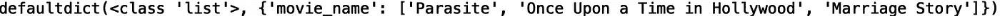
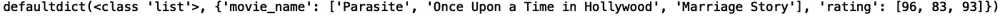
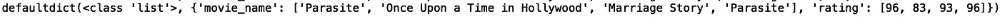
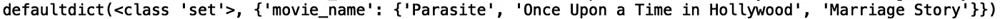
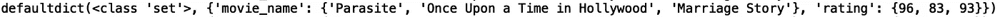
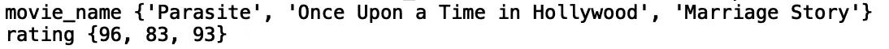

# Python 中的字典

> 原文：<https://towardsdatascience.com/dictionaries-in-python-74839d2d852?source=collection_archive---------36----------------------->

## 理解 Python 中的字典


[来源](https://www.pexels.com/photo/closeup-photography-of-book-page-folding-forming-heart-1083633/)

在 python 中，字典是数据值的无序集合，其中每个元素是一个键/值对。字典有各种各样的应用，包括视频游戏中的映射对象、数据库设置、单元测试等等。在这篇文章中，我们将讨论如何在 python 中定义和执行简单的字典操作。

我们开始吧！

# 带集合和列表的词典

字典的简单定义是将一个键映射到一个值的数据结构。大多数情况下，字典用于将键映射到多个值。为此，我们需要将字典键映射到容器，比如集合和列表。例如，假设我们有一个包含电影名称和元评论等级的字典:

```
movie_ratings = {'movie_name': ['Parasite', 'Once Upon a Time in Hollywood', 'Marriage Story'], 'rating': [96, 83, 93]}
```

在这个字典中，“movie_name”是一个映射到包含三部电影的列表的键。类似地，“rating”是映射到三个电影分级的另一个键。您也可以使用集合来定义类似的字典:

```
movie_ratings = {'movie_name': {'Parasite', 'Once Upon a Time in Hollywood', 'Marriage Story'}, 'rating': {96, 83, 93}}
```

其中集合是没有重复的无序集合对象。如果要保持集合中各项的插入顺序，就需要使用列表。如果你不想在你的收藏中有重复的东西，而且顺序也不重要，你可以使用集合。

# 默认词典

定义带有映射到列表或集合的键的字典的一种简单方法是使用“defaultdict”。让我们使用‘default dict’来构造我们的第一个字典，它使用了列表。首先，让我们导入' defaultdict ':

```
from collections import defaultdict
```

让我们将电影分级字典初始化为列表字典:

```
movie_ratings = defaultdict(list)
```

python 中默认字典的一个很好的特性是，它们会自动初始化第一个值，这样您就可以专注于插入值。让我们插入三个电影名称:

```
movie_ratings['movie_name'].append('Parasite')
movie_ratings['movie_name'].append('Once Upon a Time in Hollywood')
movie_ratings['movie_name'].append('Marriage Story')
```

现在，让我们打印字典:

```
print(movie_ratings)
```



接下来让我们插入电影评级:

```
movie_ratings['rating'].append(96)
movie_ratings['rating'].append(83)
movie_ratings['rating'].append(93)
```

让我们再打印一次:

```
print(movie_ratings)
```



现在让我们添加一个副本。让我们插入“寄生虫”及其评级:

```
movie_ratings['movie_name'].append('Parasite')
movie_ratings['rating'].append(96)
```

让我们打印:

```
print(movie_ratings)
```



我们看到我们已经成功地插入了一个副本。让我们试着为一套字典做同样的事情。让我们初始化我们的集合字典:

```
movie_ratings = defaultdict(set)
```

我们现在将添加我们的电影名称。请注意，对于集合，我们使用“add()”方法，不要与我们用于列表的“append()”方法混淆:

```
movie_ratings['movie_name'].add('Parasite')
movie_ratings['movie_name'].add('Once Upon a Time in Hollywood')
movie_ratings['movie_name'].add('Marriage Story')print(movie_ratings)
```



接下来让我们添加我们的评级:

```
movie_ratings['rating'].add(96)
movie_ratings['rating'].add(83)
movie_ratings['rating'].add(93)print(movie_ratings)
```



现在让我们尝试添加一个副本。让我们再次添加“寄生虫”及其评级:

```
movie_ratings['movie_name'].add('Parasite')
movie_ratings['rating'].add(96)print(movie_ratings)
```


我们可以看到我们的字典没有被修改。这是因为集合不允许重复。我将在这里停下来，但是我鼓励你研究一下 python 中其他一些重要的字典方法。例如，您可以使用。items()”方法迭代键/值对:

```
for key, value in movie_ratings.items():
    print(key, value)
```



您可以研究的其他重要方法有。keys()“，”。get()'、和'。setdefault()'。

# 结论

总之，在这篇文章中，我们讨论了如何在 python 中定义和操作字典。我们讨论了如何用列表和集合定义字典。我们还讨论了如何使用“defaultdict”来初始化这些字典类型，这使我们能够专注于数据插入。我希望这篇文章对你有用。这篇文章的代码可以在 GitHub 上找到。感谢您的阅读！