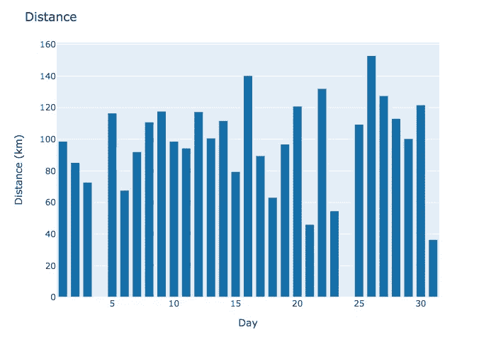
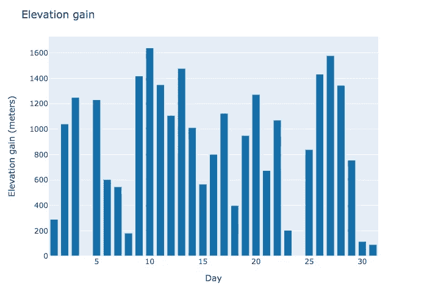
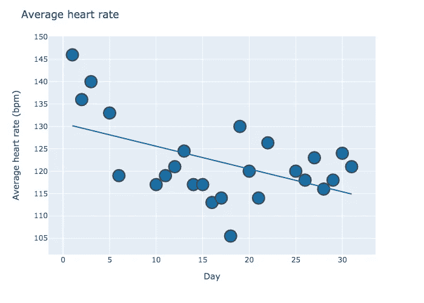
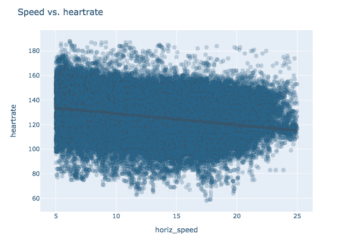
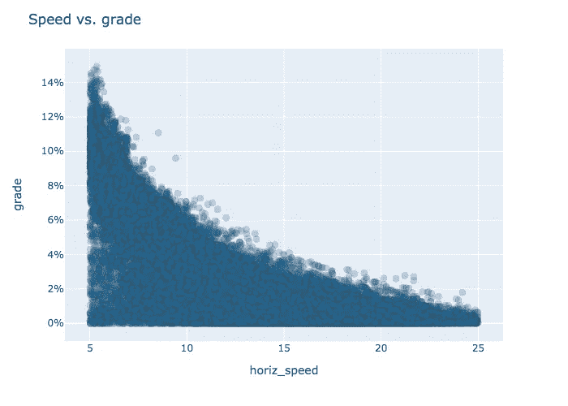
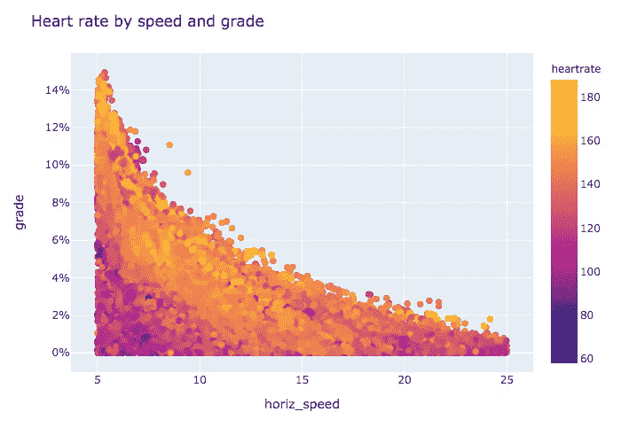
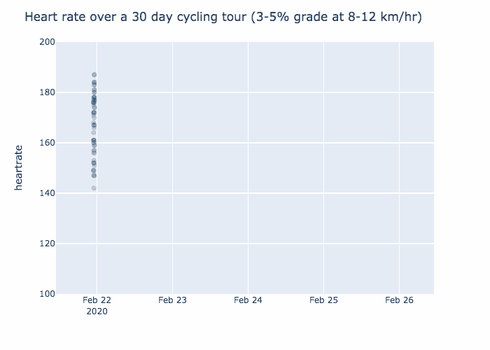
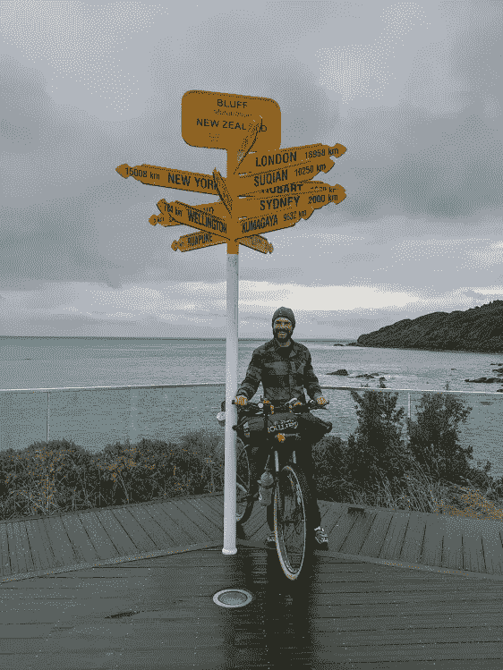

# 30 天的自行车旅行让我更健康了吗？

> 原文：<https://towardsdatascience.com/did-a-30-day-bicycle-tour-make-me-more-fit-639ae92cfd27?source=collection_archive---------60----------------------->

## 如果是的话，这能被测量吗？


TLDR:是的，它让我更健康。向下滚动以查看动画和导出的方程式。

上个月，我完成了[奥特罗阿](http://www.touraotearoa.nz/p/home.html)之旅——一次穿越新西兰的 3000 公里自行车打包之旅。完成的截止日期是 30 天。我从 2 月 21 日开始，到 3 月 23 日结束——29 天 23 小时 45 分钟后。于是我结束了 30 天的旅行，只剩下 15 分钟。

我知道这次旅行会是一次挑战。虽然我总体上很健康，也进行了一些自行车打包旅行，包括在 [GDMBT](https://www.adventurecycling.org/routes-and-maps/adventure-cycling-route-network/great-divide-mountain-bike-route/) 上的 2 周，但在过去几年里我的体重增加了一些，没有时间进行必要的训练(建议是 3000 公里，我可能完成了 200 公里？).

当我在头几天挣扎的时候，来自巡回赛老兵的建议通常是“别担心。你会变得更健康。训练成这样！”从主观上来说，随着巡演的进行，事情似乎变得稍微容易了一些。然而，**我*实际上*骑行 3000 km 后变得更健美了吗？我的身体在巡演结束时比开始时更好吗？如果是的话，我能测量吗？**

# 重要统计数据

*   32 岁
*   生来就是男性
*   身高 182 cm
*   中度但可控的哮喘
*   约 55 静息心率(午夜)
*   骑着 2017 款铝制 Salsa Timberjack，配有 29er 车轮，13.5 kg。当然，我有很多装备，所以我们假设总共 25 公斤？

# 数据收集

在游览期间，我戴了一只佳明菲尼克斯 5 手表。这记录了我每隔几秒钟的距离、高度和心率。每天结束时，收集的数据会被同步到 Garmin 的服务器上。后来，我能够以 XML 格式下载这些数据。在这 30 天里，我总共检索了 187，216 个数据点。

# 数据概述

下面是基本的距离和高程数据。有一些差异需要注意。在第四天，我的变速器坏了，我被困在等待一个新的。然后，大约从第 20 天开始，我生病了。四天后，在第 24 天的另一个休息日达到了高潮。



# 适合度的度量

我的中学体育老师对健康有一个很好的定义。用他的话来说，想象两个同样身高体重的跑步者在 5k 比赛。在整个比赛中，没有一个运动员领先于另一个。然后他们在同一时间结束比赛。一名跑步者的平均心率为 150，另一名为 155。谁是更健康的跑步者？

答案当然是心率较低的跑步者。如果你的心脏在同样的输出量下工作得更少，你就更健康。骑自行车也是如此。事实上，如果我变得更健康，我会预计我的心率会在旅行过程中下降。那是真的吗？



看看我在旅游过程中的平均日心率，它确实似乎在下降。但是我的心率下降是因为我变得更健康了还是因为我变得更懒了？要回答这个问题，我需要将我的心率与我的努力程度进行比较。

# 清理数据

Garmin XML 文件提供了四个数据点:时间、距离、海拔和心率。这些是某个时间点的快照。为了让这些数据有用，我需要速度和坡度(比如上坡/下坡)。为此，我计算了时间间隔。例如，速度是距离随时间的变化。

处理心率时，还有一个额外的重要考虑因素。人类的心脏实际上需要时间来适应身体当前的努力水平。因此，计算出的时间间隔必须足够长，以捕捉这种调整。不过，不会太久的。间隔太长会有模糊数据的风险。通过实验，我发现 90 秒的间隔效果最好(或者至少给了我最好的 [r](https://en.wikipedia.org/wiki/Coefficient_of_determination) ！).

我做过的其他事情:

*   删除了所有速度为 30 公里/小时的区间<5km/hr or >(要么是我站着不动，要么是 GPS 变得古怪)
*   放弃所有大于 1 米/秒的爬升。同样，任何超过 1 米/秒的速度都远远超过了我的身体极限，这是因为古怪的 GPS 读数
*   取消所有下降间隔。重力——而不是肌肉——是下降的主要力量。它们对这个分析没有用。

# 天真的第一遍

作为第一步，当我比较心率和速度时，我得到一个向下倾斜的趋势。这是为什么呢？为什么我走得越快心率越慢？



事实证明，当我慢下来的时候，很有可能我实际上是在爬山，并且更加努力地工作*。事实上，速度与成绩的关系图揭示了两者之间的密切关系。*

**

*在热图上包括心率表明心率在分布的顶端附近最高。这是我快速上坡的时候。这是有道理的。*

**

# *恒定输出模型*

*那么，在旅行的过程中，我变得更健康了吗？对于相同的输出，我的心跳变慢了吗？如果我将速度和坡度都保持在 8-12 公里/小时和 3-5%的坡度，我会发现一个明显的下降趋势。根据下面的动画估计，我的心跳在第 30 天比第一天慢了 20 bpm！*

**

# *调整和多变量模型*

*动画很好，但我能做得更好吗？我可以使用我所有的数据，而不仅仅是 8-12 公里/小时，3-5%的坡度范围吗？我能得到精确的数字吗？我当然可以。我可以用一个[多元模型](https://www.investopedia.com/terms/m/multivariate-model.asp)！*

```
*heartrate = a*speed + b*grade + c*day*
```

*通过 [sklearn 的](https://scikit-learn.org/stable/) [线性回归](https://www.investopedia.com/terms/r/regression.asp) [实现](https://scikit-learn.org/stable/modules/generated/sklearn.linear_model.LinearRegression.html)，对于所有 89238 个区间，我得到 r 为 **0.27** 。使用计算出的系数可得出以下等式…*

```
*heartrate = .77*speed + 344.49*grade - 0.50*day + 116.61*
```

*我还能调整什么？您可能会从动画中注意到，前三天似乎是数据中的异常值。造成这种情况的一个因素可能是我在头三天换了不同的轮胎。当我在第四天修好我的换档器时，我也认为我所用的轮胎，enduro 轮胎，太重了，所以我更换了它们。移除前三天的数据后，r 在**处大致相同。26** 新的等式如下*

```
*heartrate = .83*speed + 365.81*grade - 0.19*day + 116.61*
```

*查看“天”的系数，我看到-0.19。**在旅程中的每一天，同样强度的运动，我的心率会下降 0.2 次/分钟。这意味着总共提高了 6 BPM！**这不像动画中暗示的那样戏剧化(~20BPM)，但更精确，仍然是一个好结果！*

**

# *开放数据*

*我的代码和原始数据可以在 [Github](http://github.com/scottrogowski/tour_aotearoa_analysis) 上获得。感谢阅读！*

**原载于*[](https://scottrogowski.com/did-a-30-day-bicycle-tour-make-me-more-fit)**。***