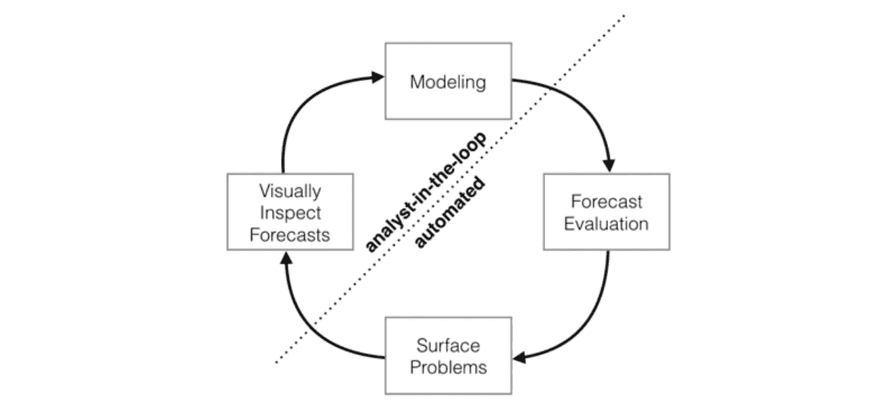
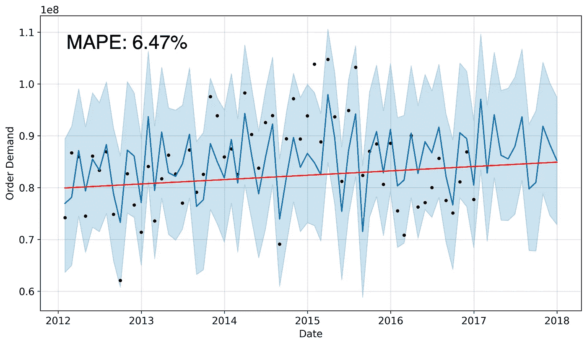

# 脸书预言家让时间序列建模太容易了吗？

> 原文：<https://towardsdatascience.com/did-facebook-prophet-make-time-series-modeling-too-easy-7d22a2bbf5dd?source=collection_archive---------47----------------------->

## 顶点工程的困境

图片由 [kues1](https://stock.adobe.com/contributor/204008816/kues1?load_type=author&prev_url=detail) 在 [Adobe Stock](https://stock.adobe.com/)

我最近选择库存需求预测作为我完成的一个为期 10 个月的数据科学项目的顶点项目(在熨斗学校)。我很高兴探索这个话题，因为我觉得它可以应用到我职业兴趣的几个不同领域。然而，当我开始应用脸书先知的项目时，我不禁觉得这太简单了。

> 我不禁想知道我是否做错了什么，选择了一个基本上为我做了工作的包。

我是不是作弊了？这个项目会让我更像一个分析师而不是数据科学家吗？

幸运的是，当我的导师向我保证数据科学家的主要目的是解决商业问题时，我的恐惧被平息了，我成功地做到了。我们使用不同的机器学习工具来解决这些问题。因此，如果一个工具碰巧有效地解决了这个问题，这是一件好事——它不必很复杂。我实际上节省了时间(在工作中，这相当于时间和金钱)。**干得好，** *。*

经过进一步的研究，我发现脸书设计了这个软件包，以便分析师可以进行时间序列预测。除了数据科学家。时间序列建模可能是行业中一个特定的专业领域，因此并不是每个数据科学家都熟悉它。

脸书使数据科学家和分析师能够像有经验的时间序列建模者一样，高效、大规模地制作时间序列模型。我在这里确认(不是说他们需要我的确认)他们确实成功了。

> 他们称这是他们的大规模预测分析方法，他们说这种方法充分利用了人工和自动化任务。

摘自[脸书先知的白皮书](https://peerj.com/preprints/3190.pdf)

我的没有超参数调整的基线模型能够准确预测测试数据，只有 8.65%的 MAPE(平均绝对百分比误差)。然后，当通过按照 Prophet 文档的指示执行网格搜索来调整两个超参数(变点和季节性先验尺度)时，我能够将模型改进为仅 6.47%的 MAPE。这在产品(库存)需求预测中被认为是极好的。

作者图片

他们的文档是我见过的最好的文档之一；同时为 R 和 Python 提供了一个组织良好的关于大多数模型使用的教程。为了更深入的探究，他们甚至包括了[到他们白皮书](https://peerj.com/preprints/3190.pdf)的链接，该白皮书解释了模型背后的计算，并展示了更多潜在的使用方法。

总的来说，脸书似乎已经成功地创建了一个开源的时间序列建模包。这使得新的和经验丰富的数据科学家以及用 Python 和/或 R 编写代码的分析师现在可以有效地大规模建模和预测时间序列数据。

> 高效地解决业务问题总是一件好事。

你试过脸书先知的时间序列建模包吗？你觉得怎么样？我期待在评论中听到你的回应。

感谢您的阅读！我希望你喜欢。

## 参考资料:

*   先知医生:【https://facebook.github.io/prophet/docs/quick_start.html 
*   先知白皮书:[https://peerj.com/preprints/3190.pdf](https://peerj.com/preprints/3190.pdf)