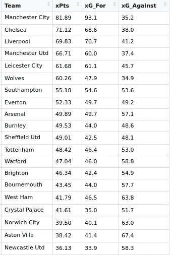
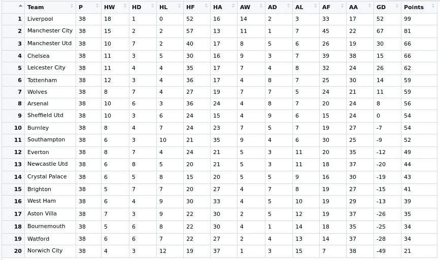
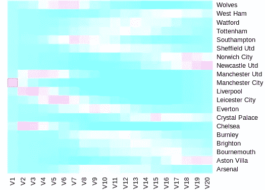

# 利物浦值得赢得英超冠军吗？

> 原文：<https://towardsdatascience.com/did-liverpool-deserve-to-win-the-premier-league-eda7a4e1b9ca?source=collection_archive---------32----------------------->

## *使用 Python、R 和预期目标的英超赛季回顾*


肖恩·唐纳利(@ [肖恩尼斯](https://unsplash.com/@shaunyness))在 [Unsplash](https://unsplash.com/photos/bIyzFopbVOg) 上的照片

> 我转念一想，见日光之下，跑得快的不一定能赛跑，强壮的不一定能打仗，智慧的不一定能吃饭，聪明的不一定能发财，有才能的不一定能得宠。但是时间和机遇会降临到他们身上。

传道书 9:11

# 我期待圣诞礼物

如果一支足球队大规模超水平发挥，以绝对优势赢得联赛冠军，会发生什么？我们怎么知道他们是靠运气赢的，还是他们只是比其他人好得多？

体育分析行业在过去 10 年中开发的评估足球表现的指标之一是传说中的预期目标(xG)。这个想法是，进球只是可能发生的结果之一(射门击中横梁，守门员扑救，射门偏出，犯规，等等)。).现在我不想过多地讨论 xG 的定义(FbRef 有很好的解释和计算方法[这里是](https://fbref.com/en/expected-goals-model-explained/#:~:text=Very%20simply%2C%20xG%20(or%20expected,what%20angle%20on%20the%20pitch%3F))，因为对于什么是 xG，或者如何计算 xG 有很多不同的观点。

为了简单起见，让我们把 xG 看作是一个球员射门(或射门机会)有多好的指标。有 1 比 1 机会对抗门将的球员？xG 高。一名中场球员在 40 码外射门越过人墙。低 xG。处罚？xG 高。在角旗附近拍摄的照片？低 xG。

几年来，职业足球俱乐部一直在使用 xG 来跟踪表现，而不是简单地通过查看最终结果来得出结论。它慢慢地[走向媒体](https://www.bbc.com/sport/football/50822875)来帮助为辩论提供信息——尽管在[与某些专家对话时可能会尽量避免。](https://www.youtube.com/watch?v=JBWKGij9Y5A#t=26s)

现在我们已经建立了 xG，这个项目的目标(*不是双关语*)是确定球队在 2019/20 英超赛季的表现如何，相对于他们的最终位置——*具体来说，*利物浦是否应该成为赢家。为此我们需要一些东西:

1.  **本赛季英超联赛的 xG 数据**
2.  **一个足球结果概率模型(主场胜利、平局、客场胜利)**
3.  **花式图表**

# Scrapy

首先，让我们得到 xG 数据。FbRef 是一个很棒的开源网站，它们由 [StatsBomb 的](https://statsbomb.com/)模型提供支持(该模型被认为是业界最好的模型之一)。在上面的链接中有两种获取 xG 数据的方法，第一种是下面的方法，它使用 Python 中的 Scrapy。在`xg_spider.py`中:

现在在终端中键入以下内容:

```
scrapy crawl expectedGoals --output exG.csv
```

让我们清理 R 中的数据(我知道我们可以用 Python 来做这些，但是我已经准备好了一个 Scrapy scraper，并且我的大部分模型已经在 R 中了):

```
install.packages("tidyr")prem1920<-read.csv("exG.csv")#get rid of empty rows
prem1920<-prem1920[rowSums(is.na(prem1920)) == 0,] #separate delimiter by hyphen into two columns
tidyr::separate(prem1920, score, into = c("homeScore", "awayScore")) 
```

Et voila，你现在有了一个带英超 2019/20 xG 数据的 csv！

或者……您可以轻松地使用 Microsoft Excel 复制并粘贴这些表格，然后手动将数据整理成 csv 格式。

# 足球模型

好吧，这就是开始有趣的地方。足球比分可以用泊松分布来近似。我不想赘述，因为网上有大量的文献，如果你想查看描述近似过程的 Python 或 R 代码，[这是一个很好的网站](https://dashee87.github.io/data%20science/football/r/predicting-football-results-with-statistical-modelling/)。

无论如何，我们可以使用内置[泊松包](https://stat.ethz.ch/R-manual/R-devel/library/stats/html/Poisson.html)中的 R 来计算一场足球比赛的正确得分，给定两队的得分率。打开一个名为`FootballMatchResult.R`的文件:

这个简单的泊松模型实际上并不像你希望的那样符合数据，因为低分和抽牌概率比模型更有可能，但是…出于时间的考虑，让我们改天再讨论这个问题。

使用这个模型，我们现在可以推导出一场比赛中球队的期望得分(xPts)。例如，在第一场比赛(利物浦对诺维奇城)中，利物浦的得分为 1.9，诺维奇城的得分为 1.0——现在假设一个球队赢了 3 分，平了 1 分，我们可以通过键入以下内容得出比赛结果概率

```
FootballMatchResult(1.9,1.0)
```

到 R 控制台，它会以向量的形式输出主场赢、平局和客场的概率:

```
[1] 0.5840664 0.2210540 0.1948797
```

因此，如果我们想计算利物浦的 xPts，我们将第一个条目乘以 3，然后加上中间的条目。诺里奇城也是如此，但在他们的例子中，将最后一个条目乘以 3，再加上中间的一个。

# 排行榜不会说谎

让我们将每场比赛从`prem1920`数据框计算到 xPts 表中，看看各队在比赛中根据 xG 表现如何。我们将总结三个属性，并将它们整理成一个排名表。这些属性是:期望得分(xPts)、期望进球得分(xG_For)和期望进球得分(xG_Against)。这是代码

随着 [RStudio](https://rstudio.com/) 的魔力，开火

```
xPts<-ExpectedPointsTable(prem1920)
```

进了候机楼。我们现在能够导出这个 xPts 表:



2019/20 英超 xPts 表

与实际的最终排名相比:



2019/20 英超决赛表

# 它回家了

好吧，我们从哪里开始？让我们首先回答这个问题，利物浦今年是否值得赢得联赛冠军。对于强大的红军来说，可悲的是，根据 xPts 表，答案是响亮的*不*。根据 xPts，他们甚至没有排在第二，根据 xG，切尔西应该排在他们前面！

曼城今年的表现绝对让所有人大吃一惊，在对阵 93.1 xG 的比赛中打入 102 球，并让他们的失球数量几乎达到了预期(35 球对 35.2 球)。他们的 xPts 也相当准确，81.89，而实际得分是 81。领先第二名超过 10 分钟！佩普瓜迪奥拉可以认为他的球队今年非常不走运——但是嘿，他们推翻了欧洲冠军联赛的禁令，所以摇摆和回旋。

排名前四的球队是，嗯，排名前四的球队——除了曼联可能应该获得第四名而不是第三名。然而，xPts 的排名显示他们的防守在联赛中仅次于同城对手，所以[也许大卫·德·赫亚和哈里·马奎尔并没有那么差](https://www.youtube.com/watch?v=bsAl0JjFvU8) …

尽管莱斯特城在赛季的最后一天错过了一个冠军联赛席位，但 xPts 表表明他们度过了伟大的一年，并最终完成了他们应该完成的任务。不幸的是，热刺就不一样了。他们获得了第六名，但是 xPts 的排名表显示他们甚至不是一个顶级球队！何塞·穆里尼奥似乎有很多事情要做来改善他的球队(以及他自己的声誉)…

# 运气好不如运气好

现在我们讨论垫底的队伍。沃特福德肯定感到特别不公平——他们为了远离倒数三名已经做得够多了。根据 xPts 排名表，伯恩茅斯是另一支感觉今年应该保持领先的球队。

诺维奇城的表现可能也需要更多，尽管可能不足以在英超联赛中再生存一年。如果我是阿斯顿维拉、水晶宫或西汉姆招聘团队的教练或工作人员，我会回头看看，如果夏休期间没有任何变化，我会有点担心我的球队下赛季的前景。

然而，他们都不应该像纽卡斯尔联队那样担心。虽然他们非常符合他们的预期目标数字，但他们以最低的预期 xG 在 xPts 表中垫底。不知何故，史蒂文·布鲁斯的球队设法比他们应得的多得了 8 分，这足以将他们拉到安全地带。这正说明了保持领先和被降级之间的差距有多小！

书中还有最后一个技巧。我们可以基于 xPts 表使用 R 来模拟 1000 个季节(代码不包括在内，因为我*发誓*我家里的灯肯定已经开始闪烁，因为需要用我的样板代码来运行模拟人生)。这是基于 1000 个赛季模拟的最终位置热图(V1 =第一名，V2 =第二名，以此类推)。颜色越粉红，团队在特定位置完成的次数就越多:



英超模拟位置热图

曼城基本上巩固了第一的位置，几乎没有挑战者(利物浦和切尔西最有可能击败他们)。看起来在温格的中年时期，曼联变成了阿森纳，而阿森纳变成了……21 世纪初的热刺。在积分榜的另一端，纽卡斯尔联队牢牢地固定在垫底的位置，很少能在最后的 4 或 5 名之外。

真的让你觉得…

# 警告

虽然 xG 已经成为分析行业预测团队绩效的标准指标之一，但现在讨论它的局限性可能是明智的——以及这个项目的局限性。

首先，有几种定义 xG 的方法——似乎没有一家公司在计算 xG 的最佳方法上达成一致。一些分析师可能会根据机会的角度增加 xG 的权重，而一些分析师可能会比其他人更多地惩罚长镜头，等等。这样想吧——每个人都知道目标是什么。黄牌或角球也是如此。它们都是定义明确、切实可见的统计数据。但是什么是 xG 呢？在这被标准化之前，它将继续是一个问题。

接下来，每个模型都有局限性，我们天真的泊松足球模型也不例外。它假设比赛中的两个进球是独立的——例如，如果一个进球得分了，它不会影响结果。事实上，这只是无稽之谈-如果你是一名球员，如果你的比赛中有进球，你会改变方法。因此，一个在 1-0 落后的情况下追逐比赛的球队将会和一个有两个进球缓冲的球队表现不同。为了使模型更加有用，需要对模型中的依赖性进行一些计算。只要记住经典的足球陈词滥调- *进球改变比赛*。

最后，xG *真的是一个团队表现的重要指标吗？在其他限制中，该指标没有考虑到单个玩家(或他们的相对技能)。在一天结束时，大多数 xG 模型都是建立在成千上万次射门和机会的数据库上的——最终的输出将是一个平均值，而不是特定于玩家的。出于论证的目的，只要认为一个前锋，一般来说，在某些位置上应该比一个后卫有更好的射门率。那么可能会有一些球员[比其他人](https://www.youtube.com/watch?v=BC-WGSeynp8)更擅长把握某些类型的机会。这是指标开始分解的地方，理解这一点是充分利用 xG 的关键。*

那么…利物浦值得赢吗？谁在乎呢，它还是发生了。到最后，不管发生了什么，唯一重要的还是结果。

# 其他文章

[](/randomness-in-sport-6e60c6132838) [## 运动中的随机性

### 为什么赢得超级碗的球队比英超多？

towardsdatascience.com](/randomness-in-sport-6e60c6132838) [](/making-up-the-odds-73fbc509ee7f) [## 创造机会

### 英国博彩业繁荣简史，从贝叶斯到必发

towardsdatascience.com](/making-up-the-odds-73fbc509ee7f)