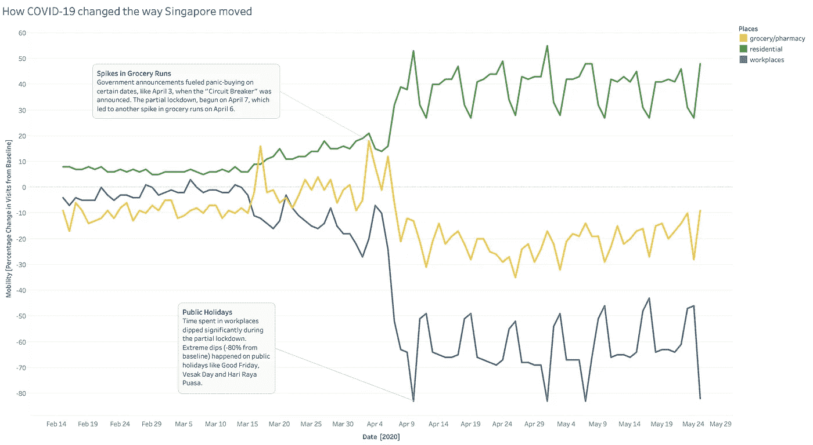
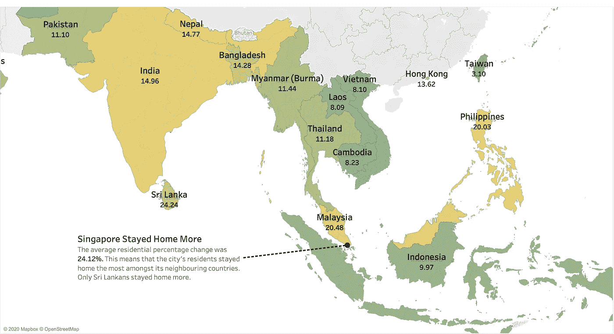
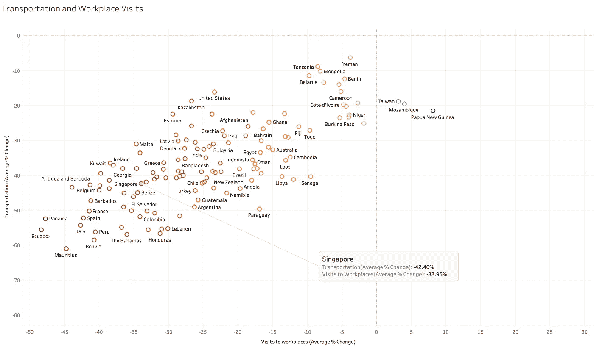

# 锁定报告卡:新加坡

> 原文：<https://towardsdatascience.com/did-singapore-obey-lockdown-rules-2aef5e55ad2c?source=collection_archive---------78----------------------->

艺术:陈卓琳

## 谷歌的社区流动性数据集揭示了新加坡“断路”措施对行为、服从和习惯的影响

为了遏制新冠肺炎病毒的传播，新加坡在 4 月份实行了为期两个月的局部封锁。政府“断路器”倡议的规则包括强制关闭几家零售企业，禁止公共集会，以及为老年人提供居家咨询。

从 2 月到 5 月，谷歌的[社区移动](http://bit.ly/36NbpeM)数据集跟踪了不同地方的访问量相对于基线的变化——一月份的五周时间。谷歌使用相同的数据(来自选择分享谷歌位置历史的用户)计算这些变化，这些数据用于在谷歌地图中显示地点的[流行时间](https://support.google.com/business/answer/6263531?hl=en)。

对数据集的分析显示了高水平的遵守，在断路器启动的当天，大多数户外场地的移动数据急剧下降。

## 断路器的直接影响

下图显示了对 4 月 7 日开始的断路器措施的即时反应。花在工作场所的时间几乎减少了三倍，花在家里的时间几乎增加了一倍。

蓝线(工作)和绿线(家庭)在 4 月和 5 月的波峰和波谷与周末和公共假日相对应，似乎不能解释任何异常行为。

杂货店/药店访问量的激增(黄线)与 5 月初断路器措施开始前的恐慌性购买新闻报道相对应。

3 月 17 日，邻国马来西亚进入封锁状态的消息也引发了更早的[恐慌性购买事件。](https://www.todayonline.com/singapore/singaporeans-rush-supermarkets-after-malaysia-announces-lockdown)

## 公园和停车场

以下图表显示了前往五类地方的旅行数据:

*杂货店&药房* —杂货店、食品仓库、农贸市场、特色食品店、药店和药房。

*公园* —地方公园、国家公园、公共海滩、码头、狗公园、广场和公共花园。

*公交车站* —地铁、公交、火车站等公共交通枢纽。

*零售&娱乐* —餐馆、咖啡馆、购物中心、主题公园、博物馆、图书馆和电影院。

*工作场所* —工作场所。

杂货店和药店受到的影响最小(与基线相差约 20%)，因为它们仍被允许经营。而在 4 月 7 日之后，对零售、交通和工作场所的访问大幅下降，比基线下降了 60%以上。

参观公园的游客没有经历同样的急剧下降，因为这是断路器期间允许的“自由”之一。然而，政府将公园内的持续集会视为新冠肺炎聚集的潜在来源，并开始关闭停车场和公园内的特定区域，以确保符合社会距离措施。这导致公园的使用率慢慢下降，并最终在两周后降至-60 以下。

## 地区#家庭冠军

在这两个月里，新加坡可以称得上是呆在家里最多的地区。从全球来看，新加坡位列第三，仅次于巴拿马和斯里兰卡。

一个好的家庭记录并不一定意味着在新冠肺炎战场上的类似结果。没有实施封锁的台湾，其居民在家的时间只增加了 3%。它将新冠肺炎的死亡人数保持在一位数(相比之下，新加坡为 23 人)。

## 在家工作:共享的全球体验

我们最后的图表显示了 132 个不同国家的交通和工作场所使用的变化。除了台湾、莫桑比克和巴布亚新几内亚，样本中的所有其他国家的工作场所访问和交通使用都有所下降。

## 走向

随着新加坡开始放松封锁措施，下个月重新访问该数据集的更新版本将会很有意思。一个有趣的问题是，流动性——以及总体生活——是否会回到基线水平。

## 信用

文/数据分析— Samuel He | samuelhe@ntu.edu.sg

编辑:珀尔·李| pearllpy@gmail.com

艺术—谭卓琳|【instagram.com/fakejolart/】T2

数据集—谷歌有限责任公司*“谷歌新冠肺炎社区移动报告”*。
https://www.google.com/covid19/mobility/访问:【2020 年 5 月 30 日>。

## 探索更多

我为可能想探索其他国家类似趋势的读者建立了一个[交互式 tableau 仪表盘](https://public.tableau.com/profile/samuel.he5739#!/vizhome/GoogleMobilityData-GlobalDashboard/Dashboard_choose_city?publish=yes)。

## 谷歌对这些数据的说法

> 每天的变化与一周中该天的基线值进行比较:
> 
> 基线是 2020 年 1 月 3 日至 2 月 6 日这 5 周期间，一周中相应一天的中值。
> 
> 数据集显示几个月的趋势，最近的数据代表大约 2-3 天前的数据，这是生成数据集所需的时间。
> 
> 计算中包括哪些数据取决于用户设置、连接性以及是否符合我们的隐私阈值。如果没有达到隐私阈值(当某个地方没有忙到足以确保匿名时)，我们不会显示一天的变化。因此，您可能会遇到某些地点和日期的空字段。
> 
> 我们包括对社会距离努力以及获得基本服务有用的类别。
> 
> 我们根据选择加入谷歌账户位置历史的用户的数据来计算这些见解，因此这些数据代表了我们的用户样本。与所有样本一样，这可能代表也可能不代表更广泛人群的确切行为。