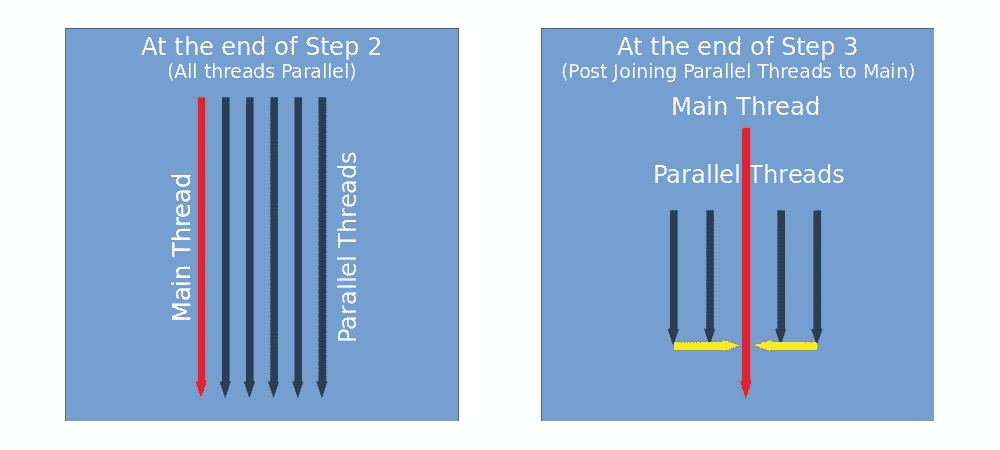
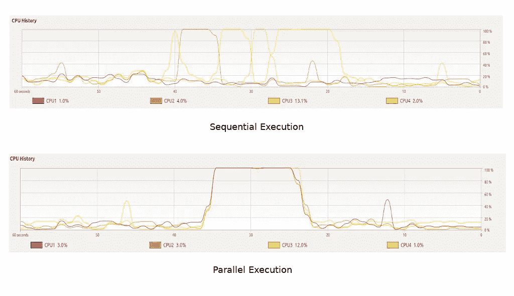

# 如何让您的 Python 代码运行得更快—第 1 期

> 原文：<https://towardsdatascience.com/did-you-know-how-to-make-your-python-code-run-faster-1st-installment-f317359159a1?source=collection_archive---------20----------------------->

## 优化系统硬件的利用率


蒂姆·高在 [Unsplash](https://unsplash.com?utm_source=medium&utm_medium=referral) 上拍摄的照片

在[的上一篇教程](https://medium.com/d2wap-sud/did-you-know-you-can-measure-the-execution-time-of-python-codes-14c3b422d438)中，我们向您介绍了 **line_profiler** ，这是一个可以帮助您对代码进行时间分析的包。现在是向前迈出一步的时候了。

在本教程中，我们将学习使用 Python 实现多线程和多处理方法。这些方法指导操作系统优化利用系统硬件，从而提高代码执行效率。

让我们开始吧…

# 多线程

> [**引用 Wiki**](https://en.wikipedia.org/wiki/Multithreading_(computer_architecture)) —在计算机架构中，**多线程**是中央处理器(CPU)(或多核处理器中的单核)提供**多个线程并发执行**的能力，由操作系统支持。

给定并发性，可以启动多个进程的并行执行，并实现更快的运行时。不去探究技术细节(**谷歌和阅读 GIL** )，要记住的一件事是**多线程在执行基于 I/O 的任务(如下载图像和文件)时效率更高。另一方面，多处理更适合基于 CPU 的计算密集型任务。**

## Python 中的多线程实现

为了实现多线程，我们将使用 Python 的标准库，**线程**。默认情况下，标准 Python 安装附带了这个库，因此可以在我们的代码中直接导入。

为了演示多线程的有效性，我们将从 [**Unsplash**](https://unsplash.com/) 下载 5 幅图像。让我们观察顺序下载这些图像时的执行时间:

```
**#### Importing requests library**
import requests**#### Defining the function** 
def down_img(name,link):
    data = requests.get(link).content
    name = f"/home/isud/DidYouKnow/Tutorial 5/{name}.jpg"
    with open(name, "wb") as file:
        file.write(data)**#### 5 images downloaded sequentially**
%%timeit -n1 -r1
images = ['[https://images.unsplash.com/photo-1531458999205-f31f14fa217b'](https://images.unsplash.com/photo-1531458999205-f31f14fa217b'),
          '[https://images.unsplash.com/photo-1488572749058-7f52dd70e0fa'](https://images.unsplash.com/photo-1488572749058-7f52dd70e0fa'),
          '[https://images.unsplash.com/photo-1531404610614-68f9e73e35db'](https://images.unsplash.com/photo-1531404610614-68f9e73e35db'),
          '[https://images.unsplash.com/photo-1523489405193-3884f5ca475f'](https://images.unsplash.com/photo-1523489405193-3884f5ca475f'),
          '[https://images.unsplash.com/photo-1565098735462-5db3412ac4cb'](https://images.unsplash.com/photo-1565098735462-5db3412ac4cb')]
for i,link in enumerate(images):
    down_img(i,link)**#### %%timeit results**
51.4 s ± 0 ns per loop (mean ± std. dev. of 1 run, 1 loop each)
```

可以看出，完整下载 5 个图像花费了 51.4 秒。此外，只有在前一次下载结束后，新的下载才会开始。现在让我们看看**多线程**如何提高代码性能。

```
**#### Importing necessary library** import threading
import requests**#### Defining the function** def down_img(name,link):
    data = requests.get(link).content
    name = f"/home/isud/DidYouKnow/Tutorial 5/{name}.jpg"
    with open(name, "wb") as file:
        file.write(data)**#### Images downloaded in parallel threads** %%timeit -n1 -r1
threads = []
images = ['[https://images.unsplash.com/photo-1531458999205-f31f14fa217b'](https://images.unsplash.com/photo-1531458999205-f31f14fa217b'),
          '[https://images.unsplash.com/photo-1488572749058-7f52dd70e0fa'](https://images.unsplash.com/photo-1488572749058-7f52dd70e0fa'),
          '[https://images.unsplash.com/photo-1531404610614-68f9e73e35db'](https://images.unsplash.com/photo-1531404610614-68f9e73e35db'),
          '[https://images.unsplash.com/photo-1523489405193-3884f5ca475f'](https://images.unsplash.com/photo-1523489405193-3884f5ca475f'),
          '[https://images.unsplash.com/photo-1565098735462-5db3412ac4cb'](https://images.unsplash.com/photo-1565098735462-5db3412ac4cb')]for i,link in enumerate(images):
    **t = threading.Thread(target=down_img, args=(i,link))**
    **t.start()**
    **threads.append(t)****for thread in threads:
    thread.join()****#### %%timeit results** 25.6 s ± 0 ns per loop (mean ± std. dev. of 1 run, 1 loop each)
```

## 代码解释—定义图像下载循环:

*   **步骤 1(线程初始化)** — Python 在单线程中运行完整的代码(姑且称之为**主线程**)。在这个例子中，通过从**线程**库中调用**线程**函数，我们**启动并行线程**并为它们分配一个要执行的目标进程(在这个例子中为 **down_image** )。被调用函数所需的所有参数都应该作为一个序列对象(在本例中为 tuple)传递。每次调用**线程**函数都会启动一个新线程(姑且称之为**并行线程**)。
*   **步骤 2(线程开始)** —调用**线程的** **开始** **方法**将指示 Python 开始线程执行。假定**for 循环的*正在主线程中执行，并且函数调用在并行线程***中执行，则在图像下载进行的同时，for 循环将继续执行。
*   **步骤 3(线程连接)** —每个新线程都被捕获到一个名为 **threads 的列表中。**然后通过调用**连接方法**将并行线程连接到主线程。

## 为什么加盟是必要的？

直到第 2 步，我们所有的线程(**主线程和**并行线程)都处于并行执行状态。在这种情况下，**主线程的执行可以在并行线程**之前完成。为了避免这种情况，将并行线程连接到主线程是不可避免的。这将确保主线程的执行仅在并行线程完成之后完成。下图解释了这两种情况:



无连接和有连接的螺纹

可以看出，下载图像的执行时间缩短了近 50%(大约 25.6 秒)。).上述示例展示了多线程如何有助于 I/O 操作并提高下载/上传过程的效率。

# 多重处理

与在单个进程中执行多个线程的多线程不同，**多线程为每个任务**启动一个新的并行进程。如上所述，它为 CPU 密集型任务(需要大量计算的任务)提供了相当大的运行时间改进。

## 在 Python 中实现多重处理

**多重处理**是另一个支持 Python 多重处理特性的标准库。为了理解它的功能，我们将多次调用一个计算密集型函数。用于演示的**函数计算 1 到 1000 万的平方**。该功能并行执行 8 次。我们来观察一下这个函数在正常情况下的表现。

```
**#### Importing time library**
import time**#### Defining the function** 
def demo_func(num):
    for i in range(num):
        a = i**2**#### Calling demo function sequentially**
%%timeit -n1 -r1
for i in range(8):
    demo_func(10000000)**#### %%timeit results**
21.2 s ± 0 ns per loop (mean ± std. dev. of 1 run, 1 loop each)
```

演示函数的顺序执行总共花费了 21.2 秒。现在，让我们检查一下在多处理设置中完成后的性能提升。

```
**#### Importing time library**
import time**#### Defining the function** 
def demo_func(num):
    for i in range(num):
        a = i**2**#### Multi-processing demo function** 
%%timeit -n1 -r1
processes = []
lop_size = [10000000,10000000,10000000,10000000,10000000,10000000,10000000, 10000000]
**p = multiprocessing.Pool()**
**p.map(demo_func,lop_size)**
**p.close()
p.join()****#### %%timeit results**
11.6 s ± 0 ns per loop (mean ± std. dev. of 1 run, 1 loop each)
```

在多处理框架下，**的执行时间下降了 50%，为 11.6 秒**。在**顺序处理**中，一次使用一个**单 CPU 内核**，而在**多处理**中，并行使用所有系统内核。CPU 使用情况屏幕截图显示了同样的情况:



顺序执行与并行执行

上图中的每条线代表一个 CPU 内核。请注意，在顺序执行中，每个函数调用都会触发一个内核，而在并行执行中，所有内核都会被同时触发。

## 代码解释

*   **步骤 1(池创建)**—**池方法**创建可以并行利用的进程池。在没有任何参数的情况下，**创建的进程数量等于系统上 CPU 内核的数量**。我有一个四核系统(4 核),这意味着在执行 8 个函数调用时，前 4 个调用将并行运行，随后是后 4 个调用。请注意，**您还可以在池中定义自定义的进程数量**(比内核数量多**)，但是超过这个数量**，它将开始消耗您的系统内存**并可能降低性能**
*   **步骤 2(池映射)** —这是指示您的流程执行一个**特定函数(第一个参数)**以及要传递给它的一系列**参数(第二个参数)**
*   **步骤 3(池关闭)—关闭方法**指示 Python 解释器，我们已经提交了我们想要提交到池中的所有内容，并且将来不会再有输入提供给池。
*   **第 4 步(池连接)——**与线程的情况一样，**连接方法**确保只有当所有并行进程完成时，代码执行才会完成。

从上面的场景中，我们可以看到多线程是如何成为对抗低效代码性能的强大武器的。

# 结束语

在本教程中，我们将重点放在通过优化利用系统硬件来提高代码性能上。在下一期文章中，我们将展示提高代码性能的具体编程实践。

我希望这篇教程是有启发性的，并且你学到了一些新的东西。

会在以后的教程中尝试并带来更多有趣的话题。在此之前:

快乐学习！！！！