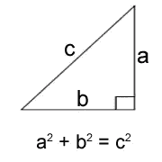
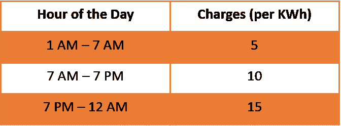

# 如何让您的 Python 代码运行得更快—第 2 部分

> 原文：<https://towardsdatascience.com/did-you-know-how-to-make-your-python-code-run-faster-2nd-installment-f105516cbd8a?source=collection_archive---------49----------------------->

## 高效的编程实践


Marc-Olivier Jodoin 在 [Unsplash](https://unsplash.com?utm_source=medium&utm_medium=referral) 上拍摄的照片

在前两个教程中，我们谈到了测量 python 代码执行时间的[](/did-you-know-you-can-measure-the-execution-time-of-python-codes-14c3b422d438)**和优化硬件利用率以提高代码执行速度的[](/did-you-know-how-to-make-your-python-code-run-faster-1st-installment-f317359159a1)*。在本教程中，我们将再次致力于提高我们的代码运行时间，但是，通过使用一些编程最佳实践，如:***

*   ***记忆化***
*   ***…向量化…***

# ***记忆化***

## *****a .)学校** **天*****

***我相信每个读这篇文章的人都会记得他们的小学时代。我们的数学老师总是记住从 2 到 20 的乘法表。想过为什么吗？很简单，这些表格构成了数学计算的基础，将它们储存在你的记忆中可以帮助你更快地计算。***

## *****b .)回到未来*****

***记忆难懂的概念的旧概念通过名称**记忆化**被构建到现代世界编程概念中。***

> ***引用维基百科，**记忆化**被定义为**优化技术**，主要用于通过**存储昂贵的函数调用**的结果和**在相同的输入再次出现时返回缓存的结果**来加速计算机程序。***

## *****c .)用 Python 实现*****

***为了用 Python 演示这个概念，让我们首先定义一个**昂贵的函数**。为了仿真一个昂贵的函数，这在计算上很耗时，我们将从时间包中调用**睡眠函数，并人为增加函数**的运行时间。*******

***下面是创建该函数的 Python 代码。这个函数使用一个数值参数作为输入，休眠 5 秒钟，然后返回数值的平方作为输出。***

```
*****USUAL APPROACH TO DEFINE A FUNCTION****#### Import time package**
import time**#### Defining expensive function - The Usual Way**
def expensive_function(n):
    time.sleep(5)
    return n**2***
```

## *****d .)用常用方法运行时间*****

***使用上面使用的方法，每次我们调用函数时，**函数将首先休眠 5 秒钟**，然后返回实际结果。让我们通过连续调用 **3 次**来对这个函数进行时间分析。***

```
*****### Calling the expensive function 3 times and timing** 
%%timeit -n1 -r1
expensive_function(9)
expensive_function(9)
expensive_function(9)**### Time profile output** 15 s ± 0 ns per loop (mean ± std. dev. of 1 run, 1 loop each)***
```

***假设，我们调用了该函数 3 次，记录的总执行时间为 **15 秒**。***

## ***e.)使用**记忆**减少运行时间***

```
*****MEMOIZATION APPROACH TO DEFINE FUNCTIONS
### Importing package** import time**### Re-defining the expensive function** def expensive_function(n):
    **argument_dict** = {}
    if n in argument_dict:
        return argument_dict[n]
    else:
        argument_dict[n] = n**2
        time.sleep(5)
        return n**2**### Testing the run time** %%timeit -n1 -r1
expensive_function(9)
expensive_function(9)
expensive_function(9)**### Time Profile output**
5.01 s ± 0 ns per loop (mean ± std. dev. of 1 run, 1 loop each)***
```

*****解释*****

*   ***由于**记忆化**提倡存储昂贵函数的结果，我们使用 Python 的字典来完成这项工作。注意字典" **argument_dict** "的定义***
*   ***函数定义略有变化。现在，在休眠 5 秒钟并返回结果之前，该函数检查与传递的参数相关联的结果是否已经存在于字典中***
*   ***只有在内存(本例中为字典)中没有与传递的参数相关的结果时，才会调用 sleep 函数***
*   ***查看测试结果，可以注意到测试代码**的执行时间(5.01 秒)比过去的执行时间(15 秒)减少了三分之一*****

# ***…向量化…***

***每当我们想到在代码中实现迭代操作时，我们想到的第一个编程结构就是**循环**。当处理较小的数据集时，循环可以做得很好，但是随着数据集大小的增加，性能会下降。编程思维的一个小小的改变可以帮助我们克服这个挑战。***

***考虑一个场景，我们需要对包含**一百万行**的 **Pandas 数据帧**的一列执行一些操作。如果以传统方式处理，将会一个接一个地循环一百万条记录。***

*****另一方面，**建议对整个列只执行一次该操作(而不是逐个记录)。这样，你就避免了执行一百万次同样的操作。下面的例子展示了我们如何从一些常见的编程场景中消除循环:***

## *****a)简单的数学运算*****

***让我们考虑一个简单的场景，其中我们有一个包含 100k 直角三角形的**底边**和**垂直长度**的熊猫数据帧，任务是计算它们的**斜边**。计算公式如下:***

******

***[来源](https://miniwebtool.com/hypotenuse-calculator/)***

***让我们使用 pandas **apply 方法**(一个函数在一个系列对象上的迭代应用)来捕获执行该操作时的运行时间:***

```
*****#### Importing libraries** import pandas as pd
import random**#### Creating Pandas with random values of base and perpendicular** base = [random.randint(1,100) for _ in range(100000)]
perpend = [random.randint(1,100) for _ in range(100000)]
triangle = pd.DataFrame(list(zip(base, perpend)),columns=["Base", "Perpendicular"])**#### Calculating hypotenuse** %%timeit
triangle["Hypotenuse"] = triangle.apply(lambda row: (row["Base"]**2 + row["Perpendicular"]**2) **(1/2), axis=1)**#### Performance** 3.43 s ± 52.9 ms per loop (mean ± std. dev. of 7 runs, 1 loop each)***
```

***使用 apply(熊猫循环最有效的形式之一)循环 100k 行花费了我们大约 **3.43 秒**。让我们看看**矢量化如何帮助**我们提高这段代码的性能。***

```
*****#### Importing libraries** import pandas as pd
import random**#### Creating Pandas with random values of base and perpendicular** base = [random.randint(1,100) for _ in range(100000)]
perpend = [random.randint(1,100) for _ in range(100000)]
triangle = pd.DataFrame(list(zip(base, perpend)),columns=["Base", "Perpendicular"])**#### Calculating hypotenuse** 
%%timeit
triangle["Hypotenuse"] = **(triangle["Base"]**2 + triangle["Perpendicular"]**2) **(1/2)****#### Performance** 5.81 ms ± 274 µs per loop (mean ± std. dev. of 7 runs, 100 loops each)***
```

*****解释*****

*   ***循环，在这个版本的代码中被删除了***
*   ***合并了对完整 pandas 系列对象(基本和垂直)操作的单个代码语句**(以粗体突出显示)*****
*   ***与之前的 3.42 秒相比，整个操作在 **5.81 毫秒内完成。这种改善难道不是实质性的吗？*****

## *****b)涉及条件的操作*****

***矢量化可以派上用场的另一个常见场景是，当循环被有条件地执行时。为了证明这一点，我们创建了一些虚拟数据，其中包含 2019 年我们家每小时的电力消耗信息(365*24 条记录)。鉴于**费用在一天的不同时间**是不同的，我们想计算**每小时**的电费。费用表如下:***

******

***编写简单循环时的性能评估:***

```
*****#### Importing libraries** import pandas as pd**#### Importing Dataframe** df = pd.read_csv("/home/isud/DidYouKnow/Tutorial 4/electricity.csv")**#### Calculating Hourly Electricity Cost** %%timeit
df["cost"] = df[["Hour","Usage"]].apply(lambda x: x["Usage"]*5 if x["Hour"]<7 else (x["Usage"]*10 if x["Hour"] <19 else x["Usage"]*15),axis = 1)**#### Performance** 417 ms ± 19.8 ms per loop (mean ± std. dev. of 7 runs, 1 loop each)***
```

***使用熊猫最有效的循环方法(应用方法)，我们可以在 **417 毫秒**内完成我们的目标。让我们评估使用**矢量化**执行相同操作时的性能:***

```
*****#### Importing libraries** import pandas as pd**#### Importing Dataframe** df = pd.read_csv("/home/isud/DidYouKnow/Tutorial 4/electricity.csv")**#### Calculating Hourly Electricity Cost** %%timeit
**less_seven = df["Hour"].isin(range(1,7))
less_nineteen = df["Hour"].isin(range(7,19))
rest = df["Hour"].isin(range(19,24))** df.loc[less_seven, "Cost"] = df.loc[less_seven, "Usage"] * 5 
df.loc[less_nineteen, "Cost"] = df.loc[less_nineteen, "Usage"] * 10 
df.loc[rest, "Cost"] = df.loc[rest, "Usage"] * 15**#### Performance** 7.68 ms ± 47 µs per loop (mean ± std. dev. of 7 runs, 100 loops each)***
```

*****解释*****

*   ***我们没有遍历每一行，而是为一天中不同的时间创建了逻辑向量，即 **less_seven** 、**less _ 19**和 **rest*****
*   ***然后，这些逻辑向量用于成本构成的一次性(矢量化)计算。***
*   ***使用上述方法，我们可以将代码运行时间从**的 417 毫秒减少到**的 7.68 毫秒。***

# ***结束语***

***在过去的 2 个教程中，我们已经尝试用编写高效代码的方法来武装你。尝试这些方法，让我们知道它们是否有帮助。***

***会在以后的教程中尝试并带来更多有趣的话题。在此之前:***

***快乐学习！！！！***