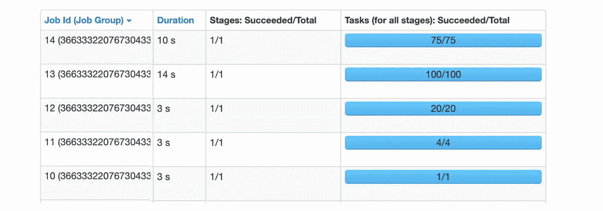

# 你在 Spark SQL 中知道这个吗？

> 原文：<https://towardsdatascience.com/did-you-know-this-in-spark-sql-a7398bfcc41e?source=collection_archive---------16----------------------->

## [入门](https://towardsdatascience.com/tagged/getting-started)

## Spark SQL 中值得了解的 8 个不明显的特性。

Spark SQL 的 DataFrame API 是用户友好的，因为它允许用高级术语表达甚至非常复杂的转换。尤其是现在的 Spark 3.0，已经相当丰富和成熟了。然而，在某些情况下，您可能会发现它的行为出乎意料，或者至少不是很直观。这可能会令人沮丧，尤其是当你发现你的生产流水线产生了你没有预料到的结果。

在本文中，我们将介绍 Spark 的一些乍一看并不明显的特性，了解这些特性可以避免愚蠢的错误。在一些例子中，我们还会看到一些很好的优化技巧，根据您的转换，这些技巧会变得很方便。对于代码示例，我们将在 Spark 3.0 中使用 Python API。

## 1.array_sort 和 sort_array 有什么区别？

这两个函数都可以用来对数组进行排序，但是在用法和空值处理上有所不同。虽然 *array_sort* 只能按升序对数据进行排序，但是 *sort_array* 采用了第二个参数，在这个参数中，您可以指定数据应该按降序还是升序排序。 *array_sort* 会将空元素放在数组的末尾，当按降序排序时 *sort_array* 也会这样做。但是当以升序(默认)使用 *sort_array* 时，空元素将被放在开头。

```
l = [(1, [2, None, 3, 1])]df = spark.createDataFrame(l, ['id', 'my_arr'])(
    df
    .withColumn('my_arr_v2', array_sort('my_arr'))
    .withColumn('my_arr_v3', sort_array('my_arr'))
    .withColumn('my_arr_v4', sort_array('my_arr', asc=False))
    .withColumn('my_arr_v5', reverse(array_sort('my_arr')))
).show()+---+----------+----------+-----------+----------+-----------+
| id|    my_arr| my_arr_v2|  my_arr_v3| my_arr_v4|  my_arr_v5|
+---+----------+----------+-----------+----------+-----------+
|  1|[2,, 3, 1]|[1, 2, 3,]|[, 1, 2, 3]|[3, 2, 1,]|[, 3, 2, 1]|
+---+----------+----------+-----------+----------+-----------+
```

关于如何使用函数 *array_sort* 还有一个选项，即直接在 [SQL](https://spark.apache.org/docs/latest/api/sql/index.html#array_sort) 中使用(或者作为 SQL 表达式作为 *expr()* 函数的参数),其中它接受第二个参数，该参数是一个比较器函数(从 Spark 3.0 开始支持)。使用此函数，您可以定义如何比较元素来创建订单。这实际上带来了非常强大的灵活性，例如，您可以对结构数组进行排序，并定义应该按照哪个结构字段进行排序。让我们看看这个例子，在这个例子中，我们通过第二个 struct 字段进行显式排序:

```
schema = StructType([
    StructField('arr', ArrayType(StructType([
        StructField('f1', LongType()), 
        StructField('f2', StringType())
    ])))
])
l = [(1, [(4, 'b'), (1, 'c'), (2, 'a')])]
df = spark.createDataFrame(l, schema=schema)(
    df
    .withColumn('arr_v1', array_sort('arr'))
    .withColumn('arr_v2', expr(
        "array_sort(arr, (left, right) -> case when left.f2 < right.f2 then -1 when left.f2 > right.f2 then 1 else 0 end)"))
).show(truncate=False)
```


在这里，您可以看到 SQL 中表示的比较函数采用两个参数*左*和*右*，它们是数组的元素，它定义了应该如何比较它们(即根据第二个字段 *f2* )。

## 2. *concat* 函数不允许空值

[*concat*](https://spark.apache.org/docs/latest/api/python/pyspark.sql.html#pyspark.sql.functions.concat) 函数可以用于连接字符串，也可以用于连接数组。不太明显的一点是，该函数不允许空值，这意味着如果任何参数为空，那么输出也将为空。例如，当连接两个数组时，如果一个数组为空，我们很容易丢失另一个数组的数据，除非我们显式地处理它，例如，使用 *coalesce* :

```
from pyspark.sql.types import *
from pyspark.sql.functions import concat, coalesce, arrayschema = StructType([
    StructField('id', LongType()),
    StructField('arr_1', ArrayType(StringType())),
    StructField('arr_2', ArrayType(StringType()))
])l = [(1, ['a', 'b', 'c'], None)]
df = spark.createDataFrame(l, schema=schema)(
    df
    .withColumn('combined_v1', concat('arr_1', 'arr_2'))
    .withColumn('combined_v2', concat(coalesce('arr_1'), array(), coalesce('arr_2', array())))
).show()+---+---------+-----+-----------+-----------+
| id|    arr_1|arr_2|combined_v1|combined_v2|
+---+---------+-----+-----------+-----------+
|  1|[a, b, c]| null|       null|  [a, b, c]|
+---+---------+-----+-----------+-----------+
```

## 3.collect_list 不是一个确定性函数

聚合函数 *collect_list* 可用于在按某个键分组后创建元素数组，但它不是确定性的，因为结果数组中元素的顺序取决于行的顺序，而行的顺序在洗牌后可能不是确定性的。

了解优化器对非确定性函数的处理非常小心也是有好处的，例如，优化器不会对其进行筛选，如以下查询所示:

```
(
  df.groupBy('user_id')
  .agg(collect_list('question_id'))
  .filter(col('user_id').isNotNull())
).explain()
```


从计划中可以看到，过滤器是最后一个转换，因此 Spark 将首先计算聚合，然后过滤掉一些组(这里我们过滤掉 group，其中 *user_id* 为 null)。然而，如果数据首先被过滤器减少，然后被聚集，这将更有效，这确实会发生在确定性函数中，例如*计数*:

```
(
  df.groupBy('user_id')
  .agg(count('*'))
  .filter(col('user_id').isNotNull())
).explain()
```


这里的*过滤器*被推得更靠近源，因为聚合函数*计数*是确定性的。

除了 *collect_list* 之外，还有其他非确定性函数，例如 *collect_set* 、 *first* 、 *last* 、 *input_file_name* 、 *spark_partition_id* 或 *rand* 等等。

## 4.对窗口进行排序会改变框架

有多种聚合和分析函数可以在所谓的窗口中调用，定义如下:

```
w = Window().partitionBy(key)
```

该窗口也可以通过调用 *orderBy(key)* 进行排序，并且可以通过 *rowsBetween* 或 *rangeBetween* 指定一个帧。这个框架决定了在窗口中调用哪个行的函数。一些功能也需要对窗口进行排序(例如 *row_count* )，但是对于一些功能，排序是可选的。关键是排序可以改变可能不直观的框架。考虑带有 *sum* 函数的示例:

```
from pyspark.sql import Window
from pyspark.sql.functions import suml = [
  (1, 10, '2020-11-01'), 
  (1, 30, '2020-11-02'), 
  (1, 50, '2020-11-03')
]df = spark.createDataFrame(l,['user_id', 'price', 'purchase_date'])w1 = Window().partitionBy('user_id')
w2 = Window().partitionBy('user_id').orderBy('purchase_date')(
  df
  .withColumn('total_expenses', sum('price').over(w1))
  .withColumn('cumulative_expenses', sum('price').over(w2))
).show()+-------+-----+-------------+--------------+-------------------+
|user_id|price|purchase_date|total_expenses|cumulative_expenses|
+-------+-----+-------------+--------------+-------------------+
|      1|   10|   2020-11-01|            90|                 10|
|      1|   30|   2020-11-02|            90|                 40|
|      1|   50|   2020-11-03|            90|                 90|
+-------+-----+-------------+--------------+-------------------+
```

正如你所看到的，排序窗口将改变帧从开始到当前行，所以求和将产生一个累积和而不是总和。然而，如果我们不使用排序，默认框架将是整个窗口，求和将产生总和。

## 5.写入表会使缓存失效

不完全是这样，但是如果您的缓存数据是基于某人刚刚向其追加了数据(或者覆盖了数据)的这个表，那么一旦您调用另一个操作，数据将被扫描并再次缓存。让我们看看这个例子:

```
df = spark.table(tableA)
df.cache()
df.count()  # now the data is placed in cache# someone writes to tableA now:
dx.write.mode('append').option('path', path).saveAsTable(tableA)# now df is no longer cached, but it will be again after calling some action on itdf.count()  # the data is now placed to memory again but its content was changed
```

因此，这里意想不到的事情是，如果有人同时追加表，对缓存的数据帧调用相同的计算可能会导致不同的结果。

## 6.为什么调用 show()会运行多个作业？

在 Spark 中，有两种类型的操作、转换和动作，前者是懒惰的，而后者将物化查询并运行作业。 *show()* 函数是一个动作，所以它运行一个作业，然而令人困惑的是有时它运行更多的作业。为什么会这样？一个典型的例子是这个查询:

```
(
  spark.table(table_name).filter(col('user_id') == xxx)
).show()
```

现在，根据数据的属性，情况可能如下图所示，这是 Spark UI 的一个屏幕截图，我们可以看到 Spark 在返回结果之前运行了五个作业:



还要注意，这些作业中的任务数量是不同的。第一个作业(作业 id = 10)只有一个任务！下一个作业运行了 4 个任务，然后是 20、100 个任务，最后是一个有 75 个任务的作业。顺便说一下，执行这个任务的集群有 32 个可用内核，因此 32 个任务可以并行运行。

在多个作业中执行查询的想法是为了避免处理所有输入数据。默认情况下， *show* 函数只返回 20 行(这可以通过传递 *n* 参数来改变)，所以也许我们可以只处理数据的一个分区来返回 20 行。这就是为什么 Spark 首先运行一个只有一个任务的作业，只处理数据的一个分区，希望找到输出所需的 20 行。如果 Spark 没有找到这 20 行，它将启动另一个作业来处理另外四个分区(这就是为什么第二个作业有四个任务),这样情况会重复，Spark 在每个进一步的作业中都会增加要处理的分区数量，直到它找到所需的 20 行或所有分区都被处理。

这是一个有趣的优化，特别是当您的数据集非常大(包含许多分区)并且您的查询不是非常有选择性时，所以 Spark 实际上只能处理前几个分区来找到 20 行。另一方面，如果您的查询具有很强的选择性，例如您要在一个非常大的数据集中查找一行(甚至可能不存在)，那么使用 *collect* 函数可能会更有用，该函数将从一开始就充分利用集群的潜力，并在一个作业中处理所有数据，因为最终无论如何都必须处理所有分区(如果记录不存在)。

## 7.如何确保用户定义的函数只执行一次？

众所周知，如果用户定义函数(UDF)不是必需的，最好避免使用，因为它们会带来一些性能损失(损失有多大，取决于 UDF 是用 scala/java 还是 python 实现的)。但不太明显的是，如果使用 UDF，它可能会比预期执行更多次，因此开销会变得更大。然而，这是可以避免的，因此总的惩罚将会减轻。让我们看一个简单的例子:

```
@udf('long')
def add_one(x):
    return x + 1(
    spark.range(10)
    .withColumn('increased', add_one(col('id')))
    .filter(col('increased') > 5)
).explain()
```

在本例中，我们创建了一个简单的 UDF，用于向 DataFrame 添加一个新列，然后基于该列进行筛选。如果我们通过调用 explain 来检查查询计划，我们将看到:


如您所见，BatchEvalPython 操作符在计划中出现了两次，这意味着 Spark 将执行 UDF 两次。显然，这不是最佳的执行计划，尤其是当 UDF 成为瓶颈时，这是常有的事。幸运的是，有一个很好的技巧可以让 Spark 只调用 UDF 一次，那就是让函数变得不确定(参见[文档](https://spark.apache.org/docs/latest/api/python/pyspark.sql.html#pyspark.sql.functions.udf)):

```
add_one = add_one.asNondeterministic()(
    spark.range(10)
    .withColumn('increased', add_one(col('id')))
    .filter(col('increased') > 5)
).explain()
```

现在，检查查询计划发现 UDF 只被调用了一次:


这是因为 Spark 现在认为函数是不确定的，所以调用它两次是不安全的，因为每次调用它都会返回不同的结果。同样值得理解的是，通过这样做，我们对优化器施加了一些约束，优化器现在将以与其他非确定性表达式类似的方式处理它，例如，过滤器将不会像我们在上面的 *collect_list* 函数中看到的那样被推送。

## 8.UDF 可以破坏你的数据分发

不是字面意思。但让我解释一下我这么说的意思。假设有这样一种情况，您希望连接两个分桶的表，并且还需要在其中一列上调用 UDF。分桶将允许您在不混乱的情况下进行连接，但是您需要以正确的顺序调用转换。考虑以下查询:

```
(
  dfA.join(dfB, 'user_id')
  .withColumn('increased', add_one('comments'))
).explain()
```

这里，我们将两个在 *user_id* 列上分桶的表连接到相同数量的桶，并在 dfA 的其中一列上应用 UDF ( *add_one* )。该计划如下所示:


在这里你可以看到一切都很好，因为计划没有*交换*操作符，执行将是无洗牌的，这正是我们所需要的，这是因为 Spark 知道数据的分布，可以用它来连接。

另一方面，让我们看看如果先应用 UDF，然后再执行连接会发生什么:

```
(
  dfA
  .withColumn('increased', add_one('comments'))
  .join(dfB, 'user_id')
).explain()
```


现在情况发生了变化，我们在计划中有两个*交换*操作符，这意味着 Spark 现在将在连接之前洗牌。这是因为调用 UDF 删除了关于数据分布的信息，Spark 现在不知道数据实际上分布得很好，它将不得不洗牌以确保分区是正确的。因此，调用 UDF 并没有真正破坏分布，但它删除了关于它的信息，所以 Spark 将不得不假设数据是随机分布的。

## 结论

在本文中，我们讨论了一些 Spark 特性的例子，这些特性可能不太明显，或者在编写查询时很容易忘记。其中一些使用不当会导致代码中的错误，例如，如果您忘记了对窗口排序将改变您的框架，或者如果一些输入参数为空，一些函数将产生空值(如 *concat* 函数)。在一些例子中，我们还看到了一些简单的优化技巧，比如使 UDF 不确定可以避免执行两次，或者如果表是分桶的(或者根据一些特定的分区进行分布)，在连接后调用 UDF 可以避免混乱。

我们还看到，使用 SQL 函数有时比 DSL 函数更灵活，一个特别的例子是 *array_sort* ，它在 SQL 中允许您指定比较器函数来实现自定义排序逻辑。