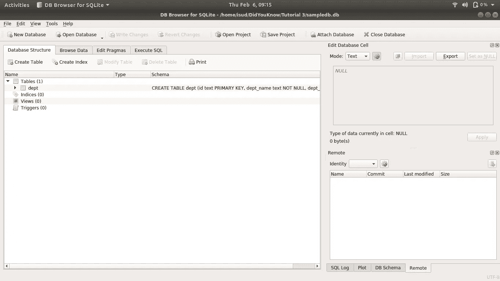

# 使用 Python 的 SQLite 简介

> 原文：<https://towardsdatascience.com/did-you-know-you-can-get-rid-of-excel-sheets-csv-files-when-working-with-python-3cf8164a57c4?source=collection_archive---------39----------------------->

## 电子表格的免费替代品


米利安·耶西耶在 [Unsplash](https://unsplash.com?utm_source=medium&utm_medium=referral) 上拍摄的照片

在信息报告领域，我们主要依靠 ***Excel 表格*和 *CSV* 文件**来满足我们的数据存储需求。随着 *Excel* 和 *CSV* 文件数量的增加，这些文件的管理成为一个真正的挑战。对于这样的场景，拥有数据库软件似乎是一个合适的解决方案。但是，由于成本和上线时间等因素，该解决方案被搁置一旁。

在本教程中，我们将向您介绍 ***SQLite3。*** 它是一个 Python 模块，创建了一个免费的、磁盘上的关系数据库管理系统。

# 1.)关于 *SQLite* DB 和 SQLite3 模块的简要说明

***SQLite*** 是一个**独立的**和**无服务器** *C* 应用程序库，它提供了一个**磁盘关系数据库管理系统(RDBMS)** 。无服务器使得 *SQLite* 成为原型开发、移动应用和游戏开发的完美候选。

***SQLite3*** 是一个 Python 模块，在标准 Python 安装中默认可用。它提供了一个使用 SQLite 数据库的接口，并确保数据库管理成为标准 Python 代码的一部分。

# 2.)如何创建数据库？

创建一个 *SQLite* 数据库就像执行一个 *SQLite3* 下面的代码块演示了同样的情况。

```
**import** sqlite3 **as** db
con = db.connect(**"Folder_Location/sample.db"**)
```

如果文件夹位置中已经存在具有所需名称的数据库，库将建立新的连接。否则，它创建一个新的数据库。

要查看该数据库、其相关表以及这些表中的数据，可以使用基于第三方 GUI 的应用程序[***SQLitebrowser***](https://sqlitebrowser.org/)**。**下面是应用程序界面截图:



屏幕截图— Sqlite 浏览器(图片由作者提供)

# 3.)PEP 249 和光标

在我们学习使用 *SQLite3* 执行 *SQL* 查询之前，让我们先来看看 **PEP 249** 和**游标**。

**PEP 249** 是设计数据库接口的 Python 标准指南(像 *SQLite3* 模块)。它确保使用 Python 代码执行 *SQL* 查询的方法在数据库之间保持一致，并且**支持可移植性**。PEP 249 **推荐使用游标**来执行 *SQL* 查询。

**光标**是对象的**类**，其方法定义为**支持 *SQL* 查询执行**。我们可以使用**连接对象**的**光标方法**创建这个类的一个实例。下面的代码块演示了光标对象的创建。

```
### Previous Python Statements
**import** sqlite3 **as** db
con = db.connect(**"Folder_Location/sample.db"**)### Creating a cursor
cur = con.cursor()
```

# 4.)游标方法和 SQL 查询

创建游标对象后，我们可以使用它的方法来执行 *SQL* 查询。游标对象支持多种方法来执行 *SQL* 查询。其中一个清单如下:


光标方法(图片由作者提供)

对于本教程，我们将主要使用**执行方法**。关于 *Sqlite3* 模块的详细文档可以在 Python [**官网**](https://www.sqlite.org/index.html) **:** 获得

## **表格创建**

我们可以将 **create table *SQL* 查询作为字符串**传递给 execute 方法来创建新表。我们可以保持表格结构与我们想要存储在数据库中的 *Excel 表*或 *CSV 文件*相同。

```
#### Creating table using cursor
**cur.execute**('''CREATE TABLE IF NOT EXISTS **dept** 
(id text PRIMARY KEY, dept_name text NOT NULL,
dept_head text);''')
```

## **加载数据**

为了将数据加载到数据库中，我们将**使用 Pandas 库**的内置函数。下面的代码块**假设导入的 *Excel* 文件与 *SQLite* 数据库表**中的列名相同。

```
#### Using Pandas builtin function to push the excel data
#### Importing pandas
import pandas as pd#### Importing CSV file as a dataframe
df = pd.read_csv("file location/name.csv")#### Pushing the dataframe in to the SQLite database
df.to_sql(table_name, con, if_exists = "append", index = False)
```

**描述** : —我们使用了**‘to _ SQL’**data frame 方法的 4 个不同参数:

*   **Table_name** —我们正在推送数据的表
*   **Con** —连接到数据库时初始化的连接对象
*   **If_exists** —该参数**检查 *SQLite* 数据库中是否存在表格**。如果该表存在，数据框中的数据将追加到现有表中。另一个选项是用“**代替**作为参数实参。它将用数据框中的新数据替换历史数据。
*   **索引**-这将确保数据框索引不会被添加到表中。

使用上面的函数，可以很容易地将 *Excel* / *CSV* 数据导入到他们的 *SQLite* 数据库中。如果**情况允许插入手动记录**，我们可以使用下面的 **insert 语句**:

```
#### Insert statement to insert a specific value in a database table
**cur.execute**('''INSERT INTO **dept**(id, dept_name,dept_head) VALUES (1, "Analytics", "Department Head");''')
```

在上面的语句中，我们将数据插入到部门表中。

*   表名后提供的**列列表**是可选的
*   在列列表后，使用关键字值，然后是**值列表**
*   值列表中值的数量应该与列列表中列的数量相同
*   值列表中的元素数应该与表中的列数相同

## **选择数据**

一旦数据在 *SQLite* 表中可用，将它用于您的报告或分析目的是一个人将执行的关键活动。使用**选择查询来**完成工作**。**

```
#### Selecting data from the table
**for** rows **in** cur.execute(**'''select * from dept'''**):
    print(rows)
```

注意:在上面的例子中，**光标对象被视为一个 iterable 对象，它循环**以获取所有选中的记录。或者，可以使用**获取一个、获取多个或获取所有**方法来选择特定数量的记录。

## **删除记录**

通常，在后期阶段，我们会发现表中的数据记录包含一些错误的值。使用标准的**删除查询，**我们可以删除特定的记录。

```
#### Deleting data in table
cur.execute('''**delete from dept where id in (3,4)**''')
con.commit()
```

**注意:**我们应该在每次插入、删除或更新操作**之后执行一个**提交方法**。**它确保数据更改成功地反映在数据库中。

# 结束语

在创建**应用程序原型**、**设计概念证明**和**处理多个 *CSV* 文件**时，我们大多数人都希望有一个**服务器免费和轻量级**版本的关系数据库。有了 *SQLite* 和它的 Python 接口的知识，我希望我们现在可以跨越这个鸿沟。

我希望这篇教程是有启发性的，并且你学到了一些新的东西。

我会在未来的教程中尝试引入更多有趣的话题。在此之前:

快乐学习！！！！