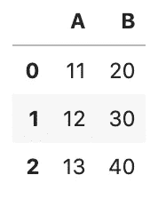
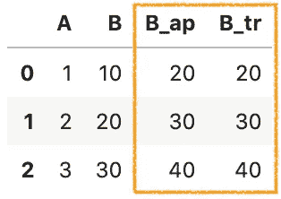
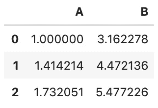
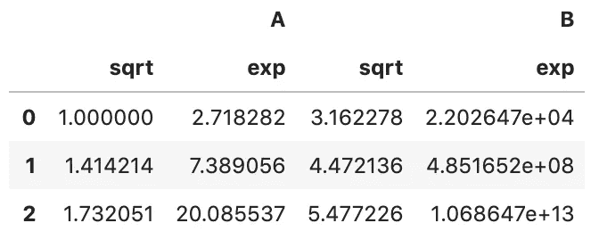
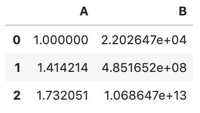
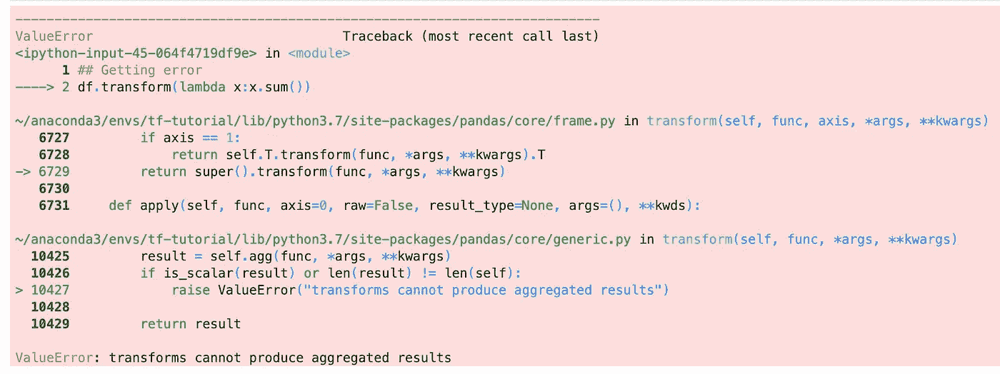
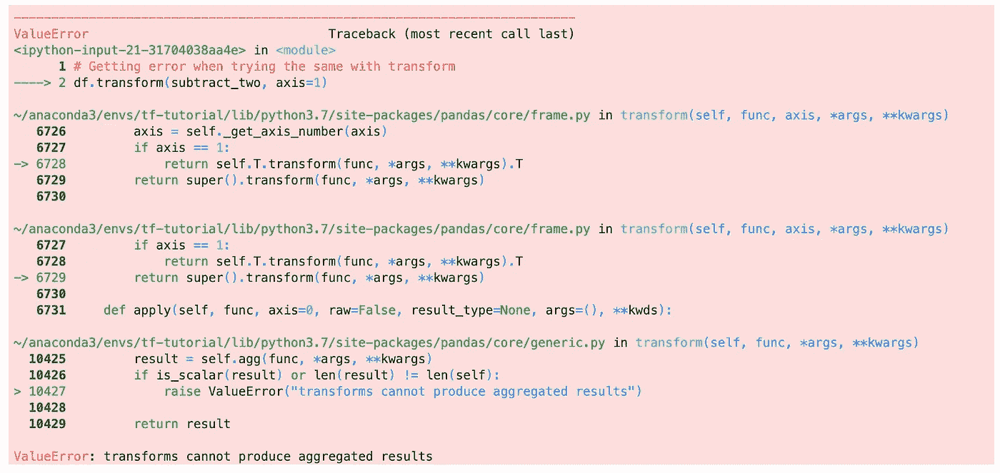
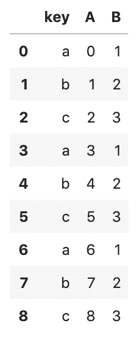
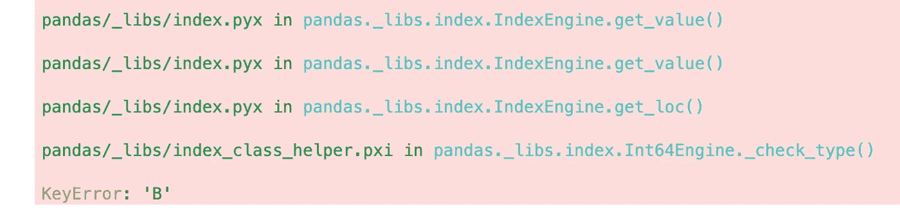

# Pandas 中应用()和转换()的区别

> 原文：<https://towardsdatascience.com/difference-between-apply-and-transform-in-pandas-242e5cf32705?source=collection_archive---------4----------------------->

## 一些最有用的熊猫把戏


照片由[翻滚 926](https://unsplash.com/@billow926?utm_source=unsplash&utm_medium=referral&utm_content=creditCopyText) 上的[退溅](https://unsplash.com/s/photos/kongfu-panda?utm_source=unsplash&utm_medium=referral&utm_content=creditCopyText)

Pandas 是一个令人惊叹的库，它包含大量用于操作数据的内置函数。在寻找应用自定义函数时，您可能会对以下两种选择感到困惑:

*   `apply(*func, axis=0*)`:沿数据帧的一个轴调用函数`*func*`。它返回沿给定轴应用`*func*`的结果。
*   `transform(*func, axis=0*)`:调用 ***self*** 上的函数`*func*`，产生一个带有变换值的数据帧。它返回一个与 ***自身*** 长度相同的 DataFrame。

他们采用相同的论点`*func*`和`axis`。两者都沿着给定数据帧的轴调用`*func*`。那么区别在哪里呢？你如何选择一个而不是另一个？

在本文中，我们将介绍以下用法，并讨论它们的区别:

1.  操纵值
2.  结合`groupby()`结果

源代码请查看我的 [Github repo](https://github.com/BindiChen/machine-learning/blob/master/data-analysis/014-pandas-apply-vs-transform/pandas-apply-vs-transform.ipynb) 。

如果您不熟悉以下文章，请查看它们:

[](/when-to-use-pandas-transform-function-df8861aa0dcf) [## 何时使用 Pandas transform()函数

### 一些最有用的熊猫把戏

towardsdatascience.com](/when-to-use-pandas-transform-function-df8861aa0dcf) [](/introduction-to-pandas-apply-applymap-and-map-5d3e044e93ff) [## 熊猫应用简介，应用地图和地图

### 一个直观的熊猫教程，介绍如何使用 apply()和 applymap()应用一个函数，以及如何替换值…

towardsdatascience.com](/introduction-to-pandas-apply-applymap-and-map-5d3e044e93ff) 

# 1.操纵值

`apply()`和`transform()`都可以用来操作数值。让我们借助一些例子来看看它们是如何工作的。

```
df = pd.DataFrame({'A': [1,2,3], 'B': [10,20,30] })**def plus_10(x):
    return x+10**
```

## 对于整个数据帧

`apply()`和`transform()`都可用于操作整个数据帧。

```
df.**apply(plus_10)**
```



```
df.**transform(plus_10)**
```


`apply()`和`transform()`都支持 lambda 表达式，下面是 lambda 的等价表达式:

```
df.**apply(lambda x: x+10)**df.**transform(lambda x: x+10)**
```

## **为单列**

`apply()`和`transform()`都可以用于操作单个列

```
df['B_ap'] = df['B'].**apply(plus_10)**
# The lambda equivalent
df['B_ap'] = df['B'].**apply(lambda x: x+10)**df['B_tr'] = df['B'].**transform(plus_10)**
# The lambda equivalent
df['B_tr'] = df['B'].**transform(lambda x: x+10)**
```



## 有什么区别？

以下是三个主要区别

*   `transform()`(1)使用函数、字符串函数、函数列表和字典。但是，`apply()`只允许与函数一起使用。
*   ②`transform()`不能产生聚合结果。
*   (3) `apply()`一次处理多个系列。但是，`transform()`一次只允许处理单个系列。

让我们借助一些例子来看看它们。

**(1)** `**transform()**` **作用于函数，一个字符串函数，一个函数列表，一个字典。但是，** `**apply()**` **只允许有一个功能。**

对于`transform()`，我们可以将任何有效的熊猫字符串函数传递给`func`

```
df.transform(**'sqrt'**)
```



`func`可以是函数列表，例如 NumPy 中的`sqrt`和`exp`:

```
df.transform(**[np.sqrt, np.exp]**)
```



`func`可以是轴标签的字典- >函数。例如

```
df.transform(**{
    'A': np.sqrt,
    'B': np.exp,
}**)
```



**(2)** `**transform()**` **不能产生聚合结果。**

我们可以使用`apply()`来产生聚合结果，例如，总和

```
df.**apply(lambda x:x.sum())**A     6
B    60
dtype: int64
```

然而，当我们试图用`transform()`做同样的事情时，我们将得到一个**值错误**。我们遇到这个问题是因为`transform()`的输出必须是与 ***自身*** 长度相同的数据帧。

```
df.**transform(lambda x:x.sum())**
```



**(3)** `**apply()**` **一次处理多个系列的作品。但是，** `**transform()**` **一次只允许处理单个系列。**

为了演示这一点，让我们创建一个一次处理 2 个系列的函数。

```
def subtract_two(x):
    return x['B'] - x['A']
```

`apply()`与`subtract_two`和`axis=1`完美配合

```
df.apply(**subtract_two, axis=1**)0     9
1    18
2    27
dtype: int64
```

然而，当我们试图用`transform()`做同样的事情时，我们得到了一个**值错误**。这是因为`transform()` **一次只允许处理一个系列。**

```
# Getting error when trying the same with transform
df.**transform(subtract_two, axis=1)**
```



当使用 lambda 表达式时，我们会得到相同的结果

```
# It is working
df.apply(**lambda x: x['B'] - x['A'], axis=1**)# Getting same error
df.transform(**lambda x: x['B'] - x['A'], axis=1**)
```

# 2.结合`groupby()`

`apply()`和`transform()`都可以与`groupby()`配合使用。而且事实上，这是`transform()`最引人注目的用法之一。更多详情，请查看以下文章中的**“结合** `**groupby()**` **结果”**:

[](/when-to-use-pandas-transform-function-df8861aa0dcf) [## 何时使用 Pandas transform()函数

### 一些最有用的熊猫把戏

towardsdatascience.com](/when-to-use-pandas-transform-function-df8861aa0dcf) 

以下是与`groupby()`结合使用时的两个区别

*   (1) `transform()`返回与输入长度相同的数据帧
*   (2) `apply()`一次处理多个系列。但是，`transform()`一次只允许处理单个系列。

让我们创建一个数据框架，并通过一些示例来展示其区别

```
df = pd.DataFrame({
    'key': ['a','b','c'] * 4,
    'A': np.arange(12),
    'B': [1,2,3] * 4,
})
```



在上例中，可以通过 ***键*** 将数据分成三组。

**(1)** `**transform()**` **返回一个与输入**长度相同的序列

为了演示这一点，让我们创建一个函数来产生一个聚合结果。

```
**# Aggregating the sum of the given Series
def group_sum(x):
    return x.sum()**
```

对于`apply()`，它为每组返回一个值，输出形状为`(num_of_groups, 1)`。

```
gr_data_ap = df.groupby('key')['A']**.apply(group_sum)**
gr_data_ap**key
a     9
b    12
c    15**
Name: A, dtype: int64
```

对于`transform()`，它返回一个与给定数据帧长度相同的序列，输出形状为`(len(df), 1)`

```
gr_data_tr = df.groupby('key')['A']**.transform(group_sum)**
gr_data_tr**0     9
1    12
2    15
3     9
4    12
5    15
6     9
7    12
8    15**
Name: A, dtype: int64
```

**(2)** `**apply()**` **一次处理多个系列。但是** `**transform()**` **一次只允许处理单个系列。**

这和我们在 **1 中提到的区别是一样的。操作值**，我们只是不需要在一个`groupby()`结果上指定参数`axis`。

为了演示这一点，让我们创建一个一次处理 2 个系列的函数。

```
def subtract_two(x):
    return x['B'] - x['A']
```

`apply()`一次处理多个系列。

```
df.groupby('key')**.apply(subtract_two)****key   
a    0    1
     3   -2
     6   -5
b    1    1
     4   -2
     7   -5
c    2    1
     5   -2
     8   -5**
dtype: int64
```

然而，当我们用`transform()`尝试同样的方法时，我们得到了一个**键错误**

```
df.groupby('key')**.transform(subtract_two)**
```



# 摘要

最后，这里是一个总结

对于操作值，`apply()`和`transform()`都可以用来操作整个数据帧或任何特定的列。但是有三个不同之处

1.  `transform()`可以接受一个函数、一个字符串函数、一个函数列表和一个字典。然而，`apply()`只允许一个函数。
2.  `transform()`无法产生汇总结果
3.  `apply()`一次处理多个系列。但是，`transform()`一次只允许处理单个系列。

用于与`groupby()`一起工作

1.  `transform()`返回与输入长度相同的序列
2.  `apply()`一次处理多个系列。但是，`transform()`一次只允许处理单个系列。

# 好了

感谢阅读。

请在我的 Github 上查看[笔记本的源代码。](https://github.com/BindiChen/machine-learning/blob/master/data-analysis/014-pandas-apply-vs-transform/pandas-apply-vs-transform.ipynb)

如果你对机器学习的实用方面感兴趣，请继续关注。

## 你可能会对我的其他一些熊猫文章感兴趣:

*   [何时使用熊猫变换()函数](/when-to-use-pandas-transform-function-df8861aa0dcf)
*   [使用熊猫方法链接提高代码可读性](https://medium.com/@bindiatwork/using-pandas-method-chaining-to-improve-code-readability-d8517c5626ac)
*   [在 Pandas 数据帧中处理日期时间](/working-with-datetime-in-pandas-dataframe-663f7af6c587)
*   [熊猫阅读 _csv()你应该知道的招数](https://medium.com/@bindiatwork/all-the-pandas-read-csv-you-should-know-to-speed-up-your-data-analysis-1e16fe1039f3)
*   [你应该知道的用 Pandas read_csv()](/4-tricks-you-should-know-to-parse-date-columns-with-pandas-read-csv-27355bb2ad0e) 解析日期列的 4 个技巧

更多可以从我的 [Github](https://github.com/BindiChen/machine-learning) 中找到