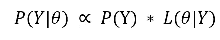
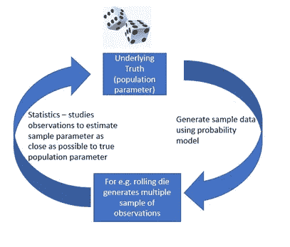

# 概率和统计的区别

> 原文：<https://towardsdatascience.com/difference-between-probability-and-statistics-d69db0ff3f71?source=collection_archive---------37----------------------->

## **让我们了解概率和统计是如何联系在一起的，哪一个更重要**

照片由 [Riho Kroll](https://unsplash.com/@rihok?utm_source=unsplash&utm_medium=referral&utm_content=creditCopyText) 在 [Unsplash](https://unsplash.com/photos/RgLaH00kZOk) 上拍摄

正如著名数学家卡尔·皮尔逊所说:

> "统计学是科学的语法。"

统计学是几乎所有技术进步的核心，在从生物统计学、金融、经济学到机器学习等广泛领域都有应用。

话虽如此，我们会发现没有任何一本统计学书籍不谈论概率的概念。事实上，它们是密切相关的数学分支，相互交织在一起。

在本文中，我们将了解两者的区别。然后，我们将以一个普遍存在的问题作为结束，这个问题是我们所有人都可能在某个时候面临的——从哪里开始？

## 概率:

概率是一个前瞻性的过程。它有助于预测下一个输出，因为我们知道数据生成模型的分布是一个随机过程

我们要计算 P(Y |θ)；其中 Y 是结果，θ是定义随机过程的参数(可能是掷硬币、掷骰子等)。

有两个学派来解释概率:

**1)频数主义者:**主要是通过多次重复实验来计算某种结果出现的相对频率

让我们举一个公平掷硬币的例子。投掷硬币 10 次可能会显示 7 个“正面”,转换成 0.7 的概率，但是，如果我们重复这个实验足够长的时间，那么“正面”的频率计数就等于反面的频率计数，表明概率为 0.5。

**2)贝叶斯:**它主要讲的是

a)在看到新数据之前的信任程度，在术语“先验”中捕获

b)来自观测数据的更新信息，包含在由 L(θ|Y)表示的“可能性”中。

然后，通过取先验与似然性的乘积来更新后验概率:

**让我们了解更多关于可能性的知识:**由于现实生活中的过程是高度随机和复杂的，我们通常对它们的分布没有一个合理的概念，因此我们需要对θ进行更好的估计，以便能够更好地预测 P(Y/ θ)。

简而言之，我们需要估计最能描述生成给定数据的分布的θ。这就是**统计进入图片**的地方——计算可能性函数。

## **统计:**

这是一个回顾过去的过程。它从潜在的随机过程中提取模式，以提出一个可能的量化模型来解释数据行为。

请注意，我们不一定知道定义潜在随机过程的所有特征。

统计模型从有限的可能值θ(称为模型空间θ)以及观察到的数据开始，以推断哪个θ会产生该数据。θ可以是定义概率分布的任何参数，如均值或方差。

统计建模也有助于我们量化推断分布或参数的误差。随着从相同的实验中收集更多的数据，估计的参数越来越接近真实的θ。也就是说，估计值周围的误差缩小了，我们对自己的估计更有信心了。这被称为置信区间。

现在，你会想这个错误是从哪里产生的，有多少数据足以推断出真正的参数。

这是因为我们只能研究数据样本，而不是整个人口，因为各种原因，比如数据的可用性，获取数据的成本等等。如果通过重复实验，我们可以使样本空间如此接近总体，我们就可以将样本参数估计的误差降低到 0，从而得到真实的参数。

**概率与统计的区别——举例说明**

**例一:**

**概率:**对于一个药物试验，整个人群以 1:10 的比例分为两组——A 组和 B 组，P(A) = 0.7，P(B) = 0.5，其中 P =药物作用成功的概率。从人群中随机抽取一名患者，成功治疗的概率是多少？

**统计:**现在，如果我们不知道真实人群的构成，并且观察从人群中随机选择的 1000 名患者中 700 名成功接受药物治疗的患者的数据。关于人口分布我们能推断出什么？

**例 2:**

**概率:**如果我们连续抛 3 次无偏的硬币，得到 HHT 的概率是多少？

**统计:**如果我们观察 3 次连续掷硬币的 HHT 结果，二项分布的参数 p 的估计值是多少？

概率和统计孰先孰后？

统计学致力于收集大量数据，以便能够产生洞察力并推动决策制定。统计学只包括但不限于概率模型的研究。

关于 [StackOverflow](https://stats.stackexchange.com/questions/219733/what-should-be-taught-first-probability-or-statistics) 的讨论很多，但是，我想得出的结论是，理解概率的基础，足以理解统计学的中心法则，这是一个迭代的过程。

在这个过程中，当我们开始理解统计学和概率模型背后的概念时，我们不再受先学习什么的教育学的限制。

感谢阅读！！！