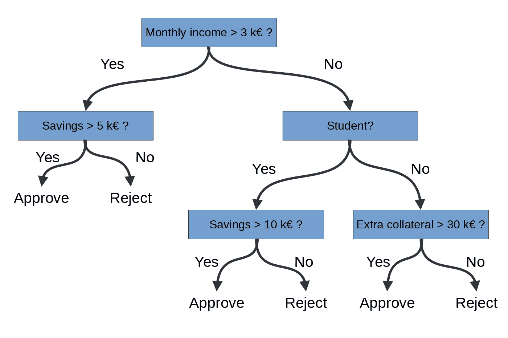

# 机器学习和常规代码的区别

> 原文：<https://towardsdatascience.com/differences-between-machine-learning-and-regular-code-9edd0e54ea58?source=collection_archive---------43----------------------->

## 机器会写和人类类似的代码吗？

在 [Unsplash](https://unsplash.com/) 上由[凯·多尔纳](https://unsplash.com/@photoversum)拍摄的照片

机器学习(ML)和传统软件工程是生产软件的两种互补方法。学习过的算法和手工制作的算法有什么不同？理解差异有助于更好地发现这两种方法的机会。

下表总结了主要差异。本文的其余部分将更详细地讨论这些差异。

我所说的学习算法是指推荐引擎、欺诈检测器或其他从数据中学习的程序。我只关注实际的预测算法，并从定义中排除 API、参数拟合和其他支持代码。传统编程是指由软件工程师编写的应用程序。

# 建立有学问的和传统的程序

当然，在 CPU 指令的最基本层面上，学习算法和传统算法之间没有区别。一个习得的算法由循环、if-else 子句和乘法组成，就像人类程序员编写的程序一样。这种差异表现在程序是如何产生的。

在传统的软件开发方法中，软件工程师坐下来，一边喝着拿铁咖啡一边思考任务，将问题分成小块，最后写下解决每个子问题的代码。相反，学习算法是自动搜索的结果。优化方法的任务是找到最小化训练数据上的误差测量的算法。

这是否意味着机器学习和传统编程是开发类似应用程序的两种可选方式？不要！他们擅长不同的问题领域。ML 解决了复杂但狭窄的任务，在这些任务中，收集大量地面真实训练数据不是问题。图像和语音识别是突出的例子。另一方面，传统的软件工程更好地应用于广泛的问题，这些问题不能简单地简化为最大化的适应度函数。具有产品目录、购物车和结账功能的移动电子商务应用程序是传统方法的主要候选。

构造和应用领域的这些差异甚至在程序代码中也能体现出来。

# 代码的形状

学习算法的代码是严格结构化的。同时，它包括可以在学习期间调整的参数，以实现所需的行为。这类似于人类大脑如何进化来处理语言。儿童大脑的胚胎发育建立了神经元结构，赋予儿童学习任何语言的灵活性。这种灵活性是由于可调节的神经元连接强度和其他因素，当成长中的儿童学会用父母的语言交流时，这些因素会重新配置。

以类似的方式，学习算法的形状遵循预先制定的模板，通常是相对简单的数学运算块的统一链。例如，决策树是将数据分成组的 if-else 子句序列。下图显示了一个示例。同样，人工神经网络是组合输入特征的分层变换链。这种操作的链将输入(例如，图像)转换成期望的输出(例如，图像包含猫的概率)。学习算法通常由一种或几种不同类型的块组成。

银行是否应该接受贷款申请的决策树。树的结构是统一的，由以链的形式组织的 if-else 块组成。if 条件(变量和数字阈值)是可学习的参数。图片作者。

这些构建模块的形状是固定的(就像人脑中语言中心的结构)，但它们包含可调参数(就像大脑中的神经连接强度):决策树中的变量和阈值以及神经网络中的连接权重。机器学习中的“学习”是指优化这些参数，使输出在训练数据上尽可能接近地匹配预期目标。

这种严格一致的结构是实现优化所必需的。我们只知道如何有效地优化某些类别的数学结构。因此，只有当程序由这种易于优化的操作块组成时，机器学习才能发现好的解决方案。幸运的是(有点令人惊讶的是)，研究人员发现许多问题，尤其是图像和语言处理中的问题，确实符合这种所需的形状。

手工代码并不局限于遵循与 ML 代码相似的高度规则的形状。人类程序员可以编写任何需要的业务逻辑。开发人员倾向于分层组织源代码，每一层都有不同的功能。下图以一个游戏中的一些套路为例。主循环渲染一帧，处理声音效果，轮询游戏控制器等等。这些阶段中的每一个都调用它们自己的专用子程序。渲染包括计算对象可见性、纹理等等。与高度统一的学习程序相比，传统程序的功能更加多样化。

作为传统程序示例的游戏引擎架构。功能是像学习算法一样分层次组织的，但是这里每个分支和层都包含在别处找不到的专用子程序。图片作者。

人类开发人员的目标是编写他们的同伴可以理解的代码。这意味着，例如，将代码分割成小而连贯的功能，在大部分独立的模块之间定义清晰的边界，并尽量减少理解一段代码时需要记住的概念数量。一个好的传统源代码读起来就像是一个其他开发人员可以理解的故事。

然而，习得的算法不一定容易理解。没有人类可以理解的主函数或子程序作为研究的自然起点。相反，人们需要立刻理解抽象数学变换的整个错综复杂的链条。随着问题规模的增长，这项任务很快超出了人类的能力。因此，我们需要[可解释的 AI](https://en.wikipedia.org/wiki/Explainable_artificial_intelligence) 方法来解释由黑盒 ML 算法做出的决策。

# 外部依赖性

传统程序定期与外部世界交互并保持状态。它们调用库来执行操作和访问数据库中的数据。

学习到的算法通常是独立的，没有副作用。他们很少在预测之间保持任何状态(尽管随着对像[神经图灵机](https://en.wikipedia.org/wiki/Neural_Turing_machine)这样的主题越来越感兴趣，这正在慢慢形成链条)。

# 展望未来

在未来，传统课程和学习课程之间的区别可能会开始变得模糊。通过优化方法的进步或仅仅因为原始计算能力的增长，机器学习可能会获得更大的灵活性。另一方面，[可微分编程](https://en.wikipedia.org/wiki/Differentiable_programming)承诺让手工代码更易于优化和学习。