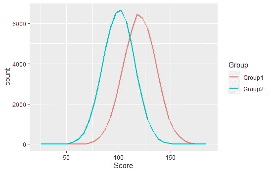
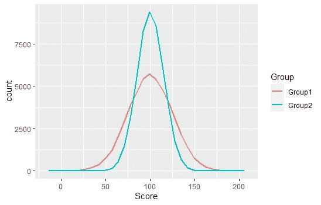
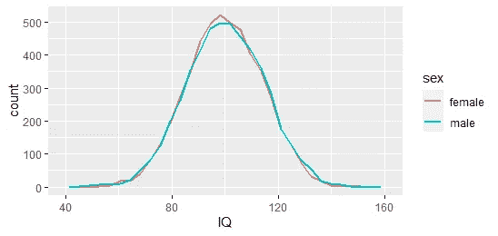

# 方差差异

> 原文：<https://towardsdatascience.com/differences-in-variance-an-unappreciated-source-of-insight-in-our-data-f9cb0de520c0?source=collection_archive---------49----------------------->

## 我们数据中一个不受重视的洞察力来源

数据人喜欢平均值。他们喜欢平均值，他们喜欢中间值。平均而言，哪些国家最幸福？患有罕见疾病的人的平均寿命是多少？一个国家的收入中位数是多少？订婚戒指的平均价格是多少？

均值和中位数很棒，因为它们告诉我们数据的总体情况。如果你的数据是正态分布的(通常不是正态分布的)，那么平均值会告诉你大部分你需要知道的东西。因此，我们的大多数统计测试，如 t-test、ANOVA 等，都是为了查看平均值，以及它们在不同组之间的差异。但是还有另一个变量，就在我们面前，却没有得到同样多的爱:**方差**。它有很多东西可以教给我们！

# 群体差异的两种方式

这里有两组人，给定一些虚构的测试。我绘制了它们的分布图:



我只是在 R 中生成了一些随机的、虚假的数据，并用 ggplot 包绘制出来(图片由作者提供)

我们看到各组的均值不同。这种差异可以通过 t 检验或回归分析清楚地发现。但是还有另一种方式可以区分不同的群体:



作者图片

这里，组 1 比组 2 具有更宽的分布。它有更大的**方差**。t-检验或回归不能捕捉到这一点；他们只会告诉你平均而言，这些群体没有什么不同*。但是正如你所看到的，这并不意味着这些群体没有什么不同！下面我将向您展示如何测试这一点。*

你可能认为你以前没有遇到过这个概念。但是你可能听说过 [GINI 系数，对吧？它衡量一个社会的财富不平等。概念大致相同:一些社会可能拥有相同的平均财富，但在一个社会中，财富可能分配不均。一个所有人工资完全相同的社会，其方差终究是 0！](https://en.wikipedia.org/wiki/Gini_coefficient)

# **真实数据的含义:性别和智商的例子**

对方差差异进行研究的少数领域之一是智商领域。研究普遍发现，虽然男女之间的智商差异很小或不存在，但男性的智商差异始终高于女性。下面我用数据来说明这一点，这些数据是我用一项超过 80，000 名苏格兰青少年的研究的真实方差模拟的(多么大的数据集啊！).我还给出了 R 代码，这样你就可以自己做了:

```
set.seed(140293)male = rnorm(5000,100,14.9)
female = rnorm(5000,100,14.1)
```

我们设置了一个特定的种子，这样你就能得到和我一样的随机数，结果也能得到相同的随机生成的数据。然后，我创建了两组智商数据，5000 名男性和 5000 名女性，均以 100 为均值呈正态分布。男性数据的标准偏差为 14.9，女性为 14.1。记住标准差是方差的平方根。

接下来，我们将数据放入一个[tible](https://r4ds.had.co.nz/tibbles.html)中，并对其进行重新格式化，以便于使用，使用 tidyverse R 包很容易做到这一点:

```
install.packages('tidyverse')
library(tidyverse)IQ_data = tibble(male, female) %>% 
  pivot_longer(cols = c(male, female), 
               names_to = 'sex',
               values_to = 'IQ') %>%
  mutate(sex = factor(sex))
```

然后我们做一个频率多边形来比较男性和女性的分布:

```
IQ_data %>% ggplot( aes(x = IQ, colour = sex) )+
  geom_freqpoly(size = 1)
```



作者图片

女性分布的峰值高于男性，表明接近 100 分的女性较多。男性分布在尾部略高，表明有更多的男性智商得分极高和极低。但是差别似乎很小。

```
t.test(IQ ~ sex, IQ_data)
```

进行 t 检验，平均智商没有性别差异( *p* = 0.38)。然而，这些组可能在尾部有所不同。我们来调查一下。

# **尾比**

我们可以通过取高于或低于某个阈值的雄性与雌性的比例来计算出一个**尾比**。我们将所有智商为 130 或更高(一般认为非常聪明)的个体，统计男女数量。对于智商 70 或更低的人(一般认为不聪明)，我们也是这样做的。

```
IQ_data %>% filter(IQ >= 130) %>% group_by(sex) %>% countIQ_data %>% filter(IQ <= 70) %>% group_by(sex) %>% count
```

运行代码，你会看到在我们的数据集中有 95 个非常聪明的男性和 66 个非常聪明的女性(59%是男性)。这使得男女比例为 1.44:1。
同样，我们的数据中有 104 名非常不聪明的男性和 84 名女性(55%为男性)，男女比例为 1.24。因此，尽管男性和女性平均来说没有什么不同，但在最聪明和最不聪明的群体中，男性更多。

# 更进一步:Levene 的测试

比率都很好，但我们可能想知道差异是否有统计学意义。对此有一些测试，但最常见的是方差相等的 Levene 测试，这是我从 car R 包中得到的:

```
install.packages('car')
library(car)
leveneTest( IQ ~ sex, IQ_data)
```

我们得到的 F 值为 5.54，显著性 p 值为 0.02，证实了我们的结果，即男性的智商比女性高。

# 含义

通过比较方差，我们还能回答哪些问题？

*   如果一种药物增加了患者的平均健康水平，但也增加了服药者之间的健康差异，这可能表明该药物对一些人有帮助，但对另一些人没有帮助。
*   也许你有两种产品在许多商店出售。平均而言，每家商店销售的产品数量可能相同，但一种产品的销售数量差异可能更大，这表明一些商店销售很多，而其他商店销售很少。这可能对理解你的客户和在哪里销售你的产品有所暗示。
*   不影响一个国家人民平均幸福的政策，如果能减少幸福的方差，可能对社会仍然是好的，我们可以称之为“[幸福不平等](https://ourworldindata.org/happiness-and-income-inequality)”。
*   通常，特别低的方差可能是好产品的标志。[罗里·萨瑟兰](https://www.youtube.com/watch?v=iueVZJVEmEs)喜欢争辩说，最好的卫星导航是最小化旅行时间差异的卫星导航，不一定是能找到最短平均旅行时间的卫星导航。当你去机场赶飞机时，你不想要一条可能需要 30 分钟到 2 小时的路线，即使它是平均最快的路线。
*   在调查妇女和少数民族的代表性时。例如，在所有公司中，女性在高层管理职位中的平均比例可能是 50%，有些人会将其解释为实现了性别平等。然而，如果公司之间的这一比例差异非常大，这可能表明许多公司的女性经理远远超过 50%，而其他公司的女性经理可能会少得多。

# 结论

我们在这里已经看到，不同的组可以有不同的方差和均值，这可以在我们的数据中产生新的见解。根据我的经验，这确实是一个被忽视的领域，所以很酷的结果可能相对容易找到。它也不需要比你已经有的更多的数据，这很好。如果你发现任何有趣的方差差异，请务必[在 Twitter 上给我加标签，](https://twitter.com/Richie_Research)这样我就可以看到它们了。我很期待你的发现！