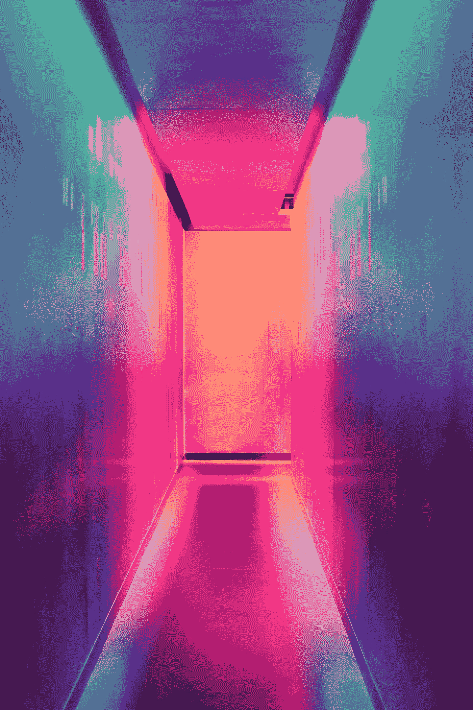

# 不同的色彩空间作为 CNN 的输入

> 原文：<https://towardsdatascience.com/different-colorspaces-as-inputs-to-cnns-406ae62d1bd6?source=collection_archive---------28----------------------->

## 通过自定义数据生成器找出在 CNN 中使用不同的色彩空间是否会导致更好的结果，并最终创建一个集合模型。


在 [Unsplash](https://unsplash.com?utm_source=medium&utm_medium=referral) 上由[鲁维姆·诺加](https://unsplash.com/@ruvimnogaphoto?utm_source=medium&utm_medium=referral)拍摄的照片

我刚刚在另一篇文章中发完一篇牢骚，我忘记了 OpenCV 使用 BGR 格式，CNN 的输出是以 RGB 格式检查的，这浪费了我很多时间，当我有了一个想法，如果将不同色彩空间的图像传递给 CNN 会怎么样，它会如何影响模型？这就是我们要在这篇文章中发现的。

# 目录

1.  要求

2.使用的色彩空间

3.代码和结果

*   导入和加载数据集
*   创建图像数据生成器
*   正常 CNN 的结果
*   迁移学习的结果
*   创建集合模型

如果你对这个过程不感兴趣，只想知道结果，你可以直接跳到正常的 CNN 部分的结果。

# 要求

如果你想编码，那么你需要 Tensorflow 和 OpenCV。你可以使用下面显示的代码进行 pip 安装，或者像我一样使用 Google Colab，不需要安装免费的 GPU。

```
pip install tensorflow
pip install opencv-python
```

# 使用的色彩空间



照片由[埃菲社](https://unsplash.com/@efekurnaz?utm_source=medium&utm_medium=referral)在 [Unsplash](https://unsplash.com?utm_source=medium&utm_medium=referral) 拍摄

决定使用哪种色彩空间是一项相当简单的任务。我只是打开了 OpenCV 的文档，并选择了所有可以转换的独特文档。我会把它们列出来，并提供额外的阅读链接，如果有人有兴趣了解更多的话。

*   RGB 或 BGR — [附加阅读](https://en.wikipedia.org/wiki/Color_spaces_with_RGB_primaries)
*   HSV — [附加阅读](https://en.wikipedia.org/wiki/HSL_and_HSV)
*   YCbCr — [补充阅读](https://en.wikipedia.org/wiki/YCbCr)
*   实验室— [附加阅读](https://www.xrite.com/blog/lab-color-space)
*   LUV — [附加阅读](https://en.wikipedia.org/wiki/CIELUV)
*   XYZ — [补充阅读](https://en.wikipedia.org/wiki/CIE_1931_color_space)

# 代码和结果

在开始之前，我想澄清一下，我的目的不是创造一个非常高科技的 CNN 架构来获得最好的准确性，而是比较所有的色彩空间。

## 导入和加载数据集

选择的数据集是猫对狗的数据集。首先，我们开始导入所有需要的库。

```
import tensorflow as tf
from tensorflow.keras.models import Sequential
from tensorflow.keras.layers import Conv2D, MaxPooling2D, Dropout, Flatten, Dense, Activation, BatchNormalization
import os
import numpy as np
import matplotlib.pyplot as plt
import re
import random
import cv2
```

下一步是加载数据集并存储所有文件名，然后将这些文件名传递给图像数据生成器，并定义将使用的所有常数。

## 创建图像数据生成器

创建一个普通的定制数据生成器，带有一个额外的 colorspace 参数，它定义了要转换到哪个 colorspace。`cv2.cvtColor`用于那个目的。除了 HSV 的色调矩阵被除以 180 之外，所有的图像都被调整到它们需要的尺寸，并通过除以 255 进行归一化。为图像和标签创建 NumPy 数组，并生成它们。

使用 Conv2D、max pooling、batch normalization 和 dropout 层创建基本的 CNN，这些层最终被展平，密集层给出具有 sigmoid 激活函数的输出。该模型是使用 Adam 编译的。如果你想创建更好的 CNN，你可以参考我之前的[文章](/beyond-the-standard-cnn-in-tensorflow-2-a7562d25ca2d?source=friends_link&sk=ed5924d636edd0ebde712b9f22d534b0)。只要用所需的值来拟合模型，我们就完成了。


正常 CNN 的结果

如果我们观察训练精度和损失，除 HSV 之外的所有色彩空间给出了非常相似的更好的结果。然而，也可以观察到我们的模型是过度拟合的，所以 HSV 不能直接被怀疑。此外，对于验证集，HSV 中的图像可以比它们的对应图像学习得更快，但是对于大量的时期，结果是均匀的，并且选择特定的一个是非常困难的。

## 迁移学习的结果

如上所述，迁移学习模型非常简单。使用预训练的 MobileNetV2，其层被设置为不可训练的，并且全局平均池层之后是用于输出的密集层。


迁移学习中不可训练层的结果

只有 BGR 和 XYZ 色彩空间给出了好的结果，而 HSV 给出了最差的结果。但是为什么会这样呢？我们使用预先训练好的层，这些层习惯于看到 RGB 风格的输入，XYZ 与 RGB 非常相似，所以只有它们给出了好的结果，而 HSV 是一个圆柱形系统，在相似性方面离 RGB 最远，因此给出了最差的结果。

因此，我们通过改变`base_model.trainable = True`使整个预训练网络可训练，让我们看看现在会发生什么。


所有可训练层的迁移学习的结果。

即使现在 BGR 和 XYZ 色彩空间从一开始就表现很好，然而，他们被所有其他色彩空间赶上了，除了 HSV，它再次表现最差。除了 HSV 之外，几乎没有太多颜色空间可供选择，所以让我们创建一个集合模型，看看它是否能提高性能。

## 创建集合模型

如果我们可以实现性能的提高，那么我们也将知道不同的色彩空间得到不同的分类为正确或错误的图像，这将意味着改变色彩空间对模型有一些影响。我们将创建一个非常简单的集合模型，取所有模型的预测概率的平均值，将其转换为整数，并根据真实标签对其进行评估。

```
accuracy for bgr  : 0.9596773982048035
accuracy for ycrcb  : 0.9536290168762207
accuracy for lab  : 0.9415322542190552
accuracy for luv  : 0.9546371102333069
accuracy for xyz  : 0.9546371102333069
Ensemble accuracy: 0.966
```

因此，可以说，改变色彩空间可能会也可能不会提高准确性，特别是如果你是随机检查，并且没有分配随机种子来重复结果，因为有很多起伏。然而，如果你想要更精确一点，你可以尝试其他色彩空间，甚至是整体模型。

如果你想玩的话，你可以在这里和这里找到 gist 链接到 colab 文件[和](https://gist.github.com/vardanagarwal/d1c957ee1ff7b370b6135684392e10a3)[的链接。](https://gist.github.com/vardanagarwal/918cdaa53a331051007c4dda6fd843f0)