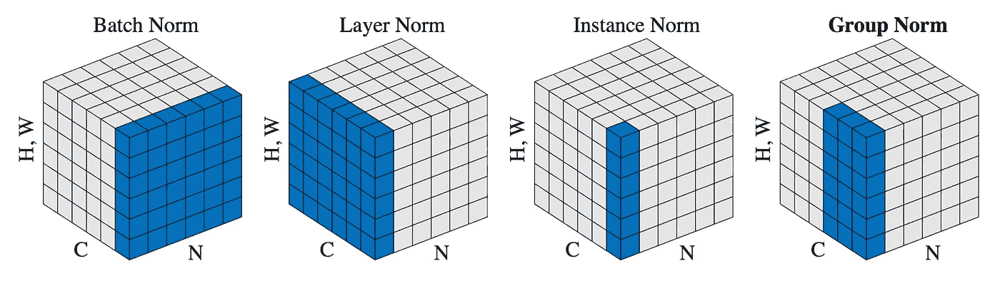
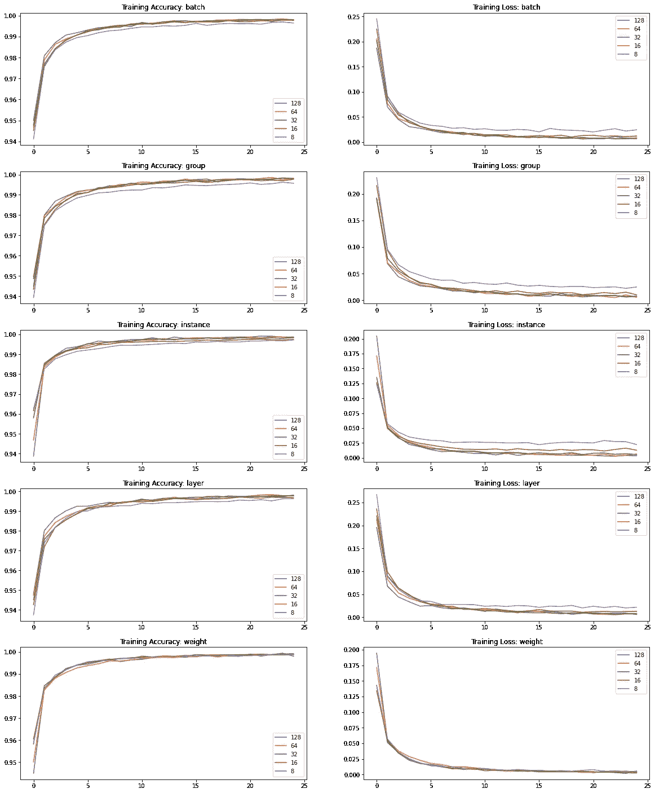
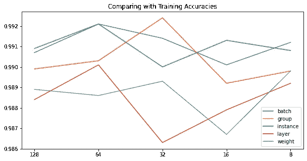

# 张量流中不同类型的归一化

> 原文：<https://towardsdatascience.com/different-types-of-normalization-in-tensorflow-dac60396efb0?source=collection_archive---------22----------------------->

## 了解 Tensorflow 中的批次、组、实例、层和权重标准化，以及解释和实现。



[来源](https://arxiv.org/pdf/1803.08494.pdf)

当规范化被引入深度学习时，它是下一件大事，并大大提高了性能。对你的模型来说，做得正确是一个至关重要的因素。曾经有过这样的疑问，不管批处理规范化是什么，它是如何提高性能的。还有什么替代品吗？如果你像我一样有这些问题，但从来没有烦恼，只是为了在你的模型中使用它，这篇文章将澄清它。

# 目录

*   批量标准化
*   群体规范化
*   实例规范化
*   图层规范化
*   权重标准化
*   Tensorflow 中的实现

# 批量标准化


由 [Kaspars Upmanis](https://unsplash.com/@upmanis?utm_source=medium&utm_medium=referral) 在 [Unsplash](https://unsplash.com?utm_source=medium&utm_medium=referral) 上拍摄的照片

最广泛使用的技术为表演带来奇迹。它是做什么的？嗯，批量标准化是一种标准化方法，通过小批量标准化网络中的激活。它计算小批量中每个特征的平均值和方差。然后减去平均值，并将该特征除以其最小批量标准偏差。它还有两个额外的可学习参数，激活的平均值和幅度。这些用于避免与零均值和单位标准偏差相关的问题。

所有这些看起来很简单，但是为什么会对社区产生如此大的影响？它是如何做到的？答案还没有完全想出来。有些人说它改善了内部协变量的转移，而有些人不同意。但我们确实知道，它使损失表面更平滑，一层的激活可以独立于其他层进行控制，并防止重量到处乱飞。

既然如此，为什么我们还需要别人呢？当批量较小时，小批量的均值/方差可能远离全局均值/方差。这引入了大量噪声。如果批量大小为 1，则不能应用批量标准化，并且它在 RNNs 中不起作用。

# 群体规范化


照片由[哈德逊·辛慈](https://unsplash.com/@hudsonhintze?utm_source=medium&utm_medium=referral)在 [Unsplash](https://unsplash.com?utm_source=medium&utm_medium=referral) 上拍摄

它计算每个训练示例的通道组的平均值和标准偏差。所以它基本上与批量大小无关。在 ImageNet 数据集上，组规范化与批处理大小为 32 的批处理规范化的性能相当，并且在较小的批处理大小上优于它。当图像分辨率很高并且由于内存限制而不能使用大批量时，组归一化是一种非常有效的技术。

对于图像识别任务，实例规范化和层规范化(我们将在后面讨论)都不如批量规范化，但不是组规范化。层规范化考虑所有通道，而实例规范化只考虑导致其崩溃的单个通道。所有的通道并不同等重要，就像图像的中心到它的边缘，同时也不是完全相互独立的。因此，从技术上来说，组规范化结合了两者的优点，并消除了它们的缺点。

# 实例规范化


照片由[埃里克·沃德](https://unsplash.com/@ericjamesward?utm_source=medium&utm_medium=referral)在 [Unsplash](https://unsplash.com?utm_source=medium&utm_medium=referral) 拍摄

如前所述，它计算每个训练图像的每个通道的平均值/方差。它用于风格转换应用，也建议作为 GANs 批量标准化的替代。

# 图层规范化


照片由[免费使用声音](https://unsplash.com/@freetousesoundscom?utm_source=medium&utm_medium=referral)在 [Unsplash](https://unsplash.com?utm_source=medium&utm_medium=referral) 上

批次归一化是对各批次维度的输入进行归一化，而图层归一化是对各要素地图的输入进行归一化。再次像组和实例标准化一样，它一次对单个图像起作用，即它的平均值/方差是独立于其他示例计算的。实验结果表明，该算法在 RNNs 上表现良好。

# 权重标准化


由 [Kelly Sikkema](https://unsplash.com/@kellysikkema?utm_source=medium&utm_medium=referral) 在 [Unsplash](https://unsplash.com?utm_source=medium&utm_medium=referral) 上拍摄的照片

我认为描述它的最好方式是引用它的论文摘要。

> 通过以这种方式重新参数化权重，我们改进了优化问题的条件，并且我们加速了随机梯度下降的收敛。我们的重新参数化受批处理规范化的启发，但不会在小批处理中的示例之间引入任何依赖关系。这意味着我们的方法也可以成功地应用于循环模型，如 LSTMs，以及噪声敏感的应用，如深度强化学习或生成模型，批量归一化不太适合这些应用。尽管我们的方法简单得多，但它仍然大大提高了整批规范化的速度。此外，我们的方法的计算开销更低，允许在相同的时间内采取更多的优化步骤。

# Tensorflow 中的实现

如果我们不能实现它，理解理论又有什么用呢？所以我们来看看如何在 Tensorflow 中实现它们。使用稳定 Tensorflow 只能实现批量规范化。对于其他人，我们需要安装 Tensorflow 附加组件。

```
pip install -q  --no-deps tensorflow-addons~=0.7
```

让我们创建一个模型，并添加这些不同的规范化层。

```
import tensorflow as tf
import tensorflow_addons as tfa**#Batch Normalization** model.add(tf.keras.layers.BatchNormalization())**#Group Normalization** model.add(tf.keras.layers.Conv2D(32, kernel_size=(3, 3), activation='relu'))
model.add(tfa.layers.GroupNormalization(groups=8, axis=3))**#Instance Normalization** model.add(tfa.layers.InstanceNormalization(axis=3, center=True, scale=True, beta_initializer="random_uniform", gamma_initializer="random_uniform"))**#Layer Normalization** model.add(tf.keras.layers.LayerNormalization(axis=1 , center=True , scale=True))**#Weight Normalization** model.add(tfa.layers.WeightNormalization(tf.keras.layers.Conv2D(32, kernel_size=(3, 3), activation='relu')))
```

当在组规范化中指定组的数量时，确保其值是当时存在的特征映射数量的完美除数。在上面的代码中是 32，所以它的约数可以用来表示要分成的组的数量。

现在我们知道如何使用它们，为什么不试一试呢？我们将使用具有简单网络架构的 MNIST 数据集。

```
model = tf.keras.models.Sequential()
model.add(tf.keras.layers.Conv2D(16, kernel_size=(3, 3), activation='relu', input_shape=(28, 28, 1)))
model.add(tf.keras.layers.Conv2D(32, kernel_size=(3, 3), activation='relu'))
#ADD a normalization layer here
model.add(tf.keras.layers.Conv2D(32, kernel_size=(3, 3), activation='relu'))
#ADD a normalization layer here
model.add(tf.keras.layers.Flatten())
model.add(tf.keras.layers.Dense(128, activation='relu'))
model.add(tf.keras.layers.Dropout(0.2))
model.add(tf.keras.layers.Dense(10, activation='softmax'))
model.compile(loss=tf.keras.losses.categorical_crossentropy,
optimizer='adam', metrics=['accuracy'])
```

我用 5 种不同的批量大小，即 128、64、32、16 和 8，尝试了所有的标准化。结果如下所示。



培训结果



测试精度

由于数据集偏差和运气等差异，我不会深入研究这些结果！再训练一次，我们会看到不同的结果。

如果你想更详细地了解这些或者发现更多的标准化技术，你可以参考这篇[文章](http://mlexplained.com/2018/11/30/an-overview-of-normalization-methods-in-deep-learning/)，它对我写这篇文章有很大的帮助。如果您想进一步改善您的网络，您可以阅读以下内容:

[](/beyond-the-standard-cnn-in-tensorflow-2-a7562d25ca2d) [## 超越 Tensorflow 2 中的标准 CNN

### 使用复杂的架构生成更深层次的模型，并了解不同的层，从而使模型更好。

towardsdatascience.com](/beyond-the-standard-cnn-in-tensorflow-2-a7562d25ca2d)